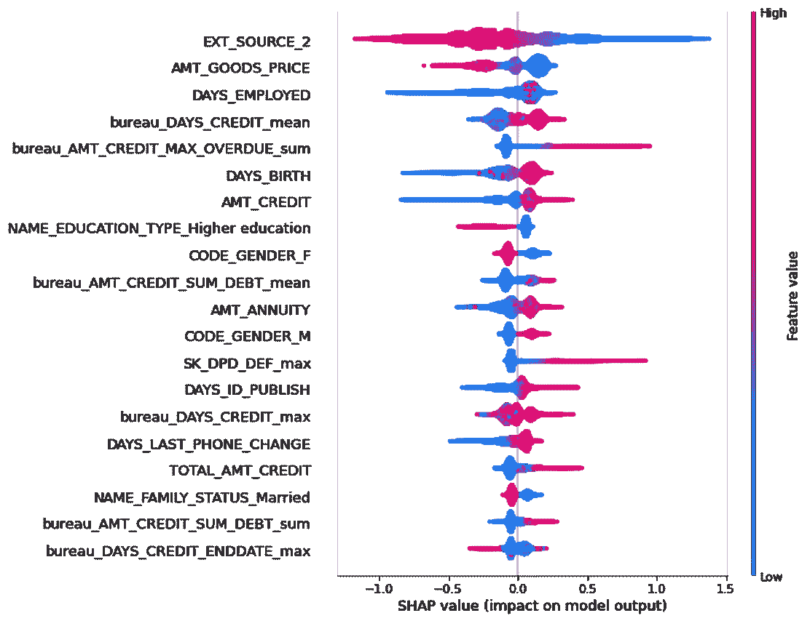
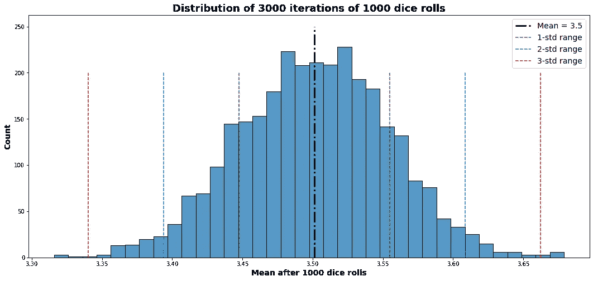
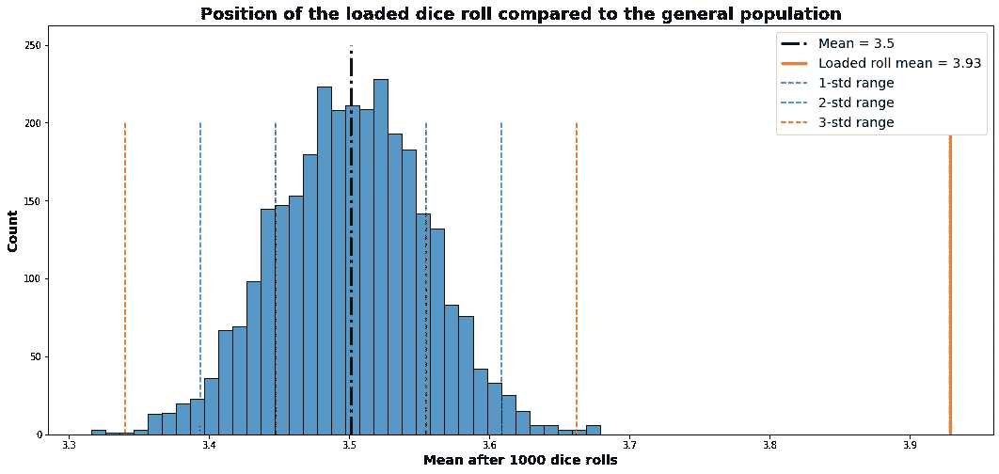
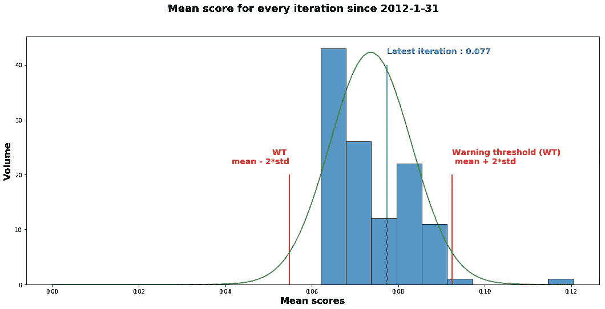
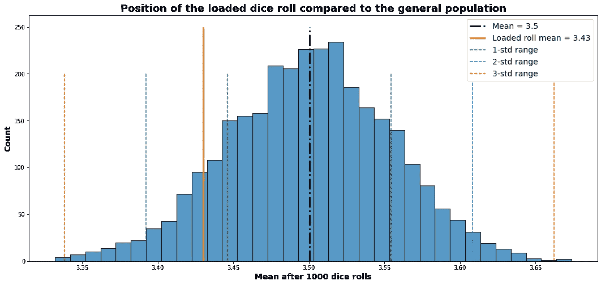
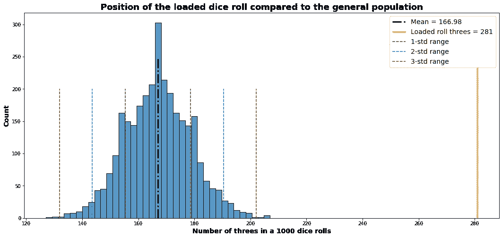
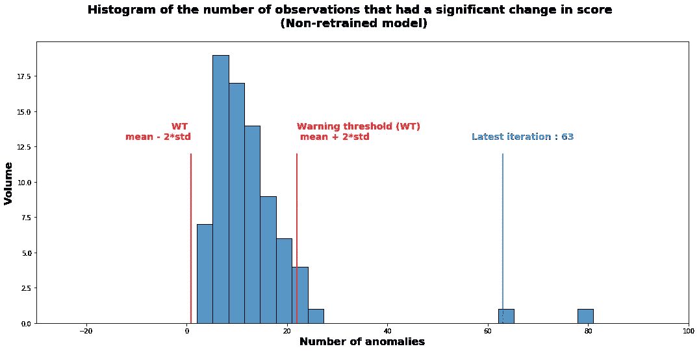
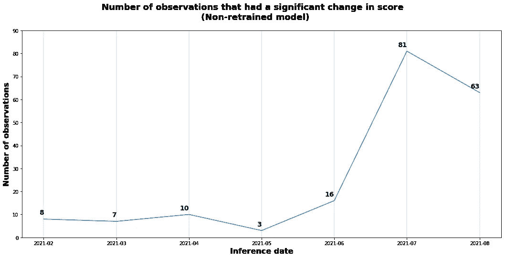

# 机器学习评分模型中的异常检测

> 原文：<https://towardsdatascience.com/anomaly-detection-in-a-machine-learning-scoring-model-205a942518e3?source=collection_archive---------23----------------------->

## 时间序列异常检测的统计技术

掷骰子将是本文所用方法的一个很好的类比。乔纳森·格林纳韦在 [Unsplash](https://unsplash.com?utm_source=medium&utm_medium=referral) 上拍摄的照片

在我最近的默认评分数据科学项目中，我希望有一个自动工具可以警告我，特别是在开发阶段，当我的模型预测不连贯时，无论是因为数据处理中出现了问题，还是因为模型需要重新训练。

主要的困难是分数的急剧上升或下降可能是不一致的，也可能是合理的，这意味着分数的变化是观测数据实际和显著变化的结果。

在不知道模型输出分布的情况下，做出这种区分是复杂的，尽管 SHAP 或 LIME 等可解释性工具有助于区分，但这意味着要逐一检查每个预测。

一个在 XGBoost 模型上计算的 SHAP 值的例子，该模型是根据来自[“住房信贷违约风险”Kaggle 竞赛](https://www.kaggle.com/c/home-credit-default-risk/data)的数据训练的。图片作者。

我们将在这里使用的关键原则是[中心极限定理](https://en.wikipedia.org/wiki/Central_limit_theorem)，利用它我们将研究从我们的模型预测中导出的正态或伪正态分布。由于这一点，我们将能够用一种完全自动化的方法来推断一个预测序列是一致的还是异常的。

# 掷骰子的类比

让我们把我们的模型看作一个骰子滚动。我们不知道骰子是否被装载，这意味着我们不知道它的概率分布。

然而，如果我们掷骰子 1000 次并平均结果，我们将得到一个稳定的值，如果我们重复这个过程，它不会改变太多。
例如，下面是我们通过对空载骰子进行 1000 次投掷的 3000 次迭代得到的图表:

图片作者。

这里，即使我们不知道骰子是空载的，我们也知道掷骰子的平均值具有正态分布，其中 68%、95%和 99.7%的值位于平均值的一个、两个和三个标准差内。

如果骰子突然变化并被加载，它将立即可见:

图片作者。

这里，掷骰子的结果是 6:掷出 6 的概率是 30%,其他值是 14%。如果骰子没有变，那么出现这种结果的概率极低，因此我们可以有把握地假设骰子被改变了。

# 回到模型

我对我的模型所做的是一样的。我取了之前每个月预测的平均分数，看看最新的预测是否与它们一致。

即使一些观察值合理地显著增加或减少了它们的分数，所有分数的平均值应该总体上遵循正态分布。这就是我们可以看到的:

图片作者。

如果一系列预测的平均值在平均值的两个标准差之外，我们可以将其视为异常并仔细分析。

**该方法也可应用于月度预测的标准差。**

# 计数异常

如果我们的骰子是 3 的话会怎么样？它会自然地将 1000 个滚动系列的平均值移向 3，但该值不会离平均值太远而被视为异常:

骰子的位置有利于 3。图片作者。

这里，根据掷骰子的平均值看不出异常，但是如果我们在 1000 次掷骰子中数出 3 的次数，就可以看出异常:

图片作者。

同样，三的数量遵循正态分布，装载骰子的结果明显异常。

在模型中，我们可以通过计算观察值的数量来应用这一点，这些观察值的得分有显著的增加或减少。
如果一半的观察值增加了 0.3，而另一半减少了 0.3，那么就预测值的平均值而言，结果是不可见的，但通过这种方法可以看到。

应用于我的模型，我得到了以下图表:

图片作者。

图片作者。

在这里，我保留了一份我的模型，几个月来根本没有训练它。我们可以从直方图和折线图中看到，该模型在 2021 年 6 月之后出现了退化的迹象。以前的数据分析表明，模型只需每年重新训练一次，但这种异常分析表明，这应该在 4 个月后发生。

# 处理异常情况

在多种原因中，异常可能发生，因为:
-数据处理管道
中存在异常-模型不稳定或必须重新训练
-存在外部因素。例如，如果出现经济危机，大多数观察值的默认分数将会急剧上升，因为它们的健康状况已经下降。反常不一定意味着不连贯。

在我的情况下，数据处理管道还没有最终确定，即使模型的重新训练频率已经被推断出来，我也想在当前数据上监控它。
因此，基于 CLT 的异常检测主要针对前两种情况。