# 支持物联网的智能电池管理系统中的异常检测

> 原文：<https://towardsdatascience.com/anomaly-detection-in-iot-enabled-smart-battery-management-systems-4ae2419c6074?source=collection_archive---------12----------------------->

## 了解电子移动世界中数据工程和机器学习的使用

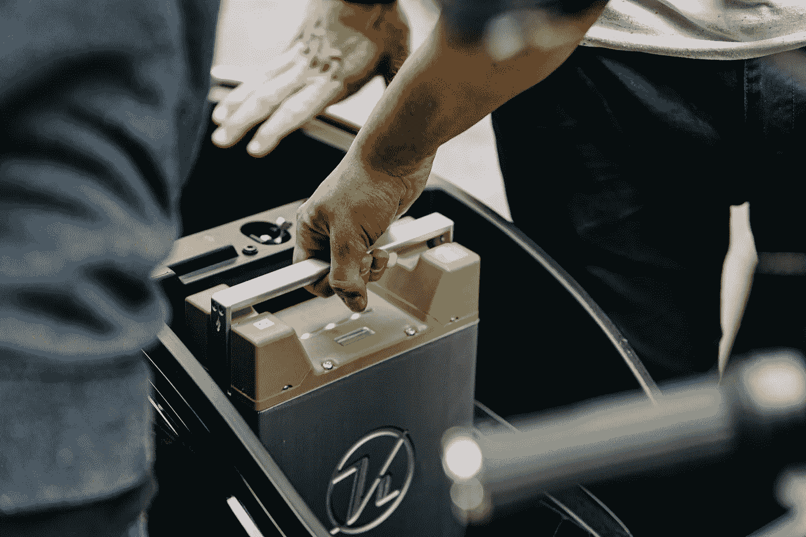

[库姆潘电气](https://unsplash.com/@kumpan_electric?utm_source=unsplash&utm_medium=referral&utm_content=creditCopyText)在[un plash](https://unsplash.com/s/photos/electric-scooter-battery?utm_source=unsplash&utm_medium=referral&utm_content=creditCopyText)上拍摄的照片

我们生活在一个电动移动的世界里。从全球范围来看，电动汽车和两轮驱动汽车的使用正在急剧上升。电动移动设备依靠昂贵的可充电锂离子电池供电。这些电池是对抗化石燃料不良影响(如污染和成本上升)的不可或缺的组成部分。但是锂离子技术也有一些缺点，比如:

*   温度升高和短路引起的火灾和爆炸
*   充电过度/不足导致的使用寿命缩短
*   由于老化，性能随着时间的推移而下降

> 全球锂离子电池市场规模预计在几年内将翻一番以上——从 2020 年的 440 亿美元到 2025 年的 940 亿美元

目前，与物理电池的采购及其维护相关的成本是采用该技术的一个主要障碍。几家锂离子电池制造公司现在正在开发**智能电池管理系统**，以帮助监控和跟踪锂离子电池的健康状况。电池管理系统有几个目标:

1.  **预防性分析** — *监控层* —持续监控与火灾、爆炸相关的威胁
2.  **预测分析** — *分析层* —预测故障，防止电池损坏，从而延长电池寿命

最近，我有机会为一家生产电动代步车电池的公司创建了这样一个智能电池管理系统。以下是该解决方案的高级架构:

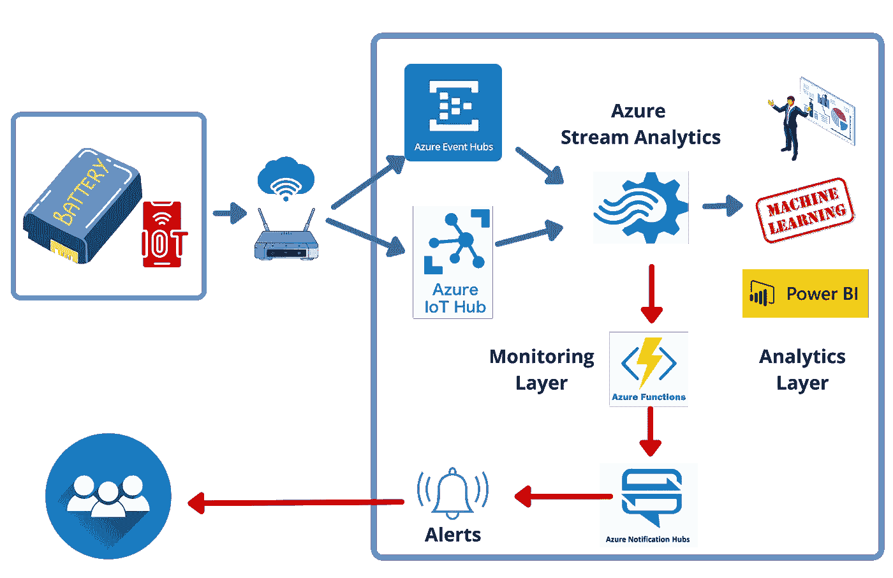

作者图片 Azure Cloud 上智能电池管理系统的高级架构

*   每个电池组都配有一个测量电池电压、电流和温度的电子物联网传感器
*   使用 Wi-Fi 或蓝牙将传感器数据发送到 Azure 云(Azure 事件中枢或 Azure 物联网中枢)
*   来自 Azure 事件中枢/Azure 物联网中枢的流数据使用 Azure 流分析进行计算
*   Azure Stream Analytics 作业执行异常检测。如果检测到异常，将生成**警报**并使用 Azure 通知中枢发送给用户

在接下来的部分中，我将向您展示我们如何使用 Azure 提供的基于机器学习的操作符—**anomaly detection _ spike andip**和**anomaly detection _ change point**来执行异常检测。

> AnomalyDetection _ SpikeAndDip 能够检测时间序列事件中的临时异常。
> 
> AnomalyDetection_ChangePoint 能够检测时间序列事件流中的持续异常

在这次演示中，我使用了 48V 25Ah 的锂离子电池。以下是电池的技术规格。

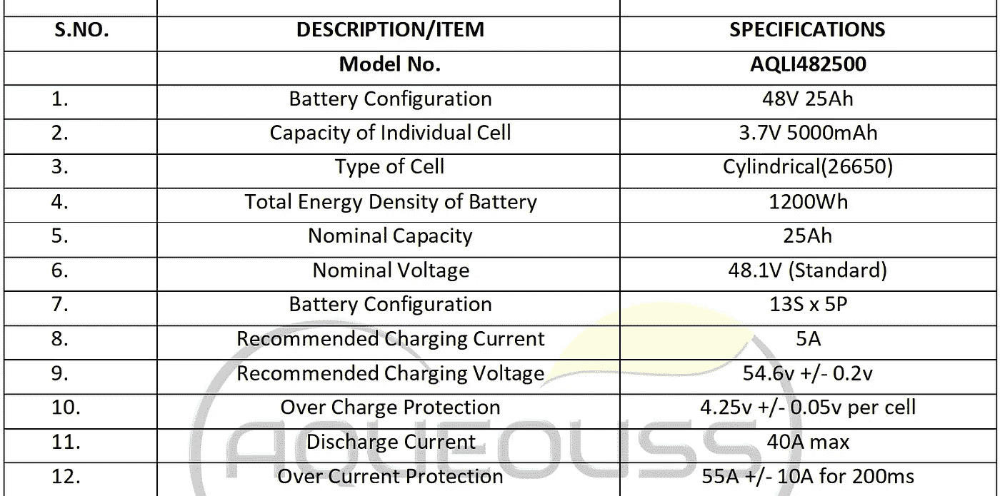

图片 bu 作者—电池规格

对于这种电池，以下是推荐的水印。

> 上限电压— 54.6 V— **任何更高的电压都可能导致爆炸或火灾**
> 下限电压— 39 V — **任何更低的电压都会影响电池的健康**

电池管理系统的一个关键功能是监控这些关键值是否在推荐范围内。出于演示的目的，我将集中在**高点电压**。毕竟谁想要爆炸或火灾。

现在让我们开始实现。假设你已经有一个 Azure 帐户，请按照下面的步骤继续操作:

*   开云壳[https://portal.azure.com/#cloudshell/](https://portal.azure.com/#cloudshell/)
*   调用下面的命令来克隆代码库

```
Azure> git clone [https://github.com/mkukreja1/blogs](https://github.com/mkukreja1/blogs)
Cloning into ‘blogs’…
remote: Enumerating objects: 149, done.
remote: Counting objects: 100% (149/149), done.
remote: Compressing objects: 100% (90/90), done.
remote: Total 149 (delta 54), reused 135 (delta 40), pack-reused 0
Receiving objects: 100% (149/149), 1.67 MiB | 41.71 MiB/s, done.
Resolving deltas: 100% (54/54), done.
```

*   现在让我们创建一个 Azure 事件中心。您可以根据自己的喜好编辑**资源组名称**和**位置**的名称。

```
RESOURCEGROUPNAME="training_rg"
LOCATION="eastus"
TOPIC="iotbattery"
EVENTHUB_NAMESPACE="iotbatteryspace"
EVENTHUB_NAME="iotbatteryhub"
EVENT_SUBSCRIPTION="iotbatteryevent"az provider register --namespace Microsoft.EventGrid
az provider show --namespace Microsoft.EventGrid --query "registrationState"
az eventgrid topic create --name $TOPIC -l $LOCATION -g $RESOURCEGROUPNAMEaz eventhubs namespace create --name $EVENTHUB_NAMESPACE --resource-group $RESOURCEGROUPNAME
az eventhubs eventhub create --name $EVENTHUB_NAME --namespace-name $EVENTHUB_NAMESPACE --resource-group $RESOURCEGROUPNAME
```

*   要验证新创建的 Azure Event Hub，请导航到**主页** > **所有资源** > **iotbatteryspace。**在左侧菜单中点击**活动中心**。现在点击新创建的事件中心 **iotbatteryhub。**

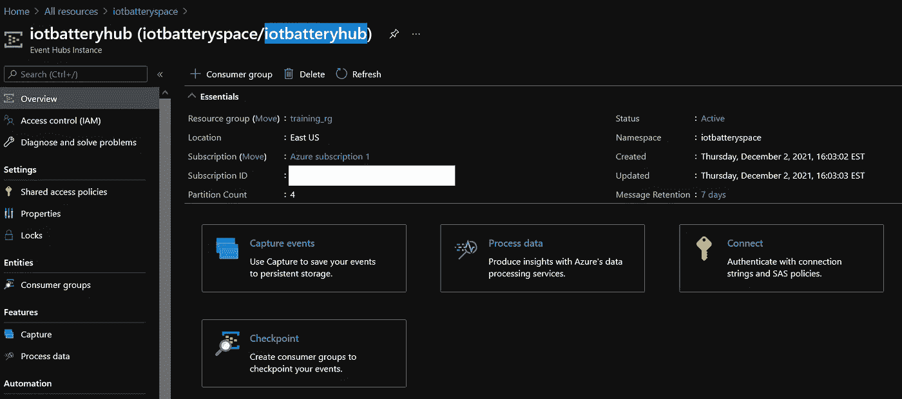

作者图片—新创建的 Azure 事件中心

*   点击**过程数据**，然后点击**浏览**。你现在应该在一个**查询编辑器**窗口中。我们需要创建一个共享访问策略来预览 Azure 事件中心中的数据。点击**创建**。

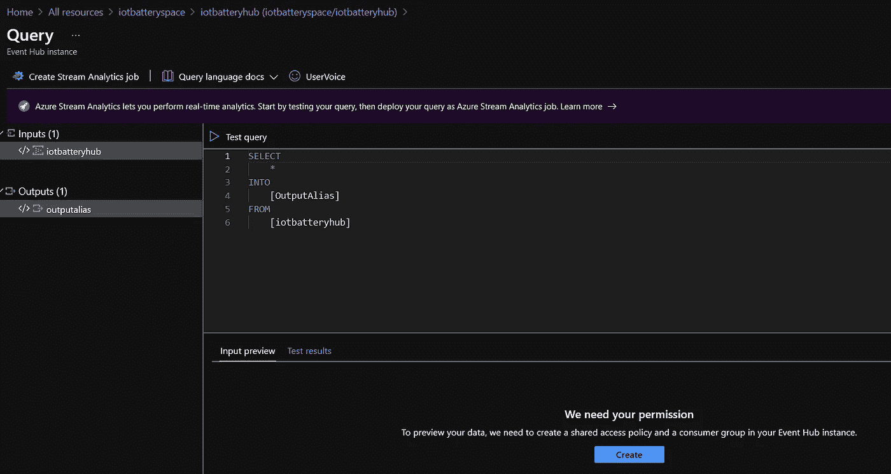

按作者分类的图像-查询编辑器窗口

*   此时，我们已经准备好向新创建的 Azure event hub 发送一些事件。由于您没有实际的物联网传感器，我们可以使用下面的命令来模拟发送到 Azure 事件中心的五节电池的 100 个事件。在云外壳中调用下面的命令。

```
RESOURCEGROUPNAME="training_rg"
TOPIC="iotbattery"
EVENTHUB_NAMESPACE="iotbatteryspace"
EVENTHUB_NAME="iotbatteryhub"
EVENTHUB_CONN_STR=$(az eventhubs namespace authorization-rule keys list --resource-group $RESOURCEGROUPNAME --namespace-name $EVENTHUB_NAMESPACE --name RootManageSharedAccessKey --query "primaryConnectionString" --output tsv)
for VARIABLE in {1..100}
do
 echo "Sending event $VARIABLE"
 python ~/blogs/eventhubs/iot/send_battery_events_normal_reading.py --EVENTHUB_NAME $EVENTHUB_NAME --EVENTHUB_CONN_STR $EVENTHUB_CONN_STR
done
```

*   我们现在可以验证事件数据是否出现在 Azure 事件中心。回到 Azure 门户**查询编辑器**。在**输入预览**页签中，按**刷新**。现在，您应该在查询窗口中看到新发送的事件。

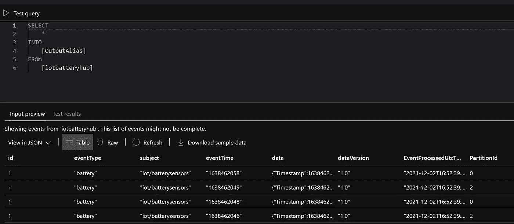

按作者分类的图像-事件数据

*   检查从物联网事件收到的读数。在查询编辑器中调用下面的 SQL。

```
SELECT data.Timestamp, data."Battery Pack", data."Terminal Voltage", data."Charging Current", data."Discharging Current",data."SoC", data."Charge Capacity", data."Charging Power", data."Discharging Power", data."Cycle Count"
FROM [iotbatteryhub]
```

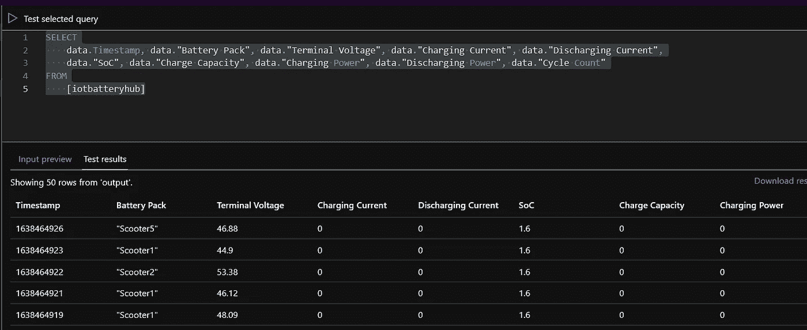

作者图片-活动阅读

*   我们现在准备实施**异常检测**。记住，我们要监控电池电压的尖峰电压，因为它们可能是危险的。调用下面的 SQL 来检查收到了多少个峰值。

```
WITH batteryAnomalyDetection AS
(
    SELECT
        data.Timestamp AS time,
        CAST(data."Terminal Voltage" AS float) AS Voltage,
        AnomalyDetection_SpikeAndDip(CAST(data."Terminal Voltage" AS   float), 70, 90, 'spikes')
        OVER(LIMIT DURATION(second, 120)) AS Spikes
    FROM 
    [iotbatteryhub]
)
SELECT
    time,
    Voltage,
    CAST(GetRecordPropertyValue(Spikes, 'Score') AS float) AS
    SpikeAndDipScore,
    CAST(GetRecordPropertyValue(Spikes, 'IsAnomaly') AS bigint) AS
    IsSpikeAnomaly
INTO battery
FROM batteryAnomalyDetection
WHERE CAST(GetRecordPropertyValue(Spikes, 'IsAnomaly') AS bigint)=1
```

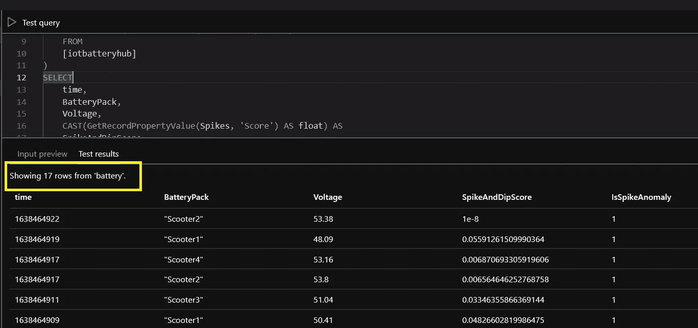

作者图片—70%置信度下模型测试的电压峰值

在上面的 SQL 中，我们使用 70%的置信度检查了异常。anomaly detection _ spikeandip(CAST(data。“端电压”为浮动)， **70** ，90，“尖峰”)

上图向我们展示了机器学习操作员将 17 个事件标记为尖峰。

*   让我们重新测试这个模型，但是这次要有 90%的置信度。

```
WITH batteryAnomalyDetection AS
(
    SELECT
        data.Timestamp AS time,
        CAST(data."Terminal Voltage" AS float) AS Voltage,
        AnomalyDetection_SpikeAndDip(CAST(data."Terminal Voltage" AS   float), 90, 95, 'spikes')
        OVER(LIMIT DURATION(second, 120)) AS Spikes
    FROM 
    [iotbatteryhub]
)
SELECT
    time,
    Voltage,
    CAST(GetRecordPropertyValue(Spikes, 'Score') AS float) AS
    SpikeAndDipScore,
    CAST(GetRecordPropertyValue(Spikes, 'IsAnomaly') AS bigint) AS
    IsSpikeAnomaly
INTO battery
FROM batteryAnomalyDetection
WHERE CAST(GetRecordPropertyValue(Spikes, 'IsAnomaly') AS bigint)=1
```

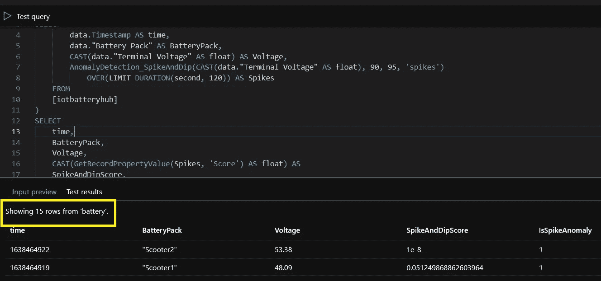

作者图片—90%置信度下模型测试的电压峰值

上图向我们展示了机器学习操作员将 15 个事件标记为尖峰。

对于**预防性分析**,我们可以实现为每个接收到的尖峰发送**警报**的代码。使用 Azure 函数可以轻松做到这一点。

*   现在让我们做一些更有趣的事情。我们现在将此转换为**流分析工作。**将该查询转换为作业的好处是可以无人值守地收集数据。收集的数据将有助于我们进行进一步的分析，这些分析可用于仪表板和决策制定。

```
WITH batteryAnomalyDetection AS
(
    SELECT
        data.Timestamp AS time,
        CAST(data."Terminal Voltage" AS float) AS Voltage,
        AnomalyDetection_SpikeAndDip(CAST(data."Terminal Voltage" AS   float), 90, 95, 'spikes')
        OVER(LIMIT DURATION(second, 120)) AS Spikes
    FROM 
    [iotbatteryhub]
)
SELECT
    time,
    Voltage,
    CAST(GetRecordPropertyValue(Spikes, 'Score') AS float) AS
    SpikeAndDipScore,
    CAST(GetRecordPropertyValue(Spikes, 'IsAnomaly') AS bigint) AS
    IsSpikeAnomaly
INTO battery
FROM batteryAnomalyDetection
```

点击**创建流分析作业**。填写如下详细信息，并点击**创建**。

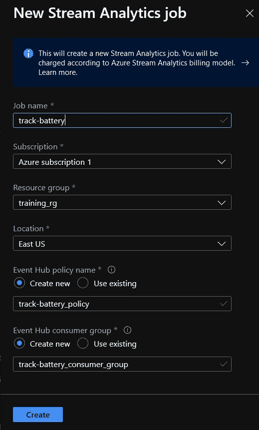

按作者分类的图像-新的流分析作业参数

*   你现在会在一个类似这样的窗口中。

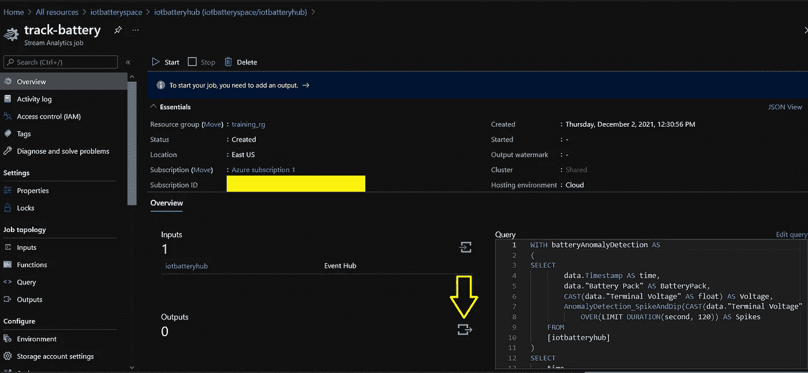

按作者分类的图像-新的流分析作业

我们需要一个用于数据收集的输出。点击 **+添加**，选择 Azure Blob 存储/ADLS Gen2。

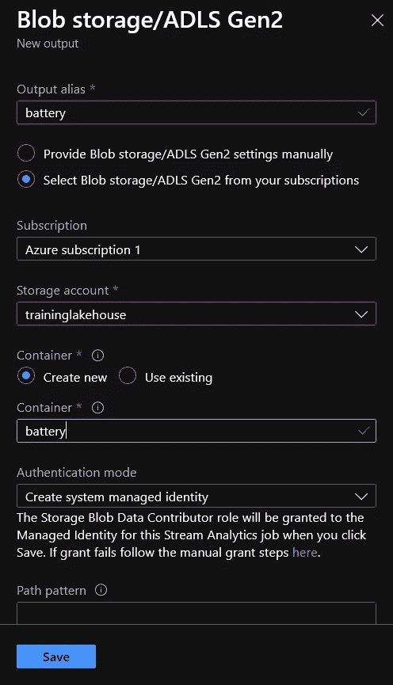

按作者分类的图像-流分析作业输出

*   既然已经创建了作业的输出，我们就可以开始作业了。点击**启动**。

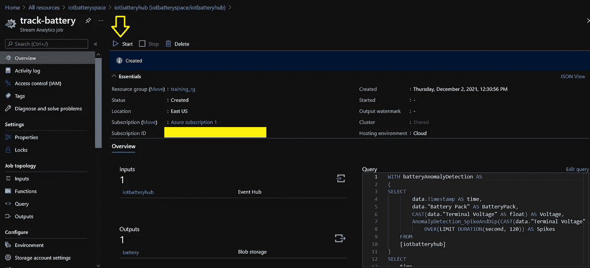

按作者分类的图像-启动流分析作业

*   收到“[流式作业成功启动](https://portal.azure.com/#)”消息后，向事件中心发送更多事件。在云外壳中调用下面的命令。

```
RESOURCEGROUPNAME="training_rg"
TOPIC="iotbattery"
EVENTHUB_NAMESPACE="iotbatteryspace"
EVENTHUB_NAME="iotbatteryhub"
EVENTHUB_CONN_STR=$(az eventhubs namespace authorization-rule keys list --resource-group $RESOURCEGROUPNAME --namespace-name $EVENTHUB_NAMESPACE --name RootManageSharedAccessKey --query "primaryConnectionString" --output tsv)
for VARIABLE in {1..100}
do
 echo "Sending event $VARIABLE"
 python ~/blogs/eventhubs/iot/send_battery_events_normal_reading.py --EVENTHUB_NAME $EVENTHUB_NAME --EVENTHUB_CONN_STR $EVENTHUB_CONN_STR
done
```

*   如果一切正常，流分析作业将以 JSON 格式将事件输出到下面的存储中。导航到**主页** > **所有资源** > **培训工作室** > **电池**

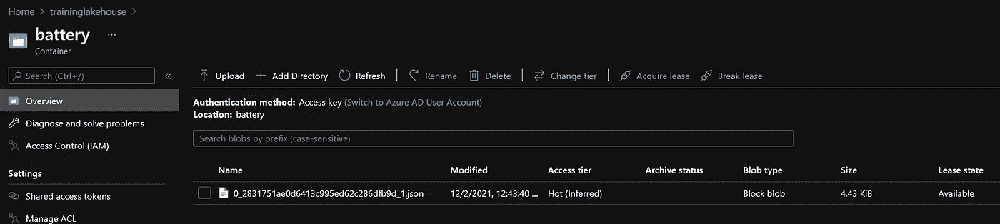

按作者分类的图像—存储上的事件数据

*   但是我们如何对事件数据进行分析呢？为此，我们可以使用 Azure Synapse。在 cloud shell 中调用下面的命令来创建一个新的 Synape 工作区。

```
STORAGEACCOUNTNAME="traininglakehouse"
BATTERYDATALAYER="battery"
SYSNAPSEWORKSPACENAME="batterytracking"
RESOURCEGROUPNAME="training_rg"
LOCATION="eastus"
SQLUSER="sqladminuser"
SQLPASSWORD="*********"az synapse workspace create \
  --name $SYSNAPSEWORKSPACENAME \
  --resource-group $RESOURCEGROUPNAME \
  --storage-account $STORAGEACCOUNTNAME \
  --file-system $BATTERYDATALAYER \
  --sql-admin-login-user $SQLUSER \
  --sql-admin-login-password $SQLPASSWORD \
  --location $LOCATIONaz synapse workspace firewall-rule create --name allowAll --workspace-name $SYSNAPSEWORKSPACENAME --resource-group $RESOURCEGROUPNAME --start-ip-address 0.0.0.0 --end-ip-address 255.255.255.255
```

*   现在导航到**主页** > **所有资源** > **电池追踪**，点击**打开 Synapse 工作室**部分的**打开**

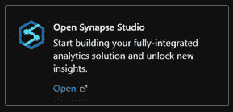

作者图片—打开 Synapse studio

*   在 Synapse workspace 窗口中，使用左侧窗格中的菜单点击**数据**。


按作者分类的图像—创建新的 SQL 数据库

输入如下详细信息，点击**创建**

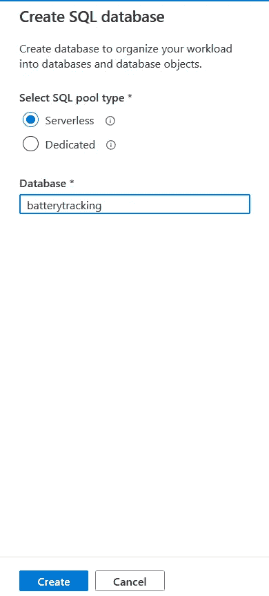

按作者排序的图像—在无服务器池中创建新的 SQL 数据库

*   创建数据库后，打开一个新的 SQL 脚本窗口。

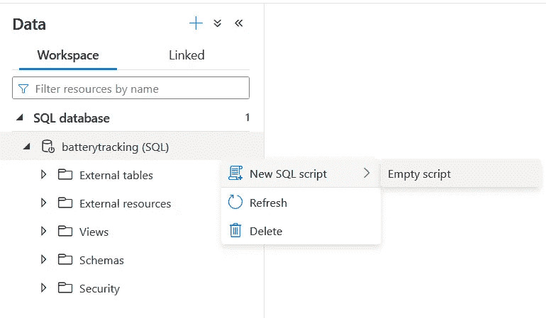

按作者排序的图像—打开一个新的 SQL 脚本窗口

*   将下面的 SQL 粘贴到新打开的 SQL 窗口中。该 SQL 将创建电池事件数据的视图。

```
CREATE view battery
AS
SELECT JSON_VALUE(doc, '$.time') AS time, JSON_VALUE(doc, '$.BatteryPack') AS BatteryPack, JSON_VALUE(doc, '$.Voltage') AS Voltage, JSON_VALUE(doc, '$.SpikeAndDipScore') AS SpikeAndDipScore, JSON_VALUE(doc, '$.IsSpikeAnomaly') AS IsSpikeAnomaly
FROM openrowset(
   BULK 'https://traininglakehouse.blob.core.windows.net/battery/',
   FORMAT= 'csv',
   FIELDTERMINATOR='0x0b',
   FIELDQUOTE= '0x0b'
) WITH(doc nvarchar(max)) as row
GO
SELECT CONVERT(TIME,DATEADD(s,cast(time as int),'19700101 0:00:00')) as time, BatteryPack, Voltage, IsSpikeAnomaly FROM battery
GO
```

*   如您所见，我们现在可以在事件数据流入存储时对其进行虚拟化。下面的图表向我们展示了一段时间内事件的峰值。该信息对于**预测分析至关重要。**

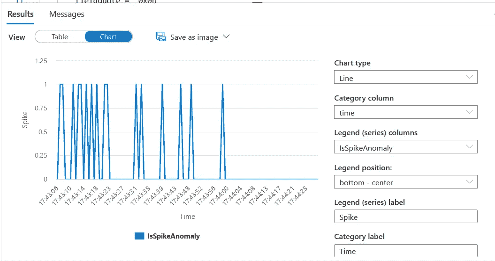

作者提供的图片—虚拟化电池事件

我希望这篇文章是有帮助的。这个主题在由 [Datafence Cloud Academy](http://www.datafence.com) 提供的 Azure 数据分析课程中有更详细的介绍。课程是周末自己在网上教的。