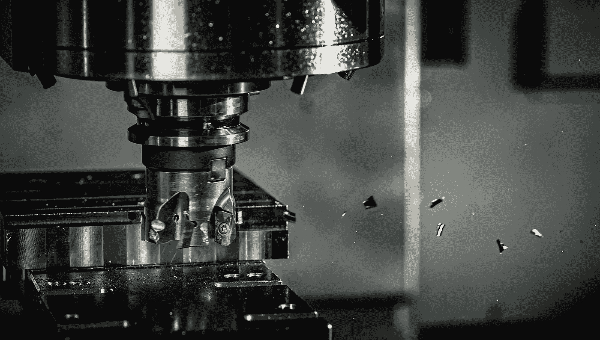

# 制造业中的异常检测，第 1 部分:简介

> 原文：<https://towardsdatascience.com/anomaly-detection-in-manufacturing-part-1-an-introduction-8c29f70fc68b?source=collection_archive---------3----------------------->

## [行业笔记](https://towardsdatascience.com/tagged/notes-from-industry)，[用 PYTHON 制造数据科学](https://towardsdatascience.com/tagged/manf-ds-python)

## 在制造业工作？用数据科学和机器学习推动您的业务


安特·罗泽茨基在 [Unsplash](https://unsplash.com/s/photos/industry?utm_source=unsplash&utm_medium=referral&utm_content=creditCopyText) 上的照片

一个关键电机出现故障。数百万美元的收入损失。最糟糕的是，这件事发生在我的眼皮底下。

事实上，失败并不归咎于任何一个人——这是一个系统故障。但是在这个过程中还是有遗漏的“信号”，就像几周前有“峰值”的温度探测器。不幸的是，我没有配备识别这些问题的工具。大量的数据不断地被收集，但要找出一个偏差就像大海捞针一样。

您可能也有过类似的经历，设备故障给企业带来了巨大的损失，无论是在金钱方面还是在人力方面。[状态监控](https://en.wikipedia.org/wiki/Condition_monitoring)是测量机器参数的过程，如温度、振动、压力等。—以便检测和预防故障。然而，过去实施的状态监控无法管理当今世界的海量数据。


可用于状态监控的几个参数。(图片由作者提供)

为了找到这些“大海捞针”，并提高生产率，传统的状态监控必须与数据科学和机器学习相结合。

幸运的是，数据的可用性以及从理论到应用的清晰界限，为在工业环境中使用数据科学和机器学习技术提供了一个令人信服的案例。[1]麦肯锡的一项研究[估计，流程制造商适当使用数据驱动技术“通常可以减少 30%到 50%的机器停机时间，延长 20%到 40%的机器寿命”。](https://www.mckinsey.com/business-functions/operations/our-insights/manufacturing-analytics-unleashes-productivity-and-profitability)

最终，正是在这里，在传统工业、数据科学和机器学习的交汇处，我们释放出难以置信的价值。

这个由三部分组成的系列将探索数据科学和机器学习在制造业中的应用。特别是，我们将学习在金属加工过程中，使用变分自动编码器(VAE)检测异常。尽管这种应用是特定于制造的，但是只要异常检测有用，就可以使用这些原理。

在第 1 部分(本文)，我们将回顾什么是异常检测。我们还将学习加州大学伯克利分校的铣削数据集，并做一些探索性的数据分析——这是重要的第一步。

在第 2 部分中，我们将介绍变分自动编码器的理论。然后，我们将使用 TensorFlow 构建和训练 VAEs 所有代码都已提供，因此您可以轻松地跟随。

最后，在[第 3 部分](/anomaly-detection-in-manufacturing-part-3-visualize-the-results-a2afb5f61d2f)中，我们将使用经过训练的 VAEs 进行异常检测。你会明白潜在空间是如何用于异常检测的。此外，我们将制作一些独特的数据可视化，以便更好地理解结果。

在本系列结束时，我希望您对异常检测以及如何在生产环境中使用它有一个新的认识。也许您会受到启发，在这个迷人的领域中锻炼您的数据科学技能？

让我们从理解什么是异常检测开始，看看自动编码器如何用于异常检测。

# 异常检测和自动编码器

道格拉斯·霍金斯给出了异常现象的经典定义:“一个[异常现象]是一个与其他观测结果相差如此之大的观测结果，以至于让人怀疑它是由不同的机制产生的。”[2]有时，异常被清楚地识别出来，数据科学家可以使用直接的方法将它们挑选出来。然而在现实中，数据中的噪声使得异常检测变得困难。区分噪声和异常成为主要挑战，如下所示。


正常数据、噪声和异常之间的连续体。挑战在于区分数据中的噪声和异常。(图片由作者提供，灵感来自[异常值分析](https://www.amazon.com/Outlier-Analysis-Charu-C-Aggarwal/dp/3319475770/ref=sr_1_1?crid=3FOZO1YOOGVD6&dchild=1&keywords=outlier+analysis&qid=1604970518&s=books&sprefix=outlier+analy%2Caps%2C196&sr=1-1)中的 Charu C. Aggarwal)

有许多方法可以执行异常检测。我强烈推荐 Aggarwal 的《离群值分析》,这本书有很好的概述。

异常检测的一种方法是使用自动编码器。如下图所示，自动编码器学习重建它们的输入。然而，重建永远不会是完美的。将数据输入与自动编码器所接受的训练非常不同的自动编码器会产生较大的重建误差。馈送相似的数据将产生较低的重建误差。


自动编码器学习重构其输入。这里，一个简单的自动编码器有一个输入层、一个输出层和一个隐藏层。隐藏单元通常被称为编码，或潜在变量。隐藏单元在潜在空间。(图片由作者提供)

重建误差的大小可以作为数据异常程度的代表。然后可以设置阈值，由此产生高于阈值的重建误差的数据被认为是异常。这被称为输入空间异常检测。

本质上，自动编码器的能力在于它能够以自我监督的方式学习。Yann Lecun 在他的图灵奖演讲中描述了自我监督学习[的力量:自我监督学习允许模型“在不为特定任务训练的情况下了解世界。”这使得大量数据可以用于模型的训练，这些数据在监督学习技术中是不可用的。](https://youtu.be/VsnQf7exv5I?t=3641)

自我监督学习的能力使其在制造和工业环境中的使用具有吸引力，在这些环境中，许多数据没有被正确标记，和/或标记成本太高。使用自动编码器进行异常检测是自我监督学习的一个实例。

# 金属加工数据集简介

我们将进一步探索自我监督学习、异常检测和自动编码器的概念，因为我们构建了一个变化的自动编码器来检测金属加工过程中工具的异常。

我们将使用的金属加工数据集或铣削数据集来自加州大学伯克利分校。这些数据存放在[美国宇航局预测卓越中心的网页](https://ti.arc.nasa.gov/tech/dash/groups/pcoe/prognostic-data-repository/)上，可以免费获取。在接下来的章节中，我们将回顾什么是铣削，然后探究数据。

## 什么是铣削？



运行中的铣削工具。(照片由[丹尼尔·史密斯](https://unsplash.com/@smudgern6?utm_source=unsplash&utm_medium=referral&utm_content=creditCopyText)在 [Unsplash](https://unsplash.com/s/photos/milling-machine?utm_source=unsplash&utm_medium=referral&utm_content=creditCopyText) 上拍摄)

在铣削中，旋转刀具，如上图所示，在沿着工件移动时去除材料。大多数情况下，铣削是在金属上进行的——这是金属加工。

下图演示了端面铣削程序。刀具在旋转的同时向前推进。当刀具旋转时，刀具将“咬入”金属并将其移除。


铣削刀具上有几个刀具刀片。当刀具旋转并被向前推动时，刀片切入金属。(图片由作者修改，[公共领域](https://commons.wikimedia.org/wiki/File:Fraisage_surfacage.svg#/media/File:Fraisage_surfacage.svg))

随着时间的推移，刀具刀片会磨损。具体来说，刀具的侧面磨损，如下所示。在 UC Berkeley 铣削数据集中，侧面磨损( *VB* )是从一次切削到另一次切削测量的。该 *VB* 值将用于标记目的。


刀具刀片的侧面磨损(透视图和正视图)。 *VB* 是侧面磨损的量度。(图片由作者提供)

# 数据探索

> 注意:我不会涵盖数据探索的所有代码——跟随 [Colab 笔记本](https://colab.research.google.com/github/tvhahn/Manufacturing-Data-Science-with-Python/blob/master/Metal%20Machining/1.A_milling-data-exploration.ipynb)查看全部内容。

处理任何新的数据科学问题时，数据探索都是重要的一步。因此，在开始任何类型的模型构建之前，我们需要熟悉加州大学伯克利分校的铣削数据集。

从哪里开始？第一步是理解数据的结构。数据是如何存储的？在数据库里？在一个数组里？元数据(如标签和时间戳)在哪里？

## **数据结构**

加州大学伯克利分校铣削数据集包含在一个结构化的 MATLAB 数组中。我们可以使用 [scipy.io 模块](https://docs.scipy.org/doc/scipy/reference/io.html)和 [loadmat](https://docs.scipy.org/doc/scipy/reference/generated/scipy.io.loadmat.html#scipy.io.loadmat) 函数加载`.mat`文件。

```
# load the data from the matlab file
m = sio.loadmat(folder_raw_data / 'mill.mat',struct_as_record=True)
```

数据存储在字典中。只有`'mill'`键包含有用的信息。

```
# store the 'mill' data in a separate np array
data = m['mill']
```

我们可以看到`data`阵列是由什么组成的。

```
# store the field names in the data np array in a tuple, l
l = data.dtype.names
print('List of the field names:\n', l)>>> List of the field names:
>>> ('case', 'run', 'VB', 'time', 'DOC', 'feed', 'material', 'smcAC', 'smcDC', 'vib_table', 'vib_spindle', 'AE_table', 'AE_spindle')
```

## 元数据和标签

加州大学伯克利分校铣削数据集包含的文档强调了重要的元数据。该数据集由 16 个铣削刀具切削金属的案例组成。创建数据时使用了六个切割参数:

*   金属类型(铸铁或钢，在数据集中分别标记为 1 或 2)
*   切割深度(0.75 毫米或 1.5 毫米)
*   进给速度(0.25 毫米/转或 0.5 毫米/转)

16 种情况中的每一种都是切削参数的组合(例如，情况一的切削深度为 1.5 毫米，进给速度为 0.5 毫米/转，并且是在铸铁上进行的)。

案例由从新工具到退化或磨损工具的单个切割组成。在所有 16 个案例中有 167 个切口(在文档中称为“运行”)。许多切口都伴随着一定程度的侧面磨损 *(VB* )。我们稍后将使用它来标记切口是健康的、退化的还是磨损的。

最后，在每次切割期间收集六个信号:

*   [主轴和工作台发出的声发射](https://en.wikipedia.org/wiki/Acoustic_emission) (AE)信号。
*   来自主轴和工作台的振动。
*   主轴电机的交流/DC 电流。

信号以 250 Hz 采集，每个切割有 9000 个采样点，总信号长度为 36 秒。

我们将从 numpy 数组中提取元数据和标签，并将其存储为 pandas 数据帧——我们将此数据帧称为`df_labels`,因为它包含我们感兴趣的标签信息。我们是这样创建数据帧的:


在上表中，从`df_labels.head()`可以看出，并非所有切口都标有侧面磨损( *VB* )值。稍后，我们将设置工具健康状况的类别—健康、降级或磨损(故障)。对于没有侧面磨损( *VB* )值的切削，我们可以基于具有磨损值的附近切削合理地估计刀具健康类别。

## 数据可视化

可视化一个新的数据集是一种很好的方式来掌握正在发生的事情，并检测任何问题。我也喜欢数据可视化，所以我们将使用 [seaborn](https://seaborn.pydata.org/) 和 [Matplotlib](https://matplotlib.org/) 创建一个漂亮的图形。

在这个数据集中只有 167 次切割，这不是一个很大的数量。我们可以目视检查每个切口以发现异常。幸运的是，我已经为你做到了…下面是一个亮点。

首先，我们来看一个相当“正常”的剪切——167 号剪切。


但是，如果您查看所有切割，您会发现切割 18 和 95(索引 17 和 94)很奇怪，在我们开始构建异常检测模型之前，需要丢弃它们。

这是第 18 个镜头:


这是第 95 次切割:


最后，我们将创建一个图表，清晰地显示所有六个信号(声发射、振动和电流)。


切 146 号。(图片由作者提供)

# 结论

数据科学和机器学习非常适合制造业环境。为此，我们回顾了使用自动编码器进行异常检测的概念。这种自我监督的学习方法在制造环境中有助于检测和预防机器故障。

在这篇文章中，我们还解释了什么是金属加工——在铣削的背景下——并探索了加州大学伯克利分校铣削数据集。在[第 2 部分](/anomaly-detection-in-manufacturing-part-2-building-a-variational-autoencoder-248abce07349)中，我们将构建一个变化的自动编码器，并根据铣削数据对其进行训练。

# 参考

[1]经济学家。(2020).[企业发现人工智能很难被采用。《经济学家》，ISSN 0013–0613。](https://www.economist.com/technology-quarterly/2020/06/11/businesses-are-finding-ai-hard-to-adopt)

[2]霍金斯博士(1980 年)。 [*离群值识别*](https://www.amazon.com/Identification-Outliers-Monographs-Statistics-Probability/dp/041221900X/ref=sr_1_1?dchild=1&keywords=Identification+of+Outliers+hawkins&qid=1605018126&sr=8-1) (第 11 卷)。伦敦:查普曼与霍尔。

*本文原载于*[*tvhahn.com*](https://www.tvhahn.com/posts/milling/)*。此外，这项工作是对发表在 IJHM* *的* [*研究的补充。官方的 GitHub 回购是*](https://www.researchgate.net/publication/350842309_Self-supervised_learning_for_tool_wear_monitoring_with_a_disentangled-variational-autoencoder) [*这里的*](https://github.com/tvhahn/ml-tool-wear) *。*

*除非另有说明，本帖及其内容由作者以*[*CC BY-SA 4.0*](https://creativecommons.org/licenses/by-sa/4.0/)*授权。*