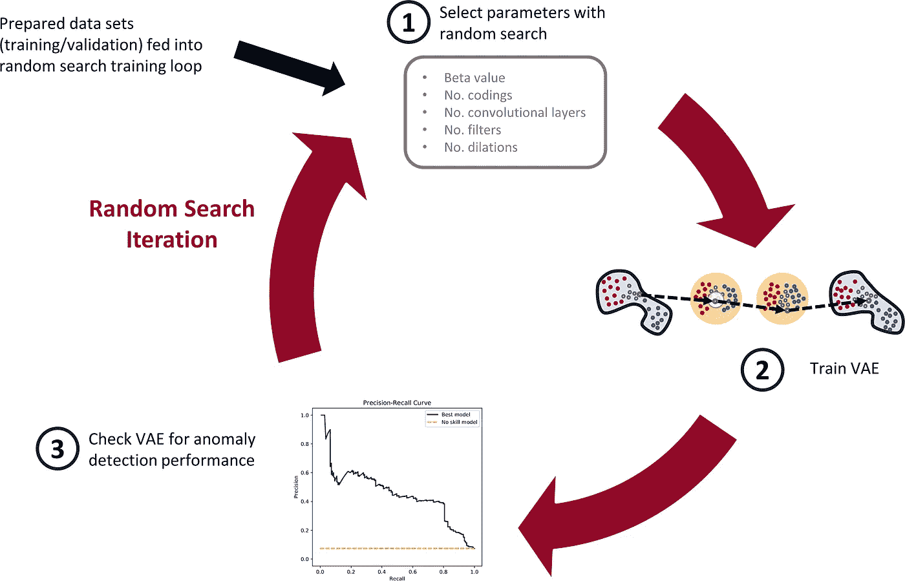

# 制造业中的异常检测，第 2 部分:构建可变自动编码器

> 原文：<https://towardsdatascience.com/anomaly-detection-in-manufacturing-part-2-building-a-variational-autoencoder-248abce07349?source=collection_archive---------10----------------------->

## [用 PYTHON 制造数据科学](https://towardsdatascience.com/tagged/manf-ds-python)

## 机器故障？使用可变自动编码器来检测和防止它们

照片由[丹尼尔·史密斯](https://unsplash.com/@smudgern6?utm_source=unsplash&utm_medium=referral&utm_content=creditCopyText)在 [Unsplash](https://unsplash.com/@smudgern6?utm_source=unsplash&utm_medium=referral&utm_content=creditCopyText) 上拍摄

在[之前的文章](/anomaly-detection-in-manufacturing-part-1-an-introduction-8c29f70fc68b)(本系列的第 1 部分)中，我们讨论了如何使用自动编码器进行异常检测。我们还探索了[加州大学伯克利分校铣削数据集](https://ti.arc.nasa.gov/tech/dash/groups/pcoe/prognostic-data-repository/#milling)。接下来，我们将使用自动编码器的变体——变分自动编码器(VAE)——对铣削数据集进行异常检测。

在这篇文章中，我们将看到 VAE 与传统自动编码器的相似和不同之处。然后，我们将实现一个 VAE，并在铣削数据上训练它。在下一篇第 3 部分的[中，我们将检查 VAE 的异常检测性能。](/anomaly-detection-in-manufacturing-part-3-visualize-the-results-a2afb5f61d2f)

# 变分自动编码器

variable auto encoder 于 2013 年推出，目前广泛用于机器学习应用。[1]VAE 不同于传统的自动编码器，因为 VAE 既是概率性的又是生成性的。那是什么意思？VAE 生成的输出部分是随机的(即使在训练之后),也可以生成与被训练数据相似的新数据。

VAE 在线有很好的解释——我会带你去 Alfredo Canziani 的深度学习课程(下面的视频来自 YouTube)。不管怎样，我试图解释一下。

在高层次上，VAE 具有与传统自动编码器相似的结构。然而，编码器学习不同的编码；即，VAE 学习均值编码、和标准差编码、**。然后，VAE 从高斯分布中随机采样，具有由编码器产生的相同的平均值和标准偏差，以生成潜在变量 ***z*** 。这些潜在变量被“解码”以重建输入。**

**下图展示了如何使用 VAE 重建信号。**

****

**一种变化的自动编码器架构(上图)，以及一个通过 VAE 的数据样本示例(下图)。数据在编码器中被压缩以产生平均值和标准偏差编码。然后，通过添加高斯噪声，从均值和标准差编码中创建编码。解码器使用编码(或潜在变量)来重建输入。(图片由作者提供，灵感来自[奥雷连·杰龙](https://www.amazon.com/Hands-Machine-Learning-Scikit-Learn-TensorFlow/dp/1492032646/ref=sr_1_1?dchild=1&keywords=Tensorflow+geron&qid=1622670016&sr=8-1))**

**在训练期间，VAE 努力最小化其重建损失(在我们的情况下，我们使用二进制交叉熵)，同时，使用潜在损失强制高斯结构。这种结构是通过 Kullback-Leibler (KL)散度实现的，在最初的 VAE 论文中对损失进行了详细的推导。[1]潜在损失如下:***

****

**其中 *K* 是潜在变量的数量，而 *β* 是由 Higgens 等人[2]引入的可调超参数**

**VAE 学习嵌入在编码中的因子，这些因子可用于生成新数据。作为这些因素的一个例子，VAE 可以被训练来识别图像中的形状。一个因素可能编码了形状有多尖的信息，而另一个因素可能看它有多圆。然而，在 VAE 中，这些因素经常在编码中纠缠在一起(潜在变量)。**

**将超参数β*(β)*调整为大于 1 的值，可以使因子“解开”,使得每个编码一次仅代表一个因子。因此，可以获得模型的更大的可解释性。具有可调β的 VAE 有时被称为解纠缠-变分-自动编码器，或者简称为 *β* -VAE。为了简单起见，我们仍然称 *β* -VAE 为 VAE。**

# **数据准备**

**在继续之前，我们需要准备数据。最终，我们将使用 VAE 来检测“异常”工具状况，这对应于工具磨损或失效的时间。但是首先我们需要标记数据。**

**如上一篇文章所示，每次切削都有一个相关的侧面磨损量， *VB* ，在切削结束时测量。我们将根据刀具的磨损程度将每个切削标记为健康、退化或失败——这些是刀具健康类别。以下是模式:**

****

**我创建了一个数据准备类，它获取原始的 Matlab 文件，一个带标签的 CSV(每个切口都标有相关的侧面磨损)，并输出训练/验证/和测试数据。然而，我想在课上强调一个重要的功能。也就是`create_tensor`函数。**

> **注意:为了简洁，我不会覆盖所有的代码——按照 [Colab 笔记本](https://colab.research.google.com/github/tvhahn/Manufacturing-Data-Science-with-Python/blob/master/Metal%20Machining/1.B_building-vae.ipynb)中的步骤，训练一些模型。**

**`create_tensor`函数获取一个单独的片段，将其分解成块，并放入一个数组中。它使用一个固定大小的窗口(`window_size`变量)将切割信号分割成块，然后沿着信号“滑动”窗口。窗口“滑动”预定的量，由`stride`变量设置。**

**我们将采用 165 个切割中的每一个(记住，原始 167 个切割中的两个被破坏)，并应用 64 的窗口大小和 64 的步幅(窗口之间没有重叠)。**

**我目视检查了每个切割，并选择了“稳定”切割区域出现的时间，通常是信号开始收集后的五秒钟左右，信号收集结束前的几秒钟。该信息存储在“[labels _ with _ tool _ class . CSV](https://github.com/tvhahn/ml-tool-wear/blob/master/data/processed/labels_with_tool_class.csv)”文件中。**

**使用`data_prep.py` (参见 [github repo](https://github.com/tvhahn/ml-tool-wear) )和一些 Python 魔术，我们可以创建训练/验证/测试数据集。脚本看起来是这样的:**

**数据的最终分布如下所示。注意数据有多不平衡(即相对较少的“失败”样本)？这是制造/工业数据中的常见问题，也是使用自监督方法的另一个原因。**

****

**对于异常检测，通常只对“正常”数据训练自动编码器。我们将做同样的事情，在健康数据(0 类)上训练我们的 VAE。但是，检查异常检测的性能将使用所有数据来完成。换句话说，我们将在“瘦”数据集上训练我们的 VAE，但在“完整”数据集上测试。**

# **构建模型**

**我们现在明白了什么是变分自动编码器，以及数据是如何准备的。是时候建造了！**

**我们的 VAEs 将由卷积层、批量标准化层和最大池层组成。下图显示了我们的一个 VAE 模型可能的样子。**

****

**VAE 使用的示例模型架构。编码器的输入是铣削数据样本，对于(64，6)的输入形状，窗口大小为 64。有 3 个卷积层，滤波器大小为 17，编码大小为 18。(图片由作者提供)**

**我不会讨论这个模型的所有细节。但是，这里有一些要点:**

*   **我使用时间卷积网络作为卷积层的基础。实现来自 Philippe Remy——感谢 Philippe！你可以在这里找到他的 github 回购[。](https://github.com/philipperemy/keras-tcn)**
*   **Aurélien Geron 的书[“用 Scikit-Learn、Keras 和 TensorFlow 实践机器学习”](https://www.amazon.com/Hands-Machine-Learning-Scikit-Learn-TensorFlow/dp/1492032646/ref=sr_1_1?dchild=1&keywords=Aur%C3%A9lien+Geron&qid=1614346360&sr=8-1)很棒。特别是，他关于 VAEs 的部分非常有用，我在这里使用了他的一些方法。有一本 Jupyter 的笔记本，摘自他的书中关于他的 github 的章节，非常有用。谢谢奥雷连恩！[3]**
*   **正如 Geron 所建议的，我使用了四舍五入的精确度来衡量模型在训练过程中的表现。**

**模型函数大概是这样的:**

# **训练模型**

**是时候开始训练一些模特了。为了选择超参数，我们将使用随机搜索。**

**为什么要随机搜索？嗯，它实现起来相当简单，而且与网格搜索相比，已经显示出产生良好的结果。[4] Scikit-learn 有一些实现随机搜索的好方法——我们将使用`[ParameterSampler](https://scikit-learn.org/stable/modules/generated/sklearn.model_selection.ParameterSampler.html)`方法。**

**我们将训练一堆不同的阀门，都有不同的参数。在每个 VAE 都经过训练(训练以最小化重建损失)并保存模型后，我们将浏览 VAE 模型，并查看它在异常检测中的表现(我们将在第 3 部分中讨论)。下面是随机搜索训练过程的示意图:**

****

**随机搜索训练过程有三个步骤。首先，随机选择超参数。其次，用这些参数训练 VAE。第三，检查经过训练的 VAE 的异常检测性能。(图片由作者提供)**

**在实践中，当我运行这个实验时，我在 Google Colab 上训练了大约 1000 个 VAE 模型(免费 GPU 耶！).在训练完所有 1000 个模型后，我将它们转移到我的本地计算机上，使用一个功能不太强大的 GPU，然后检查这些模型的异常检测性能。Colab GPUs 的持续使用是有限的，因此以这种方式最大限度地利用它们上的 GPU 是有意义的。**

**您可以在 [Colab 笔记本](https://colab.research.google.com/github/tvhahn/Manufacturing-Data-Science-with-Python/blob/master/Metal%20Machining/1.B_building-vae.ipynb)中查看完整的训练循环。试着训练一些模特！**

# ****结论****

**在这篇文章中，我们了解了 VAE 与传统自动编码器的相似和不同之处。然后，我们准备铣削数据，为超参数选择创建随机搜索，并开始训练模型。**

**在[的下一篇文章](/anomaly-detection-in-manufacturing-part-3-visualize-the-results-a2afb5f61d2f)，第 3 部分中，我们将评估经过训练的 vae，看看它们是如何用于异常检测的。我们将使用精度-召回曲线来询问模型性能。最后，我们将创建一些漂亮的图形来可视化结果(我的最爱！).**

# **参考**

**[1]金马博士和韦林博士(2013 年)。[自动编码变分贝叶斯。](https://arxiv.org/abs/1312.6114) *arXiv 预印本 arXiv:1312.6114* 。**

**[2]希金斯、伊琳娜等人(2016)。" [beta-vae:用约束变分框架学习基本视觉概念。](https://openreview.net/forum?id=Sy2fzU9gl)”**

**[3]盖伦，奥雷连恩。(2019).[使用 Scikit-Learn、Keras 和 TensorFlow 进行机器实践学习:构建智能系统的概念、工具和技术。](https://www.amazon.com/Hands-Machine-Learning-Scikit-Learn-TensorFlow/dp/1492032646/ref=sr_1_1?dchild=1&keywords=Aur%C3%A9lien+Geron&qid=1614346360&sr=8-1)奥莱利传媒。**

**[4]j .伯格斯特拉和 y .本吉奥(2012 年)。[超参数优化的随机搜索。](https://www.jmlr.org/papers/volume13/bergstra12a/bergstra12a) *机器学习研究杂志*， *13* (2)。**

***本文原载于 tvhahn.com***。此外，这项工作是对发表在 IJHM* *的* [*研究的补充。官方的 GitHub 回购是*](https://www.researchgate.net/publication/350842309_Self-supervised_learning_for_tool_wear_monitoring_with_a_disentangled-variational-autoencoder) [*这里的*](https://github.com/tvhahn/ml-tool-wear) *。****

****除非另有说明，本帖及其内容由作者授权于*[*CC BY-SA 4.0*](https://creativecommons.org/licenses/by-sa/4.0/)*。****

**** *更正:在最初的文章中，我在潜在损失函数中有一个错误(尽管代码很好)。我已经对它进行了修改，以匹配 Geron 中的内容。此外，记谱法与阿尔弗雷多·坎齐亚尼不同。请参考他的视频——非常好！****