# 制造业中的异常检测，第 3 部分:可视化结果

> 原文：<https://towardsdatascience.com/anomaly-detection-in-manufacturing-part-3-visualize-the-results-a2afb5f61d2f?source=collection_archive---------12----------------------->

## [用 PYTHON 制造数据科学](https://towardsdatascience.com/tagged/manf-ds-python)

## 创建漂亮的数据可视化，并查看异常检测模型的执行情况

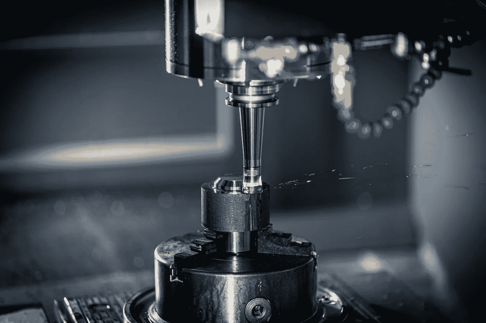

照片由[丹尼尔·史密斯](https://unsplash.com/@smudgern6?utm_source=unsplash&utm_medium=referral&utm_content=creditCopyText)在 [Unsplash](https://unsplash.com/?utm_source=unsplash&utm_medium=referral&utm_content=creditCopyText) 上拍摄

在现代制造环境中，数据的可用性是巨大的，但是常常缺乏利用数据的能力。幸运的是，数据科学和机器学习的工具可以提供帮助，反过来，可以释放出难以置信的价值。在本系列中，我们一直在探索这些工具在金属加工过程中检测故障的应用。

在[之前的文章](/anomaly-detection-in-manufacturing-part-2-building-a-variational-autoencoder-248abce07349)中，我们构建并训练了可变自动编码器来重构铣床信号。下图中的步骤 1 和 2 显示了这一点。在本帖中，我们将通过检查一个经过训练的 VAE 模型的异常检测性能来演示随机搜索循环的最后一步(步骤 3)——我们将看看我们的异常检测模型是否能够真正检测到磨损的工具。

使用重建误差(输入空间异常检测)和测量样本之间的 KL-散度差(潜在空间异常检测)来执行异常检测。我们将看到这是如何做到的，并通过一些漂亮的数据可视化来深入研究结果。最后，我将建议一些潜在的领域进行进一步的探索。

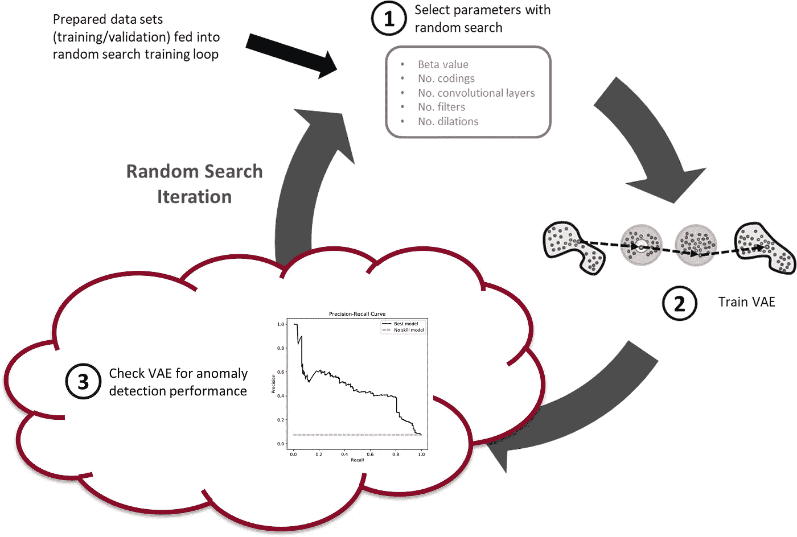

随机搜索训练过程有三个步骤。首先，随机选择超参数。其次，用这些参数训练 VAE。第三，检查经过训练的 VAE 的异常检测性能。在这篇文章中，我们将着眼于第三步。(图片由作者提供)

# 背景

## 输入空间异常检测

我们的变型自动编码器已经过“健康”刀具磨损数据的培训。因此，如果我们向训练过的 VAEs 提供不健康的数据，或者仅仅是不正常的数据，我们将产生很大的重建误差。可以对该重建误差设置阈值，由此产生高于阈值的重建误差的数据被认为是异常。这是输入空间异常检测。

> 注意:为了简洁，我不会在这篇文章中涵盖所有代码——打开 [Colab 笔记本](https://colab.research.google.com/github/tvhahn/Manufacturing-Data-Science-with-Python/blob/master/Metal%20Machining/1.C_anomaly-results.ipynb)进行交互体验，并查看所有代码。

我们将使用均方误差(MSE)来测量重建误差。因为重构是对所有六个信号的重构，所以我们可以计算每个单独信号(`mse`函数)以及所有六个组合信号(`mse_total`函数)的 MSE。这两个函数如下所示:

重建值(`recon`)是通过将窗口切割信号(也称为子切割)输入到训练过的 VAE 中产生的，如下:`recon = model.predict(X, batch_size=64).`

重构概率是输入空间异常检测的另一种方法。).安和赵在他们 2015 年的论文中介绍了这种方法。[1]

我对重建概率方法不太熟悉，但是詹姆斯·麦卡弗里在他的博客[上有一个很好的解释(并且用 PyTorch 实现)。他说:“重建概率异常检测的想法是计算第二个概率分布，然后用它来计算输入项来自该分布的可能性。具有低重建概率的数据项不可能来自该分布，因此在某种程度上是异常的。”](https://jamesmccaffrey.wordpress.com/2021/03/11/anomaly-detection-using-variational-autoencoder-reconstruction-probability/)

我们不会使用重建概率来进行异常检测，但实现起来会很有趣。也许你可以试一试？

## 潜在空间异常检测

异常检测也可以使用潜在空间中的均值和标准差编码来执行，这就是我们将要做的。下面是一般的方法:

*   使用 KL-divergence，测量数据样本之间熵的相对差异。可以在这个相对差异上设置阈值，指示数据样本何时异常。

Adam Lineberry 在他的博客上有一个用 PyTorch 实现的 KL-divergence 异常检测的很好的例子。下面是我们将使用的 KL-divergence 函数(通过 Keras 和 TensorFlow 实现):

其中`mu`是平均值()，而`log_var`是方差的对数(log σ)。方差的对数用于训练 VAE，因为它比方差更稳定。

为了生成 KL-散度分数，我们使用以下函数:

## 评估指标

在我们计算了重建误差或 KL-divergence 分数之后，我们准备设置一个决策阈值。任何高于阈值的值都将是异常的(可能是磨损的工具)，而任何低于阈值的值都将是正常的(健康的工具)。

为了全面评估一个模型的性能，我们必须考虑一系列潜在的决策阈值。两种常见的方法是[接收器工作特性](https://en.wikipedia.org/wiki/Receiver_operating_characteristic) (ROC)和[精确召回](https://en.wikipedia.org/wiki/Precision_and_recall)曲线。ROC 曲线描绘了真阳性率对假阳性率。精确度-召回曲线，顾名思义，描绘了精确度与召回率的关系。测量曲线下的面积提供了一个比较不同模型的好方法。

我们将使用精确召回曲线下面积(PR-AUC)来评估模型性能。与 ROC-AUC 相比，PR-AUC 在不平衡数据上表现良好。[2，3]下图解释了什么是精确度和召回率，以及精确度-召回率曲线是如何构建的。

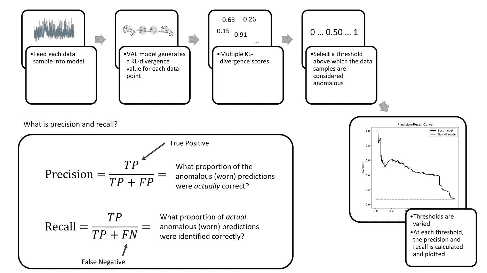

通过改变异常检测模型中的决策阈值来创建精确召回曲线。(图片由作者提供)

最终，模型性能的评估及其决策阈值的设置是特定于应用的。例如，制造商可能将预防工具故障置于频繁更换工具之上。因此，他们可以设置低阈值来检测更多的工具故障(更高的召回率)，但代价是有更多的假阳性(更低的精度)。

# 分析最佳模型

现在，一些“背景”信息已经涵盖，我们可以开始分析训练好的 VAE 模型。您必须计算每个模型的性能指标(PR-AUC 分数),看看哪一个是最好的。但是为了这个帖子，我已经训练了一堆模型，选出了最上面的一个(基于 PR-AUC 评分)。

以下是顶配车型的参数:

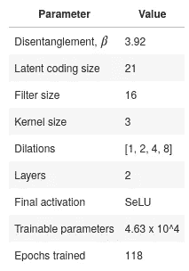

## 计算 PR-AUC 分数

让我们看看顶级模型在训练/验证/测试集上的 PR-AUC 分数。但是首先，我们需要加载数据和包。

`get_results`函数接受一个模型，并给出该模型在训练、验证和测试集上的性能。它还返回给定迭代次数的精度、召回、真阳性和假阳性(称为`grid_iterations`)。因为 VAE 的输出是部分随机的(random ),所以您也可以运行一些搜索(`search_iterations`),然后取所有搜索的平均值。

最后，下面是我们得出的结果:

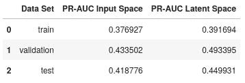

看上表:潜在空间异常检测优于输入空间异常检测。这并不奇怪。包含在潜在空间中的信息更具表现力，因此更有可能识别切割之间的差异。

## 精确回忆曲线

我们希望将模型的性能可视化。让我们为潜在空间中的异常检测模型绘制精确召回曲线和 ROC 曲线。

上图中的虚线表示“无技能模型”在进行异常检测时将获得的结果，也就是说，如果模型为数据集中的每个子部分随机分配一个类别(正常或异常)。该随机模型由 ROC 图中的斜线和 PR-AUC 图中的水平线表示，设定精度为 0.073(测试集中失败子切割的百分比)。

比较精确-召回曲线和 ROC 曲线:ROC 曲线给出了对模型性能更乐观的看法；这是 0.883 的曲线下面积。然而，精确召回曲线下面积没有那么高，值为 0.450。

为什么曲线下面积值不同？这是因为我们的数据严重失衡。这就是为什么您想要使用 PR-AUC 而不是 ROC-AUC 指标的确切原因。PR-AUC 将在处理不平衡数据时提供模型性能的更真实视图。

## 潜在空间的小提琴情节

小提琴图是一种可视化决策边界和查看样本错误分类的有效方法。你说，什么是小提琴的情节？我们来造一个吧！

这是 will 将用来创建情节的`violin_plot`函数。它需要经过训练的编码器、子切割(`X`)、标签(`y`)和一个示例阈值。

我们需要加载编码器。

…还有剧情！

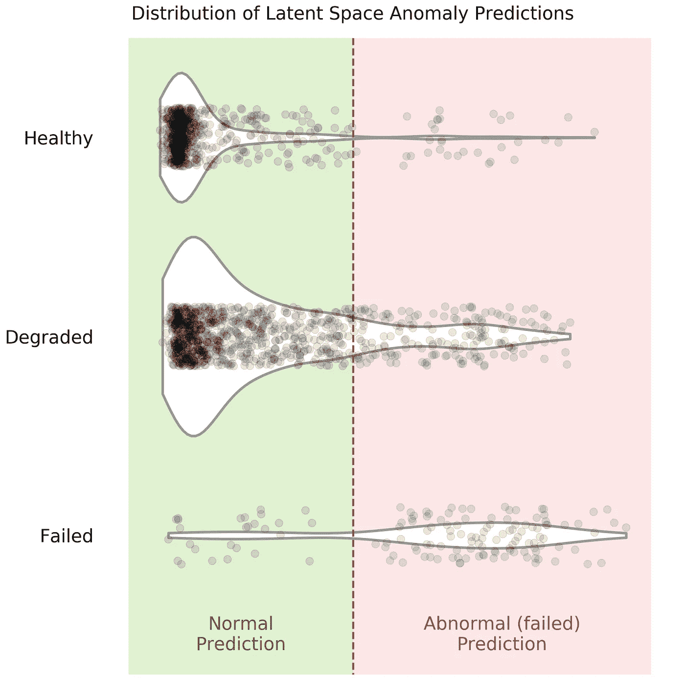

不错吧。您可以在 violin 图中看到不同的阈值会如何错误分类不同数量的数据点。想象红色虚线，代表决策阈值，在图上向左或向右移动。这是异常检测的固有问题——从异常中分离噪声。

## 比较不同切割参数的结果

铣削数据集中有六个切削参数:

*   金属类型(铸铁或钢)
*   切割深度(0.75 毫米或 1.5 毫米)
*   进给速度(0.25 毫米/转或 0.5 毫米/转)

我们可以看到我们选择的异常检测模型是否在一组参数上比另一组参数更好地检测失败的工具。我们将通过一次向模型中输入一种类型的参数并观察结果来做到这一点。例如，我们将进给用铸铁制成的切口。那我们就转向钢铁。等等。等等。

我已经跳过了一个好的代码块(见 [Jupyter 笔记本](https://colab.research.google.com/github/tvhahn/Manufacturing-Data-Science-with-Python/blob/master/Metal%20Machining/1.C_anomaly-results.ipynb)),因为它是重复的。但是，一旦我们为每个独特的切削参数创建了结果数据帧，我们就可以将它们组合成一个简洁的条形图。

下面是组合每组结果的代码:

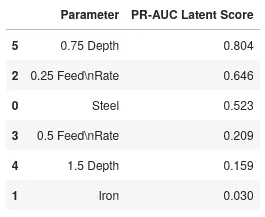

现在我们可以制作漂亮的条形图了。

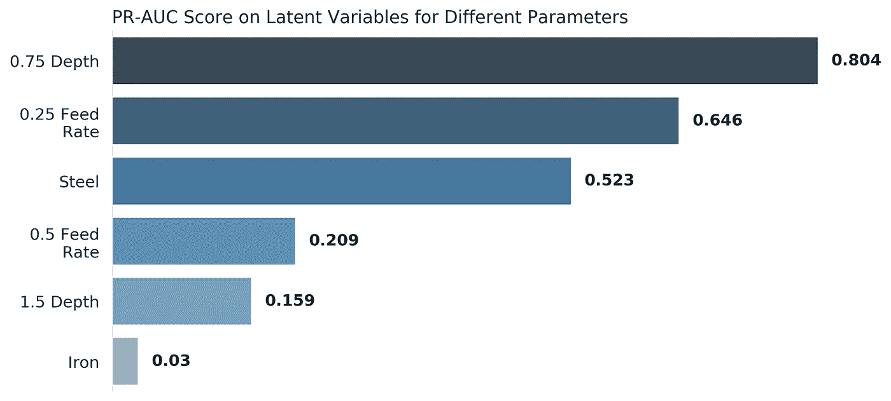

显然，这个“最佳”模型发现一些切削参数比其他参数更有用。某些切削参数可以产生携带更多信息和/或具有更高信噪比的信号。

在训练过程中，该模型还可以对某些参数产生优于其他参数的偏好。偏好可以是模型构建方式(例如，β参数或编码大小)以及模型训练方式的函数。

我怀疑可能存在具有不同参数偏好的模型配置，例如铸铁而不是钢。一组[模型](https://en.wikipedia.org/wiki/Ensemble_learning)可能会产生更好的结果。这将是进一步研究的一个有趣的领域！

## 趋势 KL-Divergence 分数

KL-divergence 分数可以按顺序进行趋势分析，以了解我们的异常检测模型是如何工作的。这是我最喜欢的图表——它很漂亮，给人很好的洞察力。

注意:您也可以对输入空间重构误差进行趋势分析，但我们不会在这里这样做。

让我们快速探索一下，看看这些趋势会是什么样子。我们需要一个函数来对子切割进行顺序排序:

现在做一个趋势图。

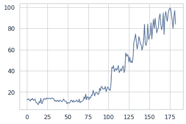

我们现在有了创建 KL-divergence 分数随时间变化趋势图所需的所有信息。

我们将趋势案例 13，这是在钢上进行，速度很慢，是一个浅切口。

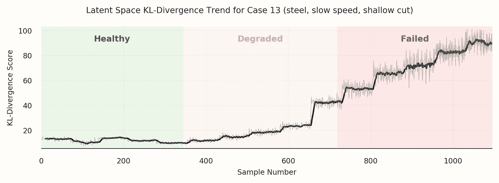

看起来不错！这个模型产生了一个清晰的趋势。然而，正如我们在上一节中所看到的，我们的异常检测模型在某些切削条件下识别刀具异常(失效/不健康/磨损)时确实有些困难。

让我们看看另一个例子——案例 11。

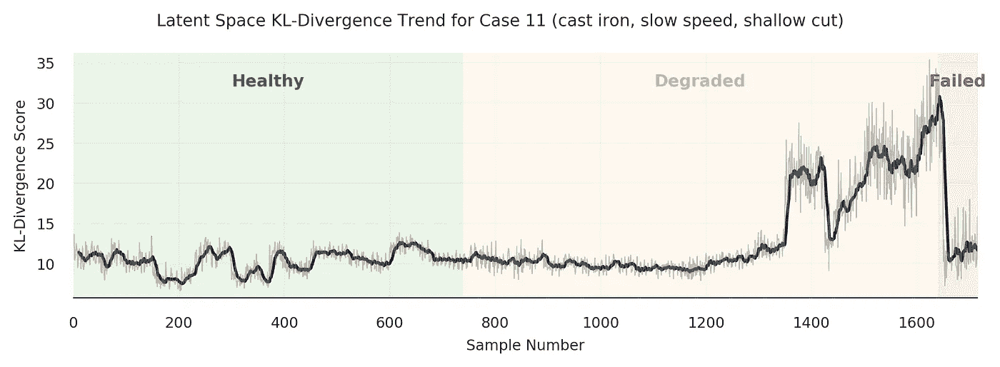

通过“降级”区域，您可以看到趋势是如何增加的，但是当它到达红色的“失败”区域时，趋势会迅速下降。为什么？呃，我也不知道具体是什么。趋势末端的样本可能更类似于健康样本…我很想听听你的想法。

还有更多的分析可以做…我会留给你。如果你发现什么有趣的东西，请告诉我！

# 进一步的想法

在这个由三部分组成的系列中，我们所做的是使用 VAE 在工业数据集上构建一种异常检测方法。我毫不怀疑这些方法可以大大改进，其他有趣的领域也可以探索。

我希望一些勤奋的研究人员或学生可以利用这项工作作为跳板，或灵感，做一些真正有趣的事情！以下是我有兴趣进一步做的一些事情:

*   正如我上面提到的，模型集合可能会产生更好的结果。
*   VAE 中的β使它成为一个不纠缠的变分自动编码器。看看编码如何随不同的切削参数而变化，以及编码是否代表独特的特征，这将是很有趣的。
*   我在 VAE 中使用了 TCN，但我认为一个常规的卷积神经网络，加上膨胀，也会工作得很好(这是我的直觉)。这将使模型训练更简单。
*   如果我要重新开始，我会整合更多的模型测试。这些模型测试(如单元测试)将对照不同的切割参数检查模型的性能。这将更容易发现哪些模型在切削参数上具有良好的通用性。

# 结论

在这篇文章中，我们通过几个可视化来探索我们训练过的 VAE 模型的性能。我们发现使用 KL 散度的潜在空间比输入空间的异常检测更有效。

在制造领域使用数据科学和机器学习工具有很强的商业案例。此外，这里演示的原则可以跨许多使用异常检测的领域使用。

我希望你喜欢这个系列，也许，学到了一些新的东西！

# 参考

[1]安，j .，&赵树声(2015)。[使用重构概率的基于变分自动编码器的异常检测](http://dm.snu.ac.kr/static/docs/TR/SNUDM-TR-2015-03.pdf)。*工业工程专题讲座*， *2* (1)，1–18。

[2]j .戴维斯和 m .戈德里奇(2006 年 6 月)。[精确召回与 ROC 曲线的关系](https://dl.acm.org/doi/pdf/10.1145/1143844.1143874?casa_token=CSQzAhypHQ0AAAAA:WqAGJXokpttfPIStrcXb_2tXdufgXdDu085FVIBhtQA1hLgXZrJGVHThaTBx4tzGUky8KTRuMJqidg)。在*第 23 届机器学习国际会议论文集*(第 233–240 页)。

[3]t .斋藤和 m .雷姆斯迈尔(2015 年)。[在不平衡数据集上评估二元分类器时，精确召回图比 ROC 图提供的信息更多](https://journals.plos.org/plosone/article?id=10.1371/journal.pone.0118432)。 *PloS one* ， *10* (3)，e0118432。

*本文原载于*[*【tvhahn.com】*](https://www.tvhahn.com/posts/anomaly-results/)*。此外，这项工作是对发表在 IJHM* *的* [*研究的补充。官方的 GitHub 回购是*](https://www.researchgate.net/publication/350842309_Self-supervised_learning_for_tool_wear_monitoring_with_a_disentangled-variational-autoencoder) [*这里的*](https://github.com/tvhahn/ml-tool-wear) *。*

*除非另有说明，本帖及其内容由作者授权于*[*CC BY-SA 4.0*](https://creativecommons.org/licenses/by-sa/4.0/)*。*