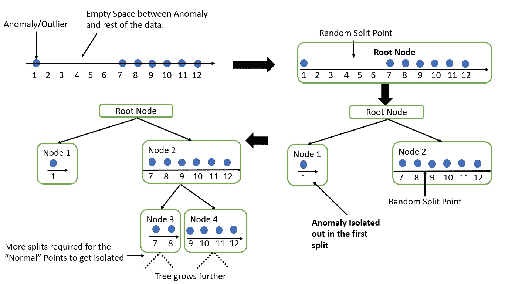
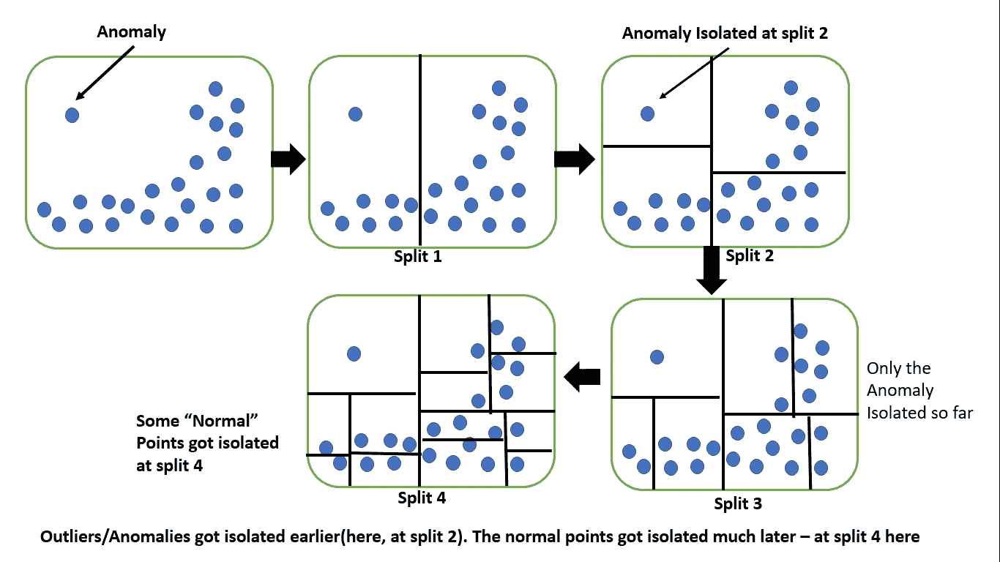
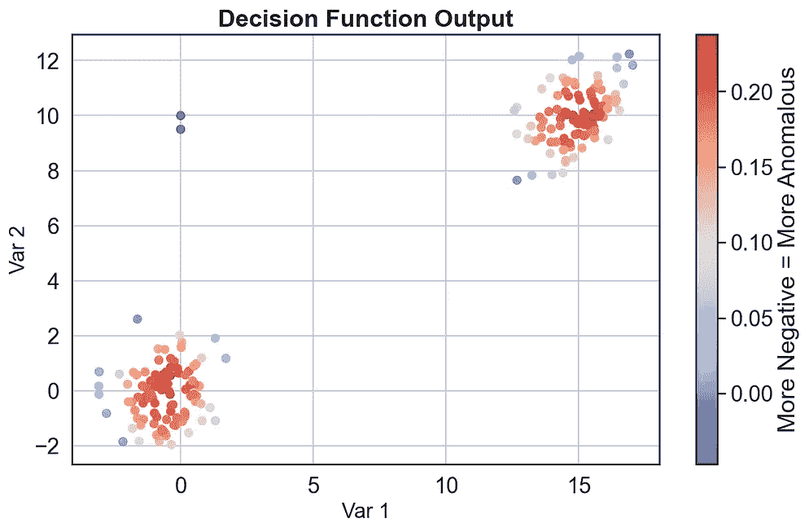
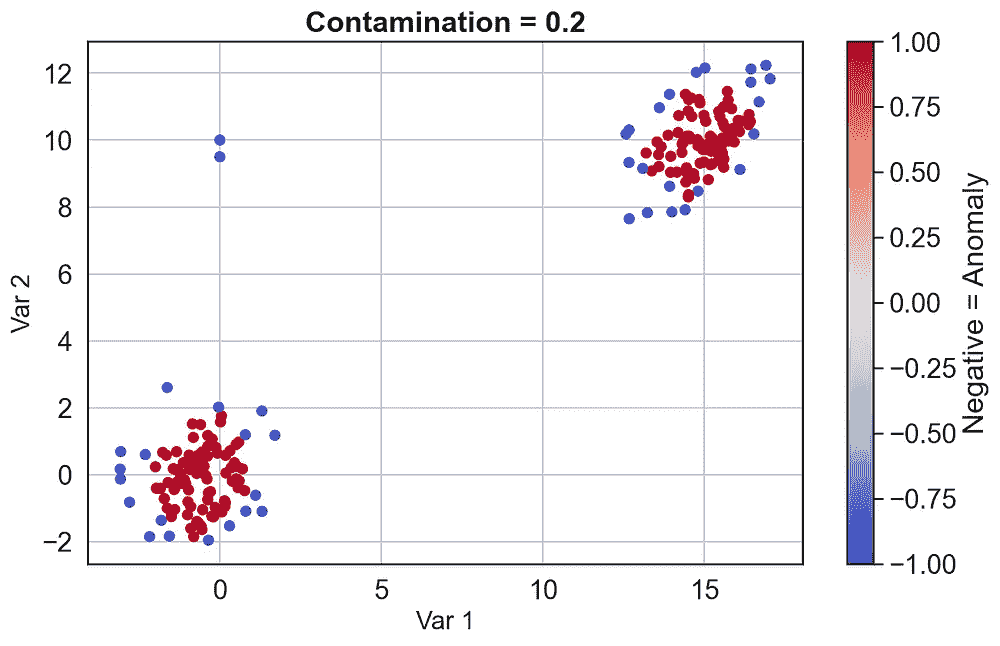
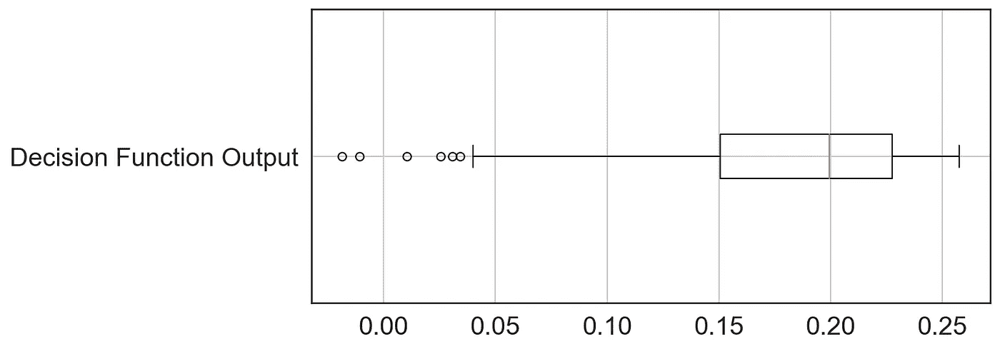
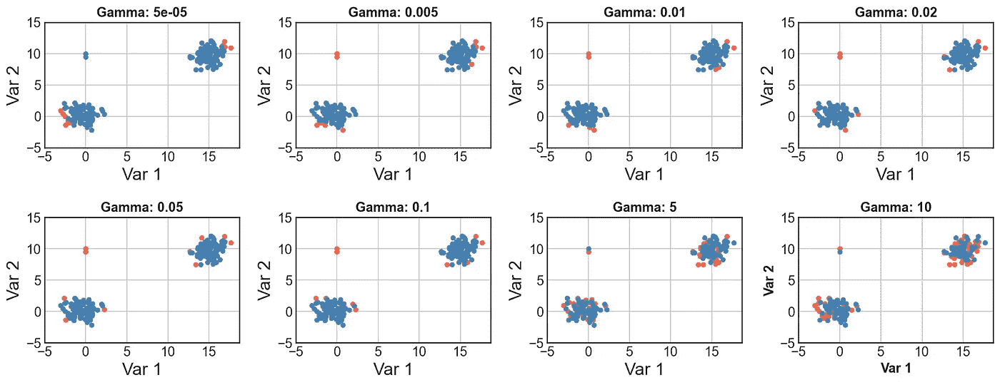
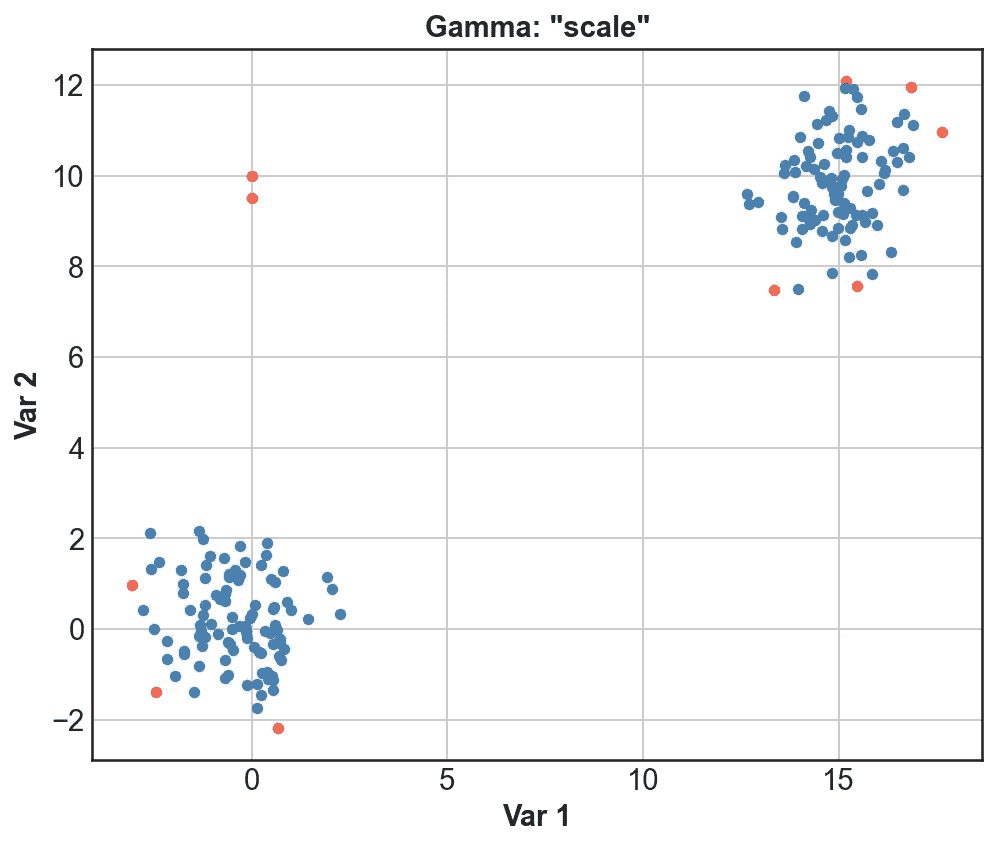

# Python 中的异常检测——第二部分:多元无监督方法和代码

> 原文：<https://towardsdatascience.com/anomaly-detection-in-python-part-2-multivariate-unsupervised-methods-and-code-b311a63f298b?source=collection_archive---------6----------------------->

## 关于如何为业务分析执行异常检测的指南或关于多元数据的机器学习管道以及相关 Python 代码。

在我之前的文章([https://medium . com/analytics-vid hya/Anomaly-detection-in-python-part-1-basics-code-and-standard-algorithms-37d 022 CDB CFF](https://medium.com/analytics-vidhya/anomaly-detection-in-python-part-1-basics-code-and-standard-algorithms-37d022cdbcff))中，我们讨论了异常检测的基础知识、问题的类型以及使用的方法的类型。我们讨论了执行异常检测的 EDA、单变量和多变量方法，以及每种方法的一个示例。我们讨论了为什么多元异常值检测是一个困难的问题，需要专门的技术。我们还讨论了使用 fastcd 的**马氏距离方法来检测多元异常值。**

在本文中，我们将讨论另外两种广泛使用的方法来执行**多元无监督异常检测**。我们将讨论:

1.  **隔离林**
2.  **OC-SVM(一级 SVM)**

## 异常检测的一般思路

异常检测是一种识别数据中异常或有趣事件的工具。**但是，在移除异常之前，从领域/业务角度分析检测到的异常非常重要。**每种方法都有自己的异常定义。多种方法可能经常无法确定哪些点是异常的。从领域/业务角度验证结果是我们的责任。

*有时，检测到的异常代表数据中的“欠采样”状态。在这种情况下，我们不应该删除它们，而是应该在该体系中收集更多的数据。*

# 多元异常的简要概述

**当各种特征的值合在一起看起来异常时，即使单个特征没有异常值，也会出现多元异常。**例如，假设我们有 2 个特征:
1。这是汽车里程表的读数，单位是英里/小时。它通常在 0-50 之间。②
。每分钟转数:这是汽车车轮的每分钟转数。它通常在 0-650 之间。

现在，想象一下奥多的时速是 0 英里。我们知道这是可能的——而且汽车没有移动。比方说，另一个场合，转速读数 600。我们知道汽车在移动。分开来看，我们知道上述读数并不异常——因为它们代表了汽车完全正常的运行模式。然而，让我们想象一下在同一时间里程表读数为 0 英里/小时，而转速读数为 600 英里/小时。这是不可能的——他们有冲突。rpm 表示汽车在移动，odo 表示汽车是静止的。这是一个多元异常值的例子。

***检测多元异常值包括同时检查所有特征的值，并验证这些特征的值组合是否异常。*** 正如我们所理解的，当我们拥有大量的特征(比如数百个)时，手动操作变得非常困难。或者，我们可以使用专门的算法来识别它们。让我们来看看它们。

# 用于异常检测的数据


我们希望用多元方法来检测 2 个主要的异常值——按作者分类的图像

# 隔离森林

众所周知，隔离林适用于高维数据。隔离林是“隔离树”的集合。在下面的论文中详细讨论:[https://cs . nju . edu . cn/Zhou zh/Zhou zh . files/publication/ICD m08 b . pdf？q =隔离-森林](https://cs.nju.edu.cn/zhouzh/zhouzh.files/publication/icdm08b.pdf?q=isolation-forest)。
*隔离树是一种二叉树，通过将数据划分成盒(称为节点)来存储数据。*要理解为什么隔离林是异常检测器，重要的是要理解隔离树是如何构建的。以下是计算隔离树的步骤:

1.  从数据中随机选择一个特征。让我们称随机特征为 **f** 。
2.  从特征 **f** 中选择一个随机值。我们将使用这个随机值作为阈值。让我们称之为 **t.**
3.  **f** < **t** 所在的数据点存放在节点 1， **f ≥ t** 所在的数据点存放在节点 2。
4.  对节点 1 和节点 2 重复步骤 1-3。
5.  当树完全长大或满足终止标准时终止。

为了简单起见，让我们从隔离树如何处理单变量数据开始。我们稍后将探讨多元示例。下图显示了一维数据的机制:


为没有异常值的数据构建的隔离树。选择一个随机阈值将数据分成子节点。然后对每个子节点重复这个过程。—作者图片

重要的是要记住，要分割的特征和阈值是随机选择的，如上图所示。由于以上示例为单因素，因此我们仅随机选择阈值。

现在，假设上面的单变量数据有异常。在这种情况下，异常点将远离其他数据点。**隔离林能够在分裂过程中很早就隔离出异常，因为** **用于分裂的随机阈值很有可能位于离群值和数据之间的空白区域，如果空白区域足够大的话。因此，异常具有较短的路径长度。毕竟，分割点(阈值)是随机选择的。因此，空白区域越大，随机选择的分裂点就越有可能位于该空白区域**。

让我们看看存在异常时隔离树的外观。



隔离树“隔离”出第一个拆分中的异常。由于异常与其他数据之间的空间较大，因此很可能在该区域出现随机分裂。—作者图像

正如我们所看到的，*由于异常和其他数据之间的空间很大，很可能在这个空白区域会出现随机分裂。*

现在，让我们看看如果有多元数据，情况会是怎样。正如我们将看到的，隔离树的工作方式与我们上面看到的非常相似——它们在隔离其他点之前先隔离异常。



异常在裂口 2 处被隔离。—作者图像

*请注意:树木也可以生长:*

1.  *直到每个叶节点中只有一个数据点。或*
2.  *直到达到关于叶节点中数据点的最小数量的终止标准。*

我在这里只展示了前几个部分来说明。正如我们所看到的，隔离树将数据划分为“框”。其特点是*比包含正常数据点的方框更早地隔离包含异常的区域。*

我们可以将隔离树的概念扩展到一个隔离林，它是多个隔离树的集合。以下是隔离林的工作原理:

1.  从整个要素集或随机选择的要素集子集构建隔离树。
2.  构建 **n** 这样的隔离树。
3.  计算每个数据点的异常分数。**异常得分为所有隔离树平均路径长度的非线性函数。**路径长度相当于隔离树为隔离一个点而进行的拆分次数。平均路径长度越短，该点成为异常的可能性就越大(正如我们在图中前面看到的)。

*即使对于具有数百个维度的数据，隔离林也能很好地工作。*

skearn 的隔离林有 4 个重要输入:

***n _ estimators:****被训练的隔离树数。* ***max _ samples:****用于训练每棵树的数据点数。* ***沾染:*** *异常数据点的分数。例如，如果我们怀疑 5%的数据是异常的，我们将污染度设置为 0.05* ***max _ features:****用于训练每棵树的特征数量(这与随机森林相反，在随机森林中，我们为每次分割决定随机的特征子集)。*

它有两个重要的方法:

**decision_function(X):** 返回一个分数——这样负分数越多的例子就越反常。
**预测(X):** 对于异常点返回-1，对于正常点返回+1。输出为异常的点的数量取决于拟合模型时设置的污染值。

让我们根据上述数据训练一个隔离林(我们将污染设置为 0.01):

```
# Create Artificial Data with Multivariate Outliers
d1 = np.random.multivariate_normal(mean = np.array([-.5, 0]),
                               cov = np.array([[1, 0], [0, 1]]), size = 100)d2 = np.random.multivariate_normal(mean = np.array([15, 10]),
                               cov = np.array([[1, 0.3], [.3, 1]]), size = 100)outliers = np.array([[0, 10],[0, 9.5]])
d = pd.DataFrame(np.concatenate([d1, d2, outliers], axis = 0), columns = ['Var 1', 'Var 2'])################### Train Isolation Forest #################
model  =  ensemble.IsolationForest(n_estimators=50, max_samples=500, contamination=.01, max_features=2, 
                         bootstrap=False, n_jobs=1, random_state=1, verbose=0, warm_start=False).fit(d)# Get Anomaly Scores and Predictions
anomaly_score = model.decision_function(d)
predictions = model.predict(d)######### Visualize Anomaly scores and Anomaly Status ########plt.figure(figsize = (10, 6), dpi = 150)
s = plt.scatter(d['Var 1'], d['Var 2'], c = anomaly_score, cmap = 'coolwarm')
plt.colorbar(s, label = 'More Negative = More Anomalous')
plt.xlabel('Var 1', fontsize = 16)
plt.ylabel('Var 2', fontsize = 16)
plt.grid()# To Plot Predictions
plt.figure(figsize = (10, 6), dpi = 150)
s = plt.scatter(d['Var 1'], d['Var 2'], c = predictions, cmap = 'coolwarm')
plt.colorbar(s, label = 'More Negative = More Anomalous')
plt.xlabel('Var 1', fontsize = 16)
plt.ylabel('Var 2', fontsize = 16)
plt.grid()
plt.title('Contamination = 0.01', weight = 'bold')
```



左图:决策函数的输出-负值越大，意味着异常越强。右图:异常的最高“污染”分数。—作者图片

如我们所见，这两个点被检测为强异常值。

因此，可以使用两种方法来确定一个点是否异常:

1.  使用预测函数:如果模型预测为-1，则将该点标记为异常点。**对于这种方法，小心设置*污染*很重要。**
2.  分析决策函数输出分布，并基于视觉检查设置阈值，异常点将落在该阈值以下。**我们还可以对决策函数输出应用单变量异常检测算法；这是一种非常常见的方法，我们将多变量问题转化为单变量问题，通过计算异常分数，然后对分数使用单变量算法。该方法不依赖于我们对污染因子的选择。**

但是，让我们看看如果我们设置不同的污染值并使用方法 1 会发生什么。



选择方法 1 预测时污染对隔离林产量的影响。—作者图片

随着污染值的增加，模型将更多的数据标记为异常。

## 如果我们不知道正确的污染怎么办？

在这种情况下，我们分析 decision_function()的输出。有两种方法可以做到这一点:

1.  **对隔离林决策函数输出**应用单变量异常检测算法(类似于 tukey 的方法——我们在上一篇文章中讨论过)。这是一种标准方法——我们使用多元算法计算“异常分数”(这里是决策函数输出);然后，为了选择这些异常分数中的哪些对应于异常值，我们对分数应用单变量异常检测算法。
2.  **绘制直方图，手动选择阈值。**

让我们看看将 Tukey 的方法应用于我们的隔离林给出的决策函数输出的结果:



应用于隔离林决策函数输出的 Tukey 方法选择了 6 个异常值。我们可以看到两个极端的异常值——这确实是我们试图检测的异常。—作者图片

我们看到两个明显的异常值，它们是左边的两个极端点。这些实际上也是我们想要检测的两个主要异常值。然而，我们看到另外 4 个点被标记为异常值。为了选择适当的异常，需要进行领域/业务分析。

**让我们讨论一下隔离林的一些优点:**

1.  **可扩展性—** 隔离林可以在训练和预测期间使用并行处理—因为所有隔离树都是并行训练的—彼此独立。
2.  **可解释性—** 隔离森林中的单棵树可以被可视化，以给出使数据点成为异常值的确切规则。这些规则可能具有很大的业务/领域重要性。但是，对于大数据来说，这可能会变得很困难。
3.  **灵活性—** 它们可以捕捉非常复杂的异常值，并且不要求数据属于特定的分布。如果我们还记得，前一篇文章中讨论的使用 FastMCD 的 Mahalanobis 距离方法假设干净数据属于多元正态分布。隔离森林不做这样的假设。

根据经验，我注意到严重异常值和轻微异常值的决策函数值通常很接近。正如我们在这里看到的，我们有 2 个明显的异常值。然而，他们的决策函数输出接近于其他一些点的决策函数输出。这与 Mahalanobis 距离方法形成对比，在 Mahalanobis 距离方法中，对于相同的问题，区别非常明显。总体而言，隔离林检测到的异常值是合理的，对决策函数使用单变量方法的方法也产生了合理的结果。

# 一类——支持向量机(OC-SVM)

OC-SVM 是一种多元方法，属于一类分类方法家族。在下面的论文中详细讨论:[https://www . Microsoft . com/en-us/research/WP-content/uploads/2016/02/tr-99-87 . pdf](https://www.microsoft.com/en-us/research/wp-content/uploads/2016/02/tr-99-87.pdf)

我们决定一小部分数据，比如说ν(读作 Nu ),我们怀疑它是数据中出现的异常数量的上限。**然后，OC-SVM 试图找到一个包含高数据密度区域的边界，最多排除一小部分ν个数据点。**可以看出，问题变量空间中的线性边界对于大多数问题来说过于简单。由于 SVM 本质上是线性分类器，我们需要借助核方法来建立具有非线性边界的灵活模型。

**OC-SVM 试图寻找一个超平面将数据从原点分开，而不是寻找一个决策边界来分隔两个类。**想法是**将数据映射到内核特征空间，并使用内核特征空间中的线性分类器以最大余量将其从原点分离。这相当于在我们的原始问题空间中使用非线性边界。**

**让我们简单讨论一下 OC-SVM 中内核的使用。**SVM 是一个线性模型。这使得它可以制定非常简单的决策规则。提高 SVM 容量的一种方法是根据数据创建多项式要素，然后在变换后的要素空间中使用线性 SVM。SVM 仍然在多项式特征空间中找到线性边界，但是当映射回我们的原始问题变量空间时，判定边界(在多项式特征空间中是线性的)看起来是非线性的。但是我们必须显式计算多项式特征——如果我们一开始就有大量特征，这会占用大量内存。**内核允许我们在非常高维的特征空间中拟合简单模型(如线性 SVM ),而无需显式计算高维特征。**最广泛使用的内核之一是 **RBF 内核。**要记住的重要一点是，SVM 总是在核心特征空间中拟合线性模型——即使决策边界在原始问题变量空间中看起来是非线性的。

以下是关于 **OC-SVM** 的一些一般要点:

1.  一般来说，使用 OC-SVM 时，建议使用非线性内核。RBF 核被广泛使用。
2.  用 RBF 核来调整 OC-SVM 的超参数是:**γ，ν**
3.  可以使用 predict()和 decision_function()方法进行预测。我们将在后面详细讨论它们。

Gamma 是特定于 RBF 核的参数，它控制相邻点对决策边界的影响。较大的 Gamma 值允许相邻点对决策边界有较大的影响，较小的 Gamma 值允许相邻点和远处点对决策边界都有影响。

让我们讨论使用不同的γ值的效果。较大的 Gamma 值会导致模型具有较大的方差-这会以概化为代价。让我们改变伽玛，看看对模型的影响。

```
def plot_anomaly2(data, predicted, ax):
    data2 = data.copy()
    data2['Predicted'] = predicted

    normal = data2.loc[data2['Predicted'] == 1, :]
    anomalies = data2.loc[data2['Predicted'] == -1, :]

    # Make Scatterplot
    column1 = data.columns[0]
    column2 = data.columns[1]

    anomalies.plot.scatter(column1, column2, color = 'tomato', fontsize = 14,  sharex = False, ax=ax)
    normal.plot.scatter(column1, column2, color = 'grey', fontsize = 14,  sharex = False, ax = ax)#plt.grid(linestyle = '--')

    plt.xlabel(column1, fontsize = 14, weight = 'bold')
    plt.ylabel(column2, fontsize = 14, weight = 'bold')
    return ax# Create Fake data to classify 
x_fake  =  pd.DataFrame(np.random.uniform(-5, 19, (35000, 2)), columns = ['Var 1', 'Var 2'])# Visualize effect of changing Gamma
gammas = [.00005, .005, .01, .025, .05, .1,.3, .6, .9, 2, 5, 10]
fig, axes = plt.subplots(2, 6, figsize = (25, 6), tight_layout = True)
for i, ax in zip(range(len(gammas)), axes.flatten()):
    gamma = gammas[i]
    model = svm.OneClassSVM(kernel='rbf', degree=5, gamma=gamma, coef0=0.0, tol=0.001, nu=0.01, 
                        shrinking=True, cache_size=200, verbose=False, max_iter=- 1).fit(all_data)model_predictions = model.predict(x_fake)
    #x_fake['Predictions'] = model_predictionsax = plot_anomaly2(x_fake, model_predictions,ax)
    ax.scatter(all_data.iloc[:, 0], all_data.iloc[:, 1], color = 'k', s = 10)
    ax.set_title('Gamma: {}'.format(np.around(gamma,6)), weight = 'bold', fontsize = 14) 
```

下图中的蓝色区域是指 SVM 奥组委预测为“正常”的区域。红点被检测为异常。



数据点的异常状态与作者提供的伽马图像的关系

我们观察到以下情况:

1.  当伽马射线极低或极高时，我们看到 OC-SVM 至少会漏掉一个主要的异常现象。
2.  对于 0.005 到 0.1 范围内的中伽马值，OC-SVM 识别出两种主要异常。

选择 Gamma 的一种方法是让 sklearn 选择 Gamma。我们通过选择 gamma = 'scale '来实现。下面是当我们设置 gamma = 'scale '时发生的情况:



Gamma = 'scale '检测 2 个异常值。nu 设定为 0.05。—作者图片

如前所述，在 OC-SVMs 中，使用线性决策边界将数据从核空间中的原点分离出来。允许一小部分(高达ν)数据落在线性决策边界的错误一侧。基本上，我们希望所有的内点在决策边界的一边，所有的外点在决策边界的另一边。OC-SVM 的 **decision_function** 方法输出一个点到决策边界的**符号距离。对于异常值，该距离取负值，对于正常点(内部点)，该距离取正值。**

让我们像前面一样对 decision_function 输出应用 tukey 的方法。


在 Tukey 方法中，k = 1.5 的 2 个点被确定为异常。这里，tukey 的方法被应用于 OCSVM 决策函数输出。—作者图片

幸运的是，tukey 的方法发现了数据中的两个主要异常。然而，在一般情况下，它可以识别额外的或较小的异常。Tukey 方法识别的异常依赖于我们的“k”值(在前一篇文章中讨论过),这个值是可以调整的。有时将 k 视为 ML 管道中的超参数是有用的，这可以通过领域分析或优化来最终确定。

# 结论

到目前为止，我们已经讨论了执行异常检测的无监督方法。我们讨论了用于执行多元异常检测的隔离森林和 OC-SVM 方法。这种方法的优点之一是它们不要求数据属于特定的分布。

OC-SVM 是一种可用于无监督和半监督异常检测的方法。在接下来的文章中，我们将讨论执行异常检测的半监督和监督方法。它们包括使用 PCA、自动编码器、OC-SVM 和不平衡分类方法来执行异常检测。

如果您有任何反馈，请随时告诉我，并查看我以前关于异常检测的介绍性文章，其中我们讨论了不同类型的异常检测问题和方法([https://medium . com/analytics-vid hya/Anomaly-detection-in-python-part-1-basics-code-and-standard-algorithms-37d 022 cdbcff](https://medium.com/analytics-vidhya/anomaly-detection-in-python-part-1-basics-code-and-standard-algorithms-37d022cdbcff))。