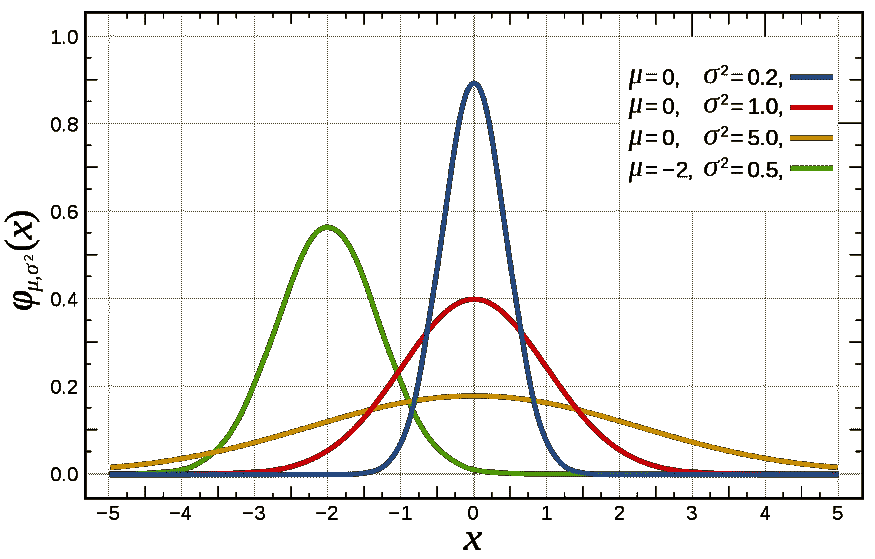
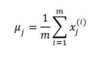
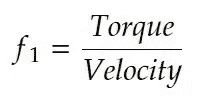
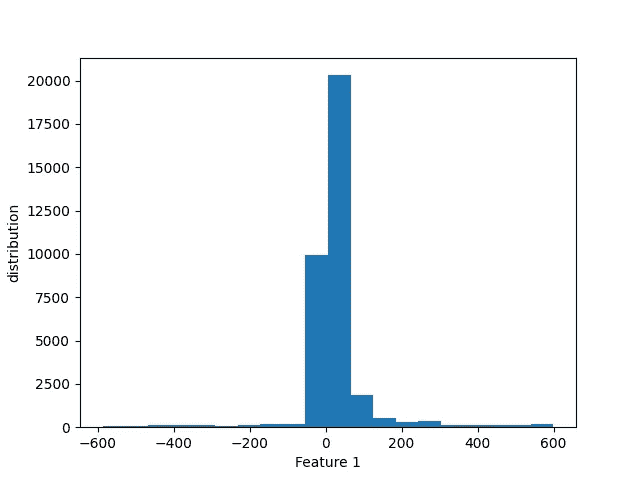
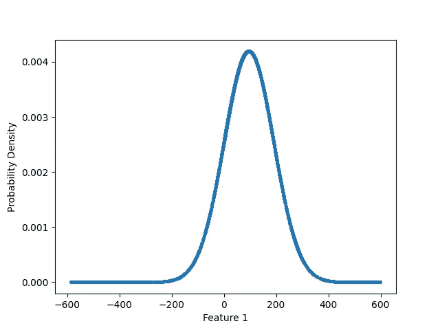
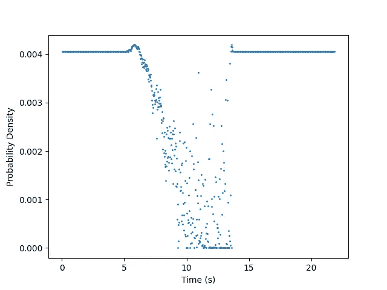
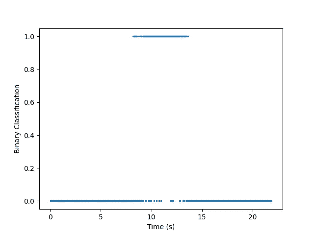
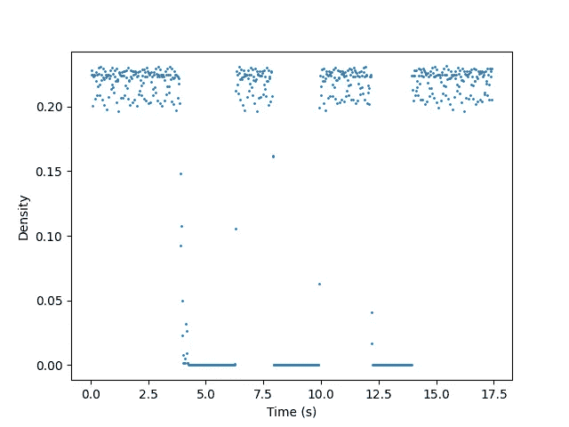
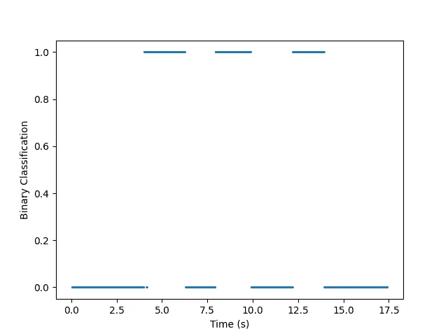

# 伺服驱动器的异常检测

> 原文：<https://towardsdatascience.com/anomaly-detection-on-servo-drives-f711f3e6022f?source=collection_archive---------16----------------------->

## [行业笔记](https://towardsdatascience.com/tagged/notes-from-industry)

## 可靠地预测伺服故障以减少停机时间

## 介绍

给定伺服反馈信息，如扭矩、速度、加速度和功率，可以预测伺服系统出现问题的可能性。通过了解伺服系统可能出现故障的时间，可以减少停机时间，并防止故障伺服系统对系统造成潜在损害。通过将简单的高斯概率密度函数应用于一组训练的特征，可以用很少的计算成本来确定异常伺服的分类。

## 背景

单个特征 *x* 的各种平均值和方差值的高斯分布如下所示:

各种高斯分布，图片由维基百科提供

该图说明了方差如何影响沿特征轴的概率密度函数大小和覆盖范围。较高的方差值表示数据更加分散，较低的方差值表示数据的值接近，方差为零表示所有数据都相同。

## 理论

模拟上述曲线的高斯概率密度函数如下所示:

等式 1:高斯概率密度函数，图片来自维基百科

该函数表示给定特征值 *x.* 处的幅度。在这种情况下，均值(μ)和方差(σ)值均在评估该函数之前确定。使用以下通用形式确定平均值:

特征均值方程，作者图片

使用以下公式确定差异:

特征方差方程，作者图片

计算将用于训练和评估模型的每个特征的平均值和方差。使用所使用的编程环境尽可能地对计算进行矢量化是很重要的。

该函数将输出高斯概率密度，对于包含各种要素的不同数据集，高斯概率密度会有显著变化。输出值需要被映射到表示伺服状态分类(异常或非异常)的二进制值。这将通过为概率密度函数指定阈值来完成。

当确定异常的阈值时，可以使用迭代方法来决定一个值，并观察模型对于各种特征值的行为。所选阈值取决于模型标记异常数据集的灵敏度。如果存在交叉验证或测试数据集，则可以评估精确度、召回率、F1 分数和[综合 F-1 分数](/a-single-number-metric-for-evaluating-object-detection-models-c97f4a98616d)，以确定模型何时表现最佳。

一个好的起始值是平均值的 2-3 倍标准差。最大概率密度可以通过将等式 1 上的指数值驱动为 0 并用矢量化的学习方差值来评估该等式来确定。类似地，2 个标准偏差下的密度可以通过在μ+2σ下评估等式 1 来确定。

## 特征选择

通过组合两个伺服反馈值来确定特征，这两个伺服反馈值在理论上应该彼此成比例。几个特征对的例子可以包括:

*   输入功率和输出扭矩
*   输入功率和输出速度
*   输入功率和加速度
*   输入扭矩和输出速度

通过将一个除以另一个，可以将两个反馈变量组合成一个单一特征:

功能 1 由功率和扭矩决定，图片由作者提供

这允许模型对异常值进行分类，如果使用标准反馈值作为两个独立的特征，则异常值可以被分类为非异常。

对于以下所示的示例，使用了由扭矩和速度组成的单一特征:

使用的特征，例如，作者的图像

使用数据采样功能，在伺服轴上运行各种 g 代码命令时，可以保存扭矩和速度值。使用各种伺服参数尽可能多地采样数据非常重要。在这种情况下，伺服系统的最大速度和加速度分别在 0.1-200.0 和 10.0-500.0 用户单位之间变化。大约有 50，000 个训练样本，分布如下图所示:

特征 1 的直方图，按作者分类的图像

请注意，数据类似于高斯分布，如果不是这种情况，则必须应用转换来使其高斯化。在某些情况下，这可以通过对数据集取对数来实现。

训练数据的平均值、方差和标准差如下所示:

分布的均值、方差和标准差，按作者分类的图像

这些值是模型学习并用于应用于伺服反馈变量的未来值的内容。

使用等式 1，为每个训练数据点计算概率密度，并且产生以下曲线:

训练数据的高斯概率密度，图片由作者提供

## 程序

为了查看运行中的模型，伺服机构将被配置为执行简单恒速移动的 3D 机架的 X 轴。

PLC 将在每个周期(8 毫秒)采样扭矩和速度值，并评估伺服系统是否异常。从模型输出的高斯概率密度和二元分类将与每次扫描采样的数据一起保存。

虽然每 1000 次的异常输出可能会出现一次假阳性，但预计模型在恒速运行时输出“非异常”。因此，需要实现额外的逻辑来确定何时以及如何对模型的输出采取行动。例如，在后面的 1，000 个样本中异常出现的次数可以用来触发一个事件，以通知管理员检查伺服系统。

为了模拟异常，3D 机架上的 X 轴将受到未知来源的外部阻力(不要在家里尝试)。这种模拟异常可能与向伺服机构提供机械阻力的受损轴承相关，并且这反映在所提供扭矩的输出速度恶化上。当伺服系统受到这些外力时，预计模型输出“异常”。

## 测试

对于上述测试程序，高斯概率密度作为时间的函数绘制如下:

单次加载的概率密度，图片由作者提供

请注意，在 6 秒标记附近，震级迅速下降；这是伺服机构经受外部阻力的准确时间，并且持续到外部阻力被移除时的 14 秒标记。

由阈值 0.001 指定的二元分类输出绘制如下:

单次加载的二进制分类，按作者分类的图像

二元分类反映了上面的高斯概率密度函数图中显示的内容。由于严格的阈值，6–14s 范围内的一些值不被归类为异常。

生成了第二组图来证明外部阻力/异常的重复加载和卸载。请注意，第二个测试使用的是用不同数据训练的模型，因此具有不同的权重。概率密度绘制如下:

重复加载和卸载的概率密度，图片由作者提供

最初，密度值以总体水平趋势分散。这是因为扭矩值会稍微改变，以保持伺服系统的恒定速度，这是预期的行为。一旦在大约 4.0、8.0 和 12.0 秒的标记处施加载荷，概率密度下降到零。通过观察剧情，很明显伺服发生了一些问题。

下面绘制的是上面绘制的概率密度的二元分类，阈值为 0.0026，这是平均值的 3 个标准偏差。

重复加载和卸载的二进制分类，图片由作者提供

该图将证实在上述概率密度图上看到的情况，因为它是概率密度的函数。

## 结论

实现这种用于异常检测的轻量级高斯概率密度模型可以很好地指示伺服何时需要维护。通过在 PLC 上运行该模型作为后台进程，可以防止不必要的停机时间和对系统的潜在损害。

对这个实现感兴趣吗？[联系我。](https://www.linkedin.com/in/peter-lebiedzinski-4012a8123/)

## 参考

[1] Ng，a .异常检测[讲座]。*机器学习。* Coursera。【https://www.coursera.org/learn/machine-learning 

[2]维基百科贡献者。(2021 年 10 月 12 日)。正态分布。在*维基百科，免费百科*。2021 年 10 月 20 日 03:24 从[https://en.wikipedia.org/w/index.php?检索 title =正态分布& oldid=1049556144](https://en.wikipedia.org/w/index.php?title=Normal_distribution&oldid=1049556144)

[3]列别德津斯基，P. (2021 年 6 月 24 日)。*用于评估对象检测模型的单个数字度量*。中等。2021 年 11 月 10 日检索，来自[https://towardsdatascience . com/a-single-number-metric-for-evaluating-object-detection-models-c97f 4a 98616d。](/a-single-number-metric-for-evaluating-object-detection-models-c97f4a98616d.)