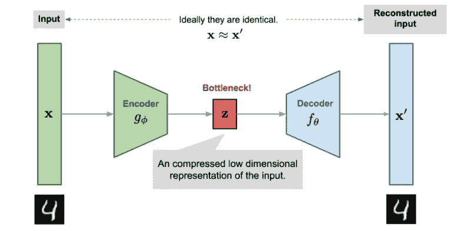
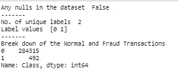
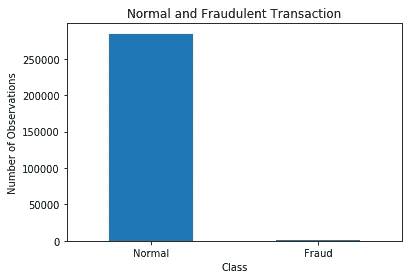
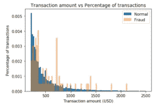
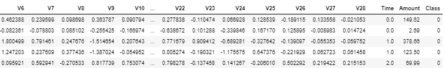
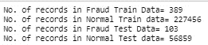
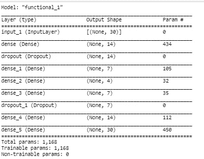
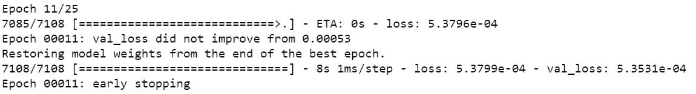
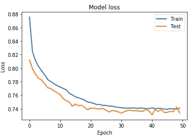
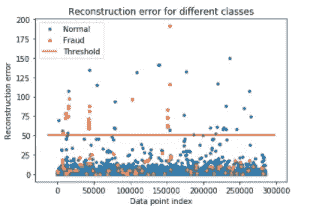

# 使用自动编码器的异常检测

> 原文：<https://towardsdatascience.com/anomaly-detection-using-autoencoders-5b032178a1ea?source=collection_archive---------1----------------------->

## 使用 TensorFlow 中的自动编码器执行欺诈检测

***了解什么是自动编码器，它们如何工作，它们的用法，最后实现用于异常检测的自动编码器。***

> AutoEncoder 是一种生成式无监督深度学习算法，用于使用神经网络重建高维输入数据，该神经网络在中间具有狭窄的瓶颈层，该瓶颈层包含输入数据的潜在表示。



来源:[https://lilian Weng . github . io/lil-log/2018/08/12/from-auto encoder-to-beta-vae . html](https://lilianweng.github.io/lil-log/2018/08/12/from-autoencoder-to-beta-vae.html)

**Autoencoder 由编码器和解码器组成。**

*   **编码器网络**:接受高维输入数据，并将其转化为潜在的低维数据。编码器网络的输入大小大于其输出大小。
*   **解码器网络**:解码器网络从编码器的输出接收输入。解码器的目标是重建输入数据。解码器网络的输出大小大于其输入大小。

自动编码器接受高维输入数据，将其压缩到瓶颈隐藏层的潜在空间表示；解码器将数据的潜在表示作为输入，以重构原始输入数据。

## 自动编码器的使用

*   **降维。**编码器将输入编码到隐藏层，降低线性和非线性数据的维数；因此，它比 PCA 更强大。
*   **推荐引擎**
*   **异常检测**:作为训练的一部分，自动编码器试图最小化重建误差。通过检查重建损失的大小来检测异常。
*   **图像去噪**:被破坏的图像可以恢复到原来的版本。
*   **图像识别**:堆叠式自动编码器通过学习图像的不同特征来进行图像识别。
*   **图像生成**:变分自动编码器(VAE)，一种自动编码器，用于生成图像。

在这里阅读关于**不同类型的自动编码器**[](https://medium.com/datadriveninvestor/deep-learning-different-types-of-autoencoders-41d4fa5f7570)****。****

## ****使用自动编码器的异常检测****

**按照以下步骤检测高维数据集中的异常。您也可以将此应用于不平衡的数据集。**

*   **在训练期间，只向编码器输入正常的交易。瓶颈层将学习正常输入数据的潜在表示。**
*   **解码器将使用瓶颈层输出来重建原始输入数据的正常事务。**
*   **欺诈交易不同于正常交易。自动编码器将难以重建欺诈性交易，因此重建误差将会很高。**
*   **您可以根据重建错误的指定阈值，将新交易标记为欺诈交易。**

## **使用自动编码器实现异常检测**

**这里使用的数据集是来自 Kaggle 的[信用卡欺诈检测。](https://www.kaggle.com/mlg-ulb/creditcardfraud/data)**

****导入所需库****

```
**import pandas as pd
import numpy as np
import tensorflow as tf
import matplotlib.pyplot as plt
import seaborn as sns
from sklearn.model_selection import train_test_split****from sklearn.preprocessing import StandardScaler
from sklearn.metrics import confusion_matrix, recall_score, accuracy_score, precision_score****RANDOM_SEED = 2021 
TEST_PCT = 0.3
LABELS = ["Normal","Fraud"]**
```

****读取数据集****

**我已经从 [Kaggle](https://www.kaggle.com/mlg-ulb/creditcardfraud/data) 下载了数据，并存储在本地目录中。**

```
**dataset = pd.read_csv("creditcard.csv")**
```

****探索性数据分析****

```
#check for any  nullvalues 
**print("Any nulls in the dataset ",dataset.isnull().values.any() )
print('-------')**
**print("No. of unique labels ", len(dataset['Class'].unique()))
print("Label values ",dataset.Class.unique())**#0 is for normal credit card transaction
#1 is for fraudulent credit card transaction
**print('-------')
print("Break down of the Normal and Fraud Transactions")
print(pd.value_counts(dataset['Class'], sort = True) )**
```

****

****可视化数据集****

**绘制数据集中正常交易和欺诈交易的数量。**

```
#Visualizing the imbalanced dataset
**count_classes = pd.value_counts(dataset['Class'], sort = True)
count_classes.plot(kind = 'bar', rot=0)
plt.xticks(range(len(dataset['Class'].unique())), dataset.Class.unique())
plt.title("Frequency by observation number")
plt.xlabel("Class")
plt.ylabel("Number of Observations");**
```

****

**可视化正常交易和欺诈交易的金额。**

```
# Save the normal and fradulent transactions in separate dataframe
**normal_dataset = dataset[dataset.Class == 0] 
fraud_dataset = dataset[dataset.Class == 1]**#Visualize transactionamounts for normal and fraudulent transactions
**bins = np.linspace(200, 2500, 100)
plt.hist(normal_dataset.Amount, bins=bins, alpha=1, density=True, label='Normal')
plt.hist(fraud_dataset.Amount, bins=bins, alpha=0.5, density=True, label='Fraud')
plt.legend(loc='upper right')**
**plt.title("Transaction amount vs Percentage of transactions")
plt.xlabel("Transaction amount (USD)")
plt.ylabel("Percentage of transactions");
plt.show()**
```

****

****创建训练和测试数据集****

**检查数据集**

****

**时间和金额是不缩放的列，因此仅对金额和时间列应用 StandardScaler。对 0 和 1 之间的值进行归一化对于数据集来说效果不太好。**

```
**sc=StandardScaler()
dataset['Time'] = sc.fit_transform(dataset['Time'].values.reshape(-1, 1))
dataset['Amount'] = sc.fit_transform(dataset['Amount'].values.reshape(-1, 1))**
```

**数据集中的最后一列是我们的目标变量。**

```
**raw_data = dataset.values**
# The last element contains if the transaction is normal which is represented by a 0 and if fraud then 1
**labels = raw_data[:, -1]**# The other data points are the electrocadriogram data
**data = raw_data[:, 0:-1]****train_data, test_data, train_labels, test_labels = train_test_split(
    data, labels, test_size=0.2, random_state=2021
)**
```

****标准化数据，使其值介于 0 和 1 之间****

```
**min_val = tf.reduce_min(train_data)
max_val = tf.reduce_max(train_data)****train_data = (train_data - min_val) / (max_val - min_val)
test_data = (test_data - min_val) / (max_val - min_val)****train_data = tf.cast(train_data, tf.float32)
test_data = tf.cast(test_data, tf.float32)**
```

> ****仅使用普通交易来训练自动编码器。****

**正常数据在目标变量中的值为 0。使用目标变量创建正常和欺诈数据集。**

```
**train_labels = train_labels.astype(bool)
test_labels = test_labels.astype(bool)**#creating normal and fraud datasets **normal_train_data = train_data[~train_labels]
normal_test_data = test_data[~test_labels]****fraud_train_data = train_data[train_labels]
fraud_test_data = test_data[test_labels]
print(" No. of records in Fraud Train Data=",len(fraud_train_data))
print(" No. of records in Normal Train data=",len(normal_train_data))
print(" No. of records in Fraud Test Data=",len(fraud_test_data))
print(" No. of records in Normal Test data=",len(normal_test_data))**
```

****

****设置训练参数值****

```
nb_epoch = 50
batch_size = 64
input_dim = normal_train_data.shape[1] #num of columns, 30
encoding_dim = 14
hidden_dim_1 = int(encoding_dim / 2) #
hidden_dim_2=4  
learning_rate = 1e-7 
```

****创建自动编码器****

**自动编码器的架构如下所示。**

****

**作者图片**

```
#input Layer
**input_layer = tf.keras.layers.Input(shape=(input_dim, ))**#Encoder**encoder = tf.keras.layers.Dense(encoding_dim, activation="tanh",                                activity_regularizer=tf.keras.regularizers.l2(learning_rate))(input_layer)
encoder=tf.keras.layers.Dropout(0.2)(encoder)
encoder = tf.keras.layers.Dense(hidden_dim_1, activation='relu')(encoder)
encoder = tf.keras.layers.Dense(hidden_dim_2, activation=tf.nn.leaky_relu)(encoder)**# Decoder
**decoder = tf.keras.layers.Dense(hidden_dim_1, activation='relu')(encoder)
decoder=tf.keras.layers.Dropout(0.2)(decoder)
decoder = tf.keras.layers.Dense(encoding_dim, activation='relu')(decoder)
decoder = tf.keras.layers.Dense(input_dim, activation='tanh')(decoder)**#Autoencoder
**autoencoder = tf.keras.Model(inputs=input_layer, outputs=decoder)
autoencoder.summary()**
```

****

****定义检查点和提前停止的回调****

```
**cp = tf.keras.callbacks.ModelCheckpoint(filepath="autoencoder_fraud.h5",
                               mode='min', monitor='val_loss', verbose=2, save_best_only=True)
# define our early stopping
early_stop = tf.keras.callbacks.EarlyStopping(
    monitor='val_loss',
    min_delta=0.0001,
    patience=10,
    verbose=1, 
    mode='min',
    restore_best_weights=True**
```

****编译自动编码器****

```
**autoencoder.compile(metrics=['accuracy'],
                    loss='mean_squared_error',
                    optimizer='adam')**
```

****训练自动编码器****

```
**history = autoencoder.fit(normal_train_data, normal_train_data,
                    epochs=nb_epoch,
                    batch_size=batch_size,
                    shuffle=True,
                    validation_data=(test_data, test_data),
                    verbose=1,
                    callbacks=[cp, early_stop]
                    ).history**
```

****

****剧情训练和测试损失****

```
**plt.plot(history['loss'], linewidth=2, label='Train')
plt.plot(history['val_loss'], linewidth=2, label='Test')
plt.legend(loc='upper right')
plt.title('Model loss')
plt.ylabel('Loss')
plt.xlabel('Epoch')
#plt.ylim(ymin=0.70,ymax=1)
plt.show()**
```

****

****检测测试数据的异常****

> ****异常是重建损失较高的数据点****

**计算测试数据的重建损失，预测测试数据，并计算测试数据和重建的测试数据之间的均方误差。**

```
**test_x_predictions = autoencoder.predict(test_data)
mse = np.mean(np.power(test_data - test_x_predictions, 2), axis=1)
error_df = pd.DataFrame({'Reconstruction_error': mse,
                        'True_class': test_labels})**
```

**绘制测试数据点和它们各自的重建误差设置了阈值，以便可视化是否需要调整阈值。**

```
**threshold_fixed = 50
groups = error_df.groupby('True_class')
fig, ax = plt.subplots()****for name, group in groups:
    ax.plot(group.index, group.Reconstruction_error, marker='o', ms=3.5, linestyle='',
            label= "Fraud" if name == 1 else "Normal")
ax.hlines(threshold_fixed, ax.get_xlim()[0], ax.get_xlim()[1], colors="r", zorder=100, label='Threshold')
ax.legend()
plt.title("Reconstruction error for normal and fraud data")
plt.ylabel("Reconstruction error")
plt.xlabel("Data point index")
plt.show();**
```

****

**将异常检测为重建损失大于固定阈值的点。这里我们看到阈值为 52 是好的。**

****评估异常检测的性能****

```
**threshold_fixed =52
pred_y = [1 if e > threshold_fixed else 0 for e in error_df.Reconstruction_error.values]
error_df['pred'] =pred_y
conf_matrix = confusion_matrix(error_df.True_class, pred_y)****plt.figure(figsize=(4, 4))
sns.heatmap(conf_matrix, xticklabels=LABELS, yticklabels=LABELS, annot=True, fmt="d");
plt.title("Confusion matrix")
plt.ylabel('True class')
plt.xlabel('Predicted class')
plt.show()**# print Accuracy, precision and recall
**print(" Accuracy: ",accuracy_score(error_df['True_class'], error_df['pred']))
print(" Recall: ",recall_score(error_df['True_class'], error_df['pred']))
print(" Precision: ",precision_score(error_df['True_class'], error_df['pred']))**
```

****

**由于我们的数据集是高度不平衡的，我们看到了高准确度，但低召回率和精确度。**

**要进一步提高精确度和召回率，需要添加更多相关的功能、不同的 autoencoder 架构、不同的超参数或不同的算法。**

## **结论:**

**当我们有一个不平衡的数据集时，Autoencoder 可以用作异常检测算法，我们有很多好的例子，但只有少数异常。自动编码器被训练以最小化重建误差。当我们在正常数据或良好数据上训练自动编码器时，我们可以假设异常将比良好或正常数据具有更高的重建误差。**

## ****参考文献:****

**[](https://blog.keras.io/building-autoencoders-in-keras.html) [## 在 Keras 中构建自动编码器

### 这个帖子写于 2016 年初。因此，它已经严重过时了。在本教程中，我们将回答一些常见的…

blog.keras.io](https://blog.keras.io/building-autoencoders-in-keras.html) 

【https://www.deeplearningbook.org/contents/autoencoders.html 

[https://www . tensor flow . org/tutorials/generative/auto encoder # third _ example _ anomaly _ detection](https://www.tensorflow.org/tutorials/generative/autoencoder#third_example_anomaly_detection)**