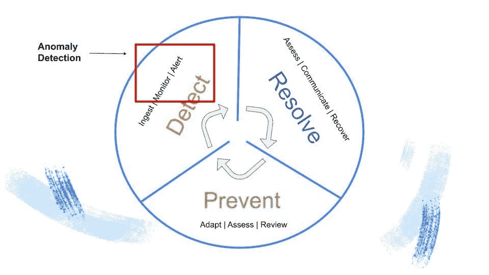
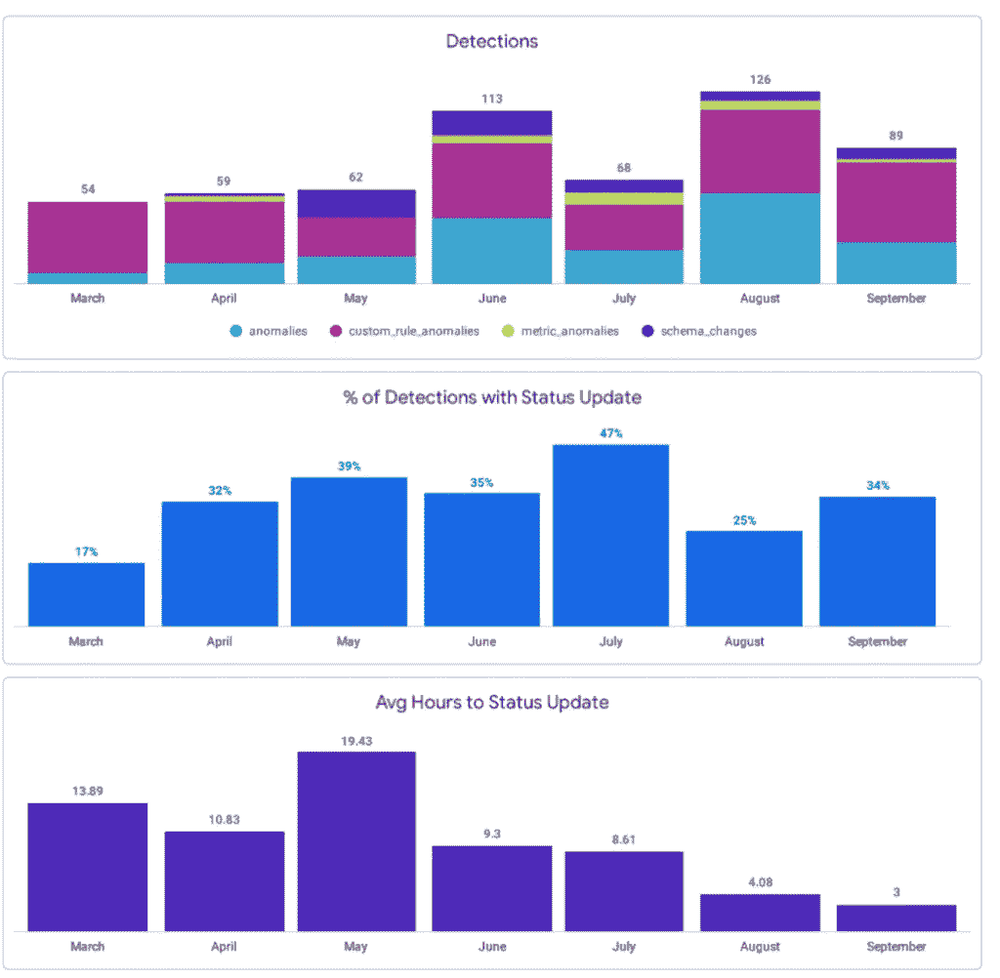

# 异常检测:为什么您的数据团队对此不感兴趣

> 原文：<https://towardsdatascience.com/anomaly-detection-why-your-data-team-is-just-not-that-into-it-580663498d0a?source=collection_archive---------14----------------------->

## ***引入更主动的数据质量方法:数据可靠性生命周期。***

图片由 [Georg Arthur Pflueger](https://unsplash.com/photos/VPSneKirzJE) 在 [Unsplash](http://www.unsplash.com) 上提供。

*交付可靠的数据产品不必如此痛苦。*

*以下是一些最优秀的数据团队在实现主动、迭代的数据信任模型时，转向开发运维及站点可靠性工程寻求灵感的原因和方式。* ***数据可靠性生命周期*** *介绍。*

想象一下，你是一名汽车修理工。

一辆轿车开进你的车库，发动机发出劈啪声。

“怎么了？”你问，从你的桌子上抬起你的眼睛。

司机摇下车窗。“我的车出了点问题，”他们回答。

很有描述性，你想，擦擦额头的汗。你的讽刺让你窃笑。

"我的车出了点问题。"他们重复，这次没有收缩。

几个小时后，你发现这辆车的火花塞松了。当然，他们缺乏信息并不是世界末日，但是想象一下，如果他们积极主动地说:

"我的引擎无法启动，我的车无法加速，我的电池也一直没电。"记住，你是个机械师。:)

你会问，这和数据有什么关系？嗯，表面上看，不多。但是在构建更可靠的数据系统时，我们可以从我们友好的机械师那里学到一两件事。

# 数据质量:反应式方法

如今，大多数数据团队采用某种 [**异常检测**](/anomaly-detection-for-dummies-15f148e559c1) 措施来解决数据质量问题。异常检测非常适合希望确定数据健康的关键支柱(即，容量、新鲜度、模式和分布)何时未能满足组织的生产预期的组织。此外，当端到端实现时(例如跨您的数据仓库、lake、ETL 和 BI 工具)，异常检测对企业来说非常有价值，而不是只存在于您的[数据平台](https://www.montecarlodata.com/the-quick-and-dirty-guide-to-building-your-data-platform/)的一两层中。

太好了，你知道你的数据坏了。现在怎么办？

正如大多数数据团队所了解的那样，当涉及到建立洞察力驱动的组织所需的信任、责任和透明度时，仅靠异常检测是不够的。

最近，我和一家财富 500 强软件公司的分析副总裁一起喝(虚拟)咖啡，他几乎完美地总结了这个问题。

“我想要与影响相关的东西，这样我就可以对它们采取行动，”他说。**“异常检测作为起点是必要的，但我们需要做更多的工作来了解根本原因并评估影响**。知道有问题是很好的，但是真的很难理解如何处理它。相反，我们需要确切地了解是什么出了问题，谁受到了它的影响，它出问题的原因和位置，以及根本原因可能是什么。**我对异常检测一点也不感兴趣**

> 显然，我们需要一种更好的方法来了解并主动改善数据的健康状况。幸运的是，现代数据团队只需要看看我们的 DevOps 和现场可靠性工程同行，就可以在 DevOps 生命周期中获得灵感。

# DevOps 的生命周期是什么？

*图片由* [*萨万阿吉特*](https://www.shutterstock.com/image-vector/devops-process-8-stages-software-development-1957460119) *于*[*Shutterstock*](https://www.shutterstock.com/)*由作者购买用于* [*标准商业许可*](https://www.shutterstock.com/license) *。*

开发人员运营(DevOps) 团队已经成为大多数工程组织不可或缺的组成部分，打破了软件和基础设施团队之间的孤岛。为了促进代码及其底层架构的快速开发，DevOps 团队应用了一个反馈循环，称为 DevOps 生命周期，它帮助团队可靠地交付与大规模业务目标一致的功能。

DevOps 生命周期包含 8 个不同的连续阶段，包括:

*   规划:与产品和业务团队合作，理解软件的目标和 SLA。
*   **开发**:写软件。
*   **集成**:将软件与您现有的应用程序集成。
*   测试:测试你的软件。
*   **发布**:将你的软件发布到测试环境中。
*   **部署**:将您的软件部署到生产环境中。
*   **操作**:运行软件，根据需要进行调整。
*   **监控**:监控软件中的问题并发出警报。

如此循环往复。虽然我们的许多数据技术和框架(即数据测试、数据 SLA、分布式架构等。)已经适应了由我们的软件工程同行设定的标准和最佳实践，我们被动处理数据质量的倾向阻止了我们以有意义和可伸缩的方式推动业务的变化。

# 数据可靠性生命周期简介

就像 DevOps 应用一个连续的反馈循环来改进软件一样，我认为现在是我们利用同样的数据勤奋的时候了。

数据可靠性生命周期是一种持续、主动改善数据健康的全组织方法，它通过将 DevOps 的最佳实践应用于数据管道来消除数据停机。

图片由巴尔·摩西提供。

该框架允许数据团队:

1.  率先了解生产中的数据质量问题。
2.  充分理解问题的影响。
3.  完全了解数据是从哪里泄露的。
4.  采取措施解决问题。
5.  收集经验，这样随着时间的推移，你可以防止问题再次发生。

方法如下:

# 发现

图片由巴尔·摩西提供。

在您测试了您的数据并将其应用到生产中之后，最重要的是监控和警告您的管道中的异常，换句话说，如果和当数据问题发生时，**检测**。异常检测是该策略的一个重要部分，尽管主要是被动的。

针对新鲜度、数量和基于分发的问题的自动监控和警报将有助于跟踪您的数据可靠性[SLA 和 SLIs](https://www.montecarlodata.com/how-to-make-your-data-pipelines-more-reliable-with-slas/) ，当您不符合这些要求时，请确保您是第一个知道的人。随着数据管道变得越来越复杂，数据必然会在某一点或另一点中断，能够缩短检测的[时间](https://www.montecarlodata.com/data-quality-you-are-measuring-it-wrong/#:~:text=Time-to-detection%20(TTD)) (TTD)对于数据驱动的企业来说至关重要。

# 解决

数据可靠性生命周期的第二个阶段是**解决**，需要您评估损坏的数据对更大的数据生态系统和相应的数据产品的影响，并将问题向下游传达给需要知道的人。理想情况下，整个影响分析过程应该是集中的，并对相应的警报进行适当的分组和标记。

你的团队不仅需要了解事件发生的时间和方式，还需要了解事件的严重性。破坏 CEO 仪表盘的表格不值得像跟踪内部事件页面浏览量的表格一样被关注。对他们一视同仁的成本对你的团队的生产力和整个企业都是有害的。

在循环的这一部分，可以使用端到端的沿袭和统计分析来理解手头问题的根本原因。随着团队越来越擅长理解、分类和响应事件，他们可以减少解决常见或预期数据事件的<https://www.montecarlodata.com/data-quality-you-are-measuring-it-wrong/#:~:text=Time-to-resolution%20(TTR>)**(TTR)时间。**

# **预防**

****

**设置数据治理仪表板(如 Looker 中的这个)可以帮助数据团队更好地了解数据问题和随时间的变化，以便他们可以采取主动措施来防止未来的事件。图片由作者提供。**

**数据可靠性生命周期的**预防**阶段处理您先前的知识和有关数据管道的历史信息，并将其转化为可操作的预防性步骤。例如，并不是你的工程师公司对现有数据集进行的每个模式更改都意味着你的管道着火了；事实上，模式更新通常意味着发展和进步。然而，如果没有适当的上下文，数据可靠性生命周期的检测阶段(换句话说，异常检测)将无法挑选这些队列。**

****你对病因了解得越具体越好。让我们回顾一下我们的汽车修理工——听起来很傻，对吗？但是就像说“我的车坏了，你能修好它吗？”给你可怜的机械师一点工作燃料(双关语)，告诉一个数据工程师“我的财务报告中有空值，你能修复它吗？”几乎没有帮助。如果没有与损坏报告的根本原因相关的所有详细信息，可能需要几个小时甚至几天的时间来了解问题的原因，并相应地防止未来的事件。****

**通过应用数据可靠性生命周期，团队应该能够显示日志、元数据和关于数据的查询，以衡量甚至预测数据健康状况。更高级的生命周期还应该能够自动调整和更新测试和监视器，以匹配不断发展的业务逻辑，进而减少 [**数据停机**](https://www.montecarlodata.com/the-rise-of-data-downtime/) 。**

# **数据质量的未来是前瞻性的**

**机械师和软件工程师并不是唯一受益于对他们的工艺采取积极的、迭代的方法的人。**

**通过应用 DevOps 的类似原则，数据团队可以更好地协作来识别、解决甚至从一开始就防止数据质量问题的发生。在接下来的几个月里，我很高兴看到这种方法如何发展，以及数据系统如何成熟，变得更具弹性和可靠性。**

**下次你见到你的机械师时:谢谢她。你不知道她经历了什么！**

*****有兴趣了解更多关于数据可靠性生命周期的信息吗？伸出手去*** [***巴尔摩西***](https://www.linkedin.com/in/barrmoses) ***或者剩下的*** [***蒙特卡洛团队***](https://www.montecarlodata.com/) ***。*****