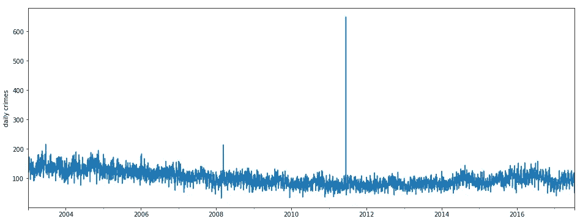
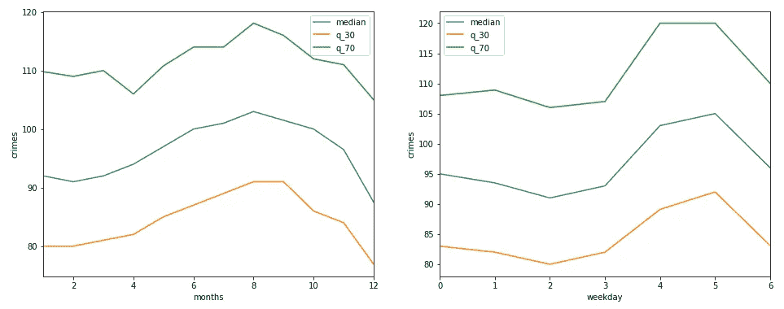
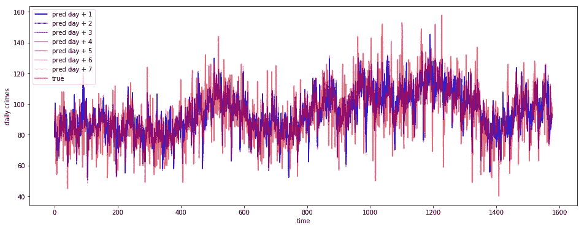
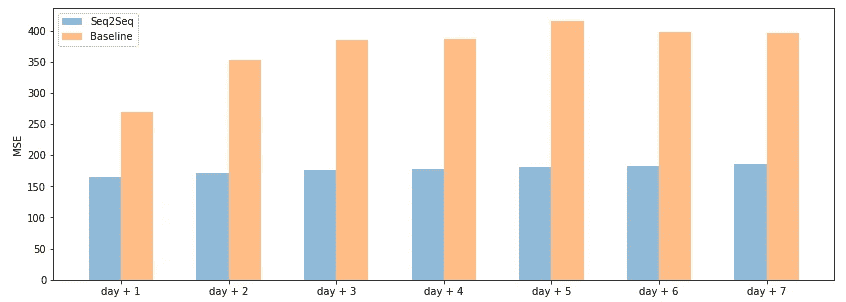
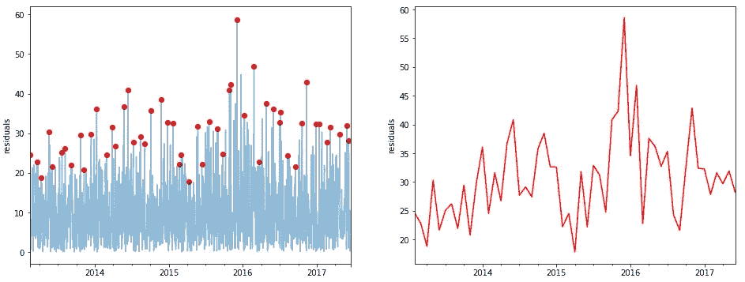
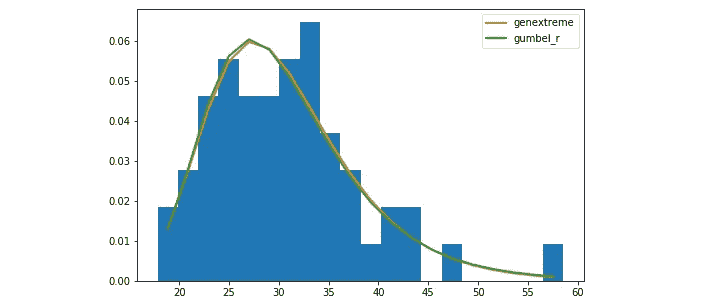
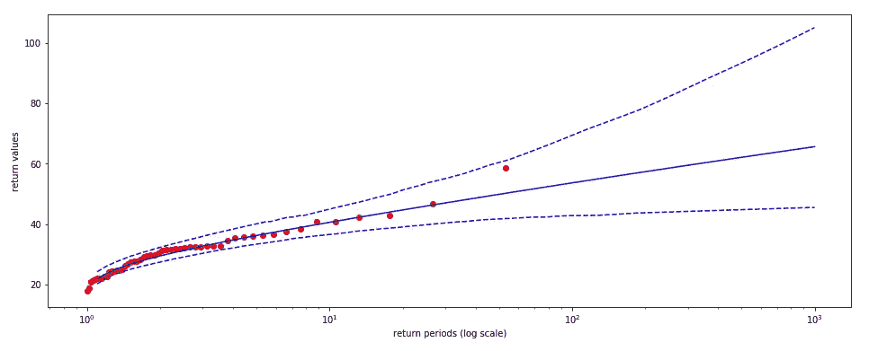
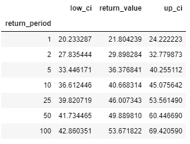
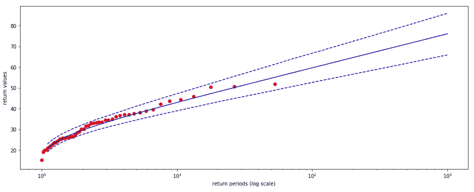
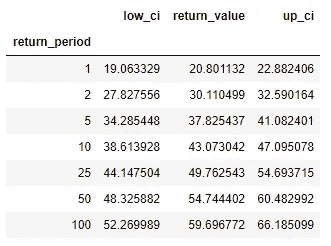

# 基于极值分析的异常检测

> 原文：<https://towardsdatascience.com/anomaly-detection-with-extreme-value-analysis-b11ad19b601f?source=collection_archive---------15----------------------->

## 使用极值理论解释异常检测结果

伊恩·西蒙兹在 [Unsplash](https://unsplash.com?utm_source=medium&utm_medium=referral) 上拍摄的照片

极值分析(EVA)是一种统计方法，主要用于估计与之前观察到的事件相比最为罕见的事件的概率。应用领域一般是工程、气象、水文、金融和海洋学。事实上，这是一种存在于不同年代的方法，用于处理参考分布的极端偏差。

我们能做的是更进一步。我们在异常检测的应用中评估我们的深度学习模型期间使用 EVA。我们并不试图重新发明任何东西，我们只是使用极值理论来为我们的监督方法的结果提供额外的解释。我们的方法与算法无关，可以很容易地推广或修改，以适应每个建模管道。

在这篇文章中，我们开发了一个基于深度学习结构的时间序列预测应用程序。在正确验证之后，我们通过 EVA 来检验预测的可靠性。我们检查在选定的控制周期内产生的残差，以确定它们有多“极端”,以及它们在未来会有多“频繁”。生成关于这些方面的统计数据和置信度允许我们指出异常情况，即不由我们的深度学习框架建模的情况，在未来会如何揭示。

# 数据

我们使用来自温哥华开放数据目录的数据集。在 [Kaggle](https://www.kaggle.com/wosaku/crime-in-vancouver) 上可以很容易地访问它，它报告了从 2003 年到 2017 年在加拿大城市登记的超过 5 亿份犯罪记录。我们只关注日常犯罪的汇总系列。如下图所示，这个系列看起来噪音很大。

每日汇总犯罪的原始系列(图片由作者提供)

然而，在每周和每月的水平上可以检测到某种形式的季节性。

犯罪系列的季节性水平(图片由作者提供)

# 模型

我们使用这些信息建立一个预测模型，根据过去的观察结果预测未来几天的犯罪。针对这种任务，我们开发了 Seq2Seq LSTM 自动编码器。它的结构非常适合对我们处理的数据进行建模，因为我们可以将原始时间信号与时间嵌入的创建相结合。编码器被输入数字输入序列(目标历史序列)加上历史工作日和月份的数字嵌入。解码器接收解码器输出加上未来工作日和月份的数字嵌入，以产生 7 天预测。

通过 [**keras-hypetune**](https://github.com/cerlymarco/keras-hypetune) ，*一种仅基于 NumPy 的 keras 超参数调整的简单框架，利用网格搜索方法优化验证集上的参数，从而计算训练过程。*

下面描述了我们的验证集生成的预测，以及为每个未来时滞计算的相应性能。我们的参考基线由最后一次有效观察的虚拟重复构成。

不同时间范围的现实与预测(图片由作者提供)

在不同时间范围内计算的 MSE(图片由作者提供)

# 极值分析

在这一点上，我们的模型的一个优化版本已经被训练好并可以使用了。我们现在要做的是运用 EVA 的一些典型技术来解释这些性能。在我们的实验中，术语“验证集”用于以更一般的方式定义“控制组”，即用于操作调整和 EVA 应用的时间间隔。

我们感兴趣的第一个要素是我们的模型在验证集上生成的残差。我们认为残差的绝对值是极值。这种选择是合理的，因为它们代表了我们的预测模型表现不佳的未知情况。换句话说，我们的模型倾向于错误的情况还没有被研究，因此被标记为异常事件。异常的程度是通过与现实和预测的距离来衡量的。EVA 的标准方法包括将高于固定阈值的所有观察值(峰值超过阈值)识别为异常/极端，或者构建将原始序列分成块的最大值序列(块最大值方法)。方法的选择与领域相关，可以产生不同的结果。当然，从模型残差中导出极值可以给我们信心来处理平稳序列，这是 EVA 的先决条件。

左起:应用于残差序列的块极大值法；在每个区块中检测到的一系列最大值点(图片由作者提供)

第二步是建立极值模型。我们希望分配这些值来自的参考分布。根据之前对如何选择异常/极值所做的选择，我们有不同的候选分布可供选择。对于我们的工作，我们选择块最大值方法，块的长度为 30 天。通过这种方法，我们有信心认为极端事件来自广义极值(GEV)或 Gumble 分布。该选择可以通过执行最大似然估计进行数学计算，从中我们选择具有最佳参数的最佳分布。

异常/极端情况的经验分布和估计分布(图片由作者提供)

有了这些零件，我们就可以开始下一步了。我们只需要选择一些时间步长，技术上称为返回周期，在此基础上计算相对返回值。对于每个返回周期，我们可以预期至少会看到一个实例超过估计的返回值。给定 *t* 作为一个重现期，一个预期的返回值( *E)* 意味着在接下来的 *t* *30 天内，我们可以预期看到一些值以等于 *1/t* 的概率超过 *E* 。在我们的具体研究案例中，返回值是我们在未来可能会超过的残差，即我们可以归类为异常的意外事件。

在下面的图中，我们可以显示未来的模型化返回值，以及我们的验证集的观察到的最大值。附表更正式地总结了我们的发现。例如，第一行表示，在接下来的 30 天内，我们有望(以相对较高的概率)获得超过我们模型预测值 21 个绝对点的观测值。同样，最后一行表示，我们可以预期(以相对较低的概率)在接下来的 3000 天内，我们的模型预测会有超过 53 个绝对点的观测值。使用自举统计来计算置信区间。

t+1 时残差的返回值图。红色表示每个区块中检测到的一系列最大值点。蓝色表示预期返回值和相对引导区间(图片由作者提供)

t+1 时残差的返回值表(图片由作者提供)

所解释的程序适用于一步预测的残差，但同样可以计算其他预测范围。

t+7 时残差的返回值图。红色表示每个区块中检测到的一系列最大值点。蓝色表示预期返回值和相对引导区间(图片由作者提供)

t+7 时残差的返回值表(图片由作者提供)

# 摘要

在这篇文章中，我们提出了一个时间序列预测任务。首先，我们为多步预测建立了一个 Seq2Seq 模型。其次，我们试图结合极值理论中的一些技巧对我们的模型作进一步的解释。我们利用这种组合来解释正常数据流中可能出现的异常，这是我们的模型无法识别的。

[**查看我的 GITHUB 回购**](https://github.com/cerlymarco/MEDIUM_NoteBook)

保持联系: [Linkedin](https://www.linkedin.com/in/marco-cerliani-b0bba714b/)