# Python 中基于 GESD 的异常检测

> 原文：<https://towardsdatascience.com/anomaly-detection-with-generalized-extreme-studentized-deviate-in-python-f350075900e2?source=collection_archive---------7----------------------->

## 理解 GESD 并用 Python 实现它

来源: [Unsplash](https://unsplash.com/)

异常检测在各种各样的用例中扮演着非常重要的角色。通常，异常数据可能与某种问题或罕见事件有关，例如银行欺诈、医疗问题、结构缺陷、设备故障等。这种联系使得挑选出哪些数据点可以被视为异常变得非常有趣，因为从业务角度来看，识别这些事件通常非常有趣。

此外，许多统计技术对异常值的存在很敏感。例如，平均值和标准偏差的简单计算可能会被一个非常不准确的数据点扭曲。检查异常值应该是任何数据分析的常规部分，并且应该检查潜在的异常值以查看它们是否可能是错误的

**什么是异常检测？**

异常检测是发现数据集异常值的任何过程；那些不属于这里的东西。这些异常可能指向不寻常的网络流量，发现某个传感器出了故障，或者只是在分析之前识别出要清理的[数据](https://www.bmc.com/blogs/data-normalization/)。

有各种技术可用于根据不同的方案或方法识别异常，如图形(箱线图、散点图)、基于距离的方案(最近邻法、聚类算法)、统计方法(GESD、基于四分位数的技术)等。每种方案都有其优点和缺点，其功效取决于使用案例。

在本文中，我们将重点关注 GESD(广义极端学生化偏差)，并用 python 实现一个简单的示例，以更好地理解它的工作原理。在我开始之前，我想承认这篇文章在很大程度上受到了我的探索性数据分析教授 Edward McFowland 和 Bhavesh Bhatt 在 YouTube 上的[机器学习和统计教程](https://www.youtube.com/channel/UC8ofcOdHNINiPrBA9D59Vaw)的启发。

**什么是 GESD？**

GESD 是一种简单的统计方法，用于检测符合近似正态分布的单变量数据集中的一个或多个异常值。统计方法假设常规数据遵循某种统计模型，不遵循该模型的数据是异常值。

GESD 克服了[格拉布斯检验](https://www.itl.nist.gov/div898/handbook/eda/section3/eda35h1.htm)和[蒂特金-摩尔检验](https://www.itl.nist.gov/div898/handbook/eda/section3/eda35h2.htm)的主要限制，即异常值的可疑数量 *k* 必须精确指定。如果没有正确指定 *k* ，这可能会扭曲这些测试的结论。GESD 检验只要求指定异常值可疑数量的上限。

给定上限 *r* ，广义 ESD 测试本质上执行 *r* 单独的测试:一个异常值的测试，两个异常值的测试，等等，直到 *r* 异常值。

广义 ESD 测试是针对以下假设定义的:

**H0:数据集中没有异常值**

**高可用性:数据集中有多达 r 个异常值**

我们的测试统计由下面的公式给出:

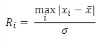

GESD 的检验统计

这里，x_bar 和σ分别表示样本均值和样本标准差。

在 GESD，我们移除最大化| *xi* — *x_bar* 的观察，然后用 n-1 个观察重新计算上述统计。我们重复这个过程，直到 r 个观察值被去除。这导致 r 统计数据 *R1，R2 ……，Rr。通过编码示例，该过程将变得更加清晰。*

对应于 *r* 测试统计，计算以下 *r* 临界值:

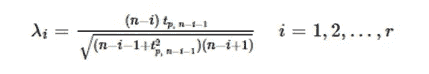

临界值计算

其中 *tp，ν* 是从具有 *ν* 自由度的[t*t*分配](https://www.itl.nist.gov/div898/handbook/eda/section3/eda3664.htm)的 100 *p* 百分点

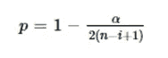

我们的显著性水平将由α表示。

**通过找到最大的 *i* 来确定异常值的数量，使得 *Ri* > *λi* 。**

Rosner 的模拟研究表明，这个临界值近似值对于 n ≥ 25 非常精确，对于 n*≥15 相当精确。*

*请注意，尽管广义 ESD 本质上是按顺序应用的[格拉布斯测试](https://www.itl.nist.gov/div898/handbook/eda/section3/eda35h1.htm)，但还是有一些重要的区别:*

*   *广义 ESD 测试根据测试的异常值数量对临界值进行适当的调整，而连续应用 Grubbs 测试则不会。*
*   *如果存在明显的掩蔽，连续应用格拉布斯检验可能会过早停止。*

*现在为了巩固理论部分，让我们用 Python 实现 GESD，以了解它实际上是如何工作的:*

*由于这是一个例子，我们将首先模拟我们的数据。这里我们创建 100 个 0 到 1 之间的随机值。我们的数据散点图如下所示。*

*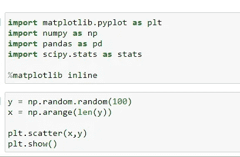**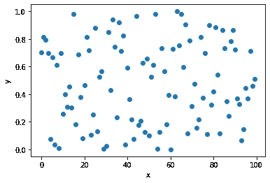*

*现在，我们会故意在数据中放一些异常值进行识别。*

*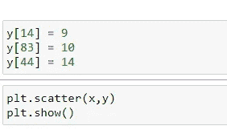**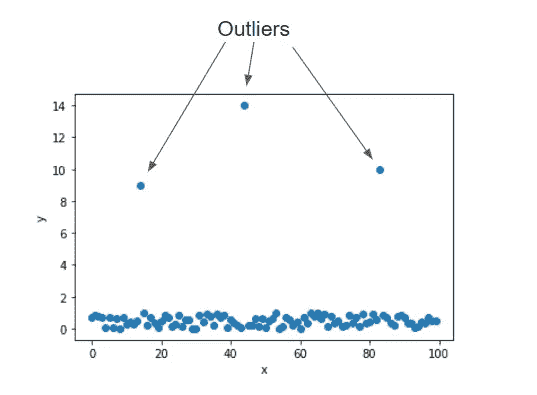*

*有异常值的数据*

*现在，我们将创建单独的函数来计算测试统计数据和临界值*

*计算测试统计的函数:*

*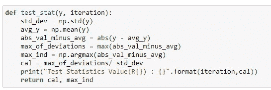*

*计算临界值的函数:*

*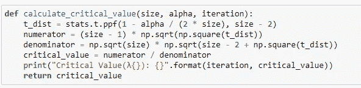*

*该函数将所有内容汇集在一起，并执行 r 检验来确定异常值的数量。对于每次迭代，我们使用上面的函数来计算使|*Xi*—*x _ bar*|最大化的检验统计量，然后计算相应的临界值，然后在下一次迭代中从我们的数据中移除观察值。*

*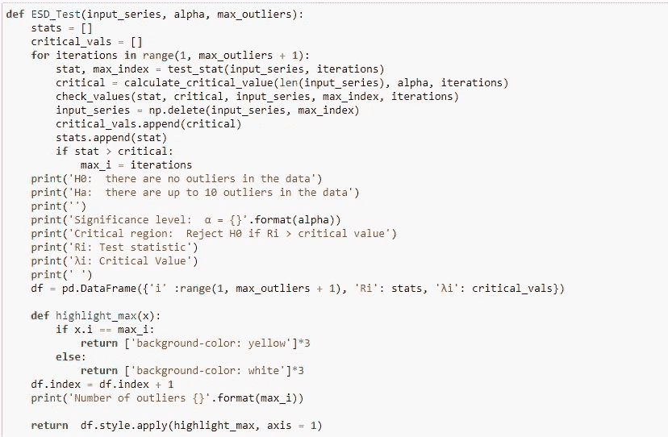*

*对我们的数据调用具有 7 个异常值上限且显著性水平为 5%的函数会产生以下结果:*

*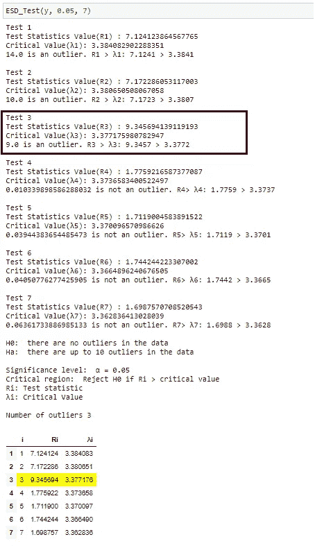*

*我们可以看到执行了 7 项测试。通过找到最大的 *i* 来确定异常值的数量，使得*Ri*λI。在本例中，测试统计值大于临界值(在 5 %的水平)的最大异常值数是 3。因此，我们得出结论，在这个数据集中有 **3 个异常值。***

*下面是完整的代码:*

*这就是 GESD 在 python 中的实现。我希望这篇文章将有助于您实现这个简单而有效的方法来发现数据中的异常值。更多项目请查看我的 [Github 简介](https://github.com/shaleenswarup)。*

***参考文献:***

*bmc| [机器学习的异常检测:Jonathan Johnson 的介绍](https://www.bmc.com/blogs/machine-learning-anomaly-detection/#:~:text=Anomaly%20detection%20is%20any%20process,data%20for%20cleaning%2C%20before%20analysis)*

* [## 使用主成分分析的异常检测

### 异常检测(或异常值检测)是对引起异常的罕见项目、事件或观察结果的识别

datascience904.wordpress.com](https://datascience904.wordpress.com/2019/10/14/anomaly-detection-using-pca/) 

[https://www . ITL . NIST . gov/div 898/handbook/EDA/section 3/EDA 35h 3 . htm](https://www.itl.nist.gov/div898/handbook/eda/section3/eda35h3.htm)*