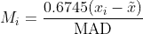
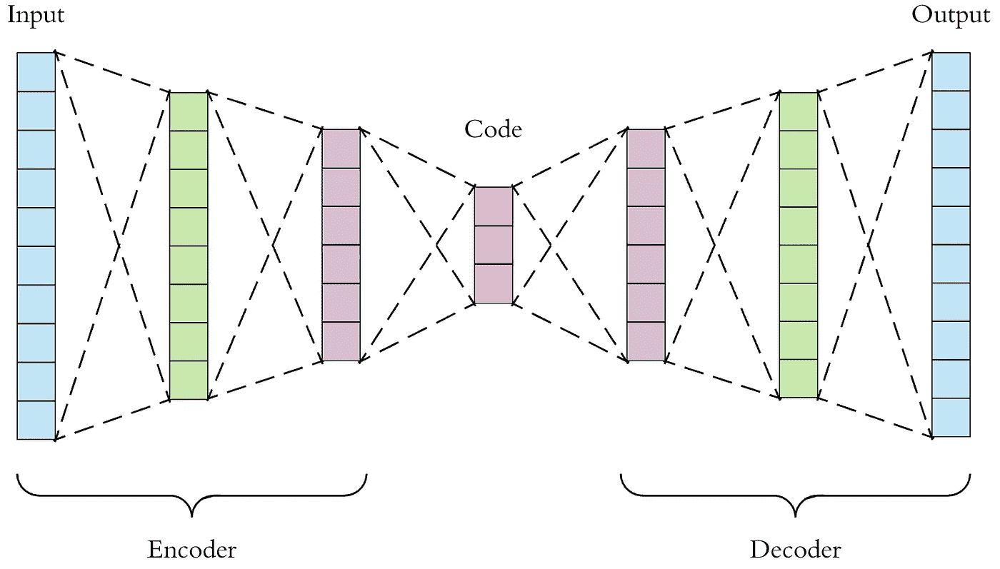

# 异常和欺诈检测

> 原文：<https://towardsdatascience.com/anomaly-fraud-detection-a-quick-overview-28641ec49ec1?source=collection_archive---------16----------------------->

## 可用方法的快速概述

这真的很反常。—[Ibrahim Boran](https://unsplash.com/@ibrahimboran?utm_source=medium&utm_medium=referral)在 [Unsplash](https://unsplash.com?utm_source=medium&utm_medium=referral) 上拍摄的照片

异常检测、欺诈检测和异常检测是人工智能领域常见的术语。虽然有不同的术语，并在脑海中暗示不同的图像，但它们都归结为同一个数学问题，简而言之就是，*在许多条目中检测似乎不属于那里的条目的过程。*

例如，作为异常检测的一个用例，信用卡/借记卡欺诈检测是检查传入的交易请求是否与用户以前的档案和行为相符的过程。以此为例:乔是一个勤奋的人，在纽约附近的一家工厂工作。每天他从当地的咖啡馆买一杯咖啡，去上班，买午餐，在回家的路上，他有时会去买些杂货。他用自己的卡支付账单，偶尔会在休闲、餐馆、电影院等地方花钱。

照片由[rupixen.com](https://unsplash.com/@rupixen?utm_source=medium&utm_medium=referral)在 [Unsplash](https://unsplash.com?utm_source=medium&utm_medium=referral) 上拍摄

一天，一个交易请求被发送到 Joe 的银行帐户，要求他在德克萨斯州奥斯汀附近的一家必胜客支付 30 美元。不知道这是 Joe 在度假还是他的卡丢失了，这看起来像是异常交易吗？是的。如果有人开始在“持卡人不在场”的基础上用乔的账户支付 10 美元的账单，例如在线支付，该怎么办？银行机构想要停止这些交易，并通过短信或电子邮件向 Joe 核实这些交易。

这些都是肉眼可以识别的异常交易的明显例子。但是正如每一个统计问题一样，总有不平凡的情况。我们如何探测它们是我想谈论的问题。

请注意，异常检测问题没有确定的答案，答案是随机的，并且总是取决于我们查看数据的角度。

## 方法

我将解决这个问题的数学方法分为三类:容易解释的**统计**方法，有点解释的**经典机器学习**方法，以及黑盒**深度学习**方法。

## 特征工程

特征工程的过程建立了我们观察数据的框架。它定义了我们认为什么是重要的，它是我们将直觉引入模型的过程。这一步在很大程度上取决于手头的问题，但我将针对我们之前讨论过的银行账户示例深入探讨这个问题。什么可以帮助我们确定乔是乔还是他的卡或在线凭证丢失了？这里有一个提示性的列表:

1.  **这一天花掉的钱的总数:**看着这个，并将其与乔每天通常的总数进行比较，模型将了解乔通常的行为。
2.  **当日交易笔数**
3.  **金额**
4.  **一天中的某个小时**
5.  **位置**
6.  …

引用贝森等人的这本书。艾尔。，

> 欺诈性账户活动可能涉及在短时间内尽可能多地消费。

这些是一些例子，需要银行机构从他们关于 Joe 的数据库的不同表中得到。当然，每个问题还有许多其他可能的特征，试着为你的情况找到它们。

特征工程是重要的一步—照片由 [airfocus](https://unsplash.com/@airfocus?utm_source=medium&utm_medium=referral) 在 [Unsplash](https://unsplash.com?utm_source=medium&utm_medium=referral) 上拍摄

## 统计方法

这个名字可能有点误导，因为我们要做的一切都是统计方法，对吗？但是在这里，我将重点放在简单的统计数据上，这些数据可以在 5 分钟内解释给利益相关者，他们可能不理解复杂的方法。这些方法的一个缺点是它们不能处理分类数据，如一天中的小时特征。因此，为了实现它们，我建议将它们分别应用于每个类别。所以我们会比较日间交易和隔夜交易。

1.  **修改后的 Z 值:**

[Z-score](https://en.wikipedia.org/wiki/Standard_score) 背后有一个非常简单的想法，这个数据点距离别人的均值有多少标准差？它越高，数据点越异常。这个定义有局限性，它假设数据是正态分布的，容易出现异常值，如果 Joe 决定偶尔比平时多花一点钱，就会触发异常值。因此，我们将目光转向修改后的 Z-score，这也是由[伊格莱维奇和霍格林](https://www.semanticscholar.org/paper/Volume-16%3A-How-to-Detect-and-Handle-Outliers-Hoaglin/d524a172b49e25f888376d662ee364aa77d99e8a)推荐的。

修改后的 Z 分数使用中位数绝对偏差，定义如下:

修改的 Z 分数

作者建议将修改后的 Z 值为 3.5 或更高的点标记为异常。

2.**四分位距:**

正如在箱线图可视化中看到的，一个范围内的数据分布可以用四分位数来可视化，这里有一个很好的描述。

在这种方法中，第一个和第三个四分位数之间的点是正常点，它们之外的点将被标记为异常点。例如，您可以将其修改为“整数”范围，其中您可以使用第 *n* 个和第 *m* 个整数来标记数据，而不是四分位数。

3.**柱状图箱:**

直方图作为一种著名的数据可视化方法，也可以用于离群点检测。通过计算每个样本的箱并获取直方图，我们可以将异常点标记为异常。这在某种程度上与 Z 得分指标相关。

## 机器学习方法

与上面描述的方法相比，ML 方法要复杂得多，有点复杂，并且能够处理分类数据(通过预处理方法，例如一键编码，例如 Pandas 中的 *get_dummies* )。

1.  **k 近邻**

kNN 是一种广泛使用的 ML 算法，其背后的基本逻辑如下:“相似的观察值彼此接近，而离群值通常是孤立的观察值”。利用这一点，我们可以检测出一个高维特征空间中最“孤独”的点。在 [sklearn](https://scikit-learn.org/stable/modules/generated/sklearn.neighbors.KNeighborsClassifier.html) 库中有很大的涵盖。通过计算每个数据点与其他数据点的平均距离，我们可以设置一个阈值，将它们中的一定比例归类为异常，甚至可以对这些距离运行 Z 评分，并找到异常值。

2.**一级 SVM**

支持向量机是 ML 工具包中的强大武器。简而言之，它们是特征空间中的超平面，将点分成不同的类。在异常检测的上下文中，一类支持向量机*学习*什么是“正常的”,并基于此检测异常值和异常数据。[这里的](http://rvlasveld.github.io/blog/2013/07/12/introduction-to-one-class-support-vector-machines/)是一篇关于其背后的数学的彻底而完整的文章。sklearn 的 SVM 工具包中有[的](https://scikit-learn.org/stable/modules/generated/sklearn.svm.OneClassSVM.html)一类支持向量机。

3.**数据库扫描**

[DBSCAN](https://en.wikipedia.org/wiki/DBSCAN) 是一种无监督算法，可以检测空间中密集的区域，并将低密度区域中的数据点标记为异常。这是一种广泛使用的聚类方法，有两个超参数需要调整:Epsilon 和 min_samples，如 [sklearn 的实现](https://scikit-learn.org/stable/modules/generated/sklearn.cluster.DBSCAN.html)中所定义。

Epsilon 是数据点相互之间应该有多接近才能成为一个聚类的一部分的度量，min_samples 是一个聚类中的最小点数。

4. **LOF(局部异常因素)**

虽然与 kNN 和 DBSCAN 的逻辑相似，但 LOF 为每个数据点分配了一个指标(LOF ),正常点的得分在 1 到 1.5 之间，而异常点的得分更高。在 [sklearn](https://scikit-learn.org/stable/modules/generated/sklearn.neighbors.LocalOutlierFactor.html) 中也有。

4.**隔离森林**

隔离森林或 iForest 是一种非常强大的，可能是大数据中最好的方法，用于异常检测的工具。它很容易扩展，这里有一个很好的解释。这是大数据异常检测的必由之路。

随机森林！—[Jay Mantri](https://unsplash.com/@jaymantri?utm_source=medium&utm_medium=referral)在 [Unsplash](https://unsplash.com?utm_source=medium&utm_medium=referral) 上拍摄的照片

## 深度学习方法

最后，在花哨的人工智能领域，我们最终得到了黑盒，它们出于我们不知道的原因表现良好，并根据我们无法解释的原因来判断数据。最著名的 DL 异常检测方法是使用自动编码器网络。

**自动编码器**

自动编码器是由两个，实际上是三个部分组成的网络:编码器，潜在空间，解码器。用数学术语来说，自动编码器学习数据集上的恒等函数(简单地说: *f(x)=x* )。假设我输入了一大组我认为没有欺诈性的 Joe 的交易。网络训练取事务 *a* ，*编码*到*潜在*，低维空间，然后*解码*回基数等于输入空间的空间。例如，具有 100 个特征的输入将被减少到具有 30 个特征的潜在空间(这是编码)，然后返回到 100 个特征的表示。神经网络训练最小化输入和输出之间的差异。

来自:[https://towards data science . com/applied-deep-learning-part-3-auto encoders-1c 083 af 4d 798](/applied-deep-learning-part-3-autoencoders-1c083af4d798)

所以它基本上学会了回馈它收到的任何东西。现在，在训练阶段之后，如果我们显示它的正常入口，网络将能够以低误差*重建*它，因为它与我们训练网络所用的相似。但是如果我输入一个稍微不同的条目呢？*重构误差*会更高，这意味着网络还不能很好地重构它。我们可以基于这个度量来决定一个数据点是否异常。

这是对著名的、可用的异常检测方法的快速回顾。我将在以后更深入地研究其中的一些，并提供一个在样本数据集中检测欺诈的实际例子。如果你有什么想法，请告诉我。