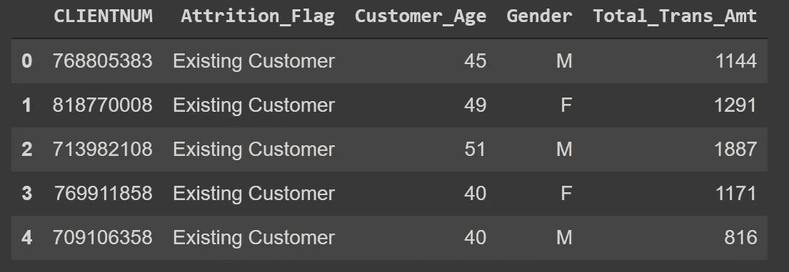
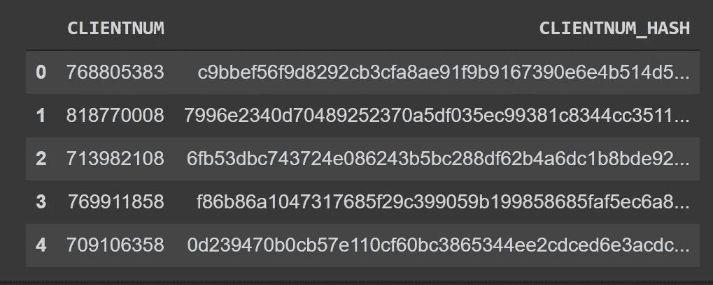

# 用 hashlib 匿名化 Pandas DataFrame 列中的敏感数据

> 原文：<https://towardsdatascience.com/anonymise-sensitive-data-in-a-pandas-dataframe-column-with-hashlib-8e7ef397d91f?source=collection_archive---------6----------------------->

## 停止在您的数据框架中共享个人身份信息


马库斯·斯皮斯克在 [Unsplash](https://unsplash.com?utm_source=medium&utm_medium=referral) 上的照片

数据科学家遇到的一个常见情况是与其他人共享数据。但是，如果这些数据包含电子邮件地址、客户 id 或电话号码等个人身份信息(PII ),您该怎么办呢？

一个简单的解决方案是在共享数据之前删除这些字段。然而，你的分析可能依赖于 PII 的数据。例如，电子商务交易数据集中的客户 id 是了解哪个客户购买了哪个产品所必需的。

相反，你可以使用**散列法**来匿名化数据中的 PII 字段。

# 哈希是什么？

哈希是将明文字符串转换为固定长度的唯一字符串的单向过程。哈希过程有两个重要特征:

1.  将散列字符串转换成其原始形式是非常困难的
2.  相同的明文字符串将产生相同的哈希输出

出于这些原因，开发人员会将您的散列密码存储在网站的数据库中。

# 一个使用 hashlib 的简单例子

[haslib](https://docs.python.org/3/library/hashlib.html) 是 Python 中的内置模块，包含了很多流行的哈希算法。在我们的教程中，我们将使用 SHA-256，它是 SHA-2 算法家族的一部分。

在将我们的字符串(在本例中为电子邮件地址)转换为哈希值之前，我们必须首先使用 UTF-8 编码将其转换为字节:

```
import hashlib# Encode our string using UTF-8 default 
stringToHash = 'example@email.com'.encode()
```

我们现在可以使用 SHA-256 散列它:

```
# Hash using SHA-256 and print
print('Email (SHA-256): ', hashlib.sha256(stringToHash).hexdigest())
```

输出:

```
Email (SHA-256): 36e96648c5410d00a7da7206c01237139f950bed21d8c729aae019dbe07964e7
```

就是这样！我们的假电子邮件地址已被成功散列。

# 使用 pandas 和 hashlib 的完整示例

既然我们可以将 hashlib 应用于单个字符串，那么将这个例子扩展到 pandas 数据帧就相当简单了。我们将使用信用卡客户数据，这些数据可以在 [Kaggle](https://www.kaggle.com/sakshigoyal7/credit-card-customers) 上获得，最初是由[Analyttica treasury hunt LEAPS](https://leaps.analyttica.com/)提供的。

**场景:**你需要共享一个信用卡客户列表。您希望保留字段“CLIENTNUM ”,因为一个客户可以拥有多张信用卡，并且您希望能够唯一地标识它们。

```
import pandas as pd# Read only select columns using pandas
df = pd.read_csv('data/BankChurners.csv', usecols=['CLIENTNUM', 'Customer_Age', 'Gender', 'Attrition_Flag', 'Total_Trans_Amt'])df.head()
```



作者图片

在将我们的“CLIENTNUM”列转换为 string 数据类型之后，我们可以使用 pandas `.apply()`散列该列中的所有字符串:

```
# Convert column to string
df['CLIENTNUM'] = df['CLIENTNUM'].astype(str)# Apply hashing function to the column
df['CLIENTNUM_HASH'] = df['CLIENTNUM'].apply(
    lambda x: 
        hashlib.sha256(x.encode()).hexdigest()
)
```

祝你在尝试破解我们新创建的专栏时好运。



作者图片

# 结论

完成本教程后，你应该对哈希算法有一个基本的了解。我们看到了如何使用 **hashlib** 散列一个字符串，以及如何将它应用于 pandas DataFrame 列来匿名敏感信息。

你有什么问题吗？ [**推我**](https://twitter.com/rtkilian) 或者在 [**LinkedIn**](https://www.linkedin.com/in/rtkilian/) 上加我。

你可以在 [**GitHub**](https://github.com/rtkilian/data-science-blogging/blob/main/hashlib_pandas.ipynb) 上找到这篇文章中用到的所有代码。