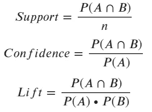
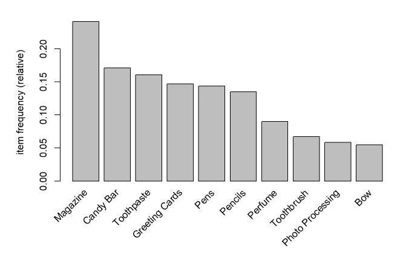
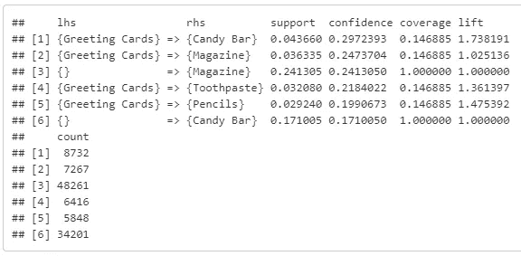
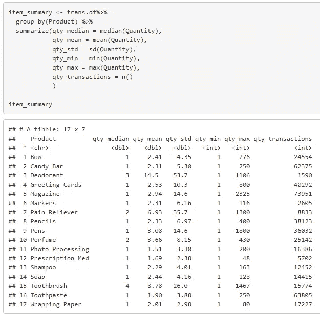
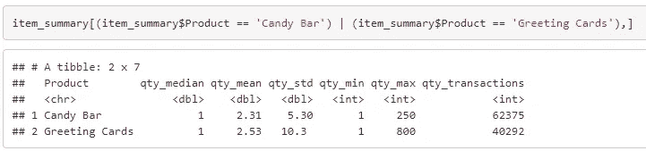

# 另一篇先验的文章，但有一点小小的变化…

> 原文：<https://towardsdatascience.com/another-apriori-article-but-with-a-small-twist-ebfac2d639b?source=collection_archive---------30----------------------->

## 你的老板想知道做一次产品推广的估计财务影响，给了你一大堆交易数据。*现在怎么办？*

由[斯蒂芬·道森](https://unsplash.com/@srd844?utm_source=medium&utm_medium=referral)在 [Unsplash](https://unsplash.com?utm_source=medium&utm_medium=referral) 上拍摄的照片

已经有很多关于先验细节的好文章了。我将主要关注一个现实的商业场景，它可能围绕着先验和市场篮分析的应用出现。

但是对 Apriori 算法做一个快速和高水平的复习是没有坏处的。

# *买了* X *的也买了 Y.*

Apriori 是一种关联规则挖掘算法，它发现哪些项目倾向于与哪些其他项目相匹配。想象一个超市，薯条和蘸酱通常在过道上相邻放置(甚至穿过商店，让你走得更远，可能会冲动购买更多)。

在进行*购物篮分析时，Apriori 算法的输出中有三个关键指标需要查看，即*支持度、信心度和提升度。

**支持** - >既有 A 又有 b 的部分交易

**置信度** - >给定 A 出现的次数，A & B 一起买入的频率。

**解除** - >表示统治随机几率的强弱。例如，3.2 的提升意味着如果客户购买 A，他们购买 b 的可能性会增加 3.2 倍。

# 回到你老板要求的场景…

在这个场景中，您有一个包含零售业务交易数据的大文件。你的老板说市场部想通过赠送糖果棒来促销贺卡。您的任务是验证假设并估计财务影响。

我觉得贺卡利润丰厚，我也喜欢糖果。不管怎样，回到场景…

取一个峰值，我们可以看到有 459，258 条记录，最终代表 200，000 笔交易。

项目频率图(来自 R 中的 arulesViz 库)(图片由作者提供)

*我这里主要关注的是* ***有什么影响？*** *“在真实的商业场景中。在这一点上，我将忽略 EDA，以及很多先验部分本身，因为它在其他文章中已经讨论过了，但不是我的主要关注点。*

浏览完数据后，你会发现这并不是一个太糟糕的想法。我们看到，几乎 30%的情况下，购买糖果棒的同时还会购买贺卡(**信心**)。我们还发现，购买贺卡的人购买糖果棒的可能性是其他人的 1.74 倍(**举**)。

LHS 和 RHS 分别是“左手侧”和“右手侧”。LHS 是倾向于导致购买 RHS 产品的产品。(图片由作者提供)

按事务数据集中的项目汇总统计信息。(图片由作者提供)

给定按产品的汇总统计数据并浏览原始数据，可以有把握地说这里可能发生两种情况中的一种(可能是组合)。

1.  这家公司的交易中有相当一部分是大宗销售。
2.  来自杂项事务的数据中有噪声。
    -例如，一家商店的系统停机了一天，他们输入了一个汇总交易来平衡库存。

这个数据集对于一个简单的例子来说已经足够好了，所以让我们看看糖果和贺卡。

项目摘要表的子集，查看我们感兴趣的内容。(图片由作者提供)

## 假设

让我们假设:

*   贺卡的利润非常可观，1 美元买 5 美元卖。
*   糖果有不错的利润，0.67 美元买进，1 美元卖出。
*   该数据代表 1 年的交易量。

可以肯定地说，以这样的速度，我们想推动贺卡的销售，可以用糖果棒的销售作为激励。

我们在汇总表中看到，平均贺卡交易有 2.53 张贺卡。

# 现在最大的问题是:

如果我们能通过“至少购买 3 张贺卡，可获得一个免费糖果棒”的促销活动，将平均贺卡数量从 2.53 张提高到 3 张… ***会有什么影响？***

平均数 3.0 减去目前的平均数 2.531，得出每笔交易贺卡平均净增加 0.469 张。

我们可以用这个增量，或者说净平均增长，乘以利润来估算贺卡业务的毛利增长。很简单，每张卡 0.469 * 4 美元的利润等于 1.876 美元。

现在我们有进展了。如果我们将平均值提高到 3，我们可以预期每笔交易会再增加 1.876 美元。但是等等，糖果不是免费的(记住，它们的价格是 0.67 英镑)，所以我们需要把它考虑进去。这使我们每笔交易的净利润增加了 1.206 美元。

因此，如果我们将其应用于贺卡交易总数(40，292)，我们会看到 ***预计的*** 净利润增长为 **$48，608！**

## 旁注:

当进行这类分析时，如果企业中有人在寻找*一个数字*，设定期望值很重要。任何时候我被要求计算出*一些*变化的影响，我总是把它框定为一个估计，并列出导致那个估计的我的假设。大多数时候都明白没有水晶球，但也有可能有人认为有。或者更有可能的是，他们知道这是一个估计，但他们不知道你可能做的任何假设。

因此，起初，这个场景可能看起来令人生畏，尤其是对于初级分析师(没关系！).但是，如果我们把问题分解成更小的块，就会变得容易得多。

# 结论

感谢您花时间阅读本文。我希望您从中获得了一些有用的东西，可以应用到现实世界的场景中。如果您有任何问题或反馈，请随时发表评论。

如果你喜欢这篇文章，你可能也会喜欢我关于使用 PuLP 解决一个简单优化问题的文章。

 [## Python + Pulp 优化:一个简单的物流例子

### Python 的纸浆是一个优化工具，像 Excel 求解器(硬币或纸浆)。我有一个不太适合的用例…

python .平原英语. io](https://python.plainenglish.io/python-pulp-optimization-a-simple-logistics-example-4a8f713ba807) 

继续学习！