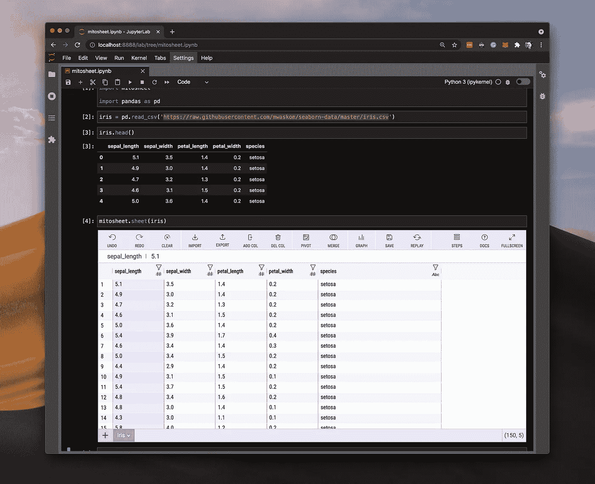
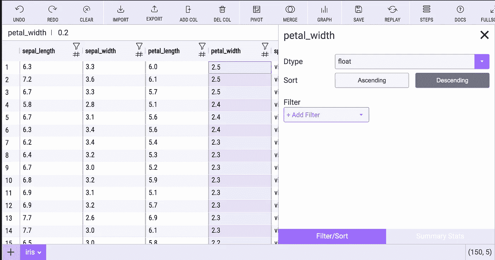
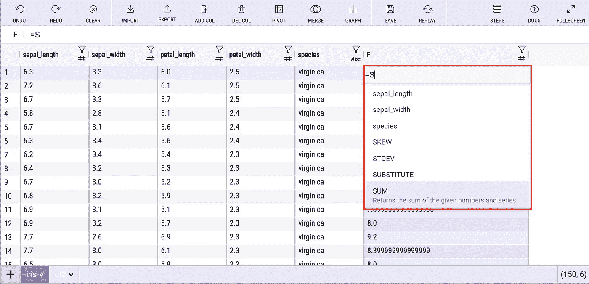
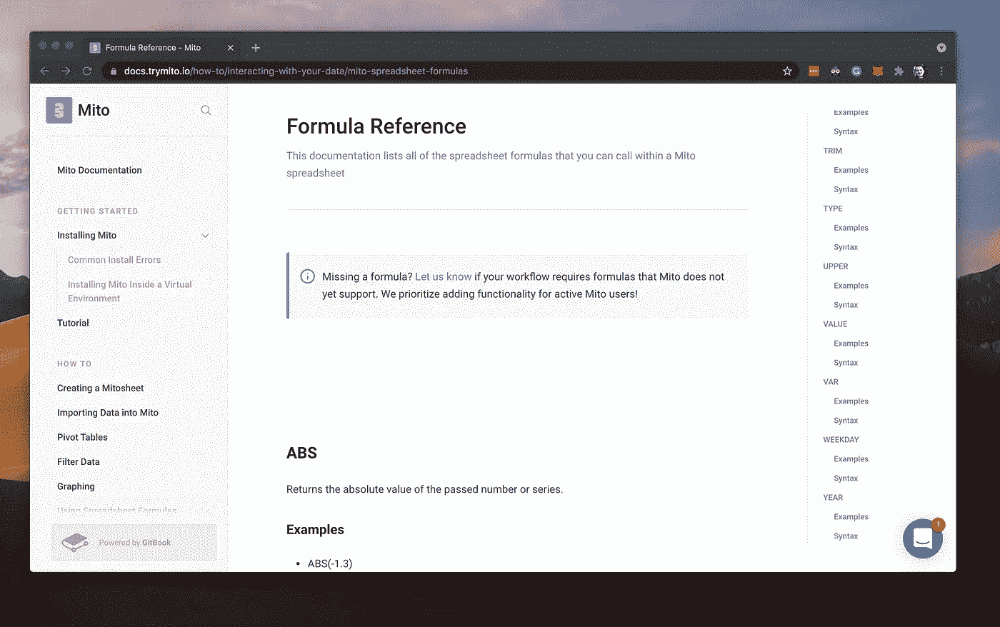
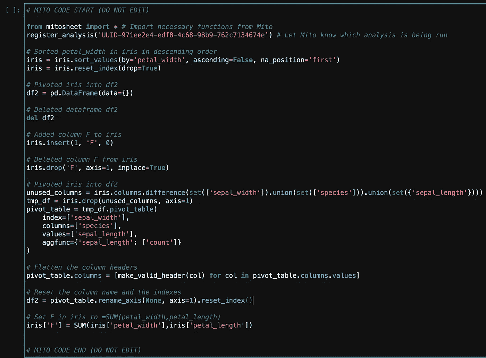

# 你应该知道的另一个 JupyterLab 扩展

> 原文：<https://towardsdatascience.com/another-jupyterlab-extension-you-should-know-about-146371cf0f32?source=collection_archive---------13----------------------->

## 米托是一个 JupyterLab 扩展，可以轻松地使用 Excel 探索和转换数据集……而且是免费的。


本杰明·戴维斯在 [Unsplash](https://unsplash.com?utm_source=medium&utm_medium=referral) 上拍摄的照片

随着所有新的 JupyterLab 扩展的出现，成为数据科学社区的一员真是一个激动人心的时刻。他们通过减少乏味的工作使数据科学变得更加有趣。

我记得在过去，我们必须依赖 numpy 和 matplotlib 作为我们在 Python 中进行探索性数据分析的主要工具。幸运的是，那些日子已经一去不复返了。

您将会明白我所说的“早就过去了”是什么意思，JupyterLab 扩展是本文的主题。

**如果你错过了其他关于米托的文章:**

*   [米托——生成 Python 的电子表格](https://romanorac.medium.com/list/mito-a-spreadsheet-that-generates-python-1df29fc67dff)

# 认识米托



加载了米托的虹膜数据集(图片由作者制作)

[米托](https://trymito.io/)是一个免费的 JupyterLab 扩展，可以轻松地使用 Excel 来探索和转换数据集。

> 米托是我们等待多年的熊猫延伸

当你启动米托时，它显示一个熊猫数据框架的电子表格视图。只需几次点击，您就可以执行任何 CRUD 操作。

> CRUD 代表创建、读取、更新、删除

## 如何开始米托？


劳拉·加里利奥在 [Unsplash](https://unsplash.com?utm_source=medium&utm_medium=referral) 上拍摄的照片

使用米托加载数据并显示电子表格视图非常简单:

```
import mitosheet
import pandas as pdurl = '[https://raw.githubusercontent.com/mwaskom/seaborn-data/master/iris.csv'](https://raw.githubusercontent.com/mwaskom/seaborn-data/master/iris.csv')
iris = pd.read_csv(url)mitosheet.sheet(iris)
```

米托打开了一个功能强大的电子表格查看器，可以对数据进行过滤、排序和编辑。



按花瓣宽度排序(图片由作者制作)

> 而且它不仅仅停留在基本的编辑功能上…

## 数据透视表

只需点击几下，米托就可以创建一个数据透视表。它支持许多常见的聚合，如总和、中值、平均值、计数、唯一等。

带米托的旋转虹膜表( [Gif](https://giphy.com/gifs/zt5qRYchWyKGSC6MOx) 作者制作)

> 什么是数据透视表？(来自[维基百科](https://en.wikipedia.org/wiki/Pivot_table))
> 
> 数据透视表是一个由分组值组成的表，它将一个更大的表中的各个项目聚合在一个或多个离散的类别中。

# 米托最令人印象深刻的特征是什么？

如果旋转表没有给你留下足够的印象，让你尝试一下米托，我很有信心下面的功能会。

# 电子表格公式



用米托计算公式(图片由作者提供)

动态公式是 Excel 的杀手锏。对于那些不熟悉编程的人来说，Excel 可以轻松地创建复杂的电子表格。

如果我告诉你**米托以一种“Excel 方式”**支持动态公式会怎么样？这个特性真的让我很惊讶，因为米托背后的团队花了很多开发时间来实现它。



[公式引用](https://docs.trymito.io/how-to/interacting-with-your-data/mito-spreadsheet-formulas)显示支持的公式(图片由作者制作)

看看下面的 GIF，看看米托的求和公式:

用米托计算虹膜数据集上的求和公式( [GIF](https://giphy.com/gifs/wVZVCwhkS1dRNeCAj3) 作者制作)

# 可视化数据


由[活动创作者](https://unsplash.com/@campaign_creators?utm_source=medium&utm_medium=referral)在 [Unsplash](https://unsplash.com?utm_source=medium&utm_medium=referral) 上拍摄的照片

我们，数据科学家，欣赏简化数据可视化的工具。

起初，pandas 从使用准系统 matplotlib(一个用于数据可视化的强大 python 包)实现了巨大的飞跃。

然后是 [seaborn](https://seaborn.pydata.org/) 和[plottly](https://plotly.com/)，它们可以用 Python 制作出令人惊叹的可视化效果，只需几个命令……这又是一次巨大的飞跃。

…然后是米托，它可以不用写一行代码就能把你的数据可视化。

米托支持条形图、箱线图、直方图和散点图。

在下面的 GIF 中，我做了一个柱状图，x 轴是萼片宽度，y 轴是物种。

用米托可视化数据( [GIF](https://giphy.com/gifs/Agg9ThuBlmwCnVrzNC) 作者制作)

# 自动代码生成


Joshua Aragon 在 [Unsplash](https://unsplash.com?utm_source=medium&utm_medium=referral) 拍摄的照片

米托将你的每个操作转换成熊猫代码，然后你可以和你的同事分享。

此功能的主要目的是在另一个数据集上重复分析。这就像一个熊猫的宏。

对于经验不足的数据科学家来说，这也是一个很好的功能，因为他们可以学习“熊猫方式”进行数据分析。

我点击了一下，米托产生了下面的代码片段:



米托动态自动生成代码(图片由作者制作)

# 如何安装米托？

米托需要 Python 3.6 或更高版本。

首先，你需要下载米托的安装程序:

```
python -m pip install mitoinstaller
```

然后要安装它，只需运行:

```
python -m mitoinstaller install
```

如果你有一些安装错误，看看米托的[常见安装问题。](https://docs.trymito.io/getting-started/installing-mito/common-install-errors)

# 结论


由[大卫·穆林斯](https://unsplash.com/@mullins?utm_source=medium&utm_medium=referral)在 [Unsplash](https://unsplash.com?utm_source=medium&utm_medium=referral) 上拍摄的照片

JupyterLab 的扩展生态系统已经走了这么远，这让我感到惊讶。最初的扩展笨重，容易出错，难以安装。

时代变了，JupyterLab 的扩展也日趋成熟。米托是这种趋势的一个很好的例子。

我带米托去试驾，几个小时后，我没有看到性能下降(或一些奇怪的错误)。

我将把米托加入我的数据科学工具箱。我计划用它进行初步的探索性数据分析——感受数据。一遍又一遍地输入同一套命令变得单调乏味。

如果你想了解更多关于米托的知识，它有写得很好的[文档](https://docs.trymito.io/)(和许多[教程](https://docs.trymito.io/getting-started/tutorial))，这对于这样的扩展来说总是一个好兆头。

# 在你走之前

*如果你喜欢看这些故事，为什么不成为* [***中等付费会员***](https://romanorac.medium.com/membership) *？每月 5 美元，你可以无限制地阅读 10000 个故事和作家。**[***如果你用我的链接***](https://romanorac.medium.com/membership)**注册，我会赚一小笔佣金。***

****

**照片由[普里西拉·杜·普里兹](https://unsplash.com/@priscilladupreez?utm_source=medium&utm_medium=referral)在 [Unsplash](https://unsplash.com?utm_source=medium&utm_medium=referral) 上拍摄**