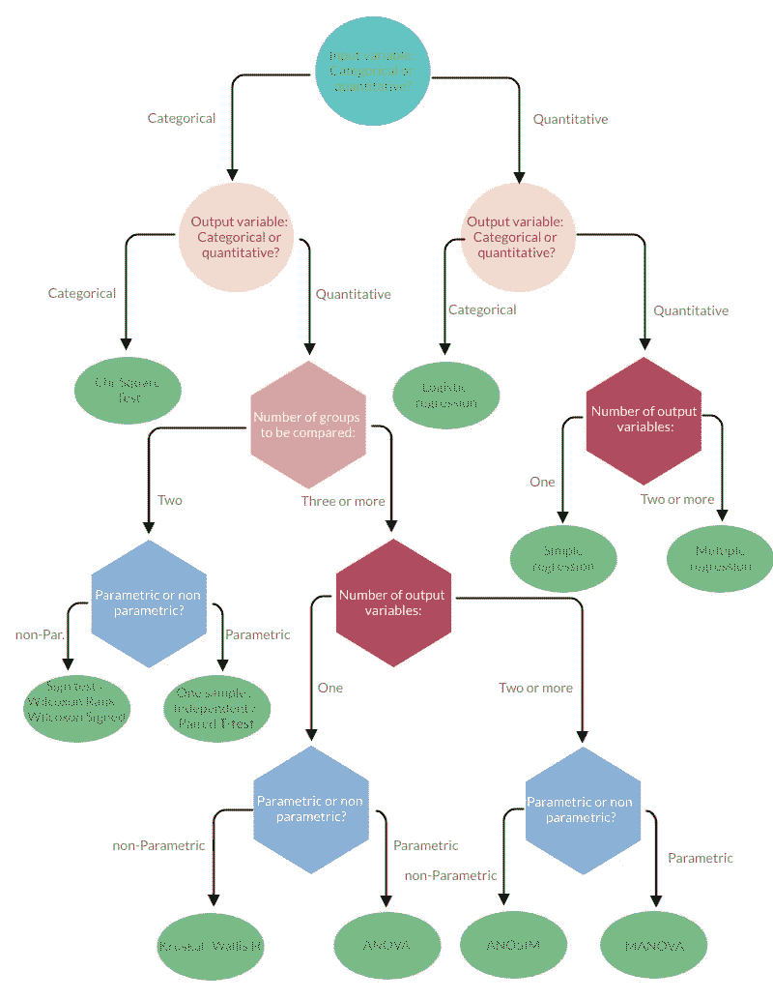
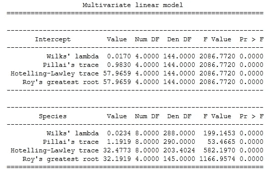

# 使用 Python 进行 ANOVA、T-test 和其他统计测试

> 原文：<https://towardsdatascience.com/anova-t-test-and-other-statistical-tests-with-python-e7a36a2fdc0c?source=collection_archive---------5----------------------->

主要分析[](https://en.wikipedia.org/wiki/Statistical_hypothesis_testing)**(ANOVA、T 检验、MANOVA 等)。)及其特点，在 Python 中应用。**

**gyphy.com上疯狂的前 GIF**

**你的老板有没有让你做一些统计测试，而你不知道从哪里开始？😱**

**你是不是已经疯了，认为你必须阅读大量的统计书籍，而这些书籍你到目前为止一直能够避免阅读？**

**这是一个快速指南，将帮助您了解基础知识，选择适合您的测试，以及如何用 Python 实现它们，并提供示例和库。😎**

# **什么是统计测试**

**统计测试用于[假设检验](https://en.wikipedia.org/wiki/Statistical_hypothesis_testing)。一般来说，它们可以用于:**

*   **确定输入变量是否与输出(目标)变量有显著的统计关系。**
*   **估计两组或多组之间的差异。**

> **统计检验的工作原理很简单:他们假设一种特定的情况发生，然后估计这种假设错误的可能性有多大。**

**统计测试假设一个[零假设](https://en.wikipedia.org/wiki/Null_hypothesis)。零假设对应于所考虑的组(集)之间没有关系或差异的假设。然后，他们确定观察到的数据是在零假设预测值的范围之外还是之内。**

**还有**多重统计测试**，根据要面对的问题和可用数据的特点而有所不同。现在我们将详细介绍它们，然后在 **Python** 中应用其中一些。**

# **统计测试的工作原理**

**统计测试的输出值被定义(具有巨大的想象力😆)一个 [**测试统计量**](https://en.wikipedia.org/wiki/Test_statistic) —一个描述测试中输入和输出变量之间的关系与原假设有多大差异的数字。**

**但这不是我们感兴趣的结果。**

**让我们明白零假设是否成立的是[***p*-值**](https://en.wikipedia.org/wiki/P-value) (概率值)。*p*-值估计如果零假设为真，您将看到测试统计报告的差异的可能性有多大。**

**要说 p 值是否显著，我们需要一个称为[显著性水平](https://en.wikipedia.org/wiki/Statistical_significance)的显著性阈值。这个阈值通常设置为 0.05，但我们不会进入这种无聊的数学家讨论。😉**

**如果 p 值低于阈值(意味着小于)，那么您可以推断出输入和目标变量之间的**统计显著关系**。**

**否则，那么你就可以推断出**预测值和结果变量之间没有统计上的显著关系**。**

**让我们举一个简单的例子。我在两组之间进行 T 检验。如果 T 检验的相应 p 值为 0.03，则意味着有统计学意义的关系。只有 3%的概率零假设是正确的(并且结果是随机的)。因此，我们拒绝零假设，接受替代假设。**

# **决定哪种测试适合我们**

**我们已经说过，统计检验有很多，每一种都只能应用于特定的场景。要确定使用哪种统计检验，您需要知道:**

*   **您正在处理的[变量类型](https://www.statisticshowto.com/probability-and-statistics/types-of-variables/)(分类变量、数量变量等。)**

**您的数据是否满足某些 [**假设**](https://www.scribbr.com/frequently-asked-questions/assumptions-of-statistical-tests/) (观测值的独立性、方差的同质性、数据的正态性)**

**统计测试分为两大类:**

*   **[参数化](https://en.wikipedia.org/wiki/Parametric_statistics)**
*   **[非参数化](https://en.wikipedia.org/wiki/Nonparametric_statistics)**

**前者是最“强大”的，因此是推荐使用的，但它们必须尊重上述假设。让我们来详细看看它们:**

1.  ****观察值的独立性**:单个观察值(变量的每个条目)相互独立(例如，对单个患者重复相同的测试会产生非独立的测量值，即重复测量值)。**
2.  ****数据的正态性**:数据服从[正态分布](https://en.wikipedia.org/wiki/Normal_distribution)。只有定量数据才需要这种假设。(更多详情，另见[此处](https://journals.physiology.org/doi/full/10.1152/advan.00064.2017))**
3.  ****方差的同质性**:在所有的组中，被比较的每个组中的[方差](https://en.wikipedia.org/wiki/Variance)(即，分数围绕平均值的分布或“分布”)是相似的。如果一组的差异比其他组大得多，这将降低测试识别差异的“能力”。**

**如果您的数据不满足观测值独立性的假设，您可以使用考虑这种情况的测试(即重复测量测试)。**

**相反，如果您的数据不满足正态性或方差齐性假设，您可以执行 [**非参数统计测试**](https://en.wikipedia.org/wiki/Nonparametric_statistics) ，这样您就可以在没有这两个假设的情况下进行比较。**

****

**指导选择正确统计检验的流程图。*【作者图片】***

**现在我们知道了在各种测试中进行选择的标准，您可以使用下面的流程图来选择适合您的测试。现在**无聊的部分结束了**，我们可以看一些代码了。😝**

**此外，还有其他的统计测试来代替那些被提议的测试，它们也有同样的功能。为了避免文章太长，它们被省略了。**

# **用于统计测试的 Python 库**

**收集主要统计测试的最著名和受支持的 python 库有:**

*   **[**stats model**](https://www.statsmodels.org/stable/index.html)**:**一个 Python 模块，为许多不同的统计模型的估计，以及进行统计测试和统计数据探索提供了类和函数。**
*   **[**Pingouin**](https://pingouin-stats.org/)**:**一个用 Python 3 编写的开源统计包，主要基于 Pandas 和 NumPy。**
*   **[**Scipy**](https://www.scipy.org/)**:**基于 Python 的数学、科学和工程开源软件生态系统。**

## ****测试假设****

**至于独立性假设，这个必须是你先验知道的，没有办法从数据外推。对于另外两个假设；我们可以用 **Scipy** (数据可以在[这里](https://www.kaggle.com/webirlab/iris-data/data)下载)；**

```
from scipy import stats
import pandas as pd# import the data
df= pd.read_csv("Iris_Data.csv")
setosa = df[(df['species'] == 'Iris-setosa')]
versicolor = df[(df['species'] == 'Iris-versicolor')]# homogeneity
stats.levene(setosa['sepal_width'], versicolor['sepal_width'])# Shapiro-Wilk test for normality
stats.shapiro(setosa['sepal_width'])
stats.shapiro(versicolor['sepal_width'])
```

*****输出:****leven result(statistic = 0.66，pvalue=0.417)***

**检验不显著(巨大的 p 值)，意味着方差是同质的，我们可以继续。**

*****输出:*** *(0.968，0.204)(0.974，0.337)***

**两个正态性检验都不显著，所以两个变量都没有违反假设。两次测试都很成功。至于独立性，我们可以假设它先验地知道数据。我们可以按计划进行。**

## ****T 型测试****

**为了进行独立 t 检验，我们可以使用 *stats.ttest_ind()* 方法:**

```
stats.ttest_ind(setosa['sepal_width'], versicolor['sepal_width'])
```

*****输出:****Ttest _ ind result(statistic = 9.282，pvalue=4.362e-15)***

**独立 t 检验结果显著(p 值非常非常小)！因此，我们可以拒绝零假设来支持替代假设。**

**如果您想使用非参数版本，只需将 **stats.ttest_ind** 替换为 **stats.wilcoxon.****

## **方差分析**

**为了应用 ANOVA，我们依赖 **Pingouin。**我们使用库中包含的数据集:**

```
import pingouin as pg# Read an example dataset
df = pg.read_dataset('mixed_anova')

# Run the ANOVA
aov = pg.anova(data=df, dv='Scores', between='Group', detailed=True)
print(aov)
```

****

**ANOVA 的结果[来自 [Pingouin](https://pingouin-stats.org/) ]**

**如我们所见，我们的 p 值低于阈值，因此各组之间存在显著差异！不幸的是，有两个以上的群体，我们无法知道他们中的哪一个是不同的。为了找出答案，你需要成对地应用 T 检验。这可以通过方法 **pingouin.pairwise_ttests 来完成。****

**如果不能确保独立性，使用**重复测量 ANOVA** :**

```
pg.rm_anova(data=df, dv='Scores', within='Time', subject='Subject', detailed=True)
```

****

**重复测量 ANOVA 的结果[来自 [Pingouin](https://pingouin-stats.org/)**

## **马诺娃**

**在这个例子中，我们回到使用初始数据集。我们将使用宽度和长度列作为因变量。此外，物种列被用作自变量。**

**MANOVA 目前仅由 **Statsmodel** 库实现。这个库的主要特性之一是它使用 **R-style 公式**向模型传递参数。**

```
from statsmodels.multivariate.manova import MANOVAmaov = MANOVA.from_formula('Sepal_Length + Sepal_Width + \
                            Petal_Length + Petal_Width  ~ Species', data=df)print(maov.mv_test())
```

****

**结果来自马诺娃[图片由作者提供]**

**这种情况下要考虑的 p 值是相对于输出变量(物种)的 Wilks' lambda 值。正如我们所看到的，即使在这种情况下，它也是重要的。**

**我们可以认为这个简短的统计测试指南已经完成了。我希望它有助于澄清概念并避免不必要的麻烦。😄**

**再见，弗朗西斯科**