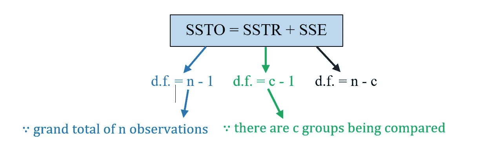
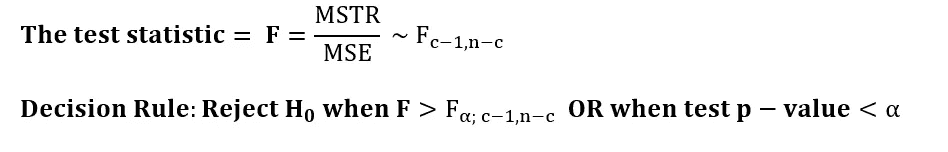
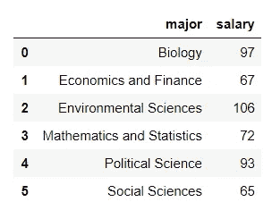
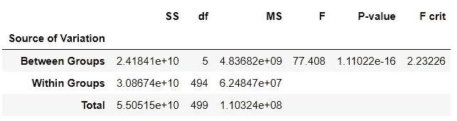
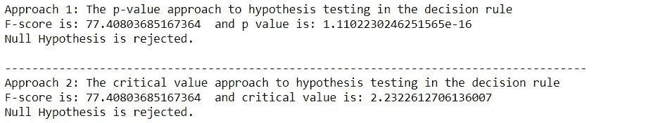

# 用 Python 进行 ANOVA 测试

> 原文：<https://towardsdatascience.com/anova-test-with-python-cfbf4013328b?source=collection_archive---------1----------------------->

## 执行 ANOVA 测试的完全初学者指南(带代码！)

照片由[乔纳森派](https://unsplash.com/@r3dmax)在 [Unsplash](https://unsplash.com/) 上拍摄

在之前的文章中，我已经讨论了如何进行[单样本假设检验](https://levelup.gitconnected.com/how-to-perform-one-sample-hypothesis-tests-with-python-308eae8789fc)和[双样本假设检验](https://levelup.gitconnected.com/two-sample-hypothesis-tests-with-python-43e1b8c52306)。那么，如果我们想比较几个人口平均数呢？在本文中，我将介绍方差分析(ANOVA ),它涉及多个未知μ的比较。

# 单向方差分析

这是一个测试，其中一个特定的因素有两个以上的群体或利益水平。例如，设μ为毕业生的真实平均年薪
单因素利益=研究对象
假设我们有 6 类研究对象，`Factor levels = athematics and Statistics, Economics and Finance, Environmental Sciences, Political Science, Social Sciences and Biology.`
因此，在影响毕业生年薪均值方面，有 6 个层次或群体的`**single factor**` 。

单向方差分析的基本思想是从每组中抽取独立的随机样本，然后计算每组的样本均值。之后，将组间样本均值的变化与组内的变化进行比较。最后，根据测试统计数据决定各组的平均值是否相等。

## 平方和

在单向 ANOVA 表中:
可变性的总量来自两个可能的来源，即:
1。各组间的差异**，称为**处理** (TR)
2。**组内的**差，称为**误差** (E)**

由于治疗( **SSTR** )的平方和以及由于误差( **SSE** )的平方和列在单因素方差分析表中。SSTR 和上证的总和等于平方和的总和( **SSTO** )。

就像 SS 一样，d.f. (SSTO) = d.f. (SSTR) + d.f .(上证)

## 均方误差(毫秒)

均方差是平方和除以其方差。这些均方差都是方差，将用于所有群体均值相等的假设检验。

## 单向方差分析假设检验的假设

*   从人群中随机选择样本数据，并随机分配给每个治疗组。因此，每个观察都是独立于任何其他观察的——随机性和独立性。
*   **常态**。假设每个抽样组中的值来自正态分布的总体。我们可以用正态概率图或者 **Q-Q 图**来检验正态性。
*   **方差齐性**。所有的 c 组方差都相等，即σ₁ = σ₂ = σ₃ = … = σ𝒸。根据经验，如果最大样本标准偏差与最小样本标准偏差的**比小于 2** ，我们认为满足等标准偏差假设。

## 单向 ANOVA 检验的简单概述:

两个以上均值的差异检验
H₀: μ₁= μ₂ = μ₃ = … = μ𝒸
H₁:并非所有的μᵢ's 都相等，其中 i = 1，2，3，…，c.
显著性水平= α

最后，单因素方差分析表如下所示:

> 假设一个 [students.csv](https://userpage.fu-berlin.de/soga/200/2010_data_sets/students.csv) 数据集包含 8239 行，每行代表一个特定的学生，还有 16 列( *stud.id、姓名、性别、年龄、身高、体重、宗教、nc.score、学期、专业、辅修、score1、score2、online.tutorial、已毕业、薪水)*，每一列对应于与该特定学生相关的一个特性。在 5%的显著性水平上，不同研究主题的毕业生的平均年薪有显著差异吗？有 6 个不同的研究主题。

## 数据探索和准备

从给定的数据集中，我们首先需要筛选出已毕业的学生，并进行随机抽样。在我们的例子中，我们将使用 Python 中的函数`random.sample`从数据集中随机抽取 500 名学生。之后，我们将我们的数据集归入两个感兴趣的变量，分类变量`major`和数值变量`salary`。

## 正态假设检验

在我们进行假设检验之前，我们检查是否满足单向 ANOVA 假设检验的假设。样本是随机和独立的样本。现在，我们通过绘制每个分组变量的正态概率图( [Q-Q 图](https://en.wikipedia.org/wiki/Q%E2%80%93Q_plot))来检验正态假设。

图 1:每个分组变量的 Q-Q 图

如果是正态分布，Q-Q 图显示的是一个很大程度上的直线模式。从上图中，我们可以假设每组的数据大致落在一条直线上。

## **方差假设的同质性检查**

最大与最小样本标准偏差之比为 1.67。这小于阈值 2。因此，我们得出结论，这些假设已经实现。

## 假设检验

按照假设检验的五步流程:
H₀: μ₁= μ₂ = μ₃ = … = μ₆
H₁:根据 f 检验统计，并非所有的薪酬均值都相等
α = 0.05
:

结论:我们有足够的证据表明，在 5%的显著性水平上，不同学科的毕业生的平均工资并不相同。

# 推荐阅读

</two-way-anova-test-with-python-a112e2396d78>  </chi-square-test-with-python-d8ba98117626>  </mcnemars-test-with-python-e1bab328d15c>  <https://levelup.gitconnected.com/how-to-perform-one-sample-hypothesis-tests-with-python-308eae8789fc>  <https://levelup.gitconnected.com/two-sample-hypothesis-tests-with-python-43e1b8c52306>  

# 参考

[1]“单因素方差分析 SOGA 地球科学系。”【在线】。可用:[https://www . geo . fu-Berlin . de/en/v/soga/Basics-of-statistics/ANOVA/One-way-ANOVA/index . html](https://www.geo.fu-berlin.de/en/v/soga/Basics-of-statistics/ANOVA/One-way-ANOVA/index.html)

[2]“单因素方差分析假设检验 SOGA 地球科学系。”【在线】。可用:[https://www . geo . fu-Berlin . de/en/v/soga/Basics-of-statistics/ANOVA/One-way-ANOVA-Hypothesis-Test/index . html](https://www.geo.fu-berlin.de/en/v/soga/Basics-of-statistics/ANOVA/One-way-ANOVA-Hypothesis-Test/index.html)