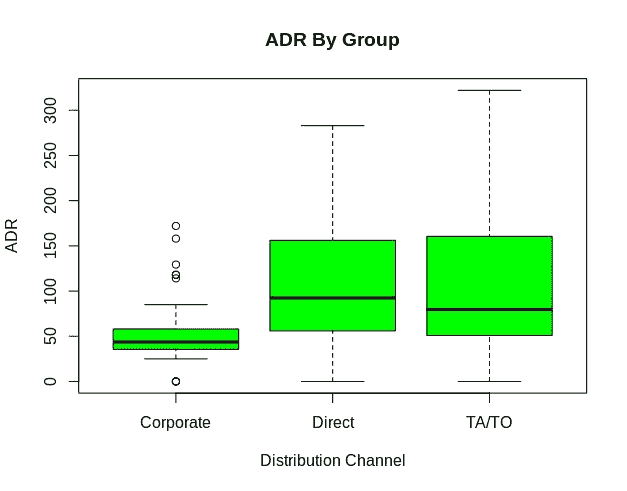

# 方差分析和 Bonferroni 校正

> 原文：<https://towardsdatascience.com/anova-vs-bonferroni-correction-c8573936a64e?source=collection_archive---------4----------------------->

## 防范 1 类错误


来源:照片由 [mohamed_hassan](https://pixabay.com/users/mohamed_hassan-5229782/) 拍摄，来自 [Pixabay](https://pixabay.com/vectors/laptop-error-web-warning-text-5906264/)

进行假设检验会带来获得 1 型或 2 型错误的风险。

*   第一类错误:拒绝一个真正的零假设
*   第二类错误:接受错误的零假设

当分析不同的组时，单向 ANOVA 可以告诉我们这些组之间是否存在统计上的显著差异。

然而，它不能告诉我们哪个群体不同于另一个群体。此外，当一次执行多个假设检验时，获得类型 1 错误的概率增加。

在统计学中，这被称为**家族错误率**，它衡量在任何特定假设检验中出现第一类错误的概率。

其计算方法如下:

> 1 — (1-α)^n
> 
> *其中:*
> 
> *α =给定假设检验的显著性水平*
> 
> *n =测试总数*

例如，如果我们使用 0.05 的显著性水平，并进行三次假设检验，则出现 1 类错误的概率增加到 14.26%，即**1-(1–0.05)= 0.1426**。

为了防止这种 1 型错误(并且同时在每组之间进行成对 t 检验)，使用 Bonferroni 校正，从而调整显著性水平以降低犯 1 型错误的概率。然而，这个测试的一个缺点是，犯第二类错误的概率也会增加。

# 酒店收入:分析分销渠道的平均每日价格

对于这个例子，让我们考虑一个酒店，该酒店已经收集了关于其每个顾客的平均每日价格的数据，即，顾客在该酒店住宿每天支付的平均价格。

酒店也有关于每个顾客的分销渠道的信息，即**公司**、**直接**和 **TA/TO** 。分析的目的是确定这三组中每一组的 ADR 均值之间的差异。原始数据来源于 Antonio、Almeida 和 Nunes (2019 年)，如下所述，从每个分销渠道随机选择 100 个样本。

## 单向方差分析

让我们从在 r 中进行单向方差分析开始。

```
> model <- aov(ADR ~ DistributionChannel, data = data)
> summary(model)
                     Df  Sum Sq Mean Sq F value   Pr(>F)    
DistributionChannel   2  236636  118318   33.33 8.76e-14 ***
Residuals           297 1054469    3550                     
---
Signif. codes:  0 ‘***’ 0.001 ‘**’ 0.01 ‘*’ 0.05 ‘.’ 0.1 ‘ ’ 1
```

分析结果时，我们可以看到 p 值非常显著，几乎为零。这意味着我们拒绝每组之间不存在显著差异的无效假设。

然而，我们可以看到 ANOVA 测试仅仅表明三个分销渠道之间存在差异，它并没有告诉我们任何关于这种差异的本质。

在进行成对 p 检验之前，这里有一个箱线图，说明三组之间的差异:



来源:RStudio 输出

从外观上看，我们可以看到直接和 TA/TO 分销渠道的平均 ADR 高于公司渠道，ADR 的离差也明显更大。

## 带 Bonferroni 校正的成对 t 检验

然而，我们希望使用带有 Bonferroni 校正的成对 t 检验对此进行更详细的分析。

```
> pairwise.t.test(data$ADR, data$DistributionChannel, p.adjust.method="bonferroni")Pairwise comparisons using t tests with pooled SDdata:  data$ADR and data$DistributionChannel Corporate Direct
Direct 4.6e-11   -     
TA/TO  2.4e-11   1P value adjustment method: bonferroni
```

当查看调整后的 p 值时，我们可以看到公司与直接、公司与 TA/TO 之间的差异非常显著，因为 p 值接近于零。鉴于 Bonferroni 校正已被用于预防 1 型错误，我们可以更有信心拒绝组间无显著差异的零假设。

也就是说，我们可以看到在直接组和 TA/TO 组之间存在 p 值 1，这意味着我们不能拒绝这两个组之间没有显著差异的零假设。

# 结论

这是对成对 t 检验的简短介绍，特别是使用 Bonferroni 校正来防止 1 型错误。您已经看到:

*   使用单向方差分析的局限性
*   如何计算家庭误差率
*   如何使用 Bonferroni 校正进行成对 t 检验并解释结果

非常感谢您的宝贵时间，非常感谢您的任何问题或反馈。

# 参考

*   [安东尼奥，阿尔梅达，努内斯(2019)。酒店预订需求数据集](https://www.sciencedirect.com/science/article/pii/S2352340918315191)
*   [统计学:如何在 R 中进行 Bonferroni 校正](https://www.statology.org/bonferroni-correction-in-r/)
*   [统计学:家族误差率是多少？](https://www.statology.org/family-wise-error-rate/)

*免责声明:本文是在“原样”的基础上编写的，没有任何担保。它旨在提供数据科学概念的概述，不应被解释为专业建议。本文中的发现和解释是作者的发现和解释，不被本文中提到的任何第三方认可或隶属于任何第三方。作者与本文提及的任何第三方无任何关系。*