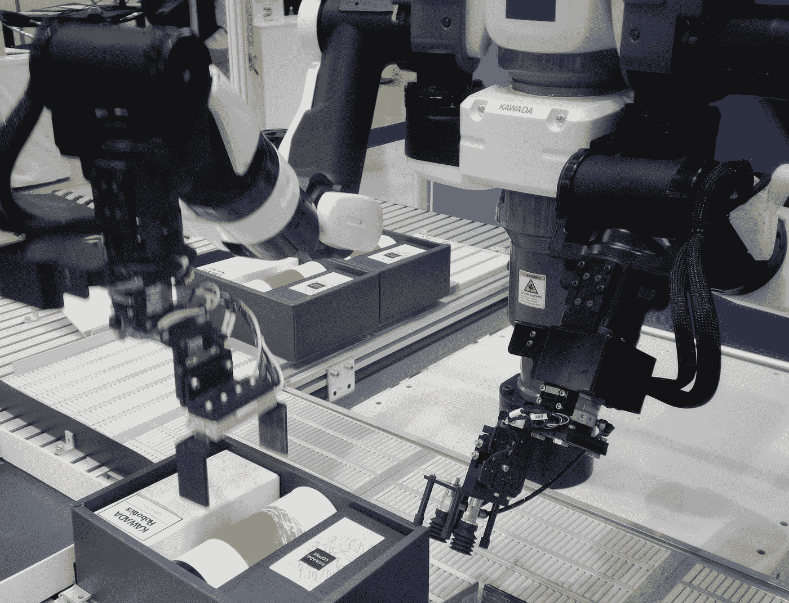

# 回答关于人工智能的 10 个最常见的问题

> 原文：<https://towardsdatascience.com/answering-10-most-commonly-asked-questions-about-artificial-intelligence-f847e63b5837?source=collection_archive---------2----------------------->

## 提供人工智能问题的解决方案，澄清误解，并讨论关于人工智能的各种概念

[附身摄影](https://unsplash.com/@possessedphotography?utm_source=medium&utm_medium=referral)在 [Unsplash](https://unsplash.com?utm_source=medium&utm_medium=referral) 上拍照

> **人工智能是我们这个世纪的主要话题之一。人工智能的能力和无限潜力引发了一些有趣的对话和辩论。**

人工智能的普及为人工智能带来了许多新的视角。从对学习人工智能越来越有热情的爱好者，到期待探索该领域的野心家，或者只是想批评它的其他人。但是，不管你躺在哪个光谱上，都有几个问题贯穿你的头脑。

在本文中，我们期待回答一些关于人工智能的最常见问题。目的是回答这两个方面，包括所有的实际问题，并澄清个人对这个问题的任何疑问。让我们简单看一下今天这篇文章中我们将试图解决的各种问题。

1.  什么是人工智能？
2.  AI 到底有多厉害？
3.  AI 会抢你们的饭碗吗？
4.  AI 能接管世界吗？
5.  AI 有哪些优点？
6.  人工智能有哪些弊端？
7.  我们离实现 AGI 还有多远？
8.  AI 有哪些应用？
9.  开始学习 AI 需要成为天才吗？
10.  如何入门 AI？

你可以随意跳到你最想得到答案的问题。但是，如果您不想错过任何特定的要点，强烈建议您阅读整篇文章。现在，让我们期待回答关于 AI 最常被问到的十个问题。

# 1.什么是人工智能？

人工智能是指开发的软件或特定模型可以独立执行复杂的任务，而不需要人类的任何帮助。人工智能更正式的定义可以表述如下:

> **“能够执行通常需要人类智能的任务的计算机系统的理论和开发，例如视觉感知、语音识别、决策和语言间的翻译。”**

人工智能是一个庞大的研究领域，由各种子领域组成，包括机器学习、深度学习、神经网络、计算机视觉、自然语言处理等等。

人工智能被认为是未来的技术，可以解决各种领域的众多问题，从机器人，医学科学，物流和运输，金融，以及工业中更多的公用事业服务。

我强烈推荐从下面提供的链接中查看下面这篇关于揭开人工智能神秘面纱的文章，以评估对该领域更高级的理解。

 [## 揭秘人工智能！

### 打破人工智能领域和它的未来。

towardsdatascience.com](/demystifying-artificial-intelligence-d2887879aaf1) 

# 2.AI 到底有多厉害？

为了回答这个问题，让我们简单地看一下人工智能的复杂历史，尤其是神经网络领域。人工智能的概念和它无限的能力在几十年前就有了。人工智能被认为是为现存问题提供解决方案的下一件大事。

随着时间的推移，人们意识到人工智能并不像想象的那么简单。执行复杂的活动几乎是不可能的，特别是在那个时期的现有技术下。

最初，人工智能并不像人们认为的那样成功，因为缺乏数据和技术资源来承受执行复杂排列和组合的能力。

然而，在我们当前的时代，我们已经得出结论，人工智能是创造一个革命性世界的潜在未来。人工智能甚至可以解决某些复杂的任务，相对而言，这些任务可能会花费人类更多的时间。

问题的简单答案—***“AI 到底有多厉害？”*** 在现代依赖于从事程序计算的研究人员的能力。开发人员的技能有助于使人工智能模型足够好，以尽快解决一个特别复杂的任务。

随着图形处理单元(GPU)的兴起，你可以帮助更快地计算人工智能模型，并开发创新的东西。就目前而言，人工智能非常强大，可以高效、有效地解决分配给它的一系列任务。然而，它还没有达到顶峰，我们离那个点还有几年的时间。

# 3.AI 会抢你们的饭碗吗？

人工智能是当今发展最快的领域。据[财富](https://fortune.com/2019/12/10/artificial-intelligence-hottest-job/#:~:text=That%20role%2C%20A.I.,past%20four%20years%2C%20LinkedIn%20said.)报道，统计数据显示，在过去的 4 年里，人工智能专家的雇佣量增长了 74%。人工智能被认为是当代人最热门的工作。

对熟练人工智能专家的需求正以前所未有的速度增长。对机器学习、深度学习、计算机视觉、统计学和自然语言处理等人工智能子领域专家的需求和空缺职位每天都在激增。

自然产生的问题是，人工智能最终会强大到有能力偷走我们所有的工作吗？

这种说 AI 未来会抢你饭碗的说法，在我看来几乎可以认为是神话。这是一个假设的场景，人工智能将取代所有人类活动，并接管现代世界的大部分任务，因为它们不容易出现人为错误，并且更有效地执行特定任务。

在工业革命时期，当机器被引进的时候，类似的事情被陈述。显然，它没有偷走工作机会。相反，它为人类控制它们的更多工作铺平了道路。人类是智慧生物。因此，人工智能将简化人类工作的复杂性，但实际上不会夺走你的工作！

# 4.AI 能接管世界吗？

菲利普·卡岑伯格在 [Unsplash](https://unsplash.com?utm_source=medium&utm_medium=referral) 上拍摄的照片

科幻(Sci-fi)电影改变了一些人对人工智能的认知。他们想象用人工智能编程的机器人将变得如此强大，以至于它们最终将摧毁它们的创造者，并摧毁整个世界，从而导致一种新的人工智能控制的物种的发展。

一个耐人寻味的故事情节，但不真实，因为它将在不久的将来真实地发生！

不可否认，人工智能已经走过了漫长的道路，并发展成为现代世界的一个独特特征。尽管人工智能取得了进步，但在工作或开发阶段，大多数任务仍然是在某种人工监督下完成的。

人工智能也仅限于被编程来完成的特定任务。一个有趣的例子是自动驾驶汽车，人工智能控制汽车，并将其驾驶到用户选择的预期目的地。然而，人工智能只限于精确地驾驶汽车，没有其他外部任务。

因此，对于科幻电影中展示的人工智能接管世界来说，我们至少还需要几十年才能实现这样的结果。但是，只是为了保持对这种猜测的好奇心，它可能最终在未来成为可能！虽然目前，这只是虚构的。

# 5.AI 有哪些优点？

由于人工智能在现代被大肆宣传，它有许多优点。

除了之前讨论过的人工智能创造的大量工作机会，它还有其他优点，例如完成人类需要执行的循环或重复任务，而没有人类容易出错的缺点。

人工智能，类似于计算机程序，不会疲劳，因此有能力整天工作在一个特定的任务上，直到达到预期的结果。

它们有能力在一系列问题上进行比人类速度更快的计算，并得到精确的结果。他们也有大量的现实生活中的应用程序，使我们的日常生活更加简单。人工智能的优点是不言自明和无限的。

# 6.人工智能有哪些弊端？

从零开始构建人工智能模型有时会非常耗时，而且会耗费大量资源。如果你正在寻求在没有 GPU 的普通计算机上开发深度学习模型，你的替代方案将是切换到云平台，因为模型的构建过程在你的 PC 上是不可持续的。

除了消耗大量的时间和资源，人工智能模型的部署在某些情况下也可能相当昂贵。此外，在特殊情况下，人工智能模型出现故障时的维护成本可能很难处理和解决。

人工智能要考虑的另一个显著缺点是缺乏使用人工一般智能来完成更高级和智能的任务。我们受限于人工狭义智能。ANI 对于执行许多任务是有益的和必要的，但是它不像 AGI 那样有效。这一点引导我们进入下一个问题。

# 7.我们离实现 AGI 还有多远？

安德鲁·乔治在 [Unsplash](https://unsplash.com?utm_source=medium&utm_medium=referral) 上的照片

人工通用智能是一个耐人寻味的概念。AGI 是指人工智能程序可以计算、评估和处理多项任务，并具有人类水平的完整性和智能。

尽管不断的研究工作和技术进步，人工通用智能领域尚未取得丰硕成果。关于这个概念的实验和研究正在不断地被评估，希望在不久的将来会有更好的结果。

根据专家的说法，人工智能尚未成为可能和实现的主要原因是因为复制人脑几乎是不可能的。

虽然神经网络在执行分配给它们的特定复杂任务方面表现出色，但不幸的是，它们不能代替人脑。

# 8.AI 有哪些应用？

自然界中的人工智能有着广泛的应用。这些包括你从一天开始到一天结束的旅程。当你通常用智能手机开始一天的工作时，你可以利用智能面锁的人工智能功能或其他指纹人工智能措施来解锁你的手机。

然后你决定用谷歌搜索一些东西，你会看到自动完成和自动更正的人工智能特性，它利用了序列到序列建模的技术。除了智能手机，人工智能还有大量其他应用，包括垃圾邮件检测、聊天机器人、对象字符识别等等。

人工智能还在许多其他领域得到应用，例如机器人、医学、物流和运输、金融以及工业中更多的公用事业服务。

要查看数据科学和人工智能的十个令人敬畏的现实世界应用，我强烈建议通过以下链接查看我以前的一篇文章。

 [## 数据科学和人工智能的 10 个令人敬畏的现实世界应用

### 理解和分析人工智能和数据科学在现实世界中的日常使用！

towardsdatascience.com](/10-awesome-real-world-applications-of-data-science-and-ai-6fddf3f34d74) 

# 9.开始学习 AI 需要成为天才吗？

这个问题有一个简单的答案— ***“不，你没有！”***

人工智能是一个神话般的领域，包含许多壮观的子领域。如果你对以下主题提供的各种有趣的概念特别感兴趣，投资你的宝贵时间来获得人工智能主题的进一步知识是完全值得的。

虽然从头开始学习人工智能有时在开始时可能很难，但随着你投入更多时间学习大量与人工智能相关的概念，它会变得更加有趣和酷。你将接触到数学、编程、机器学习等等，这将扩大你的知识面。

即使你发现人工智能领域不适合你的特殊兴趣，只要你对人工智能的众多主题有所了解，那也完全没问题。

接触人工智能的最大好处在于，你从以下主题中获得的知识可以部分或全部用于各种软件应用和工作。

# 10.如何入门 AI？

好吧！所以到这一点，你有希望对人工智能的各种功能着迷，并且你很兴奋地寻找一个开始使用人工智能的好地方。

人工智能是一个广阔的领域。但是，不用担心！有大量有价值的资源和生产资料，你可以利用它们来产生最好的结果。你可以通过分析和研究互联网上的资料获得广阔的知识领域。

Stack overflow、Data stack exchange 和 GitHub 等网站是一些最受欢迎的网站，它们可以提供您在运行或安装程序或相应代码块时遇到的问题或错误的深入解决方案和答案。

我建议查看本文结论部分提供的第一个链接，以了解更多关于“了解更多数据科学和机器学习的 10 个最佳免费网站”的信息这应该是一个很好的起点，可以用来分析各种观点，同时从资源中获得大量知识。

我还强烈推荐阅读我的一篇文章，这篇 23 分钟的文章介绍了如何在 12 个月内掌握数据科学，包括 12 个基本步骤，每个月一个步骤。您可以通过下面提供的链接访问这篇文章。

 [## 12 个月内数据科学从初学者到专业人士的 12 个步骤！

### 每月遵循一步，到第二年年底掌握数据科学！

towardsdatascience.com](/12-steps-for-beginner-to-pro-in-data-science-in-12-months-c6f6ba01f96e) 

# 结论:

美国宇航局在 [Unsplash](https://unsplash.com?utm_source=medium&utm_medium=referral) 拍摄的照片

在这篇文章中，我们涵盖了大多数关于人工智能的常见问题，同时试图为众多人工智能主题提供可持续的信息和解决方案。我们还旨在澄清误解和讨论各种关于人工智能的概念。

读完这篇文章后，我希望所有的观众对人工智能和众多关于人工智能的话题有一个清晰的了解。获得对人工智能的现实感知，对于理解未来世界革命性的变化具有重要意义。

因此，了解复杂的细节并对人工智能的主题有所了解以避免错误的观念和其他误解是至关重要的。此外，理解人工智能并致力于在人工智能领域获得未来是一种令人欣慰的经历。这是一个崭新的领域，前面有许多新的机会和发现。

如果你对这篇文章中提到的各点有任何疑问，请在下面的评论中告诉我。我会尽快给你回复。

看看我的其他一些文章，你可能会喜欢读！

 [## 了解数据科学和机器学习更多信息的 10 个最佳免费网站！

### 分析 10 个最好的免费网站，以获得更多关于机器学习和数据科学的知识

towardsdatascience.com](/10-best-free-websites-to-learn-more-about-data-science-and-machine-learning-f2c6d7387b8d)  [## 2021 年数据科学的利与弊

### 5 个优点和 5 个缺点，以确定数据科学是否是你在 2021 年的完美职业选择，或者你是否有更好的…

towardsdatascience.com](/pros-and-cons-of-data-science-in-2021-b3c333dfa79d)  [## 作为数据科学家要避免的 11 个关键错误！

### 初学数据科学的爱好者会犯的十一个关键性错误是什么？

towardsdatascience.com](/11-crucial-mistakes-to-avoid-as-a-data-scientist-71c29aef028)  [## 当今时代的 8 项革命性人工智能技术！

### 探索和分析即将或已经对世界产生巨大影响的 8 项人工智能技术！

towardsdatascience.com](/8-revolutionary-artificial-intelligence-technologies-of-the-modern-era-f8f22a4127d0)  [## 掌握 Python 中的字典和集合！

### 通过代码和示例理解 Python 中的字典和集合的概念

towardsdatascience.com](/mastering-dictionaries-and-sets-in-python-6e30b0e2011f) 

谢谢你们坚持到最后。我希望你们喜欢阅读这篇文章。我希望你们都有美好的一天！