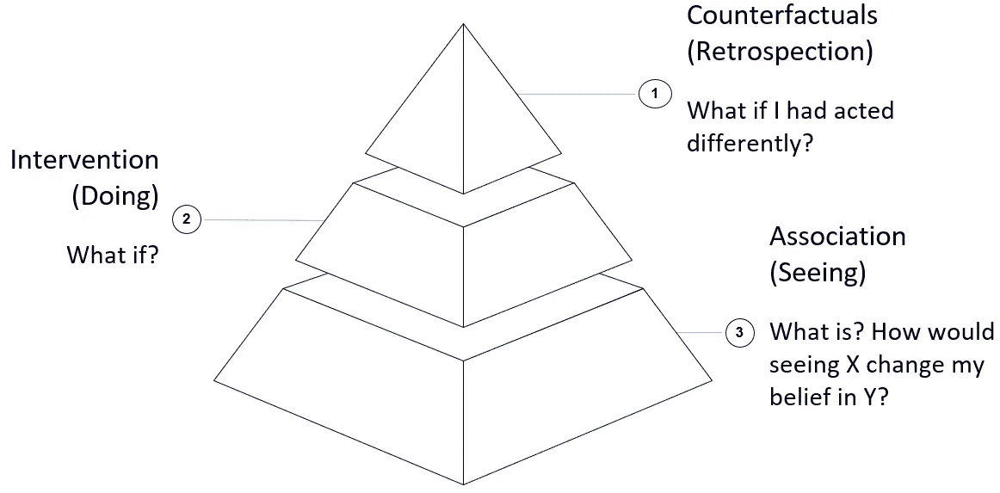
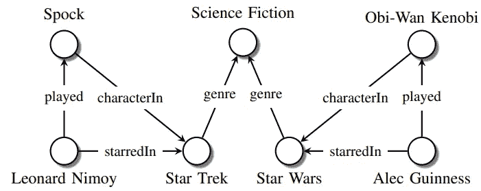
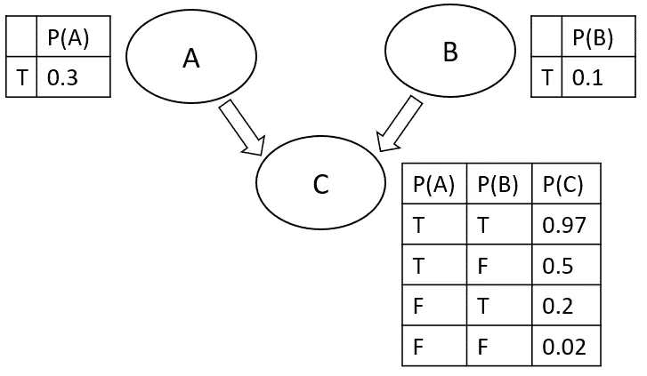
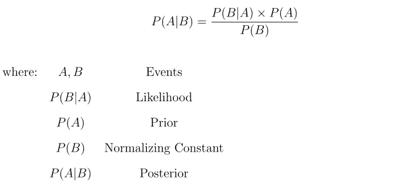
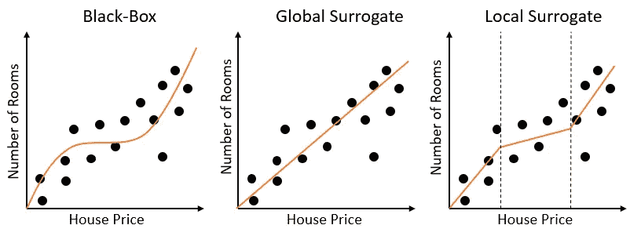

# 回答人工智能中的因果问题

> 原文：<https://towardsdatascience.com/answering-causal-questions-in-ai-87c9b53e3a72?source=collection_archive---------26----------------------->

## 介绍一些最常用的技术，这些技术可用于从数据中查询信息以进行可解释的推断。

里卡多·佩拉蒂在 [Unsplash](https://unsplash.com?utm_source=medium&utm_medium=referral) 上拍摄的照片

# 介绍

试图发现因果关系的两种主要技术是图形方法(如知识图和贝叶斯信念网络)和可解释的人工智能。这两种方法实际上构成了因果关系层次中关联层次的基础(图 1)，使我们能够回答这样的问题:什么不同的属性组成了一个实体，不同的组成部分是如何相互关联的？

如果你有兴趣了解更多关于因果关系如何在机器学习中使用的信息，更多信息可以在我以前的文章中找到:[机器学习中的因果推理](/causal-reasoning-in-machine-learning-4f2a6e32fde9)。

图 1:因果关系层级(图片由作者提供)。

# 知识图表

知识图是一种图形技术，通常用于从大量数据中简明地存储和检索相关信息。知识图目前广泛应用于从搜索引擎、电子商务网站和社交网络查询信息等应用中。在我们之前概述的推荐系统案例研究之后，知识图最近被应用于因果关系(Yikun Xian 等人。艾尔。[1])，以便生成基于因果推理的推荐。

作为一个简单的例子，让我们考虑一下，如果我们使用搜索引擎来找出伦纳德·尼莫伊是谁(在《星际迷航》中扮演斯波克的演员)，会发生什么。一旦输入我们的查询，搜索引擎将自动构建一个类似于图 2 所示的知识图，以此作为我们搜索查询的起点，然后从它开始扩展以获取任何相关信息。

图 2:简单的知识图。图片转载自[2]。

知识图最有前途的应用之一是创建能够从因果关系中学习的机器学习模型。知识图卷积网络(KGCN)，代表了这一领域的第一个成功的应用[3]。事实上，图卷积网络旨在创建知识图的矢量(嵌入式)表示，然后可以输入到机器学习模型中，以生成推理路径并为模型预测提供证据[4]。KGCN 可以潜在地用于监督或非监督任务(例如，多类分类和聚类)。

# 贝叶斯信念网络

贝叶斯信念网络是一种概率模型，它利用简化的假设来可靠地定义不同元素之间的联系，并有效地计算它们的概率关系。通过分析不同元素之间的相互作用，我们最终可以利用这些类型的模型来发现因果关系。在贝叶斯网络中，节点代表变量，而边报告不同元素之间的概率连接。图 3 给出了一个三变量贝叶斯信任网络的简单例子。

图 3:贝叶斯信念网络(图片由作者提供)。

贝叶斯信念网络，能够表达条件依赖和独立变量的联系。这些类型的网络还遵循马尔可夫条件[5](假设网络中每个节点的父节点，每个节点有条件地独立于它们的非后代节点)。最后，使用贝叶斯概率方法(等式 1)，我们能够基于新收集的证据迭代地更新连接概率。

等式 1:贝叶斯法则(图片由作者提供)。

DeepMind 等公司目前的研究重点是使用贝叶斯信念网络作为起点，以创建因果贝叶斯网络(CBN) [6]。因果贝叶斯网络现在被用于可视地识别和定量地测量数据集中的不公平模式(数据中的元素可以导致偏向特定子类别的机器学习模型)。此外，研究还证明了使用因果贝叶斯网络的可能性，以便不仅识别数据，而且识别机器学习模型本身是否偏向特定类别[7]。

# 可解释的人工智能

当今机器学习的主要权衡之一是模型性能与复杂性。事实上，与传统的线性分类器和回归技术相比，复杂的深度学习架构通常能够在各种各样的任务中表现得更好。这种权衡在 2016 年的出版物《我为什么要相信你》中有深入的分析。作者 Ribiero 等人。艾尔。[8]并引领了人工智能关注可解释性的新趋势。

复杂且更精确的模型如今被称为**黑盒**。这些类型的模型工作过程更难理解，它们不能估计每个特征的重要性以及它们之间的关系。黑盒模型的一些例子是神经网络和集成模型。

另一方面，更简单、更不精确的模型，如决策树和线性回归，反而被视为**白盒**，更容易解释。可以用来估计模型可解释性的两个主要指标是其响应函数的线性和单调性[9]。

## 模型代理人

为了使模型更容易解释，一种可能的方法是创建替代版本(近似版本)。这可以在本地或全球范围内进行。

*   **全局代理模型**:在这种情况下，我们创建原始非线性模型的线性和单调近似，它对任何可能的输入都有效。如果原始模型是高度非线性的，那么创建一个全局代理可能会导致糟糕的性能。
*   **本地代理模型**:通常在试图逼近高度非线性模型时实现。事实上，使用这种方法，我们可以将原始特征空间分成不同的线性子部分。对于这些部分中的每一个，然后可以创建线性模型等效近似(例如，使用决策树和线性模型)。局部代理模型通常也被称为局部可解释模型不可知模型(LIME)。

使用输入要素和原始模型预测(而不是地面实况标签)来训练代理模型。

在图 4 中，提供了一个简单的示例，显示了在使用标准黑盒模型或模型替代技术时，回归任务的拟合曲线可能的样子。

图 4:模型代理示例(图片由作者提供)。

为了使模型更易于解释，可以使用的一些替代方法有:特征重要性、沙普利附加解释(SHAP)、部分相关图(PDP)和基于梯度/注意力的方法。

## 人工智能中的偏差

创建[可解释的和基于因果关系的机器学习模型](/fair-and-explainable-machine-learning-25b802b00bec)的另一个重要原因是识别和防止任何可能形式的偏见(例如，对任何特定阶层的不公平歧视)。事实上，偏差可能来自训练数据集本身(例如，我们有限的数据量可能无法正确表示真实的人口分布)或模型构成(例如，我们的模型可能不合理地偏好一个类而不是其他类)。可能的偏差类型有:交互偏差、潜在偏差和选择偏差。

# 联系人

如果你想了解我最新的文章和项目[，请通过媒体](https://pierpaoloippolito28.medium.com/subscribe)关注我，并订阅我的[邮件列表](http://eepurl.com/gwO-Dr?source=post_page---------------------------)。以下是我的一些联系人详细信息:

*   [领英](https://uk.linkedin.com/in/pier-paolo-ippolito-202917146?source=post_page---------------------------)
*   [个人博客](https://pierpaolo28.github.io/blog/?source=post_page---------------------------)
*   [个人网站](https://pierpaolo28.github.io/?source=post_page---------------------------)
*   [中型型材](https://towardsdatascience.com/@pierpaoloippolito28?source=post_page---------------------------)
*   [GitHub](https://github.com/pierpaolo28?source=post_page---------------------------)
*   [卡格尔](https://www.kaggle.com/pierpaolo28?source=post_page---------------------------)

# 文献学

[1]强化知识图推理的可解释推荐，Yikun Xian 等。艾尔。访问日期:[https://arxiv.org/pdf/1906.05237.pdf](https://arxiv.org/pdf/1906.05237.pdf)2020 年 7 月。

[2]知识图的关系机器学习综述。马克西米利安·尼克尔、凯文·墨菲、沃尔克·特雷普、叶夫根尼·加布利洛维奇。访问日期:[https://arxiv.org/pdf/1503.00759.pdf](https://arxiv.org/pdf/1503.00759.pdf)2020 年 7 月。

[3] KGCNs:用 TensorFlow 对知识图进行机器学习。詹姆斯·弗莱彻，格拉克实验室的。已访问:[https://blog . grakn . ai/kg cns-machine-learning-over-knowledge-graphs-with-tensor flow-a1d 3328 b 8 f 02](https://blog.grakn.ai/kgcns-machine-learning-over-knowledge-graphs-with-tensorflow-a1d3328b8f02)2020 年 7 月。

[4]知识图和因果关系。Gianmario Spacagna，实用数据科学学院。已访问:[https://datasciencevademecum . com/2019/12/19/knowledge-graphs-and-causality/](https://datasciencevademecum.com/2019/12/19/knowledge-graphs-and-causality/)2020 年 7 月。

[5]因果推理导论。彼得·斯皮尔特斯，卡内基梅隆大学哲学系。已访问:[http://www . jmlr . org/papers/volume 11/spirtes 10a/spirtes 10a . pdf](http://www.jmlr.org/papers/volume11/spirtes10a/spirtes10a.pdf)2020 年 7 月。

[6]因果贝叶斯网络:一种支持更公平机器学习的灵活工具。西尔维亚·基亚帕和威廉·艾萨克。访问日期:[https://deepmind.com/blog/article/Causal_Bayesian_Networks](https://deepmind.com/blog/article/Causal_Bayesian_Networks)2020 年 7 月。

[7]路径特定的反事实公平。西尔维亚·基亚帕和托马斯·p·s·吉拉姆。访问日期:[https://arxiv.org/pdf/1802.08139.pdf](https://arxiv.org/pdf/1802.08139.pdf)2020 年 7 月。

[8]“我为什么要相信你？”解释任何分类器的预测。马尔科·图利奥·里贝罗，华盛顿大学。艾尔。访问:【https://arxiv.org/pdf/1602.04938.pdf】T22020 年 7 月。

[9]黑盒与白盒模型。Lars Hulstaert，走向数据科学。已访问:[https://towards data science . com/machine-learning-interprebility-techniques-662 c 723454 F3](/machine-learning-interpretability-techniques-662c723454f3)2020 年 7 月。