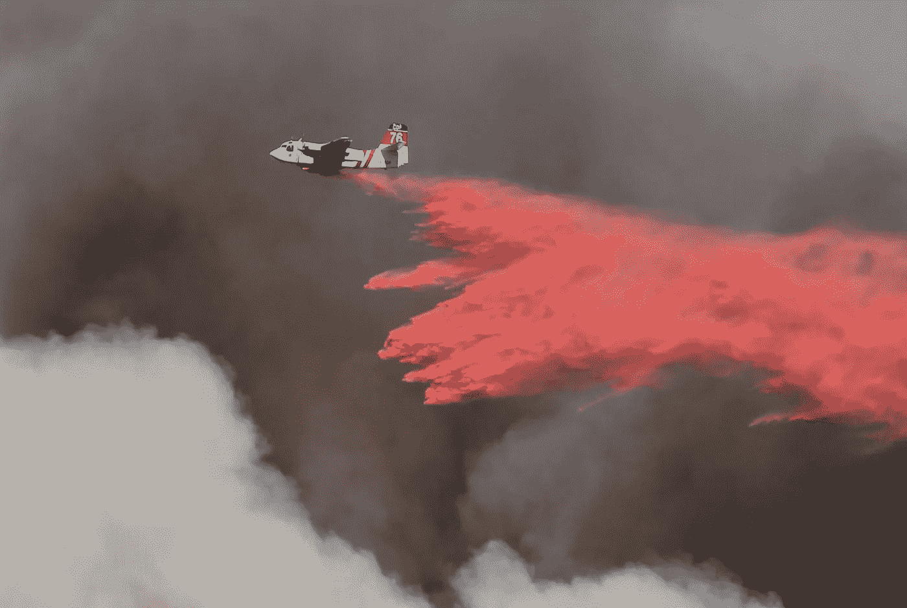
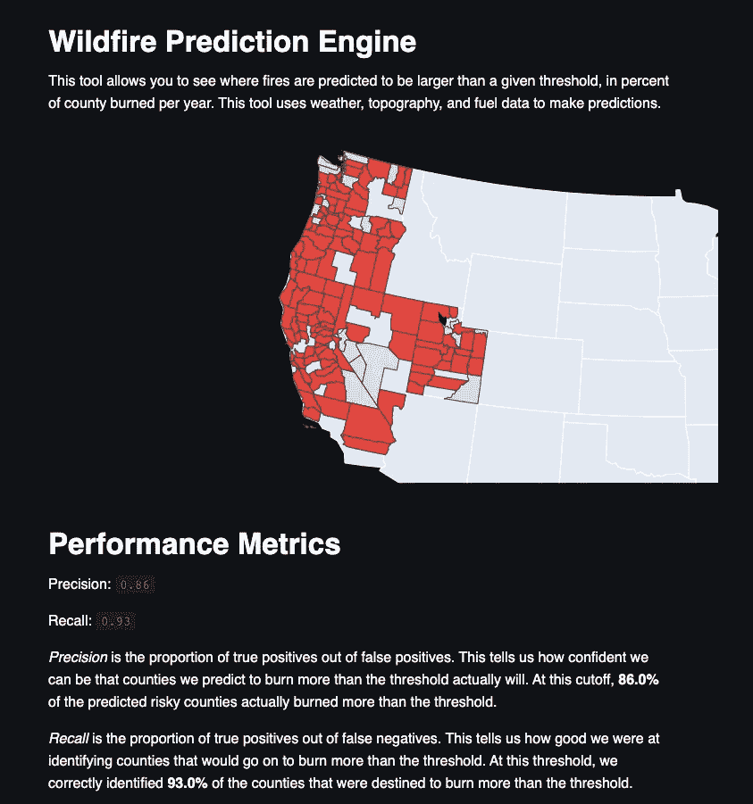

# 用机器学习工具预测野火

> 原文：<https://towardsdatascience.com/anticipating-wildfires-with-machine-learning-tools-5eb43b450d36?source=collection_archive---------45----------------------->

[本阔](https://unsplash.com/@benkuo?utm_source=unsplash&utm_medium=referral&utm_content=creditCopyText)在 [Unsplash](https://unsplash.com/s/photos/wildfire?utm_source=unsplash&utm_medium=referral&utm_content=creditCopyText) 上拍照

## 使用数据发现理想的野火抑制资源布局

从我的中学科学教室的窗户望出去，似乎地狱已经来到了科罗拉多州博尔德的郊区。烟雾几乎遮住了太阳，直升机和低空飞行的飞机来回嗡嗡作响，为四英里峡谷大火运送水和阻燃剂，这打乱了教学计划。这场大火将会烧毁 6181 英亩土地，摧毁 168 所房屋，并造成[大约 2 . 17 亿美元的财产损失。](https://en.wikipedia.org/wiki/Fourmile_Canyon#2010_wildfire)

不幸的是，那场火灾如今远非异常。2020 年，美国西部的野火造成了高达 130 亿美元的财产损失，更不用说失去的生命和无数被迫重建的家庭的心痛。

野火不是不可阻挡的力量——是人类的努力阻止了四英里峡谷大火，以及其他许多威胁到我们社区的火灾。灭火最重要的工具之一是了解最危险的区域在哪里，这样我们就可以预先部署消防资源以尽快到达。

在 Metis 提供的[数据科学训练营之后，我受到启发，创建了一个分类工具，可以帮助人类更好地部署消防资源。我想用我的技能来解决这个多年来一直是我生活一部分的问题。](https://www.thisismetis.com/bootcamps/online-data-science-bootcamp)

## 科学背景

为了理解这个问题，我们不得不转向研究野火地理分布的领域。当我去大学获得环境科学学位时，我学到了这个领域的基础知识，当谈到理解火灾风险时，有三个主要的考虑因素:燃料、气候和地形。

燃料是一个非常明显的例子。在有大量枯木燃烧的地区，火灾更有可能发生，并且可能比其他地区发展得更快。

气候也很晴朗。在湿度低于正常水平或温度高于正常水平的地区，火灾发生的可能性更大，强度也更大。

地形是一个更有趣的变量。上坡时，火灾往往蔓延得更快，在丘陵地区灭火也更困难，这意味着这里的火灾比平坦、更容易到达的地区风险更高。

我想为所有这些特征建立代理，这样我就可以在估计火灾风险时将它们考虑在内。

## 方法

我在 [Kaggle](https://www.kaggle.com/rtatman/188-million-us-wildfires) 上找到了一个包含 188 万起地理参照的美国野火的数据集。这将作为我的目标功能。当然，这需要大量的重新格式化，因为它没有提供任何一个*没有发生过野火的县的数据，只有现有野火的记录。此外，东部各州的数据有限，迫使我将分析范围缩小到美国西部。我使用 SQLite 导入了这些数据。*

至于我的预测器特性，我从多个来源检索数据。我能够从 [NOAA](https://www.ncdc.noaa.gov/cag/county/mapping) 收集气候数据，从 [USDA](https://www.ers.usda.gov/data-products/natural-amenities-scale.aspx) 收集地形数据，从[美国林务局](https://apps.fs.usda.gov/fia/datamart/)收集燃料数据。将这些联系在一起后，我对我在美国西部研究的变量有了一个很好的了解。

我在迭代过程中使用了各种模型，但是我发现的最强大的模型是 scikit-learn 包中的 Extra Trees 分类器。该算法是随机森林的一种变体，旨在通过随机改变每个决策树中每个节点的截止点来进一步减少方差。关于额外树算法的更多信息，我推荐[这篇文章](/an-intuitive-explanation-of-random-forest-and-extra-trees-classifiers-8507ac21d54b)。

我希望构建的这个分类器工具最重要的一个方面是它的灵活性。我希望用户能够提高或降低阈值，当它来到什么样的火灾规模，他们想查明。这是因为不同的灭火工具有不同的可用性，因此最适合不同的严重程度。在部署消防队时，检查所有预计会发生的小型、中型和大型火灾是有意义的。然而，当分配更大、更昂贵的资源，如飞机和直升机时，用户应该能够将结果缩小到更小、更严重的火灾范围。

因此，我需要内置一个动态工具来防止*阶级失衡*。当用户仅寻找最大的火灾时，这些火灾可能仅包括模型被训练的观察总数的百分之几。为了保持性能，我需要确保有足够的来自正面类的例子供模型使用。通过在模型的每次预测运行期间检查不平衡，我能够保持比在查看非常大的火灾时更高的性能。

一旦我确信已经充分调优了我的模型的超参数，并在不同的截止点进行了测试，我就继续进行部署。我希望这个工具对理论用户有用，所以我决定使用 Streamlit 在线托管它。

Streamlit 是一个伟大而简单的工具，允许在 web 浏览器上托管 python 代码。我强烈推荐它给那些想轻松部署模型的人。如果你想找到更多关于如何实现简化部署的信息，我推荐[他们的优秀指南](https://streamlit.io/)。

## 结果

这里我们可以看到一个已部署工具的示例。用户可以选择在即将到来的火灾季节预计燃烧的县的给定百分比的分界点，然后查看预计达到或超过该阈值的红色县的结果。

下面，度量向用户显示了工具的准确度和精确度。精确度从 0.88 到 0.83 不等，而回忆变化更大，从 0.93 到 0.29 不等。度量标准取决于用户选择的截止点。随着阈值火大小的增加，精确度提高，回忆变差。

## 结论

这个工具超出了我的预期，当与基本的气候和地形测量结合使用时，一个有很多洞和间隙的静态数据集可以完成什么。当涉及到火灾范围和严重程度时，我很想看看这个模型如何处理更细粒度的空间信息和更多的数据。

如果你想看看这个项目的精髓，就去我的 [GitHub](https://github.com/pjn51/modeling-wildfire-risk) 吧，在那里你可以看到这个项目道路上的每一个弯道。感谢您的阅读，我希望您离开时能对自然的力量有一个新的认识，以及我们使用这些工具理解它的能力。