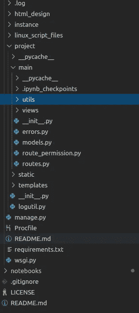

# 任何人都可以使用机器学习构建生产就绪的 SaaS 应用程序|将 ML 带入生活

> 原文：<https://towardsdatascience.com/anyone-can-build-production-ready-saas-application-with-machine-learning-bring-ml-to-life-af04efec1d37?source=collection_archive---------17----------------------->

## 使用所有必要的工具和框架，通过机器学习构建您的 SaaS 应用程序。这比你想象的要容易！

在我的职业生涯中，我构建了不同的软件即服务(SaaS)应用程序。我最近的一个 SaaS 产品是 [**社交形象 AI**](https://socialimageai.com) 。作为 [**#buildinpublic**](https://twitter.com/hashtag/buildinpublic?src=hashtag_click) 的一部分，我想向 case 展示我用于该产品的技术堆栈。它是各种技术栈的组合，包括机器学习。在我的不同产品中多次尝试后，我想出了这个堆栈。在这篇文章中，我将谈论我所使用的技术堆栈。所以这可以帮助你创造你的产品。

从 socialimageai.com 创建的图像

你从哪里开始？这是你以前没有做过任何产品时通常会遇到的第一个问题。最近无代码平台的激增正在改变整个格局。然而，在尝试了不同的无代码产品后，我觉得没有一个能满足我的所有需求，而且它也没有市场上销售的那么灵活。

当然，在你生产任何产品之前，你需要对你计划生产的产品有一个概念。我将带你通过人工智能的社会形象镜头。下面是开发 web 应用程序的不同部分。

1.  前端
2.  前端部署
3.  后端
4.  后端部署
5.  支付网关
6.  证明
7.  模型培训/调整包
8.  模型部署
9.  将模型结果集成到应用程序中

## 这可能看起来很多。但是大部分都是非常标准的建筑。我将一个一个地走过它。

## 前端(反应)

作为 python 的拥护者，我尝试过不同的前端框架，比如 Flask、HTML、PHP、Django 等。毫无疑问，reactjs 是最好的。作为一名 ML 工程师，你可能会想多学一门语言？因为您精通 python，所以您希望用 python 构建所有东西，并使用像 Django 或 Flask 这样的框架。但是这些框架只在一定程度上适用于 web 应用程序。

React 前端文件夹结构

react 的一个相当大的优势是社区的力量。许多非代码平台可以使用 react 为内部页面创建不同的组件，并将它们包含在您的应用程序中。此外，大量不同的模板可用于启动您的前端。所以不需要从头开始。

## 前端部署

一个常见的问题是如何部署。但在我看来，最具挑战性的问题是如何使用 CI/CD 以更便宜的方式部署它。您可能想要可扩展的服务和最少的停机时间。

在尝试了 render、Heroku 和其他服务之后，我觉得托管您的应用程序的最佳和最简单的方式是通过 AWS Amplify。是的，使用 AWS 可能有点奇怪，这项服务已经存在一段时间了。但是用 AWS amplify 部署一个网站实在是太容易了。

AWS 放大器

尤其是有了 react，vuejs，gatsby，或者任何其他主要的 java script 应用都可以轻松托管。一些优点是

1.  轻松添加免费 SSL 证书
2.  内置 CI/CD 管道。从您的代码库中推送
3.  添加开发分支
4.  创建拉式请求

最好的是，它是无服务器的，定价几乎等于静态网站托管。因此，今天就为您的 SaaS 应用程序试用 aws amplify 吧。

## 后端

如果您从事过任何机器学习(ML)应用程序，您可能会对 python 很熟悉。当您为服务器端选择 python 时，您有一些优势。您可以高效地为您的 ML 应用程序执行任何数据转换。此外，你有一些选择

1.  无服务器
    - AWS 圣杯
    -使用 Lambda 的无服务器
2.  服务器
    -烧瓶
    - Django
    - FastAPI

一旦为服务器端应用选择了 python，就需要决定是使用 FastAPI 还是 Flask。FastAPI 是一个快速发展的框架，有很多好处。不过 Flask 还是比较成熟的，有了合适的文件夹结构就可以轻松维护。如何构建 Flask 应用程序也很重要。您可以将所有的密钥和配置分组到一个文件中，以便于更新。

烧瓶文件夹结构

## 后端部署

与前端类似，我们需要在可伸缩的环境中部署后端。说到后端，有很多选择。

1.  使用 Lambda 的无服务器部署
2.  AWS 弹性豆茎展开
3.  渲染或 Heroku 部署

当然，无服务器的优势在于维护成本低，服务器成本低。然而，在大多数情况下，对于一个应用程序，我们可能需要一个服务器；否则，它需要一些时间来设置通过无服务器。

Elastic beanstalk 可用于以可伸缩的方式部署您的应用程序。所有你需要的是一个配置文件，并做 eb 初始化。该命令将引导您完成要执行的步骤。使用 beanstalk 的一个优点和缺点是使用负载平衡器。这是增加成本的一个原因，但它可以防止或处理应用程序中任何看不见的峰值。我们可以在没有负载均衡器的情况下使用它，然后我们就错过了免费证书的好处，并涉及到其他配置。

弹性豆茎的另一种方法是使用 EC2 或 AWS Lightsail 机器并执行您的配置。这里我们需要一个 apache web 服务器，并使用 LetsEncrypt 创建一个证书。配置并不庞大；然而，它涉及一些设置工作。

Render 或 Heroku 选项托管 flask 应用程序更便宜。它还提供免费的 SSL 证书。然而，如果您的整个堆栈是 AWS 或任何云提供商，我会建议使用相同的提供商来减少一些延迟。

## 支付网关

我们中的许多人需要一个支付网关，我们中的大多数人都知道 stripe。Stripe 是您可以使用的最佳支付网关。直接用条纹的话便宜。最重要的是，当您没有任何身份验证时，它更容易集成。如果你有多个计划，就有点复杂了。

条带订阅

几个服务包装了 stripe，并提供了一个极其简单的集成选项，如 [Gumroad](https://gumroad.com/signup?referrer=shyambv) ，或者查看[这篇文章](https://baremetrics.com/blog/saas-billing)了解更多细节。

## 证明

如果你想开发一个带有不同支付选项的简化登录选项的产品，认证曾经是一个很大的难题。然而，最近有大量的服务简化了这种方法。使用 AWS Amplify 的一个好处是，您可以通过一行命令行为托管 UI 添加身份验证。

添加身份验证

当你使用 AWS Amplify 时，它会在后台使用 AWS Cognito 服务。不过来自 AWS 的登录设计并不是很棒。所以我们可能需要为我们的应用程序定制它。如果是 react 前端，我们需要更新 react 代码。社交图像 AI 在后端使用 Cognito 使用基于 react 的登录屏幕。如果你是新手，Cognito 几乎是免费的(高达 50k MAUs)。其他选项有使用 okta、Firebase Auth、Auth0 等。大多数认证服务将满足基本需求。由于通过 amplify 添加 Cognito 更加简单，我们将使用它作为身份验证提供者。

**模型训练/调谐包**

模型可能是应用程序的大脑。通常你需要训练或者微调一个模型。最近几天，大多数模特都不是从零开始训练的。微调的话，我一般更倾向于 AWS sagemaker 笔记本，导入之前的 NLP/vision 模型。我是 PyTorch 的忠实粉丝，所以我的大部分模特都在 PyTorch。

假设您要微调一个 BERT 模型。以下是清单

1.  你有数据集可以微调吗？
2.  数据集是否足够大，可以进行微调？
3.  可以下载预先训练好的 BERT 模型吗？
4.  你能创建微调代码和转换吗？
5.  你能成功地微调模型吗？

如果你需要一些微调方面的帮助，请查看文章。

**车型部署**

你不可能拥有一个没有连接的大脑。在这一部分，大脑与身体相连。在本节中，我们将部署模型。同样，sagemaker 是部署模型的可伸缩方式。下面是部署的清单

1.  你对模特的表现满意吗？
2.  模型有多大？
3.  模型的可接受延迟是多少？
4.  推理需要 GPU 的吗？
5.  您希望模型作为端点还是批处理？
6.  如何在应用程序中使用模型？
7.  你有多种型号吗？
8.  如果有多个模型，如何在单个服务器上部署它们？

有时，根据型号的不同，这些步骤可能需要很长时间。由于重试次数不同。这里有一篇文章展示了如何在 AWS sagemaker 中[部署一个模型。](/24x5-stock-trading-agent-to-predict-stock-prices-with-deep-learning-with-deployment-c15570720ae9)

多模式部署

如果模型训练代码是按照 sagemaker 函数构建的，那么部署它将会更容易。否则，需要创建模型部署结构，然后进行部署。

**将模型结果整合到应用中**

如果您的服务器端是 python 框架(FastAPI 或 Flask)，并且在 AWS 中，调用该模型可能很容易。下面是一个调用总结模型的示例代码。

正在获取 Sagemaker 数据

如果模型会被 Python 之外的人消费，那么最好集成 API gateway 和 lambda 函数。作为第一步，您将在 lambda 函数中编写类似的代码，然后将从 API 网关调用 lambda 函数。

**下一步是什么？**

现在想想你的想法，开始创造你的产品。如果你想详细了解，请订阅以下书籍/教程。

从教程中学习—从 socialimageai.com 创建

> 目前我正在写一本书和视频教程，里面有从头开始创建 SaaS 产品所需的所有代码。它将引导您通过机器学习来构建产品的构建模块。如果你有兴趣，请点击 [**订阅此处**](https://gumroad.com/shyambv/follow) 获取相关通知。

# 获取代码

*请订阅我的* [***简讯***](https://makemoneywithcode.substack.com/welcome) *获取我的文章和其他更新的免费工作代码。*