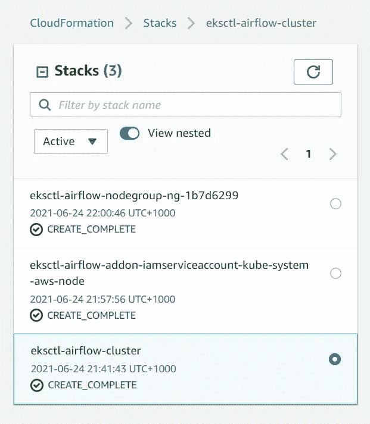

# 服用类固醇的阿帕奇气流 2.0——EKS·库伯内特和 MWAA

> 原文：<https://towardsdatascience.com/apache-airflow-2-0-on-steroids-eks-kubernetes-mwaa-ec341d52fe2d?source=collection_archive---------13----------------------->

## 这篇文章将告诉我们如何在 EKS 自动气象站上运行气流 2.0，以及它在新 MWAA 上的好处。它还将把它与原生的 Kubernetes executor 联系起来，并告诉我们它与它有什么不同，类似的还有 Fargate vs EKS 的节点管理 EC2。

上个月，2021 年 5 月，AWS 发布了针对 Apache Airflow (MWAA)的 AWS 托管工作流的更新，其中包括 Airflow 2.0，这让我想到，当 AWS 以最新的稳定版本提供托管服务，价格并不昂贵，更不用说我们可以从 AWS 获得的支持(以前 MWAA 有一个旧的 Airflow 版本，不支持云形成)时，为什么现在有人要自己管理 Airflow(典型的云困境)。但我担心自己处于尚未经过实战检验的技术的前沿。另一方面，AWS 几个月前发布了一个关于 EKS 气流的版本，我们都知道 K8s 的可扩展性，所以我想尝试一下。我将站在技术的前沿，但至少它不会是一个黑匣子。

假设我们都知道 Kubernetes 的组成部分以及什么是舵轮图，我将这篇文章分成两个子主题，即:

1.  在 EKS 和 MWAA 部署 air flow 2.0 &
2.  添加 Dag、变量、插件、连接等


来源:pixabay

# 在 EKS 和 MWAA 部署 Airflow 2.0

简言之，K8s 中的节点组可以使用 AWS Fargate 或节点管理的 EC2 来创建。两者都可以横向扩展，但主要区别是，Fargate AWS 将管理工作节点扩展及其 AMI 配置，而在节点管理中，我们必须同时做这两件事，但它的好处是相当可观的。由于 Fargate 不支持 daemonsets，使用受管节点组，我们不必将 Dynatrace、Splunk 或 Datadog 等监控服务的代理放在 sidecar 容器中，因此更加可靠。此外，Fargate 不缓存容器图像，因此启动时间会更长。根据我的经验，Fargate 更适合基于气流的工作流，其中大多数是批处理，而节点管理更适合与流相关的模式。

## 先决条件

*   在您的角色需要访问的地方，设置了一个基于 Linux 的环境。我正在使用 Ubuntu windows 应用程序。

## 创建集群

在创建集群之前，我们需要安装 kubectl 和 eksctl。eksctl 将创建和管理集群，而 kubectl 将与集群 API 服务器通信，以检索所需的节点、pod 和名称空间。幸运的是，二进制文件对他们两个都是可用的。

```
curl -o kubectl [https://amazon-eks.s3.us-west-2.amazonaws.com/1.20.4/2021-04-12/bin/linux/amd64/kubectl](https://amazon-eks.s3.us-west-2.amazonaws.com/1.20.4/2021-04-12/bin/linux/amd64/kubectl)chmod +x ./kubectlmkdir -p $HOME/bin && cp ./kubectl $HOME/bin/kubectl && export PATH=$PATH:$HOME/bin
```

对于 eksctl 来说，

```
curl — silent — location “[https://github.com/weaveworks/eksctl/releases/latest/download/eksctl_$(uname](https://github.com/weaveworks/eksctl/releases/latest/download/eksctl_$(uname) -s)_amd64.tar.gz” | tar xz -C /tmpsudo mv /tmp/eksctl /usr/local/bin
```

现在让我们使用 Fargate 创建一个 k8 集群，命令如下。这大约需要 15–20 分钟，用户可以查看有关将要创建的资源(Vpc、子网等)的云信息。

```
eksctl create cluster \
 — name test-cluster \
 — region ap-southeast-2 \
 — fargate
```

它会显示如下内容:

*…
【】EKS 集群* `*ap-southeast-2*` *【地区】中的“测试集群”准备就绪*

接下来，让我们创建一个节点管理的集群，区别就在这里。我们需要首先在本地创建将在 EC2 连接中使用的 pub 私有密钥对。

```
aws ec2 create-key-pair — region us-west-2 — key-name myKeyPaireksctl create cluster \
 — name eksctl-airflow-cluster \
 — region ap-southeast-2 \
 — with-oidc \
 — ssh-access \
 — ssh-public-key <your-key> \
 — managed
```

您可以在 CFN 中查看有关创建的节点组的信息。



作者图片

通过运行以下命令，我们可以确认安装，它应该会显示群集中存在的节点:

```
kubectl get nodes -o wide
```

接下来，我们需要更新 kubeconfig，以便无论何时运行 kubectl，它都应该指向正确的集群。

```
aws eks — region ap-southeast-2 update-kubeconfig — name eksctl-airflow-cluster
```

接下来，创建名称空间，以便我们可以在其中部署气流。它只是一种抽象，将相关资源保存在一个地方，就像一个堆栈一样。一个集群可以有许多可以相互通信的名称空间。

```
kubectl create namespace airflow
```

在命名空间中创建气流之前，我们需要安装 helm

```
$ curl -fsSL -o get_helm.sh https://raw.githubusercontent.com/helm/helm/master/scripts/get-helm-3
$ chmod 700 get_helm.sh
$ ./get_helm.sh
```

下面将创建气流资源，完成后你可以在 localhost:8080 查看。我们可以给任何你想要的版本名。

```
helm repo add airflow-stable [https://airflow-helm.github.io/charts](https://airflow-helm.github.io/charts)
helm repo updatehelm install RELEASE_NAME airflow-stable/airflow 
 — namespace airflow \
 — version 8.3.0
```

你可以在 https://github.com/airflow-helm/charts/releases 找到对应于最新气流发布的其他图表版本。

在检查 GUI 之前，我们需要使用以下命令将 8080 端口从 pod 转发到本地主机:

```
export POD_NAME=$(kubectl get pods — namespace NAMESPACE -l “component=web,app=airflow” -o jsonpath=”{.items[0].metadata.name}”)
kubectl port-forward — namespace NAMESPACE $POD_NAME 8080:8080
```

# 添加 Dag、变量、插件、连接等

现在有趣的部分来了，舵图给出了 values.yml，其中提到了所有气流配置、变量、dagbag 文件夹等，这有助于更新实际气流。因此，现在剩下的唯一事情就是给它所需的值，并使用下面的命令进行更新:

```
helm upgrade airflow airflow-stable/airflow — namespace airflow — version 8.3.0 — values values.yml — debug
```

下面是 values.yml 的一部分，我们可以在其中指定需要安装的 python 模块

```
airflow:
    extraPipPackages: 
        — “pandas”
        — “awscli”
```

类似地，下面是 values.yml 的一部分，其中指定了我们在部署 efs 后获得的持久卷和声明。

```
airflow:
    extraVolumeMounts:
        — name: airflow-efs-dag
          mountPath: /opt/efs/

    extraVolumes:
        — name: airflow-efs-dag
          persistentVolumeClaim:
              claimName: efs-storage-claim
```

下面是它的大袋子:

```
dags:
    path: /opt/efs/dags
```

有趣的是， **MWAA** 也有类似的设置，它要求我们在云信息模板中提及所有这些细节。为了添加一个气流变量，MWAA 使用了环境变量，为了更新 env，我们需要在 CFN 中提到它。由于 AWS SSM 是 MWAA 的后端，我们可以指定包含 conn_string 的连接的键名，MWAA 将使用键名选择它并将其部署在 Airflow 中。至于 DAG、插件文件夹和 requirements.txt，我们需要给它一个 s3 文件夹，但问题是它们都应该在同一个桶中。对任何刚开始的人来说都不是瓶颈。MWAA 在后端使用 RDS 或 Aurora，但它不会让用户随意摆弄。它只使用芹菜执行器，并根据不同的机器类型提供三种类型的集群。总之，它只能支持 1000 个 Dag 运行。因此，MWAA 对中小企业有利，但对大公司不利。在撰写本文时，使用 MWAA 的一个缺点是，即使您通过 CFN 更新气流变量，调度程序也会在部署时停止，并需要大约 10-20 分钟才能运行。因此，需要考虑一个适当的发布策略，即每当有新的构建要部署时，不运行或运行较少的 Dag。EKS 也需要几分钟来完成头盔升级，但这比 MWAA 更透明，因为它提供了日志。

此外，对于 EKS，我们需要自己集成 EFS 和 RDS，这应该不是什么大问题，然后任何 CICD 都可以将更新的 Dag 从代码库推送到 EFS。

气流舵的 values . yml:[https://github . com/air flow-helm/charts/blob/main/charts/air flow/values . YAML](https://github.com/airflow-helm/charts/blob/main/charts/airflow/values.yaml)

## **EKS &库伯内特的遗嘱执行人**

在 Airflow 中使用 k8 executor 时，每个任务都在 pod 上运行，而 airflow 可以在单独的机器上运行。然而，在 EKS，airflow 的所有部分，即 airflow db、调度程序等都在单独的 pod 中运行，因此具有更高的 HA 和可靠性。

# 结论

如果您已经完成了，那么恭喜您，您已经学会了如何使用 fargate 和节点管理 ec2 在 EKS 上部署 Airflow 2.0。我们还学习了如何定制 values.yml，它将具有气流配置和其他规定，如指定变量、连接等。在我看来，一切都将在不久的将来成为 kubernetes，我们拥有将存储与计算分离的优势，可以随时利用潜在的无限量计算。这完全取决于您在理解和实现数据工程前景的旅程中处于哪个阶段。