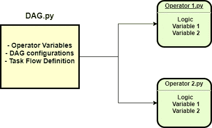
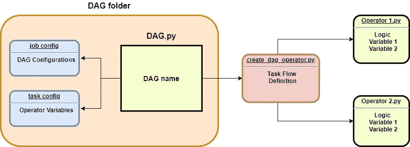
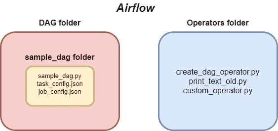

# Apache air flow——编写 Dag 的新方法

> 原文：<https://towardsdatascience.com/apache-airflow-a-new-way-to-write-dags-240a93c52e1a?source=collection_archive---------16----------------------->

## 扩展数据管道的 ETL 框架

作者图片

问候数据从业者。
**现在是 2021 年，数据工程是新的数据科学。**
在数据工程领域花费的时间和投资
都有所增加。

您有多少次构建模型或执行分析时才意识到您使用的数据有问题？—如果你已经在这个行业工作了一段时间，这种情况会很常见。

为了消除我们的疑虑，我们经常需要咨询数据工程师来验证我们数据的完整性。如果我们自己是数据工程师，我们将不得不钻研**数据管道**来理解我们数据的 ETL。

随着数据行业的成熟，数据管道和基础设施越来越受到重视。这就是今天文章的内容。

# 阿帕奇气流

</data-engineering-how-to-build-a-gmail-data-pipeline-on-apache-airflow-ce2cfd1f9282>  

**Apache Airflow** 是我们用来管理数据管道的最流行的工作流管理系统之一。crontabs 被用作管道调度程序的时代已经一去不复返了。

Apache Airflow 是批处理管道的最佳解决方案之一。如果您的公司非常重视数据，那么采用气流可以为未来的项目带来巨大的好处。像**脸书**和 **Airbnb** 这样的科技巨头在他们的日常数据任务中使用 Apache Airflow。

# 先决条件

这是一篇关于在 Apache Airflow 上构建框架的文章。
因此，我们假设你已经了解气流的基本概念，比如——

*   熟练的技艺
*   经营者

如果你不熟悉，可以通读一下我做的关于 Apache 气流基础的综合指南。

</data-engineering-basics-of-apache-airflow-build-your-first-pipeline-eefecb7f1bb9>  

不言而喻，你了解基本的 **Python** 。

gif 作者[reactiongifs.com](http://www.reactiongifs.com/nicolas-cage-you-dont-say/)

# 框架

凯利·西克玛在 [Unsplash](https://unsplash.com?utm_source=medium&utm_medium=referral) 上拍摄的照片

首先，你可能会问— **为什么我们甚至需要一个框架？**

有了框架，我们就可以建立结构更好的管道。**更容易维护**和**刻度**。更不用说它还符合**业务规则**和**编程惯例**。

当你开始拥有大量的管道时，框架**可以节省你部署管道的时间**，让你可以集中精力为管道开发代码。

这是阿帕奇气流中的管道是如何部署的—

作者图片

1.  在 Airflow 的 DAG 文件夹中创建了一个 **DAG.py 文件，其中包含操作符的导入、DAG 配置(如时间表和 DAG 名称),并定义了任务的依赖关系和顺序。**
2.  **操作员是在气流中的操作员文件夹**中创建的。它们包含具有执行任务逻辑的 Python 类。它们在 DAG.py 文件中被调用。

这是一个示例 DAG 和运算符—

DAG:

操作员:

看起来很整洁。然而，当管道中有多个任务时，事情就变得混乱了。每个任务需要不同的操作员，它们都需要不同的变量。

你的 DAG.py 文件很快就会被一行行不可读的代码淹没。
文件路径、SQL 查询，甚至随机变量，当它们开始堆积起来时，读者会感到困惑。

让我们使用一个框架来部署我们的管道。

作者图片

1.  不是. py 文件，**而是为每个 DAG** 创建一个文件夹。文件夹里面，一个**。创建 py 文件**、 **task_config.json、**和 **job_config.json** 。的。py 文件是一个调用 create_dag_operator.py 的单行程序。
2.  create_dag_operator.py **包含了设计我们管道的任务流的所有逻辑**。它还从作业和任务配置文件中提取所有操作员所需的变量。在任务流构建期间，它从这里导入所有其他定制操作符。

下面是管道是如何与框架一起部署的—

任务配置:

作业配置:

DAG:

操作员:

从这里，你可以清楚地看到 **CreateDagOperator** 做了所有繁重的工作。观察 DAG 文件有多简单。

配置文件是简单的 python 字典。作业配置主要由 DAG 配置组成，如名称、计划和开始日期。任务配置由任务配置和实例变量组成，比如任务名称和任何需要通过被调用的操作符传递的内容。

在 **CreateDagOperator 中，**定义了任务流依赖、DAG 创建和任务定义。所有必需的变量都从配置文件中提取出来，并在这里进行实例化。

对于你的团队成员来说，这个框架让事情变得整洁和简单。他们确切地知道他们必须在配置文件中输入什么，同时只在 CreateDagOperator 中开发逻辑。

当然，这只是一个基本管道的例子。对于特殊的作业和定制的任务流，只需在 CreateDagOperator 中用**创建一个新的静态方法**，并在 DAG 文件中调用它。

这是框架下你的文件夹结构应该是什么样子的—

作者图片

在框架上扩展，您可以在 sample_dag 文件夹中创建文件夹用于不同的目的。例如，如果您的管道以某种方式涉及。csv 文件，您可以创建一个名为“resources”的文件夹，并将您的。csv 文件放在那里。然后，您可以从 CreateDagOperator 中调用它。然后，您可以将配置文件放在名为“config”的文件夹中。

这提供了一种更加**系统化的方式来组织你的文件**。
我今天在这里提供的是**框架的基本结构**。
完全取决于你在上面展开，这就是乐趣发挥的地方，不是吗？

Gif by [Memecandy](https://giphy.com/channel/memecandy)

这里有一个文件夹结构的实际例子—

<https://github.com/nickefy/Apache-Airflow---A-New-Way-to-Write-DAGs>  

# 摘要

[Jason Strull](https://unsplash.com/@jasonstrull?utm_source=medium&utm_medium=referral) 在 [Unsplash](https://unsplash.com?utm_source=medium&utm_medium=referral) 上拍摄的照片

如果你已经走了这么远，恭喜你。你一定对数据非常认真。

你应该担心——数据将很快成为我们经济的燃料。

在这篇文章中，你学到了—

*   阿帕奇气流的基本结构
*   在 Apache Airflow 上构建一个基本框架

像往常一样，我引用一句话作为结束。

> 每个公司的未来都有大数据，每个公司最终都会从事数据业务。——[*托马斯·h·达文波特*](https://www.tomdavenport.com/) *，美国学者兼作者*

# 订阅我的时事通讯，保持联系。

也可以通过 [**我的链接**](https://nickefy.medium.com/membership) 注册一个中等会员来支持我。你将能够从我和其他不可思议的作家那里读到无限量的故事！

我正在撰写更多关于数据行业的故事、文章和指南。你绝对可以期待更多这样的帖子。与此同时，你可以随时查看我的其他 [**文章**](https://medium.com/@nickmydata) 来暂时填补你对数据的渴望。

***感谢*** *的阅读！如果你想和我联系，请随时通过 nickmydata@gmail.com 联系我或者我的* [*LinkedIn 个人资料*](https://www.linkedin.com/in/nickefy/) *。你也可以在我的*[*Github*](https://github.com/nickefy)*中查看之前写的代码。*