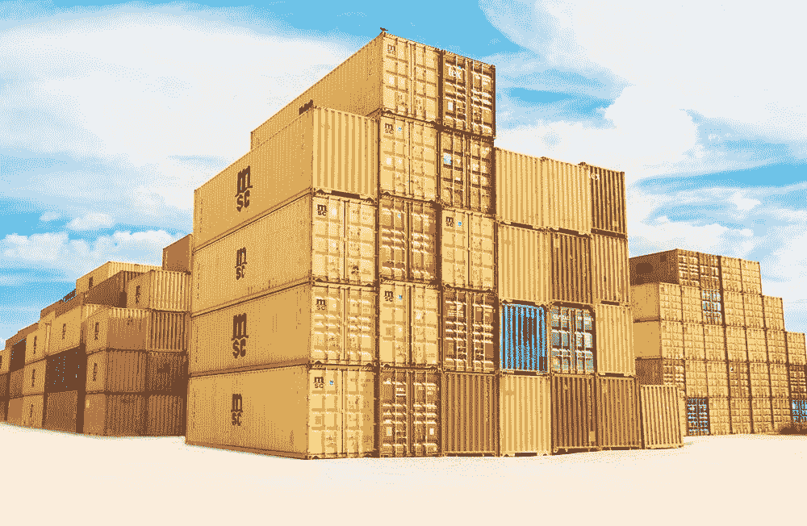
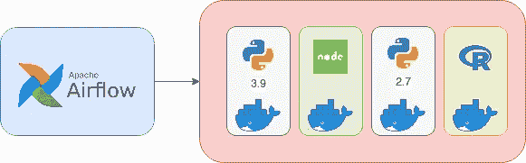
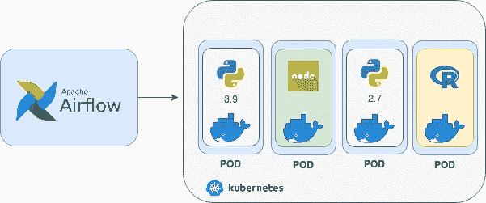
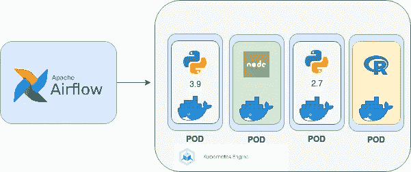
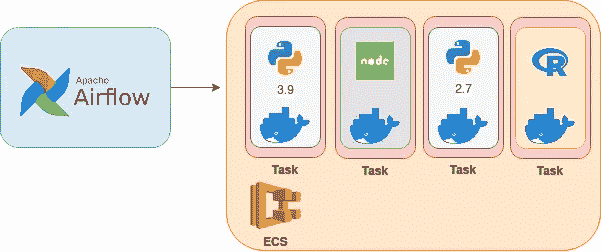

# 集装箱化数据管道的阿帕奇气流

> 原文：<https://towardsdatascience.com/apache-airflow-for-containerized-data-pipelines-4d7a3c385bd?source=collection_archive---------14----------------------->

## 在 Airflow 上使用不同版本的 Python 运行任务时是否会遇到问题？在本文中，我将解释如何解决这个问题。

弗兰克·麦肯纳在 [Unsplash](https://unsplash.com/s/photos/containers?utm_source=unsplash&utm_medium=referral&utm_content=creditCopyText) 上拍摄的照片

# 介绍

您可能以前听说过 Apache Airflow，或者您现在正在使用它来调度您的数据管道。而且，根据您要运行的内容，您的方法是为它使用一个操作符，您使用 SparkSubmitOperator 调度 Spark 作业，并使用 BashOperator 在 Airflow 正在运行的机器上运行一些东西。当您需要运行 Python 代码时，事情就变得有趣了。

您可以再次查阅文档，找到著名且有用的 PythonOperator。很直白。您只需将想要运行的 Python 代码放在那里，它将根据您的 DAG 的配置运行。您只需要确保您的代码运行在 Python 版本的 Airflow 上，并且您的库安装在系统上。

您的工作流使用 Python 的次数越多，您使用 PythonOperator 的次数就越多。您很高兴，因为您能够将 Python 知识用于所有数据科学任务。Airflow 允许您在其中安装 Python 模块，因此您可以手头上有所有您喜欢的库来做非凡的事情。

在您或您团队中的某个人想要使用新版本的 Python 或新的库之前，所有这一切都运行良好，此时您已经有许多任务在运行旧版本且不兼容的库，您有两个选择:

*   更新库并更新所有有问题的任务。
*   根据所有现有任务使用库的过时版本。

让我们更深入地了解这些选项，并分析第一个选项。您已经有 30 个任务在使用旧版本的库，因此您和您的团队可以抽出时间，用这些更改来更新库和所有这些作业。这不是一个简单的任务，但你们都做到了。最后，这是值得的，因为您有机会使用库的所有新特性，并且您的代码库是与最新趋势同步的。但是这是不可伸缩的，当你有 100 个任务在运行，你需要做同样的事情，会发生什么呢？或者仅仅是您的旧任务出于某种原因需要旧版本的库？

现在我们来分析第二种选择，这种选择似乎不那么痛苦。你用一个过时版本的库开发你的任务，然后就结束了。这并不理想，但也许你知道如何用过时的版本完成工作。但同样，这是不可扩展的，一两年后，你继续用一个过时的版本开发，你将面临各种问题，其中之一是你将需要一些新的东西，在这一点上用过时的版本库很难完成，而且你做不到。这真的会挫伤积极性，并且会影响到你和你的团队。最终，你的代码库将不会是一个你可以创新和尝试新事物的快乐地方。

现在让我们想象一个更糟糕的场景，当我们需要更新系统的 Python 版本或者我们的一个库与 Airflow 本身不兼容时。这是一个主要的问题，而且非常普遍，尤其是当团队在成长的时候。

那么，我们能做些什么来解决这个问题呢？

# 使用容器

我们之前问题的解决方案是使用 Docker 容器。

气流调度集装箱化任务—作者图片

想象一下，您可以创建一个 DAG，其中每个任务都在一个 Docker 容器中运行，由于容器的原理，您需要安装任何版本的库或您想要用于它的语言。

这将使您能够自主地使用新技术创建任务，而无需承担更新已经运行的任务的负担。

但是我如何才能做到这一点呢？

让我们探讨几个选项。

## 在 Kubernetes 上安排作业

KubernetesPodOperator 的气流调度任务—图片由作者提供

如果你不知道 Kubernetes 是什么，你可以去[这里](https://kubernetes.io/docs/concepts/overview/what-is-kubernetes/)。

通过这种方法，我们在 Kubernetes 中以 pod 的形式推出了 Docker 容器。这些吊舱是短暂的，这意味着一旦任务完成，吊舱被摧毁，它不会使用系统的容量。

因此，每个任务都是一个 Docker 容器，每个容器都作为一个 Pod 在 Kubernetes 上启动。Airflow 将日志从 Kubernetes 拉到任务的 UI 中，因此任务在哪里运行对您来说是透明的，最后您可以继续正常使用 Airflow。

为此，我们使用了 [KubernetesPodOperator](https://airflow.apache.org/docs/apache-airflow-providers-cncf-kubernetes/stable/operators.html#kubernetespodoperator) 。

> `[KubernetesPodOperator](https://airflow.apache.org/docs/apache-airflow-providers-cncf-kubernetes/stable/_api/airflow/providers/cncf/kubernetes/operators/kubernetes_pod/index.html#airflow.providers.cncf.kubernetes.operators.kubernetes_pod.KubernetesPodOperator)`使用 Kubernetes API 在 Kubernetes 集群中启动一个 pod。通过提供一个图像 URL 和一个带有可选参数的命令，操作员使用 Kube Python 客户机来生成一个 Kubernetes API 请求，该请求可以动态启动这些单独的 pod。用户可以使用`config_file`参数指定一个 kubeconfig 文件，否则操作员将默认为`~/.kube/config`。

这是我发现的更通用的解决方案，可以在主要的云提供商甚至本地安排容器化的任务。Kubernetes 是作为 Azure、AWS、Google Cloud、Linode 等平台上的服务提供的。可能是库伯内特公司的解决方案。

## 在 GKE 上安排工作(Google Kubernetes 引擎)

GKE 上的气流调度任务——图片由作者提供

如果你在谷歌云上，你计划使用的 Kubernetes 集群是托管版本(GKE)。为了方便起见，合适的操作员是[gkestartpoperator](https://airflow.apache.org/docs/apache-airflow-providers-google/stable/operators/cloud/kubernetes_engine.html#run-a-pod-on-a-gke-cluster)。你可以使用 KubernetesPodOperator，但最终需要更多的工作来设置所有的环境，如果你在谷歌云上，我认为这是推荐的方法。

## ECS(弹性集装箱服务)上的作业调度

ECS 上的气流调度任务—图片由作者提供

现在让我们假设你在 AWS 上，他们提供了一个叫做弹性库本内特服务或 EKS 的解决方案。如果你要在那里启动任务，你可以使用 KubernetesPodOperator。

但是 AWS 提供了另一种容器编排服务，称为弹性容器服务或 ECS，正如你可能已经猜到的，其中有一个操作符来启动容器化的任务，它被称为 [ECSOperator](https://airflow.apache.org/docs/apache-airflow-providers-amazon/stable/operators/ecs.html#ecs-operator) 。

在 ECS 上，没有 pod，这个概念有点不同，在那里它们被称为任务。您将在 ECS 任务中安排气流集装箱化任务。我知道，这听起来令人困惑，但原理和豆荚是一样的，它们是短暂的。因此，一旦气流任务完成，它就不会消耗资源。

# 考虑

*   当您在群集中运行任务时，请确保您的群集拥有所有可用的权限和凭据。如果集群与 Airflow 运行的集群不同，并且您正在迁移任务，这是您需要考虑的问题。
*   运行任务所需的额外 Kubernetes 或 ECS 群集的成本不容小觑。你一定要考虑到这一点。
*   一个是我们之前用来在 Kubernetes 上运行任务的 KubernetesPodOperator，另一个是 Kubernetes Executor，最后一个是使用 Kubernetes 来运行 Airflow 本身。请确保你不要混淆这些，有时网上有很多信息可能会使这种情况发生。
*   您不一定需要在 Kubernetes 或 ECS 上运行 Airflow 本身，您可以在外部集群中调度任务。

# 结论

这不是银弹，因为在所有的技术决策中，总是有一个权衡。是的，容器允许你有更好的隔离，但也给你更多的操作复杂性。如果您想让这种方法为您工作，您需要有一个 CI/CD 管道，这样部署一个任务的新版本就不会成为负担。

尽管不受我们可以用来完成任务的库或语言的限制很酷。这通常是人们所忽略的，但是能够试验和尝试新事物对团队的士气是一个主要的优势。

# 资源

*   [KubernetesPodOperator](https://airflow.apache.org/docs/apache-airflow-providers-cncf-kubernetes/stable/operators.html#howto-operator-kubernetespodoperator)
*   [GKEStartPodOperator](https://airflow.apache.org/docs/apache-airflow-providers-google/stable/operators/cloud/kubernetes_engine.html#run-a-pod-on-a-gke-cluster)
*   [ECSOperator](https://airflow.apache.org/docs/apache-airflow-providers-amazon/stable/operators/ecs.html)