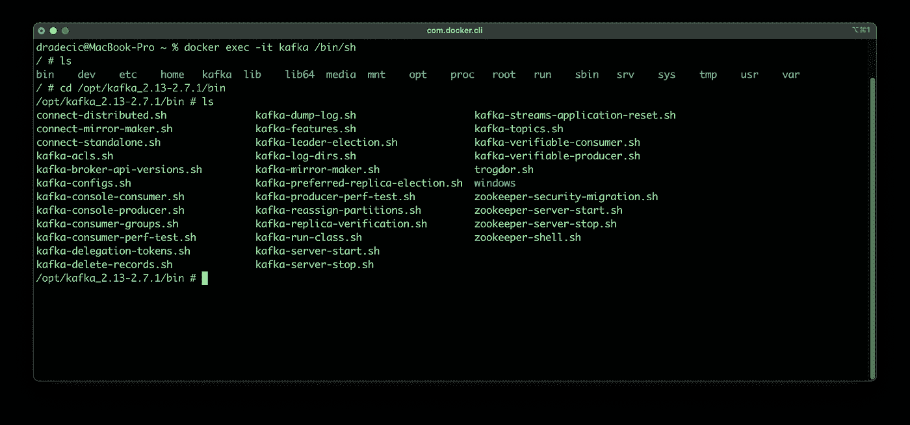
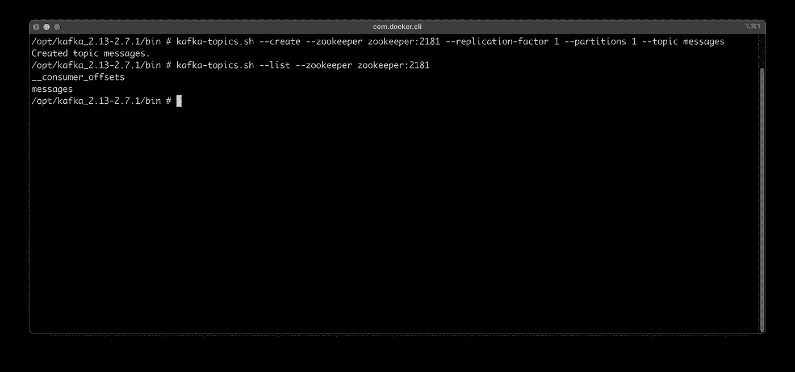
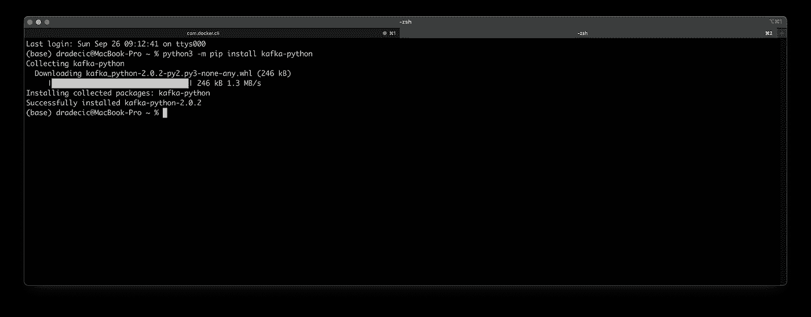
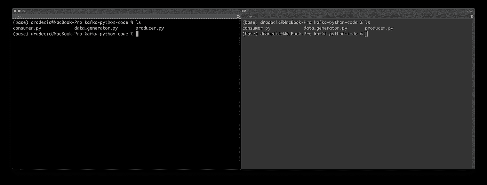
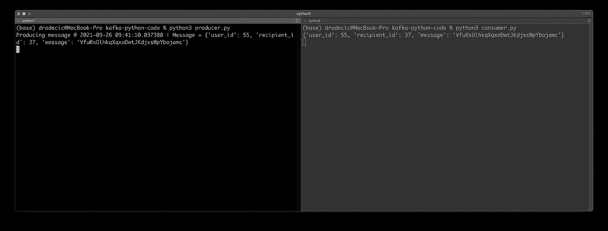
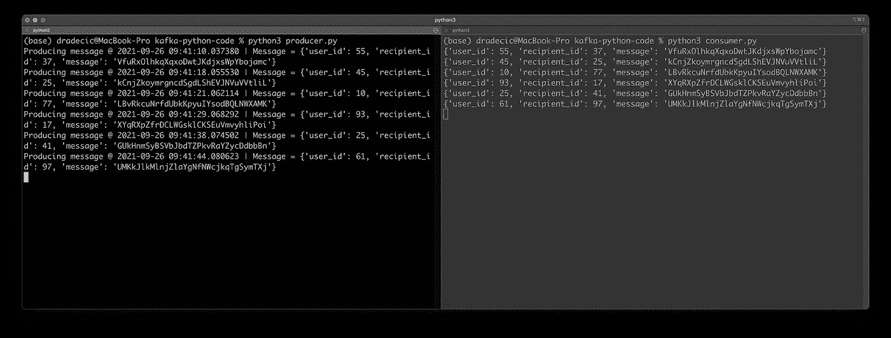

# Python 中的 Apache Kafka:如何与生产者和消费者共享数据流

> 原文：<https://towardsdatascience.com/apache-kafka-in-python-how-to-stream-data-with-producers-and-consumers-307e84ca8bdb?source=collection_archive---------18----------------------->

## 从头开始编写 Kafka 生产者和消费者的流聊天数据。


照片由[努贝尔森·费尔南德斯](https://unsplash.com/@nublson?utm_source=unsplash&utm_medium=referral&utm_content=creditCopyText)在 [Unsplash](https://unsplash.com/?utm_source=unsplash&utm_medium=referral&utm_content=creditCopyText) 拍摄

在大数据的世界里，可靠的流媒体平台是必不可少的。阿帕奇卡夫卡是一条路要走。

今天的文章将向您展示如何使用 Python 与 Kafka 生产者和消费者合作。你应该通过 Docker 配置 Zookeeper 和 Kafka。如果不是这样，请在继续之前阅读[这篇文章](https://betterdatascience.com/how-to-install-apache-kafka-using-docker-the-easy-way/)或观看[这段视频](https://youtu.be/4xFZ_iTZLTs)。

不想看书？坐下来看:

本文涵盖以下主题:

*   环境设置
*   用 Python 创建假数据
*   用 Python 写卡夫卡制作人
*   用 Python 编写 Kafka 消费者
*   测试

你可以在 [GitHub](https://github.com/better-data-science/Apache-Kafka-in-Python) 上找到源代码。

# 环境设置

首先打开一个新的终端窗口并连接到 Kafka shell。您应该已经运行了 Zookeeper 和 Kafka 容器，如果不是这样，请启动它们:

```
docker exec -it kafka /bin/sh
cd /opt/kafka_<version>/bin
ls
```

以下是您应该看到的内容:



图 1——打开卡夫卡的外壳(图片由作者提供)

接下来，您应该创建一个主题来存储 Python 生成的消息。以下是如何创建一个名为`messages`的主题，然后通过列出所有 Kafka 主题来验证它是如何创建的:



图 2——创建一个卡夫卡主题(作者图片)

这就是你在卡夫卡外壳里要做的一切。您现在可以通过在控制台中键入`exit`来离开它。下一步是安装 Python 包来使用 Kafka。它叫做`kafka-python`，你可以用下面的命令安装它:

```
python3 -m pip install kafka-python
```

安装过程应该是这样的:



图 3 —为 Kafka 安装 Python 库(图片由作者提供)

快到了！最后一步是创建一个文件夹来存储 Python 脚本和脚本文件本身。我在桌面上创建了一个`kafka-python-code`文件夹，但是你可以把你的放在任何地方:

```
cd Desktop
mkdir kafka-python-code && cd kafka-python-codetouch data_generator.py
touch producer.py
touch consumer.py
```

这就是你开始编码所需要的一切！

# 用 Python 创建假数据

如果你想了解卡夫卡是如何工作的，你需要一种方法来确保恒定的数据流。这就是为什么您将创建一个生成虚假用户消息数据的文件。

文件`data_generator.py`的`generate_message()`函数将有这个任务。它将选择一个随机的用户 ID 和收件人 ID——只是一个从 1 到 100 的随机数，确保它们不相同——并以 32 个字符的随机字符串形式创建一条消息。

因为我们将发送编码为 JSON 的消息，所以这三个都以 Python 字典的形式返回。

下面是完整的代码:

```
import random 
import string user_ids = list(range(1, 101))
recipient_ids = list(range(1, 101)) def generate_message() -> dict:
    random_user_id = random.choice(user_ids) # Copy the recipients array
    recipient_ids_copy = recipient_ids.copy() # User can't send message to himself
    recipient_ids_copy.remove(random_user_id)
    random_recipient_id = random.choice(recipient_ids_copy) # Generate a random message
    message = ''.join(random.choice(string.ascii_letters) for i in range(32)) return {
        'user_id': random_user_id,
        'recipient_id': random_recipient_id,
        'message': message
    }
```

这个功能很简单，但是它能很好地满足我们的需求。接下来，我们用 Python 写一个卡夫卡制作人。

# 用 Python 写卡夫卡制作人

这是有趣的事情开始的地方。现在您将看到如何用`kafka-python`库编写一个生产者代码。打开`producer.py`文件，你就可以开始了。

去往卡夫卡的消息需要以某种方式序列化。既然我们以 Python 字典的形式获得它们，那么唯一合理的选择就是 JSON。您将编写一个助手`serializer()`函数，将它看到的任何东西都转换成 JSON 并编码为`utf-8`。

卡夫卡制作人需要知道卡夫卡在哪里运行。如果您在配置阶段没有更改端口，那么您的端口可能在`localhost:9092`上。此外，`KafkaProducer`类需要知道值将如何被序列化。你知道这两个问题的答案。

现在到了您将生成消息并将它们发送到`messages`主题的部分。您将创建一个无限循环，因此消息会一直发送，直到您停止 Python 脚本。在循环中，您将生成消息，打印带有时间戳的消息，并将其发送到 Kafka 主题。

为了避免控制台中的消息数量过多，最好在消息发送后设置一些睡眠时间。Python 将休眠随机的秒数，范围在 1 到 10 秒之间。

这就是卡夫卡制作人的全部。以下是完整的源代码:

```
import time 
import json 
import random 
from datetime import datetime
from data_generator import generate_message
from kafka import KafkaProducer # Messages will be serialized as JSON 
def serializer(message):
    return json.dumps(message).encode('utf-8') # Kafka Producer
producer = KafkaProducer(
    bootstrap_servers=['localhost:9092'],
    value_serializer=serializer
) if __name__ == '__main__':
    # Infinite loop - runs until you kill the program
    while True:
        # Generate a message
        dummy_message = generate_message()

        # Send it to our 'messages' topic
        print(f'Producing message @ {datetime.now()} | Message = {str(dummy_message)}')
        producer.send('messages', dummy_message)

        # Sleep for a random number of seconds
        time_to_sleep = random.randint(1, 11)
        time.sleep(time_to_sleep)
```

*简单吧？*我们仍然需要编写消费者代码，所以我们接下来就这么做吧。

# 用 Python 写卡夫卡式的消费者

卡夫卡的消费者将更容易编码出来。当消费者启动时，您将获得来自`messages`主题的所有消息，并将它们打印出来。当然，您并不局限于打印消息——您可以做任何您想做的事情——但是让我们把事情简单化。

`auto_offset_reset`参数将确保最早的消息首先显示。

以下是完整的源代码:

```
import json 
from kafka import KafkaConsumer if __name__ == '__main__':
    # Kafka Consumer 
    consumer = KafkaConsumer(
        'messages',
        bootstrap_servers='localhost:9092',
        auto_offset_reset='earliest'
    )
    for message in consumer:
        print(json.loads(message.value))
```

这就是你要做的一切！接下来让我们对它们进行测试。

# 测试

如果可以的话，并排打开两个终端窗口。这在 Mac 上很容易，因为你可以按照你认为合适的方式排列标签。在两个选项卡中打开 Python 脚本所在的文件夹:



图 4 —测试 Python 消费者和生产者(1)(图片由作者提供)

您将希望首先启动消费者，因为您不想错过任何消息。所有旧邮件将首先被打印，您将看到新邮件在生成时被打印出来。使用以下命令启动消费者:

```
python3 consumer.py
```

现在，在另一个选项卡中使用以下命令来启动生成器:

```
python3 producer.py
```

您将立即看到一条打印出来的消息:



图 5 —测试 Python 消费者和生产者(2)(图片由作者提供)

请记住，生成器在发送下一条消息之前会随机休眠几秒钟。最好让两个窗口都运行一分钟左右，只是为了验证一切都正常工作。

以下是我的机器上的结果:



图片 6 —测试 Python 消费者和生产者(3)(图片由作者提供)

一切都像广告宣传的那样有效！接下来让我们总结一下。

# 离别赠言

这就是你的第一个基于 Python 的 Apache Kafka 消费者和生产者代码。当然，这是一个虚拟的例子，但是不管您要做什么样的代码更改，原则都是一样的。

如果有些事情对你不起作用，参考[视频](https://www.youtube.com/watch?v=LHNtL4zDBuk),因为这样更容易跟进。

对于整个 Apache Kafka 迷你文章/视频系列来说都是如此——我希望它足够容易理解，并且您在这个过程中学到了一些有用的东西。感谢阅读。

*喜欢这篇文章吗？成为* [*中等会员*](https://medium.com/@radecicdario/membership) *继续无限制学习。如果你使用下面的链接，我会收到你的一部分会员费，不需要你额外付费。*

[](https://medium.com/@radecicdario/membership) [## 通过我的推荐链接加入 Medium-Dario rade ci

### 作为一个媒体会员，你的会员费的一部分会给你阅读的作家，你可以完全接触到每一个故事…

medium.com](https://medium.com/@radecicdario/membership) 

# 保持联系

*   在[媒体](https://medium.com/@radecicdario)上关注我，了解更多类似的故事
*   注册我的[简讯](https://mailchi.mp/46a3d2989d9b/bdssubscribe)
*   在 [LinkedIn](https://www.linkedin.com/in/darioradecic/) 上连接

*原载于 2021 年 9 月 27 日*[*https://betterdatascience.com*](https://betterdatascience.com/apache-kafka-in-python-how-to-stream-data-with-producers-and-consumers/)T22。