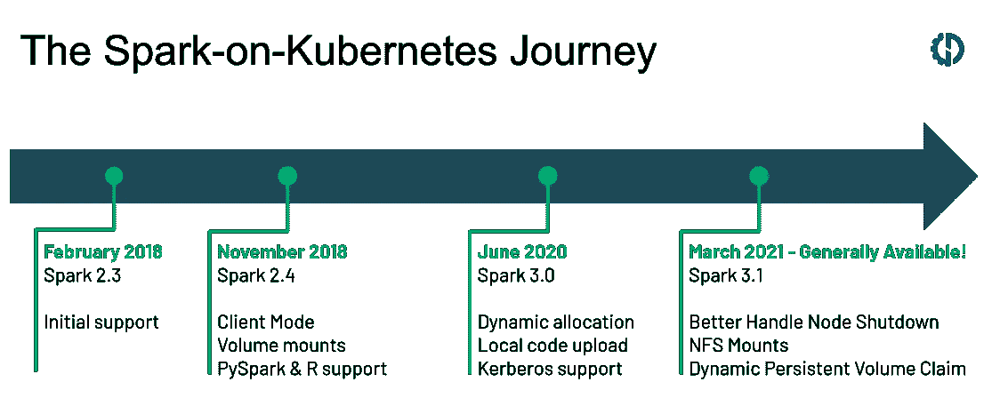
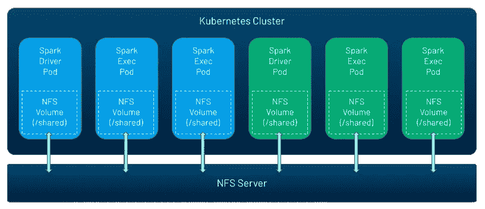
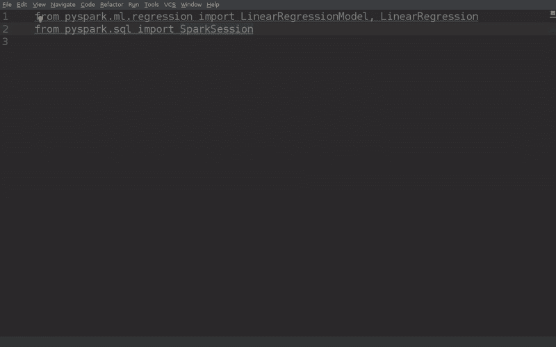

# Apache Spark 3.1 发布:Kubernetes 上的 Spark 现在已经正式发布

> 原文：<https://towardsdatascience.com/apache-spark-3-1-release-spark-on-kubernetes-is-now-generally-available-65cccbf1436b?source=collection_archive---------16----------------------->

随着 2021 年 3 月发布的 [Apache Spark](https://www.datamechanics.co/apache-spark) 3.1，Kubernetes 项目上的 [Spark 现已正式宣布为生产就绪，并普遍可用。这是自 Spark 2.3(2018 年 2 月)添加对 Spark-on-Kubernetes 的初始支持以来，3 年来快速增长的社区贡献和项目采用的成就。在本文中，我们将回顾 Spark 3.1 的主要特性，特别关注对 Spark-on-Kubernetes 的改进。](https://www.datamechanics.co/spark-on-kubernetes)

*相关资源:*

*   *关于使用 Kubernetes 作为 Spark(而不是 YARN)的资源管理器的介绍，请看在 Kubernetes 上运行 Spark 的* [*优点&缺点*](https://www.datamechanics.co/blog-post/pros-and-cons-of-running-apache-spark-on-kubernetes) *。*
*   *有关在 Kubernetes 上成功使用 Spark 的技术指南，请查看* [*设置、管理&监控 Kubernetes 上的 Spark*](https://www.datamechanics.co/blog-post/setting-up-managing-monitoring-spark-on-kubernetes)*。*
*   *关于数据机制的背景知识，请查看 Kubernetes 上的*[*Spark Made Easy:Data Mechanics 如何改进开源版本*](https://www.datamechanics.co/blog-post/spark-on-kubernetes-made-easy-how-data-mechanics-improves-on-spark-on-k8s-open-source)

# Spark-on-Kubernetes 之旅:从 2.3 中的 beta 支持到成为 3.1 中的新标准

随着 2018 年初 Spark 2.3 的发布，Kubernetes 成为了 Spark 的新调度程序(除了 YARN、Mesos 和 Standalone mode 之外)，这要归功于 RedHat、Palantir、谷歌、彭博和 Lyft 等少数几家带头开展该项目的大公司。这种最初的支持是实验性的——缺乏特性，并且存在稳定性和性能问题。

从那时起，社区支持蓬勃发展，许多大大小小的公司都被 Kubernetes 的好处所吸引:

1.  本地集装箱化。使用 [Docker](https://www.datamechanics.co/blog-post/spark-and-docker-your-spark-development-cycle-just-got-ten-times-faster) 来打包你的依赖项(和 Spark 本身)——[查看我们为 Spark](https://www.datamechanics.co/blog-post/optimized-spark-docker-images-now-available) 优化的 Docker 图片。
2.  高效的资源共享和更快的应用启动时间。
3.  丰富的开源生态系统减少了云提供商和供应商的束缚

这个项目的主要特点是——从 2.4 中的 PySpark & R 支持、客户端模式和卷挂载等基本要求，到动态分配(3.0)和更好的节点关闭处理(3.1)等强大的优化。在过去的 3 年中，总共有超过 500 个补丁(改进和错误修复)被贡献出来，使得 Kubernetes 上的 spark 更加稳定和高效。

Kubernetes 上 Spark 改进的时间线从 2018 年的 Spark 2.3，到 2021 年 3 月最新的 Spark 3.1。图片作者。

因此，Kubernetes 越来越被认为是 2021 年新 Spark 项目的标准资源管理器，我们可以从开源[Spark-on-Kubernetes operator](https://github.com/GoogleCloudPlatform/spark-on-k8s-operator)项目的受欢迎程度，或者主要供应商采用 Kubernetes 而不是 Hadoop YARN 的声明中看出这一点。

有了 Spark 3.1，Spark-on-Kubernetes 项目现在被认为是普遍可用和生产就绪的。在这个最新版本中，超过 70 个错误修复和性能改进被贡献给了这个项目。现在，让我们深入了解最具影响力的功能，也是我们的客户热切期待的功能。

# 更好地处理节点关闭——优雅的执行器退役(新的 Spark 3.1 特性)

这个功能( [SPARK-20624](https://issues.apache.org/jira/browse/SPARK-20624) )是由 [Holden Karau](https://www.twitch.tv/holdenkarau) 实现的，目前只适用于 Kubernetes 和单机部署。它被称为“更好地处理节点关闭”，尽管“优雅的执行器退役”是它的另一个好名字。

这个特性使得 Spark 在使用 spot 节点(也就是 GCP 上的可抢占节点)时更加健壮和高效。它确保在 spot 中断发生之前，移动 shuffle 和缓存数据，以便 Spark 应用程序可以在影响最小的情况下继续运行。在此功能之前，当发生定点清除时，随机文件会丢失，因此需要重新计算(通过重新运行可能非常长的任务)。此功能不需要设置外部 shuffle 服务(这需要昂贵的存储节点按需运行，并且与 Kubernetes 兼容)。这个用一张图更好描述。

Spark 的新功能的一个例子，它可以预测当场死亡并优雅地终止执行者，而不会丢失宝贵的数据！图片作者。

**这个功能有什么作用？**

1.  将要离开的执行程序被列入黑名单 Spark 驱动程序不会在它上面安排新的任务。当前在其上运行的 Spark 任务不会被强制中断，但是如果它们失败(由于执行器死亡)，这些任务将在另一个执行器上重试(与今天相同)，并且它们的失败不会计入最大失败次数(新)。
2.  执行程序中的随机文件和缓存数据会迁移到另一个执行程序中。如果没有其他执行程序(例如，我们正在删除那里唯一的执行程序)，您可以配置一个对象存储(如 S3)作为[后备存储](https://github.com/apache/spark/blob/2e31e2c5f30742c312767f26b17396c4ecfbef72/core/src/main/scala/org/apache/spark/internal/config/package.scala#L474)。
3.  一旦完成，执行者就死了，Spark 应用程序可以不受影响地继续运行！

**这个什么时候生效？**

*   当您使用 spot/preemptable 节点时，云提供商(aws、gcp、azure)现在会提前 60-120 秒通知您。Spark 现在可以利用这个时间段来保存我们宝贵的洗牌文件了！当云提供商实例因其他原因关闭时，如 [ec2 维护事件](https://docs.aws.amazon.com/AWSEC2/latest/UserGuide/monitoring-instances-status-check_sched.html)，同样的机制也适用。
*   当一个 Kubernetes 节点被清空(例如为了维护)或者 Spark executor pod 被驱逐(例如被一个更高优先级的 pod 抢占)时。
*   当执行程序作为动态分配的一部分被删除时，在缩减期间，因为执行程序空闲。在这种情况下，缓存和随机文件也将被保留。

如何打开它？

*   配置标志。需要开启的 4 个主要 Spark 配置分别是***Spark . dissolution . enabled***，***Spark . storage . dissolution . rddblocks . enabled*，***Spark . storage . dissolution . shuffle blocks . enabled*，***Spark . storage . dissolution . enabled***。
    我建议直接参考[源代码](https://github.com/apache/spark/blob/2e31e2c5f30742c312767f26b17396c4ecfbef72/core/src/main/scala/org/apache/spark/internal/config/package.scala#L1954)来查看其他可用的配置。****
*   云提供商警告节点即将离开(例如由于定点清除)的能力需要特定的集成。我们建议查看一下 [AWS](https://github.com/aws/aws-node-termination-handler) 、 [GCP](https://github.com/GoogleCloudPlatform/k8s-node-termination-handler) 和 [Azure](https://github.com/diseq/k8s-azspot-termination-handler) 的 NodeTerminationHandler 项目。如果你是数据力学的客户，请注意我们正在为你做这项工作。

# Kubernetes 上 Spark 的新卷选项

从 Spark 2.4 开始，在 Kubernetes 上使用 Spark 时，可以挂载 3 种类型的卷:

1.  一个 [emptyDir](https://kubernetes.io/docs/concepts/storage/volumes/#emptydir) :共享一个 pod 生命周期的初始空目录。这对于临时存储很有用。这可以由节点的磁盘、SSD 或网络存储提供支持。
2.  A [hostpath](https://kubernetes.io/docs/concepts/storage/volumes/#hostpath) :将一个目录从底层节点挂载到您的 pod。
3.  静态预创建的 [PersistentVolumeClaim](https://kubernetes.io/docs/concepts/storage/persistent-volumes/) 。这是 Kubernetes 对各种类型的持久存储的抽象，比如 AWS [EBS](https://aws.amazon.com/ebs/) 、 [Azure Disk](https://azure.microsoft.com/en-us/services/storage/disks/) ，或者 GCP 的[持久磁盘](https://cloud.google.com/persistent-disk)。PersistentVolumeClaim 必须由用户提前创建，并且其生命周期与 pod 无关。

Spark 3.1 支持两个新选项——NFS 和动态创建的 PersistentVolumeClaims。

[NFS](https://kubernetes.io/docs/concepts/storage/volumes/#nfs) 是一个可以同时由许多 pod 共享的卷，并且可以预先填充数据。因此，这是一种跨 Spark 应用程序，或者跨给定 Spark 应用程序中的驱动程序和执行器交换数据、代码和配置的方式。Kubernetes 不运行 NFS 服务器，你可以自己运行，或者使用云服务(比如 AWS [EFS](https://aws.amazon.com/efs/) ，GCP [Filestore](https://cloud.google.com/filestore) ，或者 Azure [Files](https://docs.microsoft.com/en-us/azure/storage/files/storage-files-introduction) )。

一旦您创建了 NFS 共享，现在使用 Spark 3.1 只需使用 Spark 配置就可以很容易地将其安装到您的 Spark 应用程序中:

*spark . kubernetes . driver . volumes . NFS . my share . mount . path =/shared
spark . kubernetes . driver . volumes . NFS . my share . mount . readonly = false
spark . kubernetes . driver . volumes . NFS . my share . options . server = NFS . example . com
spark . kubernetes . driver . volumes . NFS . my share . options . path =/storage/shared*

NFS(网络文件系统)是在所有 Spark 应用程序之间共享数据的热门选择。它现在可以在 Kubernetes 上运行。图片作者。

第二个新选项是动态 PVC，这是一种更加用户友好的使用持久卷的方式。以前，您必须预先创建 PVC，然后装载它们。如果你使用动态分配，你不知道在你的应用程序执行过程中会产生多少执行者，所以这很难做到。您还必须自己清理未使用的持久卷，或者接受存储资源的浪费。

有了 Spark 3.1，一切都是动态和自动化的。当您提交 Spark 应用程序时(或者当您在动态分配期间请求新的执行器时)，Kubernetes 中会动态创建 PersistentVolumeClaims，这将自动提供您所请求的[存储类](https://kubernetes.io/docs/concepts/storage/storage-classes/)的新 PersistentVolumes(例如 AWS [EBS](https://aws.amazon.com/ebs/) 、 [Azure Disk](https://azure.microsoft.com/en-us/services/storage/disks/) 或 GCP 的[持久性磁盘](https://cloud.google.com/persistent-disk))。删除 pod 后，关联的资源会自动销毁。

# 其他 Spark 3.1 特性:PySpark UX、阶段级调度、性能提升

除了 Kubernetes go GA 上的 Spark 之外，Spark 3.1 还带来了许多显著的功能。在这里我们将集中讨论几个主要的问题。

PySpark 开发者 UX 在 Spark 3.1 中获得了两大改进:

*   PySpark [文档](https://spark.apache.org/docs/latest/api/python/index.html)已经接受了完全的重新设计，这使得它更加 pythonic 化和用户友好。看看吧！
*   类型提示支持现在意味着您应该在 IDE 中免费获得代码完成和静态错误检测。

下面是 Apache Spark 3.1 中 PySpark 用户可以使用的 IDE 自动完成功能的示例。来源:https://github.com/zero323/pyspark-stubs

Spark History Server 可以在应用程序完成后呈现 Spark UI，它现在会显示您运行的结构化流查询的统计信息。

阶段级调度( [SPARK-27495](https://issues.apache.org/jira/browse/SPARK-27495) )仅适用于启用动态分配时的 YARN 和 Kubernetes 部署。它允许您在代码中控制在一个阶段的粒度上请求的执行器资源的数量和类型。具体来说，您可以配置您的应用程序，在应用程序的第一阶段使用带有 CPU 的执行器(比如说，执行 ETL 和准备数据)，然后在应用程序的第二阶段使用 GPU(比如说，训练 ML 模型)。

在性能方面，Spark 3.1 改进了混洗散列连接的性能，并在子表达式消除和 catalyst 优化器中添加了新规则。对于 PySpark 用户来说，内存中的列格式 [Apache Arrow](https://arrow.apache.org/overview/) 版本 2.0.0 现在与 Spark 捆绑在一起(而不是 1.0.2)，这应该会使您的应用程序更快，特别是如果您倾向于在 Spark 和 Pandas 数据帧之间转换数据。好消息是，您将免费从这些性能改进中受益，无需任何代码或配置更改。

# 结论

Spark 3.1 是 Apache Spark 的一个激动人心的版本，庆祝了社区多年来对 Spark-on-Kubernetes 集成的支持，标志着它的支持已经普遍可用并可以生产。这对于我们 Data Mechanics 来说并不意外，因为我们一直在帮助客户迁移到 Kubernetes，并在开发人员体验和性能/成本降低方面不断取得巨大成果。

除了即将正式上市的 Kubernetes 上的 Spark 之外，优雅的退役功能还实现了将计算资源从存储中完全分离出来的愿景，并通过 Spark 使经济高效的 spot 实例的使用更加稳定。我们对该功能的初步测试非常有希望——我们将很快发布一个我们的大客户使用该功能的故事，敬请关注！

*本文原* [*发表于数据力学博客*](https://datamechanics.co/blog-post/apache-spark-3-1-release-spark-on-kubernetes-is-now-ga) *。*