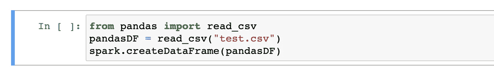
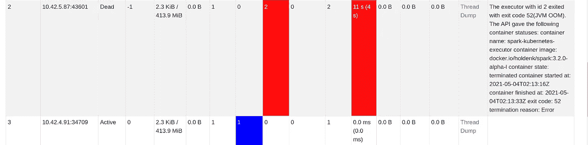
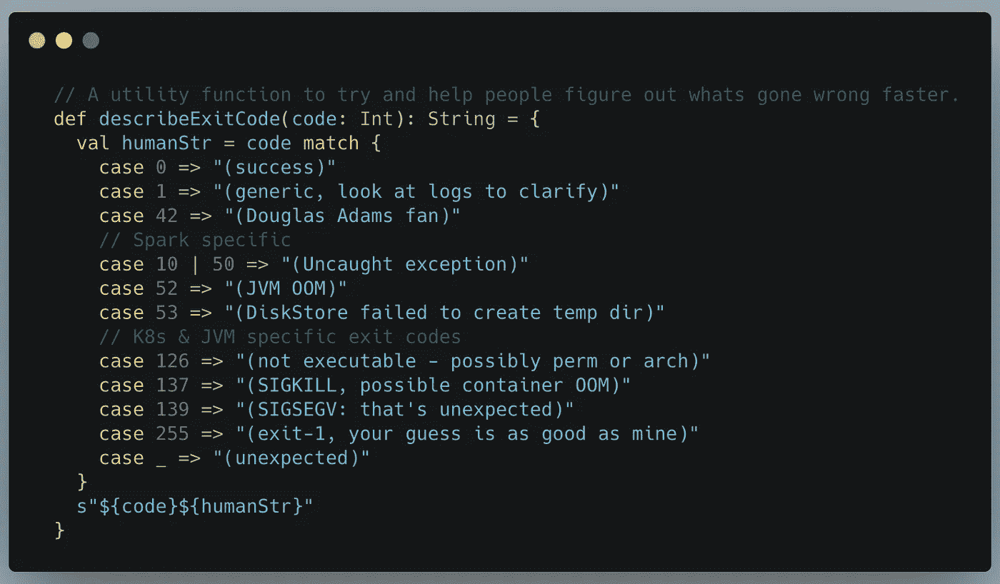
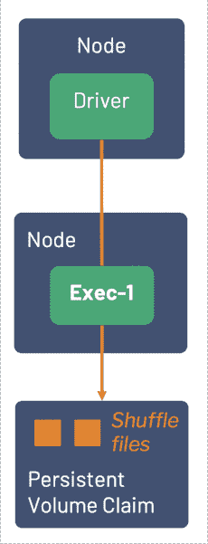

# Apache Spark 3.2 版本—Spark-on-Kubernetes 的新特性

> 原文：<https://towardsdatascience.com/apache-spark-3-2-release-whats-new-for-spark-on-kubernetes-cb234e680fc0?source=collection_archive---------16----------------------->

## 主要功能解释:PersistentVolumeClaim 重用(k8s 专用)、考拉、Hadoop 3.3、RocksDB 等等！

Apache Spark 3.2 为每个人带来了性能和稳定性的改进，以及一个令人兴奋的新特性，使 Spark-on-Kubernetes 在 spot 节点上表现出色！来源: [Unsplash](http://unsplash.com) 。

Apache Spark 3.2 于 2021 年 10 月发布(参见[发布说明](https://spark.apache.org/releases/spark-release-3-2-0.html))，现在面向[数据机制](https://www.datamechanics.co)客户，以及任何希望在 Kubernetes 上运行 [Spark(或简单地在 Docker 上运行 Spark)的人，因为我们更新了 Spark 的优化 Docker 映像的](https://www.datamechanics.co/apache-spark-on-kubernetes) [DockerHub 库](https://hub.docker.com/r/datamechanics/spark)。

在本文中，我们将带您浏览 Apache Spark 的新特性，这些新特性让我们兴奋不已。我们将首先看一下有利于整个 Spark 社区的总体改进，然后关注一个针对 Spark-on-Kubernetes 用户的激动人心的新开发。

# 主要特性—总体改进

# Hadoop 3.3.1 —性能改进

Spark 3.2 现在默认使用 [Hadoop 3.3.1](https://hadoop.apache.org/docs/r3.3.1/index.html) (而不是之前的 Hadoop 3.2.0)。你可能认为这不适用于你(特别是如果你在 Kubernetes 上运行 Spark)，但实际上即使你不在 Hadoop 基础设施上运行，Spark 也使用 Hadoop 库。特别是，Spark 在从对象存储中读取数据时会使用 Hadoop 库(比如 S3 ),所以这一点非常重要。

Hadoop 3.3.1 版本为 S3A 连接器( [HADOOP-17400](https://issues.apache.org/jira/browse/HADOOP-17400) )带来了显著的性能提升。这些改进调优了 s3 清单的性能，并删除了许多对 S3 API 的不必要调用，因此降低了被抑制的风险，并且总体上提高了 Spark 从 S3 读取时的性能。

另一个值得注意的变化是“ [Magic S3 提交器](https://hadoop.apache.org/docs/r3.1.1/hadoop-aws/tools/hadoop-aws/committers.html#The_Magic_Committer)”现在更易于使用，甚至被推荐为默认设置，因为我们现在可以受益于 S3 自 2020 年 12 月以来在全球范围内支持强写后读一致性的事实。Spark 3.2 和 Hadoop 3.3.1 版本修复了一些错误，并显著提高了提交器的性能。

你现在可以通过[打开单个 Spark 配置标志](https://github.com/apache/spark/pull/32518)(而不是多个)来启用 magic committer，其中<桶>是你写入数据的 S3 桶:**" Spark . Hadoop . fs . s3a . bucket .<桶>. committer . magic . enabled ":" true "。**

> ‍If，你不知道什么是 S3 提交器，我们推荐你阅读这个[文档](https://hadoop.apache.org/docs/r3.1.1/hadoop-aws/tools/hadoop-aws/committers.html#The_Magic_Committer)，它有点过时，但是对 S3 提交问题做了很好的介绍。还要注意的是，Hadoop 维护者正在开发一个类似的提交器，为 Google Cloud 和 Azure 的对象存储进行了优化。

# 自适应查询执行—性能改进

Spark 开发团队一直在寻找提高 Spark SQL 查询优化器效率的方法。查询优化器负责选择适当的连接方法、任务执行顺序，并根据从底层数据中获得的各种统计信息决定连接顺序策略。

自适应查询执行是这些优化技术之一，最初发布于 Spark 3.0。在 Spark 3.2 中，默认情况下**启用自适应查询执行**(您不再需要配置标志来启用它)，并且与其他查询优化技术(如动态分区修剪)兼容，使其更加强大。

AQE 允许查询优化器在某些阶段完成时收集数据，根据从查询执行中收集的新统计信息重新构建查询计划，并在应用程序执行过程中对查询计划应用这些更改。

自适应查询执行在 Spark SQL 查询运行时对其进行优化。

AQE 通过应用以下策略来优化查询执行:

*   动态合并混洗分区
*   动态切换连接策略(动态选择使用广播连接或混合散列连接，而不是较慢的排序-合并连接)
*   动态优化偏斜连接

不同的配置标志让你调整这些优化的行为，更多细节请参考[文档](https://spark.apache.org/docs/3.2.0/sql-performance-tuning.html#adaptive-query-execution)。这些配置标志是在数据力学平台上为您自动设置的。

# 数据源 V2 聚合下推-性能改进

当 Spark 从任何存储中读取数据时(对象存储中的 parquet 文件、数据仓库、HDFS、SQL 数据库……)，它使用一个实现特定 API 的库。随着 2018 年 Spark 2.3 的发布，发布了新的 API(名为 DataSource V2)，主要的常用数据连接器(阅读器和写入器)都移植到了它上面。基本 API (V1)只允许 Spark 以分布式方式读/写数据。新的 API (V2)在数据源层实现了很多优化，比如通过在数据源“向下”推送过滤器来减少数据读取量。

有了 Spark 3.2，您现在可以从包含聚合过滤器或选择聚合列的查询上的谓词下推中受益。举一个具体而简单的例子，让 Spark 计算一个拼花文件中的行数现在会快得多，因为 Spark 可以直接从文件的元数据中读取它，而不是扫描它(参见 [SPARK-35511](https://www.datamechanics.co/blog-post/apache-spark-3-2-release-main-features-whats-new-for-spark-on-kubernetes#) )。

支持的聚合函数包括**计数、求和、最小值、最大值、平均值**。通过聚合下推，Spark 可以将聚合谓词应用于数据源，从而减少通过网络读取和混合的文件数量。如果查询中包含多个聚合，并且数据源支持这些聚合，Spark 将下推所有聚合。

> 请注意，如果您选择一个聚合和一个维度列，该聚合将不会被下推到数据源。还要注意的是，当使用 parquet 或 Delta 作为数据源时，这种优化效果最明显。

# 考拉——熊猫用户的 PySpark 改进

Koalas 是流行的 Pandas 库的 Spark 实现，作为 PySpark 的首选转换库，它越来越受欢迎。在 Spark 3.2 中，考拉现在将默认与 Spark 捆绑在一起，它不需要作为附加库安装。我们的目标是让 Spark 更容易被习惯在单台机器上运行纯 python 代码的人访问，事实上，现在使用 PySpark 运行相同的代码比使用纯 Pandas 要快得多，即使您不运行 Spark 的分布式功能(这要感谢 Spark SQL 中内置的许多优化)。

## Api 变更

以前，如果您想要在熊猫、考拉或 Spark 功能之间切换，您需要应用转换函数来获得适当的 DataFrame 对象，从而允许您利用特定的转换。随着 Spark 3.2 的发布，Pandas 现在可以在 Spark 上本地运行，并且包含在 PySpark API 中。

星火 3.2 之前进口熊猫。图片作者。

上面的单元格描述了使用 Pandas 函数、创建 Pandas 数据帧和转换为 Spark 数据帧的工作流程。这种操作效率特别低，因为在开始 Spark 操作之前，您会将整个“test.csv”收集到您的驱动程序中，从而放弃了 Spark 的一个关键优势，即分布式处理。此外，代码本身变得乏味，因为我们需要在库之间切换，以便利用我们的应用程序所需的转换和功能。

从 Spark 3.2+导入熊猫。图片作者。

使用 Spark 3.2，您可以直接从 PySpark API 导入 read_csv 函数，并接收 Spark 数据帧，这样就不需要在两个库之间来回转换了。此外，read_csv 函数现在是使用 Spark 作为后端实现的，这意味着在内存中读取和处理 csv 时，您将受益于并行化。这种实现不仅允许开发人员生成更干净的 PySpark 应用程序，还可以消除混淆，即哪些操作只在 Spark 驱动程序上执行，哪些操作分布在执行器上。

## 形象化

标准的 Python Pandas 实现打包了 [matplotlib](https://matplotlib.org/) 作为默认的绘图库。在 3.2 版本中，PySpark Pandas 默认使用。Plotly 提供了许多增强功能，例如对交互式放大和缩小图形的本机支持，以及使用 Spark 重新计算绘图视图。如果选择切换回 matplotlib，可以在 Spark 配置中指定 PySpark 绘图库。

# RocksDB —火花流改进

标准的 Spark 流配置通过在内存中存储持久值来支持有状态操作，如流聚合或连接。对于一些具有高基数的流工作负载，在内存中存储状态可能不够，导致应用程序将数据溢出到磁盘并影响性能。

Spark 现在支持 [RocksDB](http://rocksdb.org/) ，这是一个用于高性能状态管理的持久性键值存储。与传统的内存解决方案相比，RocksDB 在查找性能和延迟方面都有显著提升。要使用 RocksDB 运行 Spark 应用程序，请添加以下配置设置:

*" spark . SQL . streaming . statestore . provider class ":" org . Apache . spark . SQL . execution . streaming . state . rocksdbstatestoreprovider "*

# Kubernetes 上的火花改进

# Spark UI 中的执行器失败原因

新的执行程序失败原因列位于右侧。图片作者。

Spark UI 现在在它的执行者页面上增加了一个新的列，给你一个 Spark 执行者死亡的原因。这一改进适用于所有 Spark 用户，而不仅仅是 Spark-on-Kubernetes。对于 Spark-on-Kubernetes 用户来说，一个阻止错误代码传播的 bug 已经修复，并且提供了一些额外的见解，例如将 Docker 退出代码翻译成人类可以理解的东西。

火花 PMC·霍尔登·卡劳添加了新的有趣的错误信息(来源: [Github](https://github.com/apache/spark/pull/32436/files#diff-946f85835a0805b0ae57c8579a37e9bd9c432833acad14cd66ed826fc29c34eeR257)

# 执行程序重启时 Kubernetes 持久性卷声明重用

在 3.1 版本中，Spark 引入了在 Kubernetes 工作负载上动态生成、装载和删除[持久卷声明](https://kubernetes.io/docs/concepts/storage/persistent-volumes/) (PVCs)的能力，这些工作负载基本上是装载到 Spark pods 中的卷，由 Kubernetes 管理，并由物理云卷(如 AWS 上的 EBS、GCP 上的持久磁盘或 Azure 磁盘)提供支持。如果你想在我们的平台上做这件事，请看我们的文档。

如果由于定点清除或失败(例如 JVM 耗尽内存)而丢失了一个执行器，那么持久化卷将在执行器 pod 终止的同时丢失，从而迫使 Spark 应用程序重新计算丢失的工作(洗牌文件)。

Spark 3.2 增加了 PVC 重用和洗牌恢复来处理这种确切的场景( [SPARK-35593](https://issues.apache.org/jira/browse/SPARK-35593) )。如果执行程序或节点在运行时丢失，Spark 将保留最初与丢失的执行程序相关联的持久卷声明，从 Kubernetes 请求一个新的 pod，并将现有的卷附加到它上面，以便宝贵的 shuffle 文件不会丢失，Spark 可以恢复已经完成的工作，而不是重新计算它。

演示 Exec-2 如何恢复存储在与 Exec-1 关联的 PVC 中的随机文件的动画 GIF。图片作者。

该特性将极大地提高 Spark-on-Kubernetes 在处理偶发执行器故障时的健壮性和效率，并有助于使用现场/可抢占节点，与传统的按需节点相比，可节省 60%以上的成本。这是 Spark-on-k8s 用户的一大胜利！

要启用动态 PVC 重用，请将以下设置添加到应用程序的 Spark 配置中。请注意，前两个标志是 Spark 3.2 中的新标志，其他标志来自 Spark 3.1 中的动态 PVC 特性

# 结论

Apache Spark 3.2 为 Spark 在所有用例中带来了显著的性能提升——从 Spark SQL 用户(AQE)，到熊猫开发者(考拉)，以及流用户(RocksDB)。这也是 Spark-on-Kubernetes 项目(从 Spark 3.1 开始正式发布)增加稳定性和成熟度的另一个版本，因为 PVC 重用以一种健壮的方式解决了在应用程序运行时丢失 Spark 执行器的问题。

当您在我们的平台上将工作负载升级到 Spark 3.2 时，我们期待展示这些影响。如果您不是客户，但对迁移到 Spark-on-Kubernetes 感兴趣，[请向我们预订演示](https://calendly.com/data_mechanics/demo)！