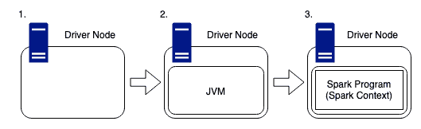
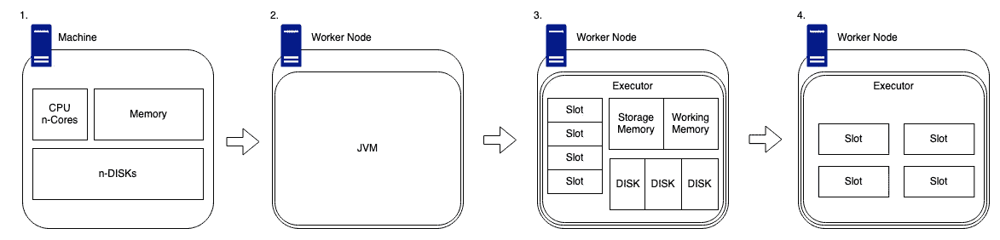
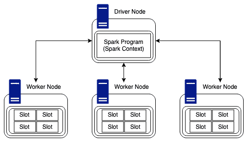
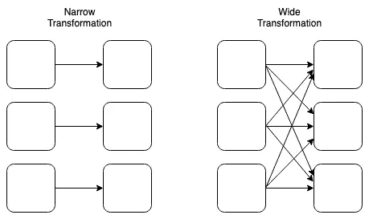
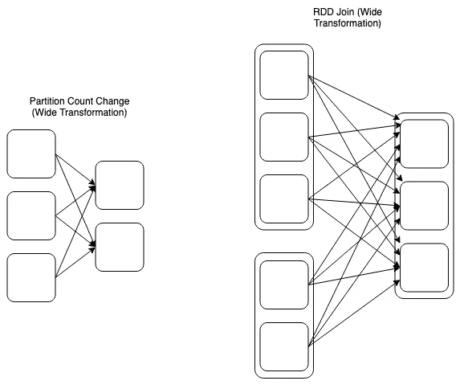
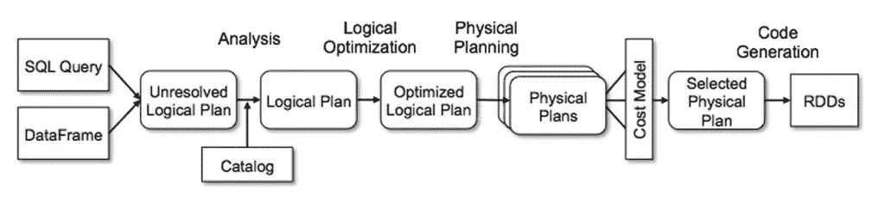
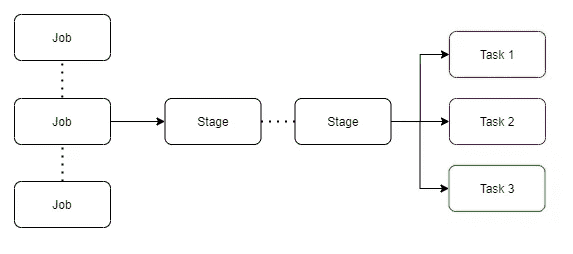
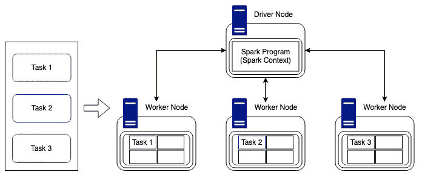

# Apache Spark —多部分系列:Spark 架构

> 原文：<https://towardsdatascience.com/apache-spark-multi-part-series-spark-architecture-461d81e24010?source=collection_archive---------4----------------------->

## [理解大数据](https://towardsdatascience.com/tagged/making-sense-of-big-data)

Spark 架构是最初学习 Spark 时最难掌握的元素之一。我认为其中一个主要原因是有大量的信息，但没有什么能让我们深入了解 Spark 生态系统的方方面面。这很可能是因为，它很复杂！有这么多奇妙的资源，但并不是所有的都是直观的或容易理解的。

我希望这个系列的这一部分能够帮助那些对这个主题知之甚少的人从基础开始理解 Spark Architecture 是如何构建的。我们还将研究如何为我们的 Spark 系统提供工作，以及系统如何以最有效的方式消耗和完成这些工作。

正如我所承诺的，这部分会更重一点。所以系好安全带，这将会很有趣！

# 物理火花等级:

为了理解 Spark 程序是如何工作的，我们需要理解 Spark 系统是如何一砖一瓦地构建起来的(参见我在那里所做的)。有许多不同的方法来建立一个 Spark 系统，但是对于这个系列的这一部分，我们将讨论一个最流行的方法来建立它。

一般来说，Spark 系统是由许多独立的机器组成的，它们为了一个共同的目标一起工作，这被称为*集群*或*分布式系统*。要让这样的系统工作，我们需要一台机器来整体管理集群。该机器通常被标记为*驱动节点*。

## 驱动节点

Spark 驱动程序用于协调整个 Spark 集群，这意味着它将管理分布在集群中的工作，以及在整个集群生命周期中哪些机器是可用的。

逐步驱动程序节点(由 Luke Thorp 创建)

1.  驱动程序节点像任何其他机器一样，它有 CPU、内存、磁盘和缓存等硬件，但是，这些硬件组件用于托管 Spark 程序和管理更广泛的集群。驱动因素是用户之间的链接，以及完成提交给群集的任何工作所需的物理计算。
2.  由于 Spark 是用 Scala 编写的，所以要记住集群中的任何机器都需要运行一个 JVM (Java 虚拟机),这样 Spark 才能与主机上的硬件一起工作。
3.  Spark 程序在这个 JVM 内部运行，用于创建 SparkContext，这是用户访问 Spark 集群的访问点。

驱动程序包含 DAG(有向无环图)调度器、任务调度器、后端调度器和块管理器。这些驱动程序组件负责将用户代码翻译成在集群上执行的 Spark 作业。隐藏在驱动程序节点中的是集群管理器，它负责获取 Spark 集群上的资源并将它们分配给 Spark 作业。这些资源以*工作节点*的形式出现。

## 工作节点

工作者节点形成集群的*【分布式】*部分。这些节点有各种形状和大小，加入集群时不一定总是相同的，它们的大小和性能可以不同。但是，当进一步调查性能瓶颈时，拥有性能相同的工作节点可能会有好处。所以，这是需要记住的事情。

Worker Node Step by Step(由 Luke Thorp 创建)

1.  工作节点通常是独立的机器，其硬件与任何其他节点一样。例如 CPU、存储器、磁盘和高速缓存。
2.  与驱动程序一样，为了让 Spark 在 worker 节点上运行，我们需要确保系统安装了兼容版本的 Java，以便代码能够以正确且有意义的方式进行解释。
3.  当我们在工作节点上安装 Spark 时，我们的驱动节点将能够利用其集群管理功能来映射工作节点上可用的硬件。
    集群管理器将跟踪*“插槽”*的数量，这实际上是设备上可用内核的数量。这些插槽被分类为可用的计算卡盘，并且可以由驱动程序节点向它们提供要完成的任务。有一定数量的可用内存被分成两部分，存储内存和工作内存。默认比例是 50:50，但是可以在 Spark 配置中更改。
    每个工作人员还会附带一些磁盘。但是我知道你要说什么，Spark 工作在内存，不是磁盘！然而，Spark 仍然需要磁盘来分配 shuffle 分区(将在本文后面进一步讨论)，它还需要空间来持久存储到磁盘和溢出到磁盘。
4.  现在我们有了驱动节点和工作者节点是如何构造的细节，我们需要知道它们是如何交互和处理*工作*的。
    为此，我们将创建一个极简版本的图表来显示一个 worker 节点及其可用的工作插槽。

## 最小化物理结构

既然我们知道了驱动程序和工作程序是如何独立构造的，我们就可以研究它们在集群环境中是如何内在联系的。如上所述，我们将简化 worker 节点的视图，以便它只显示对下一节重要的元素。(他们还有内存和磁盘！)

查看驱动程序和工作节点，我们可以看到驱动程序节点是集群中节点之间通信的中心。

驱动节点和工作节点架构(由 Luke Thorp 创建)

工作节点能够相互通信和传递数据，但是对于工作和任务，驱动节点只负责向工作节点提供要完成的工作。

在上面的例子中，我们有一个包含一个驱动程序和三个工作节点的集群。每个节点都有四个可用的计算插槽，因此，该集群将能够同时完成十二项任务。值得一提的是，Sparks *new* photon engine 是一款 Spark 兼容的矢量查询引擎，旨在满足和利用最新的 CPU 架构。这支持更快的数据并行处理，甚至在任务执行期间读取数据时实时提高性能。

# Spark 运行时架构

Spark 运行时架构正是它在 tin 上所说的，即代码运行时集群发生了什么。“代码正在运行”可能是错误的阶段。Spark 既有热切的评价，也有慵懒的评价。星火行动渴望；然而，转换天生懒惰。

如上所述，转换是懒惰的，这实质上意味着当我们对数据调用一些操作时，它不会立即执行。Spark 维护被调用操作的记录。这些操作可以包括连接和过滤。

动作是急切的，这意味着当一个动作被调用时，该行代码一运行，集群就开始计算预期的结果。当操作运行时，它们会产生一个非 RDD(弹性分布式数据集)组件。

## 转换类型:

有两种类型的转换是理解 Spark 如何以分布式方式管理数据和计算的关键，它们是**窄**和**宽**。转换从彼此创建 rdd。

狭窄和宽阔的变换(由卢克·索普创造)

*   由一个输入分区定义的窄转换将产生一个输出分区。这方面的一个例子是*过滤器*:因为我们可以有一个数据帧，我们可以将其过滤成一个更小的数据集，而不需要了解任何其他工作节点上保存的任何数据。
*   大范围转换(混洗)是由工作节点需要通过网络传输(混洗)数据以完成所需任务这一事实定义的。这方面的一个例子是*连接*:因为我们可能需要从集群中收集数据，以完全正确地完成两个数据集的连接。

扩展的广泛转换(由卢克·索普创建)

宽转换可以采取多种形式，并且 *n* 个输入分区可能不总是产生 *n* 个输出分区。如上所述，*连接*被归类为宽转换。所以在上面的例子中，我们有两个 RDD，它们有不同数量的分区连接在一起形成一个新的 RDD。

## 运行时间

当用户通过他们喜欢的方法向驱动程序提交代码时，驱动程序隐式地将包含转换(过滤器、连接、分组、联合等)和动作(计数、写入等)的代码转换成未解析的逻辑计划。

在提交阶段，驱动程序参考逻辑计划目录以确保所有代码符合所需的参数，在这完成之后，未解决的逻辑计划被转换成逻辑计划。流程现在执行优化，比如计划转换和行动，这个优化器更好地被称为 catalyst 优化器。

> Spark SQL 的核心是 Catalyst optimizer，它以一种新颖的方式利用高级编程语言功能(例如 Scala 的模式匹配和准引号)来构建可扩展的查询优化器。Catalyst 基于 Scala 中的函数式编程结构，其设计有两个主要目的:
> 
> -轻松将新的优化技术和特性添加到 Spark SQL 中
> 
> -使外部开发人员能够扩展优化器(例如，添加数据源特定规则、支持新数据类型等)。)
> 
> [https://databricks.com/glossary/catalyst-optimizer](https://databricks.com/glossary/catalyst-optimizer)

Apache Spark Catalyst 优化器:data bricks(【https://databricks.com/glossary/catalyst-optimizer】T2

在本系列的下一部分，我将深入研究 catalyst optimiser，所以不要太担心这一部分。

一旦优化完成，逻辑计划被转换成多个物理执行计划，这些计划被汇集到成本模型中，分析每个计划并应用成本值来运行每个执行计划。完成成本最低的计划将被选为最终产出。此选定的执行计划将包含具有多个阶段的作业。

物理执行计划(由卢克·索普创建)

阶段有小的物理任务，这些任务被打包发送到 Spark 集群。在分配这些任务之前，驱动程序与集群管理器进行对话，以协商资源。

集群任务分配(由 Luke Thorp 创建)

一旦完成这项工作并分配了资源，任务就被分配给有空闲时间的工作节点(执行者),驱动程序监控进度。这是以尽可能最有效的方式完成的，同时牢记当前可用的资源和集群结构。在上面的例子中很简单，我们有三个任务分配给三个工作节点。任务可以以上述方式分配，即每个工作节点一个任务，或者它们可以被发送到一个节点，并且由于 Spark 的并行特性而仍然异步运行。但是，当我们的任务多于可用的计算槽时，或者当我们的任务数与集群中的节点数相比不可整除时，复杂性就会增加。幸运的是，Spark 自己处理这个问题，并管理任务分配。

值得一提的是，尽管 Spark 可以高效地分配任务，但它并不总是能够解释数据，这意味着我们可能会遇到数据偏差，这会导致任务持续时间的巨大时间差。然而，这完全取决于底层数据湖的结构。如果它是使用 Delta Engine (Photon)构建的，我们可以利用查询执行的实时改进，以及鼓励更好的混排大小和最佳连接类型的改进。

Spark UI(用户界面)允许用户交互整个工作负载流程，这意味着用户可以深入每个部分。例如，有针对作业和阶段的选项卡。通过进入一个阶段，用户可以查看与特定任务相关的指标，这种方法可用于了解为什么特定作业可能比预期需要更长时间才能完成。

# 云与本地

我相信您已经猜到了，Spark 集群通常构建在云环境中，使用云服务提供商提供的流行服务。这是由于这些服务的可扩展性、可靠性和成本效益。然而，您可能没有意识到，如果您想使用 Spark 配置，可以在本地机器上运行 Spark。

到目前为止，最简单的修补方法是注册 Databricks 的社区版。这允许您创建一个小型但功能相当强大的单个工作节点集群，能够运行所有的数据块代码示例和笔记本。如果你还没有做，那就去做吧！有一些限制，群集在两个小时的空闲时间后会超时，但是免费计算就是免费计算！

# 最后

星火架构很难。理解物理元素以及核心运行时代码如何转化为正在转换的数据并在集群中移动需要时间。当我们完成这个系列时，我们将继续参考这一部分，以确保我们都将基本原理锁定在我们的灰质中。

在本系列中，我将探讨我们能够更深入 Spark 的方法，以便我们能够理解 JVM 结构的基本框架，以及优化器如何对我们未解决的逻辑计划起作用。

值得注意的是，在接下来的部分中，我们将构建一个 Spark 集群，使用一个 Raspberry Pi 作为驱动节点，使用多个 Raspberry Pi Zero 作为工作节点。我只需要等待项目被交付… Covid 交付时间很慢！

如果我错过了本节的任何内容，或者如果还有什么不清楚的地方，请让我知道，这样我就可以改进这个系列，更不用说我的 Spark 知识了！你可以在 LinkedIn 上找到我:

 [## 卢克·索普-资深数据科学家- BBC | LinkedIn

### 参加聚会，学习新的技能、工具和方法是我最擅长的！我是一名经验丰富的分析师，而且…

www.linkedin.com](https://www.linkedin.com/in/luke-thorp/) 

# 系列部分:

[简介](https://lukethorp.medium.com/apache-spark-multi-part-series-introduction-37735823c3cc)

1.  [什么是阿帕奇 Spark](https://lukethorp.medium.com/apache-spark-multi-part-series-what-is-apache-spark-63c3f6caa3c)
2.  [星火建筑](https://lukethorp.medium.com/apache-spark-multi-part-series-spark-architecture-461d81e24010)