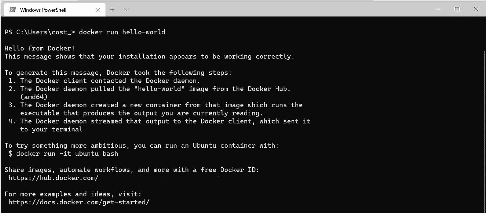

# Windows 上的 Apache Spark:Docker 方法

> 原文：<https://towardsdatascience.com/apache-spark-on-windows-a-docker-approach-4dd05d8a7147?source=collection_archive---------5----------------------->

## 如何用 Docker for Windows 以最少的工作量建立一个 Apache Spark 开发环境


卡斯帕·卡米尔·鲁宾在 [Unsplash](https://unsplash.com?utm_source=medium&utm_medium=referral) 上的照片

最近，我被分配到一个项目中，在这个项目中，整个客户数据库都在 **Apache Spark / Hadoop** 中。作为我所有项目的标准，我首先在公司笔记本电脑上准备开发环境，这是 Windows 作为标准操作系统提供的。正如许多人已经知道的，在 Windows 笔记本电脑上准备开发环境有时会很痛苦，如果笔记本电脑是公司的，那就更痛苦了(由于系统管理员、公司 VPN 等施加的限制)。).

为 Apache Spark / Hadoop 创建开发环境也是如此。在 Windows 上安装 Spark 极其复杂。需要安装几个依赖项(Java SDK，Python，Winutils，Log4j)，需要配置服务，需要正确设置环境变量。鉴于此，我决定将 Docker 作为我所有开发环境的首选。

现在，Docker 就是我的“**一环** / **一工具**”(参考《魔戒》):

> “在魔多的**土地**(窗户)阴影所在的地方。**一枚戒指**统治他们所有人，**一枚戒指**寻找他们，**一枚戒指**带来他们所有人，并在黑暗中束缚他们；在魔多的阴影之地"(**托尔金**


夏尔——照片由[格雷戈&路易斯·努内斯](https://unsplash.com/@greg_nunes?utm_source=medium&utm_medium=referral)在 [Unsplash](https://unsplash.com?utm_source=medium&utm_medium=referral) 上拍摄

如果 Docker 不是你的选择，有几篇文章可以解释这个问题

*   [**在 Windows 10 上安装 Apache PySpark**](http://Installing Apache PySpark on Windows 10)
*   [**Windows 上的 Apache Spark 安装**](https://sparkbyexamples.com/spark/apache-spark-installation-on-windows/)
*   [**Windows 上的 PySpark 入门**](http://deelesh.github.io/pyspark-windows.html)

**为什么是 Docker？**

1.  *Windows 上不需要安装任何库或应用，只需要 Docker。每周安装软件和库时，无需请求技术支持人员的许可。(他们会爱你的，相信我)*
2.  *Windows 将始终以最大潜力运行(不会有无数服务在登录时启动)*
3.  *拥有不同的项目环境，包括软件版本。例如:一个项目可以使用 Apache Spark 2 和 Scala，另一个项目可以使用 Apache Spark 3 和 pyspark，不会有任何冲突。*
4.  *社区做出来的现成形象有几个(postgres，spark，jupyters 等。)，使得开发设置更快。*

这些只是 Docker 的一些优势，还有其他的，你可以在 Docker 官方页面 上了解更多。

说了这么多，让我们言归正传，设置我们的 Apache Spark 环境。

# **为 Windows 安装 Docker**

你可以按照 [**开始指南**](https://docs.docker.com/docker-for-windows/install/) 下载 **Docker for Windows** 并按照说明在你的机器上安装 Docker。如果你的 Windows 是家庭版，你可以按照 [**的说明在 Windows 上安装 Docker 桌面**家庭版](https://docs.docker.com/docker-for-windows/install-windows-home/)。

当安装完成后，你可以重新启动你的机器(记得保存这篇文章在收藏夹，以备份从重启)。

如果您在此时或稍后运行任何错误，请查看微软故障排除指南[](https://docs.microsoft.com/en-us/visualstudio/containers/troubleshooting-docker-errors?view=vs-2019)**。**

**你可以从开始菜单启动 Docker，过一会儿你会在系统托盘上看到这个图标:**

****

**鲸鱼码头图标**

**你可以右击图标，选择**仪表盘**。在仪表板上，您可以点击**配置**按钮(右上方的发动机图标)。您将看到以下屏幕:**

****

**Docker 仪表板(图片由作者提供)**

**我喜欢做的一件事是取消选择选项:**

*   ****登录后启动 docker 桌面。****

**这样 docker 就不会从 windows 启动，我可以只在需要的时候通过开始菜单启动它。但是这是个人的选择。**

****检查对接器安装****

**首先，我们需要确保我们的 docker 安装工作正常。打开一个 Powershell(或 WSL 终端)，我强烈推荐令人惊叹的 [**Windows 终端**](https://docs.microsoft.com/en-us/windows/terminal/get-started) ，这是一个 Windows ( *类 Unix*)终端，它有很多帮助我们开发人员的功能(标签、自动完成、主题和其他很酷的功能)，并键入以下内容:**

```
~$ docker run hello-world 
```

**如果你看到这样的东西:**

****

**Docker hello-world(图片由作者提供)**

**你的 docker 安装是 **ok** 。**

# ****Jupyter 和 Apache Spark****

**正如我前面所说，docker 最酷的特性之一依赖于社区图片。几乎所有的需求都有许多预制的图像可供下载，只需很少或不需要配置就可以使用。花点时间探索一下 [**Docker Hub**](https://hub.docker.com/) ，自己看吧。**

**Jupyter 开发人员一直在做一项惊人的工作，积极地为数据科学家和研究人员维护一些图像，项目页面可以在这里找到[](https://jupyter-docker-stacks.readthedocs.io/en/latest/index.html)**。一些图像是:****

1.  ******jupyter/r-notebook** 包括来自 R 生态系统的流行软件包。****
2.  ****jupyter/scipy-notebook 包括来自科学 Python 生态系统的流行包。****
3.  ******jupyter/tensor flow-notebook**包括流行的 Python 深度学习库。****
4.  ****jupyter/pyspark-notebook 包含对 Apache Spark 的 Python 支持。****
5.  ****jupyter/all-spark-notebook 包括 Python、R 和 Scala 对 Apache Spark 的支持。****

****和许多其他人。****

****对于我们的 Apache Spark 环境，我们选择了**jupyter/pyspark-notebook**，因为我们不需要 R 和 Scala 支持。****

****要创建新容器，您可以转到终端并键入以下内容:****

```
****~$ docker run -p 8888:8888 -e JUPYTER_ENABLE_LAB=yes --name pyspark jupyter/pyspark-notebook****
```

****如果本地主机上还没有**jupyter/py spark-notebook**映像，这个命令会从 Docker Hub 中提取它。****

****然后，它启动一个运行 Jupyter 笔记本服务器的 name= **pyspark** 容器，并在主机端口 8888 上公开服务器。****

****您可以指示启动脚本在启动笔记本服务器之前定制容器环境。您可以通过向 docker run 命令传递参数(-e 标志)来实现这一点。所有可用变量的列表可在 [**docker-stacks docs** 中找到。](https://jupyter-docker-stacks.readthedocs.io/en/latest/using/common.html)****

****服务器日志出现在终端中，并包含笔记本服务器的 URL。您可以导航到该 URL，创建一个新的 python 笔记本并粘贴以下代码:****

****瞧啊。我们用最少的努力创造了我们的 Apache Spark 环境。您可以打开一个终端，使用 **conda** 或 **pip** 安装软件包，并按照您的意愿管理您的软件包和依赖项。完成后，您可以按下 **ctrl+C** 并停止容器。****

# ******数据持久性******

****如果你想启动你的容器并保存你的数据，你不能再次运行" **docker run** "命令，这将创建一个新的默认容器，那么我们需要做什么呢？****

****您可以在终端中键入:****

```
****~$ docker ps -a****
```

********

****Docker 容器列表(图片由作者提供)****

****这将列出所有可用的容器，要启动之前创建的容器，请键入:****

```
****~$ docker start -a pyspark****
```

****其中 **-a** 是一个标志，告诉 docker 将控制台输出绑定到终端，pyspark 是容器的名称。要了解更多关于 docker *start* 选项的信息，您可以访问[**Docker do**](https://docs.docker.com/engine/reference/commandline/start/)**cs**。****

# ******结论******

****在本文中，我们可以看到 docker 如何加快开发生命周期，并帮助我们减轻使用 Windows 作为主要开发操作系统的一些缺点。微软在 WSL、docker 和其他开发人员和工程师工具方面做得很好，甚至通过 Docker 和 WSL 支持 GPU 处理。未来大有可为。****

****感谢您阅读这篇文章，希望这篇小指南能够帮助您，并给任何决定使用 Docker for Windows 作为您的“ **One ring** ”的人提供宝贵的见解。****

****请随时在评论区提问或提供反馈。****