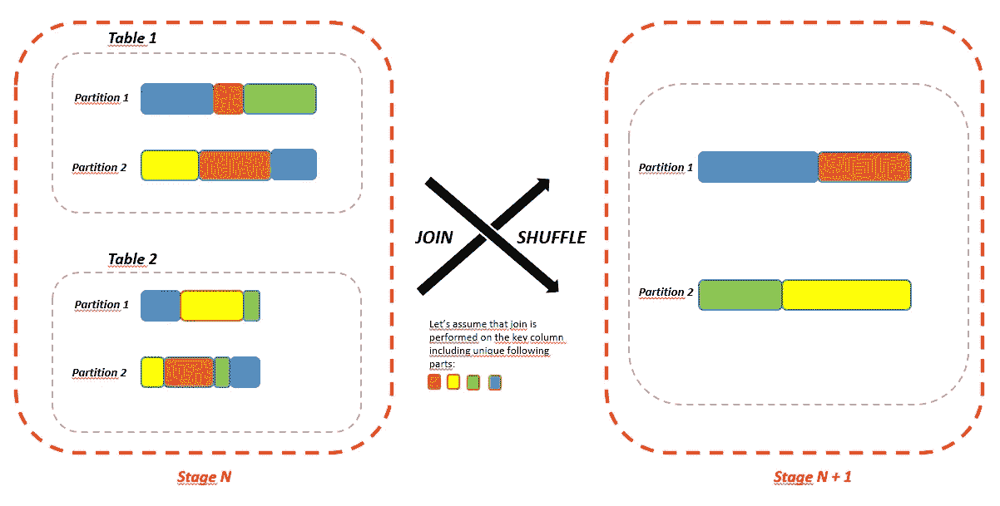
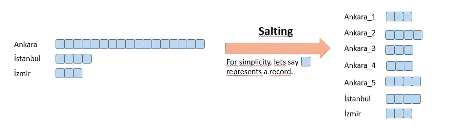
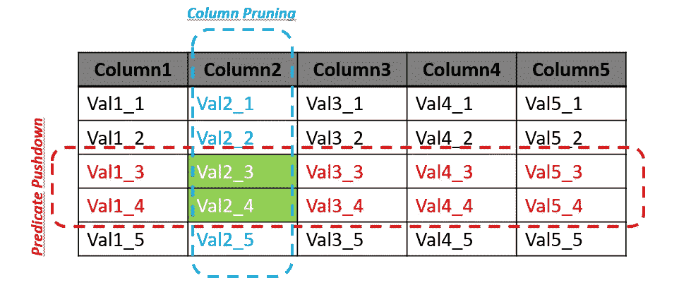

# Apache Spark 性能提升

> 原文：<https://towardsdatascience.com/apache-spark-performance-boosting-e072a3ec1179?source=collection_archive---------0----------------------->

## 关于 Pyspark 性能技巧的综合指南

Apache Spark 是一个通用的分布式数据处理平台，专门用于大数据应用。它成为处理大数据的事实标准。根据其分布式和内存中的工作原理，默认情况下它应该执行得很快。然而，在现实生活中并非总是如此。这篇文章是我上一篇文章的后续，我的上一篇文章是关于设置配置参数来优化 Spark 中的内存和 CPU 分配。在这里，我将提到在 Pyspark 中开发时一些有用的编码实现，以提高工作持续时间、内存和 CPU 使用率方面的性能。


照片由[在](https://unsplash.com/@veredcc?utm_source=medium&utm_medium=referral) [Unsplash](https://unsplash.com?utm_source=medium&utm_medium=referral) 上拍摄的 Caspi

## **1 —通过广播加入**

连接两个表是 Spark 中的主要事务之一。它主要需要洗牌，由于节点之间的数据移动，洗牌的成本很高。如果其中一个表足够小，则可能不需要任何洗牌操作。通过将小表广播到集群中的每个节点，可以简单地避免混乱。

假设您正在处理一个力场数据集，并且有一个名为 *df_work_order* 的数据框，其中包含力场团队处理的工作指令。此外，您还有另一个数据框，其中包含现场工作队的城市信息。虽然 *df_work_order* 中有超过 100M 行和许多列，但是 *df_city* 数据帧中大约有 100 条记录。要将城市信息添加到 *df_work_order* 数据帧中，广播小表就可以了。

```
df_work_order = df_work_order.join(broadcast(df_city), on=[‘TEAM_NO’], how=’inner’)
```

广播表的最大大小为 **8GB** 。Spark 还在内部维护了一个表大小的阈值，以自动应用广播连接。可以使用*spark . SQL . autobroadcastjointhreshold*配置阈值，默认为 **10MB** 。

## **2 —用窗口**替换联接&聚合

常见的模式是对特定的列执行聚合，并将结果作为新的特性/列保留在原始表中。正如所料，该操作由一个聚合和一个连接组成。作为一个更优化的选项，可以使用 [*窗口*](https://medium.com/jbennetcodes/how-to-get-rid-of-loops-and-use-window-functions-in-pandas-or-spark-sql-907f274850e4) 类来执行任务。我认为这是一种常见的模式，值得一提。两种方法的简单基准和 DAG(有向无环图)表示可以在[这里](https://blog.knoldus.com/using-windows-in-spark-to-avoid-joins/)找到。

```
# first approachdf_agg = df.groupBy('city', 'team').agg(F.mean('job').alias('job_mean'))df = df.join(df_agg, on=['city', 'team'], how='inner')# second approachfrom pyspark.sql.window import Windowwindow_spec = Window.partitionBy(df['city'], df['team'])
df = df.withColumn('job_mean', F.mean(col('job')).over(window_spec))
```

## **3 —最小化洗牌**

Spark 操作符通常是流水线式的，在并行进程中执行。然而，一次洗牌打破了这一管道。它们是物化点的种类，并在管道中触发一个新的阶段。在每个阶段结束时，所有中间结果都被具体化，并被下一个阶段使用。在每个阶段中，任务以并行方式运行。

原则上，[混洗](https://medium.com/swlh/revealing-apache-spark-shuffling-magic-b2c304306142)是数据在网络上的物理移动，并被写入磁盘，导致网络、磁盘 I/O 和数据序列化，从而使混洗成为一项成本高昂的操作。换句话说，它是有原因的数据重新分配。在 Spark 中，这些原因是像*加入*、*被*分组、*被*减少、*重新分配*和*不同*这样的变换。这些是非常常见的转换。因此，对于 Spark 应用程序来说，洗牌几乎是不可避免的。然而，减少洗牌是我们的责任。当先前的转换已经根据相同的分割器对数据进行了分区时，Spark 知道如何避免洗牌。

[为了减少网络 I/O](https://medium.com/road-to-data-engineering/spark-performance-optimization-series-3-shuffle-104738a83a9e) 在 shuffle 的情况下，可以创建具有更少机器并且每个机器具有更大资源的集群。然而，这完全是一个设计决策，不应该只考虑最小化洗牌。

*   **从洗牌点加入**

正如我之前提到的，join 是需要 shuffle 的常见操作之一。因为这是一个非常常见的转换，而且 join 中的洗牌可能是可以避免的，所以我想在一个单独的部分中讨论它。Spark 为 joins 提供了三种不同的算法—*SortMergeJoin*、 *ShuffleHashJoin* 和 *BroadcastHashJoin* 。从 2.3 版开始， *SortMergeJoin* 是默认的连接算法。使用 *BroadcastHashJoin，*可以获得最佳性能，但是，它对数据帧的大小有非常严格的限制。

洗牌或许可以避免，但当然要有所取舍。大多数情况下，通过对同样需要洗牌的数据应用其他转换，可以消除连接过程中的洗牌。重点是你额外创造了多少洗牌，作为回报，你将阻止多少洗牌。此外，每次洗牌的数据量是另一个应该考虑的重要因素——一次大洗牌还是两次小洗牌？所有这些问题的答案都不是直截了当的，如果是，这将是 Spark 的默认行为。这实际上取决于您正在处理的数据。

根据经验，如果在*连接*中，第一个表的每个分区最多被第二个表的一个分区使用，就没有必要进行洗牌。但是，如果第一个表的每个分区可能被第二个表的多个分区在*连接*中使用，那么就需要进行洗牌。以这种方式，我们可以在实现*连接*之前，通过对相同键值的两个表进行重新分区或分桶来避免洗牌。请记住，这些操作也需要洗牌。



加入 Spark 期间洗牌

[不避免混洗但减轻混洗中的数据量的典型例子](https://umbertogriffo.gitbook.io/apache-spark-best-practices-and-tuning/dataframe/joining-a-large-and-a-small-dataset)可以是一个大数据帧和一个中等数据帧的连接。如果一个中等大小的数据帧不够小而不能广播，但是它的密钥集足够小，我们可以广播中等大小数据帧的密钥集来过滤大数据帧。通过这种方式，如果我们能够从大规模数据中过滤出大量数据，我们可能会实现大幅减少数据量。

```
list_to_broadcast = df_medium.select('id').rdd.flatMap(lambda x: x).collect()
df_reduced = df_large.filter(df_large['id'].isin(list_to_broadcast))
df_join = df_reduced.join(df_medium, on=['id'], how='inner')
```

*   **铲斗移动**

[分桶](https://blog.clairvoyantsoft.com/bucketing-in-spark-878d2e02140f)是另一种数据组织技术，它用相同的桶值对数据进行分组。**它类似于分区，但是分区为每个分区创建一个目录，而分桶通过桶值上的散列将数据分布在固定数量的桶上。**关于*存储*的信息存储在 metastore 中。它可以在有或没有分区的情况下使用。一个重要的要点是分区应该只用于值数量有限的列；*当唯一值的数量很大时，bucketing* 也能很好地工作。通常在聚合和连接中用作键的列是*分桶*的合适候选列。

通过在混洗所需的操作之前对数据帧中的方便列应用*桶化*,我们可以避免多次可能的昂贵混洗。*分桶*通过在执行排序-合并连接之前对数据进行排序和混排来提高性能。**在连接中，表的两边有相同数量的桶是很重要的。**

要使用它，需要指定桶的数量和键列。不用说，我们应该对数据有深入的了解，以决定正确的桶数。一般来说，*通过*、*连接*、*组，不同的*变换受益于*桶*。

```
df = df.bucketBy(32, ‘key’).sortBy(‘value’)
```

任何情况下多洗牌都是好的？

可能会出现两种不同的情况。第一个是关于通过应用额外的洗牌来增加应用的并行度。如果应用程序由于低水平的并行性而无法利用集群中的所有内核，则可以应用重新分区来增加分区数量。这样，通过额外的洗牌，应用程序的整体性能可能会更好。

其次，当在大量分区上聚合时，在合并所有结果的驱动程序中，计算会很快成为单个线程的瓶颈。为了减轻驱动程序的负载，可以执行一轮额外的分布式聚合，通过聚合操作将数据集划分为更少的分区。在将结果发送到驱动程序进行最后一轮聚合之前，每个分区中的值会并行合并。这样，驱动程序中的计算负荷将会减轻。

## **4 —正确缓存**

仅仅因为您可以在内存中缓存数据帧，您就不应该本能地这样做。请记住，执行内存和存储内存共享一个统一的区域。越多不必要的*缓存*，就越有可能[将](https://medium.com/road-to-data-engineering/spark-performance-optimization-series-2-spill-685126e9d21f)溢出到磁盘上，从而影响性能。这样，重新计算可能比增加内存压力所付出的代价更快。Spark 中有几个[存储级别](https://spark.apache.org/docs/latest/api/java/index.html?org/apache/spark/storage/StorageLevel.html)，可能会根据序列化、内存和数据大小因素进行相应的设置。

如果一个数据帧将在后面的步骤中反复使用，那么在开始时*缓存*它以避免重复的转换负载将是合理的。这是使用*缓存*的理想情况。

我经常观察到的一个误用*缓存*的情况是在从 Cassandra 或 Parquet 这样的数据源读取数据后立即缓存数据帧。在这种情况下，整个数据被缓存，而不检查所有数据是否相关。例如，[在从 parquet](/best-practices-for-caching-in-spark-sql-b22fb0f02d34) 读取的情况下，Spark 将只读取元数据来获取计数，因此它不需要扫描整个数据集。对于过滤查询，它将使用列修剪，只扫描相关的列。另一方面，当从*缓存*中读取数据时，Spark 将读取整个数据集。

需要注意的是，如果您在数据帧上应用哪怕是一个小的事务，比如添加一个带有列的新列*，它将不再存储在*缓存*中。您可以使用*测向存储级别*检查数据帧的状态*

## **5 —打破沿袭—检查点**

[*检查点*](https://spark.apache.org/docs/latest/api/python/pyspark.sql.html#pyspark.sql.DataFrame.checkpoint) 截断执行计划，将检查点数据帧保存到磁盘上的临时位置，并重新加载回来，这在除 Spark 之外的任何地方都是多余的。然而，在 Spark 中，它作为一个性能提升因素出现。关键在于，每次在数据框上应用变换或执行查询时，查询计划都会增长。Spark 保存了在数据帧上运行 *explain* 命令时可以看到的应用于数据帧的所有变换历史。当查询计划开始变大时，性能会急剧下降，从而产生瓶颈。

以这种方式，*检查点*有助于刷新查询计划和具体化数据。它非常适合包含迭代算法和扩展新数据框架以执行不同类型分析的场景。更确切地说，在对数据帧进行*检查点操作*后，您不需要重新计算之前应用于数据帧的所有变换，它会永远存储在磁盘上。注意，即使在 *sparkContext* 被销毁之后，Spark 也不会清理检查点数据，清理工作需要由应用程序来管理。通过检查数据帧的状态来调试数据流水线也是*检查点*的一个很好的特性。

为了提高性能，缓存也是一种类似目的的替代方法。与*检查点*相比，它显然需要更多的内存。在*缓存*和*检查点*之间有一个很好的比较，以及什么时候更喜欢它们中的一个。这里可以看一下[。](https://medium.com/@adrianchang/apache-spark-checkpointing-ebd2ec065371)

还有一个意见[这里](https://medium.com/tblx-insider/how-we-reduced-our-apache-spark-cluster-cost-using-best-practices-ac1f176379ac)，数据流水线中*检查点*放在哪里。在创建 Spark 会话时，可以定义存储数据的位置。

```
# query plan without checkpointdf = df.filter(df['city'] == 'Ankara')
df = df.join(df1, on = ['job_id'], how='inner')
df.explain()# query plan with checkpointdf = df.filter(df['city'] == 'Ankara').checkpoint()
df = df.join(df1, on = ['job_id'], how=’inner’)
df.explain()
```

## **6 —避免使用 UDF**

乍一看，用户定义函数(UDF)是以函数方式解决问题的非常有用的材料，它们确实如此。然而，Pyspark 的成本非常高。它们一次操作一行，因此序列化和调用开销很大。换句话说，它们使数据在 executor JVM 和 Python 解释器之间移动，导致了巨大的序列化成本。此外，在调用一个 Python *UDF* 之后，Spark 会忘记之前数据是如何分布的。因此，与 Java 或 Scala 中的 *UDF* 实现相比，在 Pyspark 中使用*UDF*不可避免地会降低性能。

从这个意义上来说，在 Pyspark 中开发时，避免不必要的使用 UDF 是一个很好的实践。内置的 Spark SQL 函数可以满足大部分需求。在 Pyspark 中使用*UDF*之前，重新思考是很重要的。如果你仍然要使用*UDF*，考虑使用[pandas*UDF*](https://databricks.com/blog/2017/10/30/introducing-vectorized-udfs-for-pyspark.html)构建在 *Apache Arrow 之上。*它承诺完全用 Python 定义低开销、高性能的*UDF*的能力，从 2.3 版本开始就支持了。作为缓解由*UDF*引起的性能瓶颈的另一种选择，用 Java 或 Scala 实现的[*UDF*也可以从 PySpark](https://blog.cloudera.com/working-with-udfs-in-apache-spark/) 中调用。

为了更清楚*UDF*的不必要用法，看一下下面的例子，用*UDF*计算 [*z-score*](https://en.wikipedia.org/wiki/Standard_score) 没有任何意义。

```
# Unnecessary usage of UDFs
z_score_udf = F.udf(lambda x, m, s: (x — m) / s, DoubleType())
 df = df.withColumn('z_score',z_score_udf('completed_job',
 'mean_completed_job', 'std_completed_job'))# A better approach
df = df.withColumn('z_score',
 F.round(((F.col('completed_job') — F.col('mean_completed_job')) /
 F.col('std_completed_job')),2))
```

## **7 —处理倾斜数据—** 加盐&重新分配

整个阶段的工作持续时间直接取决于任务的最长运行时间。如果你在 Spark 上花了足够多的时间，你很可能会遇到这样一种情况:最后一个任务需要几分钟，而这个阶段的其余任务比如说 199 个任务在几毫秒内执行。它是数据沿分区分布不均匀的结果，即[数据偏斜问题](https://medium.com/road-to-data-engineering/spark-performance-optimization-series-1-skew-2762a0f288c)。这个问题可能发生在火花应用的中间阶段。此外，如果数据高度倾斜，甚至可能导致数据从内存溢出到磁盘。为了观察数据在分区之间的分布，可以使用 *glom* 函数。此外，借助 Spark UI 的*执行器*页面中筛选出的任务执行时间和任务处理的数据量信息，也可以检测出数据的不均匀分布。

```
*partition_number = df.rdd.getNumPartitions()
data_distribution = df.rdd.glom().map(len).collect()*
```

Spark 3.0 版本有一个很好的特性 [*自适应查询执行*](https://docs.databricks.com/spark/latest/spark-sql/aqe.html) ，它可以自动平衡分区间的偏斜。除此之外，还有两个独立的解决方法来解决分区间数据分布的*偏斜*—*加盐*和*重新分区*。

*   **腌制**

[*加盐*](https://dzone.com/articles/why-your-spark-apps-are-slow-or-failing-part-ii-da#:~:text=Salting%20is%20a%20technique%20where,to%20match%20the%20random%20keys.) 一个数据集基本上就是给数据添加随机化，帮助它更均匀的分布。额外的处理成本是在分区间均匀分布数据的回报，因此性能会提高。在聚合和联接中，具有相同键的所有记录都位于同一个分区中。因此，如果其中一个键比其他键有更多的记录，那么该键的分区就有更多的记录需要处理。 **S *alting* 技术仅应用于倾斜的键**，从这个意义上说，随机值被添加到键中。然后，获得*<key 1+random _ salting _ value>*，如果是 join 操作，则将这个创建的新键值与另一个表中复制的对应键值进行匹配。

为了澄清这一点，请看下面的例子，其中键列是 join 中的城市信息，而键列的分布在表中是高度倾斜的。为了均匀分布数据，我们将从 1 到 5 的随机值附加到较大的连接表的键值的末尾，并通过从 1 到 5 展开一个数组在较小的表中组成一个新列。



Spark 中的 Salting 示例

```
# Adding random values to one side of the join
df_big = df_big.withColumn('city', F.concat(df['city'], F.lit('_'), F.lit(F.floor(F.rand(seed=17) * 5) + 1)))# Exploding corresponding values in other table to match the new values of initial table
df_medium = df_medium.withColumn('city_exploded', F.explode(F.array([F.lit(i) for i in range(1,6)])))
df_medium = df_medium.withColumn('city_exploded', F.concat(df_medium['city'], F.lit('_'), df_medium['city_exploded'])). \
            drop('city').withColumnRenamed('city_exploded', 'city')# joining
df_join = df_big.join(df_medium, on=['city'], how='inner')
```

*   **重新分配**

*重新分区*执行完全洗牌，创建新分区，并提高应用程序中的并行级别。更多的分区将有助于处理数据偏斜问题，其额外成本是如上所述的全部数据的混洗。然而，向查询计划添加一个 shuffle 可能会消除另外两个 shuffle，从而加快运行速度。*重新分区*也可能由特定的列执行。如果在下面的步骤中这些列上存在多个连接或聚合，这将非常有用。

另一种方法是 *coalesce，*不同于 *repartition* 用于通过洗牌增加或减少分区号，它用于减少分区号而不洗牌。联合可能无法解决数据分布的不平衡问题。

```
# only set partition number
df = df.repartition(1000)
*# only partition accroding to colums*  
*df = df.repartition(['col_1', 'col_2', 'col_3'])
# reparition number and columns together
df.repartition(1000, ['col_1', 'col_2', 'col_3'])*
```

除了数据偏斜，我强烈推荐看一看[这篇文章](/should-i-repartition-836f7842298c)，它给出了关于*重新分配*的使用案例，并解释了幕后的细节。

配置输入格式以创建更多的分割并将输入数据以较小的块大小写出到 HDFS 是增加分区数量的其他技术。

## **8 —利用适当的文件格式—拼花地板**

Apache Parquet 是一种列存储格式，旨在只选择被查询的列，跳过其余的列。它通过 Spark 提供了最快的读取性能。 *Parquet* 将数据排列成列，将相关值放在彼此靠近的位置，以优化查询性能，最大限度地减少 I/O，并促进压缩。此外，它实现了[列修剪和谓词下推](https://umbertogriffo.gitbook.io/apache-spark-best-practices-and-tuning/storage/use-the-best-data-format)(基于统计的过滤器)，这是一个简单的过程，当查询一个巨大的表时，只选择所需的数据进行处理。它可以防止在内存中加载不必要的数据部分，并减少网络使用。



拼花格式—列修剪和谓词下推

> 关键是从数据源中只获取相关的数据，而不管您使用什么类型的数据源，并简单地防止全表扫描。它不是 Spark 的直接问题，而是直接影响 Spark 应用程序的性能。

例如，如果您使用 [Cassandra](https://cassandra.apache.org/) ，读取直接分区会非常有效。然而，它有时会变得棘手。假设，Cassandra 表是按日期列分区的，并且您有兴趣读取最近 15 天的数据。在这种情况下，简单地用*等于*操作符一个接一个地读取 day，然后将它们联合在一起，比用过滤器 *> date_current-15 读取要高效得多。*

```
# day_from is the starting point of date info and sequential 15 days are queried. 
dfs =list()
for i in range(15):
    day_i = day_from + timedelta(days=i)
    df = self.sc_session \
                .read \
                .format('org.apache.spark.sql.cassandra') \
                .options(table=self.table, keyspace=self.keyspace) \
                .load()
    df = df.filter(F.col('PARTITION_KEY_COLUMN') == day_i) # rather than > day_i
    dfs.append(df)
df_complete = reduce(DataFrame.union, dfs)  # union is a kind of narrow transformation which does not require shuffling
```

## **9 —使用带有 pyArrow 的托潘达斯**

作为官方定义， [*Apache Arrow*](https://arrow.apache.org/) 是一个跨语言的内存数据开发平台。它为平面和层次数据指定了一种标准化的语言无关的列内存格式。更清楚地说， *Apache Arrow* 是跨语言平台之间的桥梁，它有助于读取 Spark 数据帧，然后将数据帧写入 Apache Cassandra，而不会遭受巨大的低效序列化和反序列化性能。

Apache *PyArrow* 是 Arrow 的 Python 实现。它提供了一个 Python API，将 Arrow 的功能与 Python 环境结合在一起，包括领先的库，如*熊猫*和 *numpy* 。在 Spark 中，数据只要在 JVM 中，处理速度都非常快。然而，由于 Python 中丰富的数据处理库等原因，Pyspark 开发人员可能会在 Python 环境和 JVM 之间转移数据。从这个意义上来说，在从 pandas 数据帧移动到 Spark 数据帧时使用 *PyArrow* ，或者反之亦然，都会带来巨大的性能提升。

要使用 *PyArrow* ，首先要通过 *pip* 或 *conda* 安装。之后，在配置中启用它就足够了。剩下的都是一样的，编码没有变化。在 Pyspark 应用中使用 *pyArrow* 以及在 *pandas* 和 spark 数据帧之间的转换过程中发生了什么在这里解释得非常清楚[。](https://blog.clairvoyantsoft.com/optimizing-conversion-between-spark-and-pandas-dataframes-using-apache-pyarrow-9d439cbf2010)

```
pip install pyarrowspark.conf.set(“spark.sql.execution.arrow.enabled”, “true”)
```

# 外卖食品

*   当不需要返回精确的行数时，不要使用 *count()* 。为了检查数据帧是否为空，考虑到性能问题， *len(df.head(1)) > 0* 会更准确。
*   不要在你的产品代码中使用 *show()* 。
*   使用 *df.explain()* 来深入了解 Spark(物理规划的最终版本)中数据帧的内部表示是一个很好的实践。
*   在连接之前，总是通过过滤不相关的数据(行/列)来尽量减小数据大小。
*   在线/离线监控 Spark 应用。它可能会给你任何关于不平衡的数据分区的线索，作业在哪里被阻塞，以及查询计划。Spark UI 的替代产品可能是 Ganglia 。
*   基本上，避免使用循环。
*   关注内置功能，而不是定制解决方案。
*   确保 *join* 操作中的键列不包含空值。
*   [将较大的数据集放在左边的连接中](https://medium.com/softwaresanders/improving-your-apache-spark-application-performance-ec5d64bc3c75)。
*   请记住，Spark 是以*懒惰评估*逻辑运行的。因此，在调用动作之前，不会触发任何东西。这可能会导致[无意义的错误](https://medium.com/enigma-engineering/things-i-wish-id-known-about-spark-when-i-started-one-year-later-edition-d767430181ed)代码。
*   如果您的其余代码不需要缓存中的数据，请将其取消持久化。
*   完成应用程序后，关闭/停止 Spark 会话。
*   在 [Spark 3.0](https://medium.com/@ch.nabarun/whats-new-in-spark-3-8250a65b3144) 中，考虑到版本升级，通过 [*自适应查询执行*](https://databricks.com/blog/2020/05/29/adaptive-query-execution-speeding-up-spark-sql-at-runtime.html) 解决了性能问题，实现了重大改进。
*   对于数据操作，更喜欢数据帧而不是 rdd。
*   一般来说，大于大约 **20 KiB** 的任务可能值得优化。
*   一般来说，建议您的集群中每个 CPU 内核**执行 2-3 个任务**。
*   每个分区有一个在 **128MB** 内的块来实现并行性总是好的。
*   *Csv* 和 *Json* 数据文件格式可提供高写入性能，但读取速度较慢，另一方面，*拼花*文件格式非常快，可提供最佳读取性能，但在写入操作方面比其他提及的文件格式慢。
*   物理计划是自下而上读取的，而 DAG 是自上而下读取的。
*   *交换*的意思是阶段之间发生了洗牌，基本上是性能下降。
*   过多的阶段数可能是性能问题的迹象。
*   [垃圾收集(GC)](https://spark.apache.org/docs/latest/tuning.html#garbage-collection-tuning) 是另一个可能导致性能问题的关键因素。从 Spark UI 的*执行者*标签中查看。在任何与 GC 相关的情况下，通常都可以使用 Java GC 选项。
*   序列化在任何分布式应用程序的性能中也扮演着重要的角色。将对象序列化的速度较慢或消耗大量字节的格式将大大降低计算速度。对于基于 Scala/Java 的 Spark 应用，强烈推荐使用 [Kryo 序列化](https://spark.apache.org/docs/latest/tuning.html#data-serialization)。在 Pyspark 中，支持 [Marshal 和 Pickle](https://spark.apache.org/docs/latest/api/python/_modules/pyspark/serializers.html) 序列化器， *MarshalSerializer* 比 *PickleSerializer* 快，但支持的数据类型少。
*   注意，如果您更喜欢在 *docker* 环境中使用 Spark，您可能会体验到性能损失。在我们的项目中，我们观察到，在 *docker* 环境中，Spark 应用程序使用相同的配置指标需要更长的时间。

# 有用的链接

*   [https://towards data science . com/the-art-of-joining-in-spark-dcbd 33d 693 c](/the-art-of-joining-in-spark-dcbd33d693c)
*   [https://medium . com/@ brajendragouda/5-key-factors-to-keep-in-mind-while-optimization-Apache-spark-in-AWS-part-2-c 0197276623 c](https://medium.com/@brajendragouda/5-key-factors-to-keep-in-mind-while-optimising-apache-spark-in-aws-part-2-c0197276623c)
*   [https://medium . com/teads-engineering/spark-performance-tuning-from-the-trench-7 cbde 521 cf 60](https://medium.com/teads-engineering/spark-performance-tuning-from-the-trenches-7cbde521cf60)
*   [https://medium . com/tblx-insider/how-we-reduced-our-Apache-spark-cluster-cost-using-best-practices-ac1f 176379 AC](https://medium.com/tblx-insider/how-we-reduced-our-apache-spark-cluster-cost-using-best-practices-ac1f176379ac)
*   [https://medium . com/Expedia-group-tech/part-3-efficient-executor-configuration-for-Apache-spark-b 4602929262](https://medium.com/expedia-group-tech/part-3-efficient-executor-configuration-for-apache-spark-b4602929262)
*   [https://towards data science . com/about-joins-in-spark-3-0-1 E0 ea 083 ea 86](/about-joins-in-spark-3-0-1e0ea083ea86)
*   [https://towards data science . com/be-in-charge-of-query-execution-in-spark-SQL-c 83 D1 e 16 b 9 b 8](/be-in-charge-of-query-execution-in-spark-sql-c83d1e16b9b8)
*   [https://ch-naba run . medium . com/Apache-spark-optimization-techniques-54864d 4 FDC 0 c](https://ch-nabarun.medium.com/apache-spark-optimization-techniques-54864d4fdc0c)
*   [https://changhsinlee.com/pyspark-dataframe-basics/](https://changhsinlee.com/pyspark-dataframe-basics/)
*   https://robertovitillo.com/spark-best-practices/
*   【https://luminousmen.com/post/spark-tips-partition-tuning 