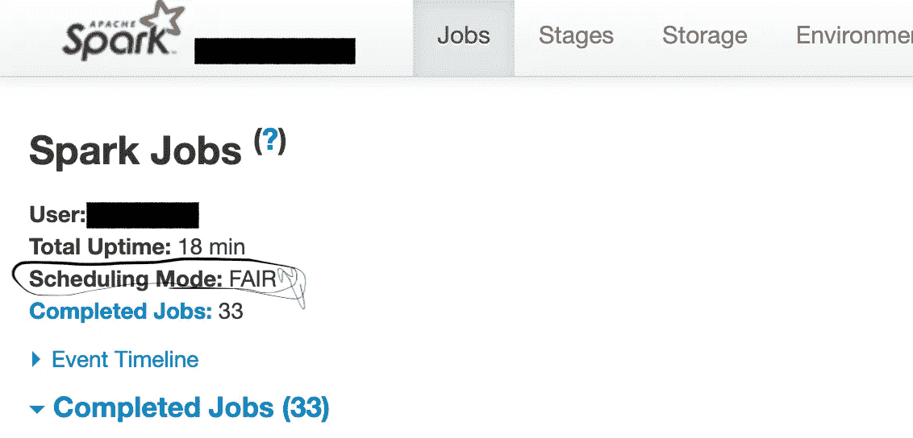
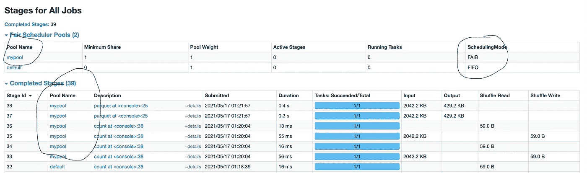

# Apache Spark:在应用程序中的并发作业之间公平共享

> 原文：<https://towardsdatascience.com/apache-spark-sharing-fairly-between-concurrent-jobs-d1caba6e77c2?source=collection_archive---------12----------------------->

## 确保在应用程序中的并发作业之间平等分配资源，而不管它们的大小

Krzysztof Maksimiuk 在 [Unsplash](https://unsplash.com/s/photos/jars?utm_source=unsplash&utm_medium=referral&utm_content=creditCopyText) 上的照片

> 注意:在本帖中，短语“spark job”和“job”用于指代 spark 操作，如保存、收集、计数等。，短语“并发作业”是指在一个应用程序中同时运行的多个并行 spark 动作。

在我的 [***上一篇文章***](https://medium.com/analytics-vidhya/boosting-apache-spark-application-by-running-multiple-parallel-jobs-25d13ee7d2a6) 中，我们讨论了通过 Scala Futures 或 Parallel Collections 并发运行 Spark 作业来提升单调的 Apache Spark 应用程序，这**将应用程序时间减少到了四分之一**。(如果你之前没看过，现在[看](https://medium.com/analytics-vidhya/boosting-apache-spark-application-by-running-multiple-parallel-jobs-25d13ee7d2a6)就值得了。)

然而，可能存在这样一种情况，即仅在 spark 作业级别实现并发性不足以优化应用程序的性能。例如，一个大型作业消耗所有可用的 spark 资源，并将其他并行作业推入等待状态，直到前者的任务没有利用所有资源。发生这种情况是因为 spark 在应用程序中的默认调度选项是 FIFO(先进先出)，这确保了第一个作业优先获得所有可用的 Spark 资源，直到其阶段有任务运行。在大多数这样的场景中，我们绝不会希望 spark 应用程序只被一个长作业卡住，同时，我们希望所有 spark 作业，无论是短作业还是长作业，都能公平地共享资源。

为了满足我们的需求，Apache Spark 提供了一个完美的解决方案，通过它我们可以将默认的调度选项更改为 FAIR，这样任务之间的任务就会以循环方式执行。这意味着所有的工作都获得了同等份额的星火资源。**通过使用公平调度，我将我的应用程序的持续时间减少了 27 %,因此，我强烈推荐它用于任何同时运行多个并行 spark 作业的 spark 应用程序。**

> 利用公平调度的先决条件:在 Spark 应用程序中，多个任务从不同的线程提交。如果你不知道怎么做，请看这里的。

此时，我们准备探索如何在具有并发作业的 Spark 应用程序中实现公平调度。

首先创建“ [fairscheduler.xml](https://gist.github.com/hariviapak/06310a6f62fe2b59ea37b8d1cc051726) ”，使用您选择的池名和调度模式 FAIR。这里，我们需要明确地提到它的调度模式，因为默认情况下，它是每个池的 FIFO。你可以在这里了解更多[。](https://spark.apache.org/docs/latest/job-scheduling.html#configuring-pool-properties)

[https://gist . github . com/hariviapak/06310 a6f 62 fe2b 59 ea 37 b 8 D1 cc 051726](https://gist.github.com/hariviapak/06310a6f62fe2b59ea37b8d1cc051726)

其次，我们需要配置 spark 应用程序，以便在创建 spark 会话或提交 Spark 应用程序时使用公平调度。

最后，我们需要将" [fairscheduler.xml](https://gist.github.com/hariviapak/06310a6f62fe2b59ea37b8d1cc051726) "中定义的池设置为 spark 上下文的本地属性。

[https://gist . github . com/hariviapak/d3ba 23 ea 12082 e 6 f 36 df 124 e 5 f 6 bea 8 a](https://gist.github.com/hariviapak/d3ba23ea12082e6f36df124e5f6bea8a)

## **通过 Spark UI 确认公平调度**

确认公平调度是否成功实施是非常重要的，因为在执行上述步骤时稍有差错，就可能使您回到起点。此外，

1.  仅将" *spark.scheduler.mode* "设置为" FAIR "是不够的，因为任务的阶段仍在调度模式为 FIFO 的默认池中运行。
2.  这就是我们用公平调度模式创建自己的池的原因。
3.  并将该池设置为 spark context 的本地属性。

为了确认我们的工作，我们可以使用 Spark UI。

1.  检查“Jobs”页面，确认调度模式是公平的，但是，如前所述，它不能确保池级别的调度也是公平的。
2.  因此，转到“阶段”页面，检查正在运行或已完成阶段的池名称。在我们的例子中，应该是“ *mypool* ”。

下面的片段将帮助你更清楚地理解它。

Spark UI 的工作网页

Spark UI 的 Stages 网页

总之，*公平调度*是一个必须具备的特性，如果一个应用程序包含并发运行的大小 spark 任务。通过这种方式，我们可以在资源利用方面显著提高应用程序的性能，并最终节省成本。

我希望，你喜欢这篇文章。我很乐意在评论区听到你的建议或反馈。

***参考文献***

*   Apache Spark 官方文档|[https://spark.apache.org/docs/latest/job-scheduling.html](https://spark.apache.org/docs/latest/job-scheduling.html)
*   [通过运行多个并行作业提升 Apache Spark 应用](https://medium.com/analytics-vidhya/boosting-apache-spark-application-by-running-multiple-parallel-jobs-25d13ee7d2a6)Hari Viapak Garg