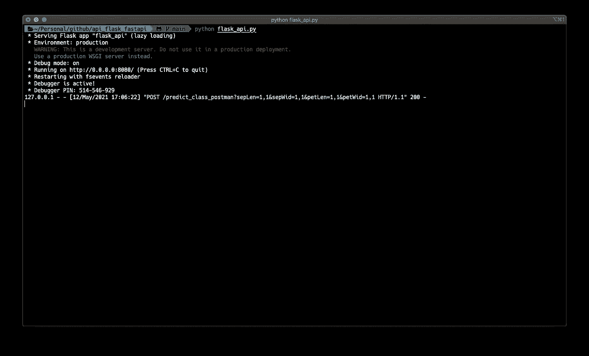

# 从人工智能算法到全功能 API

> 原文：<https://towardsdatascience.com/api-flask-fastapi-http-postman-e1673d672596?source=collection_archive---------15----------------------->

## 如何简单高效地将你的 AI 算法公开为 API


图片由来自 [Pexels](https://www.pexels.com/fr-fr/photo/banniere-web-avec-des-informations-en-ligne-sur-ordinateur-3803517/?utm_content=attributionCopyText&utm_medium=referral&utm_source=pexels) 的 [Brett Sayles](https://www.pexels.com/fr-fr/@brett-sayles?utm_content=attributionCopyText&utm_medium=referral&utm_source=pexels) 拍摄

作为一名数据科学家，当与其他开发人员一起从事一个复杂的项目时，你经常需要将你的人工智能算法打包到我们称为`API`的东西中，后端可以调用它来协调你的应用程序。使用 API 有几个好处，可以使您的预测更高效、更省时。

在这篇文章中，我们将通过深入研究`RESTful`API 的定义，然后我们将通过模块`Flask`和`FastAPI`使用 python 创建一个 API。最后，我们将看到如何通过`Curls`或软件`Postman`使用`HTTP`协议与它通信。

# 目录

摘要如下:

1.  *API & RESTful API*
2.  *HTTP 协议& CURL &邮递员*
3.  *数据科学算法*
4.  *烧瓶*
5.  *FastAPI*

# API & RESTful API

一个 API，作为一个应用程序的接口，是一个计算机工具，它允许将你的代码打包成一个服务，这个服务可以简单有效地进行交流。
这可以被视为将您的开发转化为一个黑盒的一个步骤，黑盒带有预定义的通信代码，允许您作为`provider`随时向团队中的`clients`或`consumers`前端和后端开发人员公开。


作者图片

有许多免费的 API(天气、航班搜索、足球……)可以在 [RapidAPI](https://rapidapi.com/blog/most-popular-api/) 上探索。
原料药有多种类型:

*   **公共**或**开放**API:无限制
*   **私有**或*内部*API:在同一公司内使用
*   **合作伙伴**API:需要许可证才能访问

如果 API 使两个应用程序能够通信， **Web 服务 API**，对于它们来说，使给定网络上的两台机器之间的交互成为可能。这是一个使用万维网上的`url`来提供对其服务的访问的系统。
web 服务 API 有很多种，比如 *SOAP* ， *JSON-RPC* ， *XML-RPC* ，...等等。在本文中，我们将主要关注另一种类型的 **REST** 。与其他协议形式的 web 服务 API 不同，REST 是一套五大架构原则，使得 RESTful web 服务变得轻便、高效、可伸缩且易于使用:

*   **客户机-服务器架构**:当客户机与服务器通信时，它要么接受请求并发送响应，要么拒绝请求并通知服务器
*   **无状态**:不在服务器上存储任何信息。这也意味着客户端应该确保所有需要的数据都在请求中
*   **可缓存性**:在客户端实现，以便在发送旧请求时返回更快的响应
*   **分层系统**:覆盖附加层的能力，例如，安全层或负载均衡器，而不影响客户机-服务器交换
*   **统一接口**:简单来说，就是使用`URIs`，为**U**n form**R**e source**I**标识器，来公开仓库的结构。结合 HTTP 方法，它允许与服务器进行有效的`XML`或`JSON`交换。


作者图片

# HTTP 协议& CURL & Postman

## HTTP 协议

一旦你创建了你的 web 服务 API，你将需要与它通信，这就是 HTTP 开始发挥作用的时候。HTTP，是一种网络通信协议，用于在网络上交换数据。它旨在促进网络服务器和网络导航器(如 Google Chrome 和 Safari)之间的通信。它是一个无状态的协议，遵循客户端-服务器架构，很容易与 RESTful APIs 集成。


作者图片

下面是一些最常用的协议方法:

*   POST :在服务器上创建一个资源
*   **GET** :访问服务器上的资源
*   **上传**:更新服务器上的一个资源
*   **删除**:删除服务器上的一个资源

## 卷曲

通常，在虚拟机上工作时，您只能访问一个`command line interface`，因为没有`graphical interface`，因此也没有导航器。
**CURL** ，for**C**lient**U**RL**R**equest**L**library，之前名为 *httpget* ，是一个命令行工具，用于获取和发送资源到连接到某个网络的服务器。它支持许多协议，包括 HTTP。有许多 curl 选项，但是在本文中，我们将专注于一个专门针对 RESTful API 的选项:

*   **-X** :确定与服务器通信时使用的 HTTP 方法

## 邮递员

Postman 是一个简化 API 开发和测试的软件或平台。
通过其用户友好的界面，它提供了一种非常简单的发送请求的方式:

*   选择 HTTP **方法**
*   输入 API 正在监听的 **URL** 和**端口**
*   选择**参数**，这将自动更新 HTTP 请求
*   **向 API 发送**请求

可以在页面的**主体**部分的**底部**看到响应。


作者图片

# 数据科学算法

为了便于说明，我们将考虑**鸢尾**数据集，其中 ML 任务包括使用四个变量(萼片长度、萼片宽度、花瓣长度和花瓣宽度)将鸢尾分为三类(Setosa、Versicolour 和 Virginica)。

iris 数据集将从 **Sklearn** 下载，我们将使用**随机森林分类器**进行训练。

```
import numpy as np
import pandas as pd

from sklearn.ensemble import RandomForestClassifier
from sklearn.model_selection import train_test_split
from sklearn.metrics import confusion_matrix
from sklearn.metrics import accuracy_score
from sklearn.datasets import load_iris
from matplotlib import pyplot as plt
import joblib

%matplotlib inline
WEIGHTS_DIR="weights/"

iris = load_iris()

df=pd.DataFrame(iris.data, columns=iris.feature_names)
df["species"]=iris.target

X = df[iris.feature_names]
y = df['species']

X_train, X_test, y_train, y_test = train_test_split(X, y, test_size=0.20, random_state=42)

clf = RandomForestClassifier(max_depth=2, random_state=42)
clf.fit(X_train, y_train)
y_pred = clf.predict(X_test)

print("Confusion matrix: \n", confusion_matrix(y_test, y_pred))
print("Accuracy score: ", accuracy_score(y_test, y_pred, normalize=True) )

joblib.dump(clf, WEIGHTS_DIR+"clf_iris.joblib")
```

经过训练，我们得到以下结果:

```
>>> Confusion matrix:
    array([[10,  0,  0],
        [ 0,  9,  0],
        [ 0,  0, 11]])
>>> Accuracy score: 1.0
```

在以下段落中，我们将对以下数据集进行预测:


# 瓶

Flask 是一个 python 模块，用于创建 API 并在给定的网络上公开它们的服务。可以使用以下命令行安装它:

```
pip install flask
```

在下面的代码中，我将创建一个 flask API，它使用之前训练的模型来预测虹膜的类别，给定四个变量作为输入。

## 初始化 API

```
#%%
from flask import Flask, request, jsonify
import pandas as pd
import joblib
import jsonWEIGHTS_DIR = "weights/"
FLASK_API = Flask(__name__)
```

## 加载模型

```
def get_iris_model():
    loaded_clf = joblib.load(WEIGHTS_DIR + "clf_iris.joblib")
    return loaded_clfloaded_clf = get_iris_model()def str_to_float_list(arg):
    arg = arg.split(",")
    arg = [float(x) for x in arg]
    return arg
```

## 路由

当创建一个 API 时， **Routes** 用于公开它的功能和服务。在 flask 中，使用 decorators 添加了。

***-predict _ class _ postman*** 我们创建路线，通过该路线我们将进行预测。这条路径返回一个 json 响应，其中包含每组变量的相应类。当使用 Postman 时，我们使用**请求**的 **args** 参数提取变量。

```
#%%Postman
def get_params_postman(request):
    sep_length = str_to_float_list(request.args.get("sepLen"))
    sep_width = str_to_float_list(request.args.get("sepWid"))
    pet_length = str_to_float_list(request.args.get("petLen"))
    pet_width = str_to_float_list(request.args.get("petWid")) return (sep_length, sep_width, pet_length, pet_width)@FLASK_API.route("/predict_class_postman", methods=["GET", "POST"])
def predict_class_postman():
    (sep_length, sep_width, pet_length, pet_width) = get_params_postman(request)
    new_row = pd.DataFrame(
        {
            "sepal length (cm)": [float(x) for x in sep_length],
            "sepal width (cm)": [float(x) for x in sep_width],
            "petal length (cm)": [float(x) for x in pet_length],
            "petal width (cm)": [float(x) for x in pet_width],
        }
    )
    y_pred = list(loaded_clf.predict(new_row))
    y_pred = [str(x) for x in y_pred] response = {"y_pred": ",".join(y_pred)}
    return jsonify(response)
```

***-predict _ class _ curl*** 我们这次创建另一条路由来与 CURL 命令通信。我们使用发送的**请求**的方法 **form.get** 从命令行提取变量。

```
#%%CURL
def get_params_curl(request):
    request_input = request.form.get("input")
    request_input = json.loads(request_input) sep_length = str_to_float_list(request_input["sepLen"])
    sep_width = str_to_float_list(request_input["sepWid"])
    pet_length = str_to_float_list(request_input["petLen"])
    pet_width = str_to_float_list(request_input["petWid"]) return (sep_length, sep_width, pet_length, pet_width) @FLASK_API.route("/predict_class_curl", methods=["GET", "POST"])
def predict_class_curl():
    (sep_length, sep_width, pet_length, pet_width) = get_params_curl(request)
    new_row = pd.DataFrame(
        {
            "sepal length (cm)": [float(x) for x in sep_length],
            "sepal width (cm)": [float(x) for x in sep_width],
            "petal length (cm)": [float(x) for x in pet_length],
            "petal width (cm)": [float(x) for x in pet_width],
        }
    )
    y_pred = list(loaded_clf.predict(new_row))
    y_pred = [str(x) for x in y_pred] response = {"y_pred": ",".join(y_pred)}
    return jsonify(response)
```

## 启动服务

一旦我们定义了上面的所有元素，我们通过添加以下代码来启动 API 的服务:

```
#%%
if __name__ == "__main__":
    FLASK_API.debug = True
    FLASK_API.run(host="0.0.0.0", port="8080")
```

*   `debug mode`有助于即时可视化变化
*   我们可以选择暴露 API 的`URL`和`port`:

要启动 API，请键入:

```
python flask_api.py
```

其中`flask_api.py`是托管上面开发的所有代码的文件。

我们得到以下响应:

```
>>> * Serving Flask app "flask_api" (lazy loading)
>>> * Environment: production
WARNING: This is a development server. Do not use it in a production deployment.
Use a production WSGI server instead.
>>> * Debug mode: on
>>> * Running on [http://0.0.0.0:8080/](http://0.0.0.0:8080/) (Press CTRL+C to quit)
>>> * Restarting with fsevents reloader
>>> * Debugger is active!
>>> * Debugger PIN: 514-546-929
```

**请求&响应**

***+邮递员***
给定了`HTTP request`上的邮递员:

```
localhost:8080/predict_class_postman?sepLen=1,5&sepWid=2,6&petLen=3,7&petWid=4,8
```

答复如下:

```
{
  "y_pred": "1,2"
}
```


作者图片

**+ CURL**
我们使用 CURL 启动以下命令行来与 API 通信:

```
curl -F "input={\"sepLen\":\"1,5\",\"sepWid\":\"2,6\",\"petLen\":\"3,7\",\"petWid\":\"4,8\"}" -X POST "http://0.0.0.0:8080/predict_class_curl"
```

正如所料，我们得到了相同的结果:

```
{
  "y_pred": "1,2"
}
```


作者图片

**HTTP 代码:**如果请求正确，API 返回 HTTP 代码 **200** 。还存在其他代码，如客户端错误的 *4xx* 和服务器错误的 *5xx* 。



作者图片

你可以在我的 GitHub [资源库](https://github.com/ismail-mebsout/api_flask_fastapi/blob/main/flask_api.py)中找到 flask API 的代码。

# FastAPI

[FastAPI](https://fastapi.tiangolo.com/) 是另一个支持 API 开发的 python 模块。
可以使用命令行进行安装:

```
pip install fastapi
```

它与 Flask 非常相似，但速度更快，有一些细微的变化:

*   **使用`request.query_params`提取`postman`中的查询参数**
*   **使用`eval(input)`获得`curls`中的形状参数**，其中`input: str = Form(...)`

```
#%%
import pandas as pd
import joblib
import json
from fastapi import FastAPI, Form, Request
import uvicorn

WEIGHTS_DIR = "weights/"
FASTAPI_API = FastAPI()

#%%
def get_iris_model():
    loaded_clf = joblib.load(WEIGHTS_DIR + "clf_iris.joblib")
    return loaded_clf

def str_to_float_list(arg):
    arg = arg.split(",")
    arg = [float(x) for x in arg]
    return arg

loaded_clf = get_iris_model()

#%%Postman
def get_params_postman(query_params):
    sep_length = str_to_float_list(query_params["sepLen"])
    sep_width = str_to_float_list(query_params["sepWid"])
    pet_length = str_to_float_list(query_params["petLen"])
    pet_width = str_to_float_list(query_params["petWid"])
    return (sep_length, sep_width, pet_length, pet_width)

@FASTAPI_API.post("/predict_class_postman")
def predict_class_postman(request: Request):
    query_params = dict(request.query_params)
    (sep_length, sep_width, pet_length, pet_width) = get_params_postman(query_params)
    new_row = pd.DataFrame(
        {
            "sepal length (cm)": [float(x) for x in sep_length],
            "sepal width (cm)": [float(x) for x in sep_width],
            "petal length (cm)": [float(x) for x in pet_length],
            "petal width (cm)": [float(x) for x in pet_width],
        }
    )
    y_pred = list(loaded_clf.predict(new_row))
    y_pred = [str(x) for x in y_pred]

    response = {"y_pred": ",".join(y_pred)}
    return response

#%%CURL
def get_params_curls(input_var):
    sep_length = str_to_float_list(input_var["sepLen"])
    sep_width = str_to_float_list(input_var["sepWid"])
    pet_length = str_to_float_list(input_var["petLen"])
    pet_width = str_to_float_list(input_var["petWid"])
    return (sep_length, sep_width, pet_length, pet_width)

@FASTAPI_API.post("/predict_class_curl")
def predict_class_curl(input: str = Form(...)):
    input_var = eval(input)
    (sep_length, sep_width, pet_length, pet_width) = get_params_curls(input_var)
    new_row = pd.DataFrame(
        {
            "sepal length (cm)": [float(x) for x in sep_length],
            "sepal width (cm)": [float(x) for x in sep_width],
            "petal length (cm)": [float(x) for x in pet_length],
            "petal width (cm)": [float(x) for x in pet_width],
        }
    )
    y_pred = list(loaded_clf.predict(new_row))
    y_pred = [str(x) for x in y_pred]

    response = {"y_pred": ",".join(y_pred)}
    return response

#%%
if __name__ == "__main__":
    uvicorn.run(FASTAPI_API, host="0.0.0.0", port=8080)
```

FastAPI 是使用[uvicon](https://www.uvicorn.org/)运行的。这是一个闪电般快速的 ASGI 服务器实现，基于 uvloop 和 httptools，其中 uvloop 是 asyncio 事件循环的基于 Cython 的替代，比默认事件循环快 2-4 倍。
可以使用以下命令行安装 Uvicorn:

```
pip install uvicorn
```

要启动 API，请键入:

```
python fastapi_api.py
```

其中`fastapi_api.py`是托管上面开发的所有代码的文件。

我们得到以下响应:

```
>>> INFO:     Started server process [50003]
>>> INFO:     Waiting for application startup.
>>> INFO:     Application startup complete.
>>> INFO:     Uvicorn running on [http://0.0.0.0:8080](http://0.0.0.0:8080) (Press CTRL+C to quit)
```

请求和回应

**+ Postman**
给定对 Postman 的 HTTP 请求:

```
localhost:8080/predict_class_postman?sepLen=1,5&sepWid=2,6&petLen=3,7&petWid=4,8
```

答复如下:

```
{
  "y_pred": "1,2"
}
```


作者图片

**+ CURL**
我们使用 CURL 启动以下命令行与 API 进行通信:

```
curl -F "input={\"sepLen\":\"1,5\",\"sepWid\":\"2,6\",\"petLen\":\"3,7\",\"petWid\":\"4,8\"}" -X POST "http://0.0.0.0:8080/predict_class_curl"
```

正如所料，我们用一个 **200** HTTP 代码得到了相同的结果:

```
{
  "y_pred": "1,2"
}
```


作者图片

你可以在我的 GitHub [资源库](https://github.com/ismail-mebsout/api_flask_fastapi/blob/main/fastapi_api.py)中找到 FastAPI API 的代码。

# 结论

API 是非常强大的工具，允许您向服务公开您的工作，并促进与服务的通信。当在一个开发团队中工作时，掌握这些技术对于项目的进展变得至关重要。