# API 与 R 的交互

> 原文：<https://towardsdatascience.com/api-interaction-with-r-46bf1d4f4fe6?source=collection_archive---------28----------------------->

## [实践教程](https://towardsdatascience.com/tagged/hands-on-tutorials)

## 演示与 NHL API 交互的插图

这个文档是一个小插图，展示了如何从一个 [API](https://en.wikipedia.org/wiki/API) 中检索数据。为了演示，我将与 NHL API 进行交互。我将构建一些函数来与一些端点进行交互，并探索一些我可以检索的数据。

需要注意的是，其中一些函数返回团队级别的数据。一些 API 使用特许 ID 号，而一些使用最近的团队 ID 来选择特定团队的端点。因此，如果您使用我的任何功能，我建议您提供完整的团队名称(例如`"Montréal Canadiens"`)。我的函数会把它们解码成合适的 ID 号。

这篇文章很长，所以如果需要编写函数与 API 交互的例子，只需阅读前半部分。

我在文章的底部提供了一个到 github pages 版本的链接，它提供了一个到 github repo 的链接。

# 要求

为了使用与 NHL API 交互的函数，我使用了以下包:

*   `[tidyverse](https://www.tidyverse.org/)`:大量有用的数据操作和可视化特性
*   `[jsonlite](https://cran.r-project.org/web/packages/jsonlite/)` : API 交互

除了这些包之外，我还在文档的其余部分使用了以下包:

*   `[cowplot](https://cran.r-project.org/web/packages/cowplot/index.html)`:针对`ggplot2`的额外功能
*   `[imager](https://cran.r-project.org/web/packages/imager/)`:载入图像
*   `[broom](https://cran.r-project.org/web/packages/broom/vignettes/broom.html)`:整理回归输出进行显示
*   以友好的方式显示表格

# API 交互功能

在这里，我定义了与 [NHL 记录 API](https://gitlab.com/dword4/nhlapi/-/blob/master/records-api.md) 和 [NHL 统计 API](https://gitlab.com/dword4/nhlapi/-/blob/master/stats-api.md) 交互的函数，以及一些辅助函数。

## `convertToNumeric`

我创建了这个助手函数来将包含存储为`character`值的数字数据的列转换为数字数据类型。我遇到了一个问题，我的 API 调用将一些数字数据作为`character`数据返回，我需要一种方法来处理这个问题，而不只是根据需要调用`as.numeric`。

```
convertToNumeric **<-** **function**(vec){
  *###*
  *# This function will convert the input vector to a numeric vector    
  # if it is able to. Otherwise, it just returns the vector.*
  *###*

  *# If any of the values in vec return NA when trying to convert to 
  # numeric, set output to the unchanged input.*
  **if** (**any**(**is.na**(suppressWarnings(**as.numeric**(vec))) **==** **TRUE**)){
    output **<-** vec
  }
  *# Otherwise, convert vec to a numeric vector.*
  **else** {
    output **<-** **as.numeric**(vec)
  }
  *# Return output.*
  **return**(output)
}
```

## `franchise`

我编写这个函数是为了与 NHL Records API 的`franchise`端点进行交互。它返回一个`data.frame`，包含 NHL 历史上每个*球队的第一个和最后一个赛季的球队和当前球队 Id 号、球队的名称和缩写。随着地点的改变，一些球队已经改变了球队的名字。它需要一个参数。`team`，可以是`"all"`，球队全称(如`"New Jersey Devils"`)，也可以是**球队 Id** (如`23`新泽西魔鬼队)。*

```
franchise **<-** **function**(team**=**"all"){
  *###*
  *# This functions returns a data.frame with metadata on NHL teams. 
  # It can also return those columns for a single team if a 
  # franchise ID or name is passed.*
  *###*

  *# Get the franchise data from the franchises endpoint.*
  outputAPI **<-** fromJSON(
      "https://records.nhl.com/site/api/franchise"
      )

  *# Select only the data.frame from the JSON output.*
  output **<-** outputAPI**$**data

  *# If team does not equal "all", check if it is a franchise ID or 
  # team name.*
  **if** (team **!=** "all"){

    *# If team is in the id column, subset output for just that row.*
    **if** (team **%in%** output**$**id){
      output **<-** output **%>%**
        filter(id **==** team)
    }
    *# If team is in the fullName column, subset output for just that 
    # row.*
    **else** **if** (team **%in%** output**$**fullName){
      output **<-** output **%>%**
        filter(fullName **==** team)
    }
    *# Otherwise, throw an informative error.*
    **else** {
      message **<-** paste("ERROR: Argument for team was not found in ",      
                       "either the fullName or id columns. Try ",  
                       "franchise('all') to find the franchise ", 
                       "you're looking for.")
      stop(message)
    }
  }
  *# Do nothing if the team value equals "all".*
  **else** {
  }

  *# Convert any columns that should be numeric to numeric, while 
  # suppressing messages.*
  output **<-** suppressMessages(
                as.data.frame(lapply(output, convertToNumeric)))

  *# Return the output data.frame.*
  **return**(output)
}
```

## `teamTotals`

我编写这个函数是为了与 NHL 记录 API 的`franchise-team-totals`端点进行交互。它返回了球队整个历史上常规赛和季后赛的大量统计数据。它需要一个参数。`team`，可以是`"all"`，球队全称(如`"New Jersey Devils"`)，也可以是**球队 Id** (如`1`新泽西魔鬼队)。

```
teamTotals **<-** **function**(team**=**"all"){
  *###*
  *# This function returns total stats for every franchise (ex 
  # roadTies, roadWins, etc) unless a specific team Id or full team 
  # name is passed. Then it returns that data for the specific team.    
  # The output is a data.frame.*
  *###*

  *# Get the franchise data from the franchises endpoint.*
  outputAPI **<-** fromJSON(
    "https://records.nhl.com/site/api/franchise-team-totals"
    )

  *# Select only the data.frame from the JSON output.*
  output **<-** outputAPI**$**data

  *# If team does not equal "all", check if it is a team ID or team 
  # name.*
  **if** (team **!=** "all"){

    *# If team is in the teamId column, subset output for just that 
    # row.*
    **if** (team **%in%** output**$**teamId){
      output **<-** output **%>%**
        filter(teamId **==** team)
    }
    *# If team is in the teamName column, subset output for just that 
    # row.*
    **else** **if** (team **%in%** output**$**teamName){
      output **<-** output **%>%**
        filter(teamName **==** team)
    }
    *# Otherwise, warn the user and return the entire dataframe.*
    **else** {
      message **<-** paste("WARNING: Argument for team was not found ",
                       "in either the teamName or franchiseId ", 
                       "columns. Returning all franchises.")
      warning(message)
    }
  }
  *# Do nothing if the team value equals "all".*
  **else** {
  }

  *# Convert any columns that should be numeric to numeric values.*
  output **<-** suppressMessages(
                as.data.frame(lapply(output, convertToNumeric)))

  *# Return the output data.frame.*
  **return**(output)
}
```

## `findId`

这是一个帮助功能，用于查找最新的球队 Id 或球队 Id，以获得完整的球队名称(例如`findId("Boston Bruins", "team")`或`findId("Boston Bruins", "franchise")`)。它用于为 API 端点找到合适的 Id 号。

```
findId **<-** **function**(teamName, idType){

  *# Call the teamTotals function with the team name so we can look 
  # up the appropriate Id from it.*
  outputAPI **<-** teamTotals(teamName)

  *# Retrieve the franchise Id if that is what the idType is.*
  **if** (idType **==** "franchise"){
    output **<-** outputAPI[1,]**$**franchiseId
  }
  *# Retrieve the team Id if that is what the idType is.*
  **else** **if** (idType **==** "team"){
    output **<-** outputAPI[1,]**$**teamId
  }
  *# Any other argument throws an error.*
  **else** {
    stop(paste("ERROR: Invalid idType argument! Should be ", 
               "'franchise' or 'team'!"))
  }
  *# Return the appropriate Id.*
  **return**(output)
}
```

## `seasonRecords`

`seasonRecords`函数返回单个专营权的记录统计数据。比如一个赛季进球最多的，以及他们进球的赛季。它需要一个参数。`team`，可以是球队全称(如`"New Jersey Devils"`)，也可以是**球队 Id** (如`23`新泽西魔鬼队)。

```
seasonRecords **<-** **function**(team){
  *###*
  *# This functions returns a data.frame with the season records for 
  # a variety of stats for a single team.*
  *###*

  *# If team is a "character" type, try to look up the franchise id.*
  **if** (typeof(team) **==** "character"){
    teamId **=** findId(team, "franchise")
  }
  *# If team is an integer, set teamId equal to team.*
  **else** **if** ((typeof(team) **==** "double") **&** (team **%%** 1 **==** 0)){
    teamId **=** team
  }
  *# Otherwise, throw an error.*
  **else** {
    message **<-** paste("ERROR: Please pass a franchise id (integer) ", 
                     "or a full team name (e.g. 'Boston Bruins').")
    stop(message)
  }

  *# Set the base url, endpoint, and combine them with teamId for the 
  # full url.*
  baseURL **<-** "https://records.nhl.com/site/api/"
  endpoint **<-** "franchise-season-records?cayenneExp=franchiseId="
  fullURL **<-** paste0(baseURL, endpoint, teamId)

  *# Get the API output.*
  outputAPI **<-** fromJSON(fullURL)
  *# Select only the data from the API output.*
  output **<-** outputAPI**$**data

  *# Convert any columns that should be numeric to numeric format.*
  output **<-** suppressMessages(
                as.data.frame(lapply(output, convertToNumeric)))

  *# Return the output from the request.*
  **return**(output)
}
```

## `goalieRecords`

`goalieRecords`函数返回为一个球队效力的所有守门员的统计数据。比如一场比赛最多的扑救，比赛日期。它需要一个参数。`team`，可以是球队全称(如`"New Jersey Devils"`)，也可以是**球队 Id** (如`23`新泽西魔鬼队)。

```
goalieRecords **<-** **function**(team){
  *###*
  *# This functions returns a data.frame with the goalie records for 
  # a team.*
  *###*

  *# If team is a "character" type, try to look up the franchise id.*
  **if** (typeof(team) **==** "character"){
    teamId **=** findId(team, "franchise")
  }
  *# If team is an integer, set teamId equal to team.*
  **else** **if** ((typeof(team) **==** "double") **&** (team **%%** 1 **==** 0)){
    teamId **=** team
  }
  *# Otherwise, throw an error.*
  **else** {
    message **<-** paste("ERROR: Please pass a franchise id (integer) ",         
                     "or a full team name (e.g. 'Boston Bruins').")
    stop(message)
  }

  *# Set the base url, endpoint, and combine them with teamId for the 
  # full url.*
  baseURL **<-** "https://records.nhl.com/site/api/"
  endpoint **<-** "franchise-goalie-records?cayenneExp=franchiseId="
  fullURL **<-** paste0(baseURL, endpoint, teamId)

  *# Get the API output.*
  outputAPI **<-** fromJSON(fullURL)
  *# Select only the data from the JSON output.*
  output **<-** outputAPI**$**data

  *# Convert any columns that should be numeric to numeric format.*
  output **<-** suppressMessages(
                as.data.frame(lapply(output, convertToNumeric)))

  *# Return the output from the request.*
  **return**(output)
}
```

## `skaterRecords`

`skaterRecords`函数返回所有为一个球队效力的非守门员球员的数据。例如，他们在一个赛季中被罚的时间最多，以及这个赛季发生的时间。它需要一个参数。`team`，可以是球队全称(如`"New Jersey Devils"`)，也可以是**球队 Id** (如`23`新泽西魔鬼队)。

```
skaterRecords **<-** **function**(team){
  *###*
  *# This functions returns a data.frame with the skater records for 
  # a team.*
  *###*

  *# If team is a "character" type, try to look up the franchise id.*
  **if** (typeof(team) **==** "character"){
    teamId **=** findId(team, "franchise")
  }
  *# If team is an integer, set teamId equal to team.*
  **else** **if** ((typeof(team) **==** "double") **&** (team **%%** 1 **==** 0)){
    teamId **=** team
  }
  *# Otherwise, throw an error.*
  **else** {
    message **<-** paste("ERROR: Please pass a franchise id (integer) ",     
                     "or a full team name (e.g. 'Boston Bruins').")
    stop(message)
  }

  *# Set the base url, endpoint, and combine them with teamId for the 
  # full url.*
  baseURL **<-** "https://records.nhl.com/site/api/"
  endpoint **<-** "franchise-skater-records?cayenneExp=franchiseId="
  fullURL **<-** paste0(baseURL, endpoint, teamId)

  *# Get the API output.*
  outputAPI **<-** fromJSON(fullURL)
  *# Select only the data from the JSON output.*
  output **<-** outputAPI**$**data

  *# Convert any columns that should be numeric to numeric format.*
  output **<-** suppressMessages(
                as.data.frame(lapply(output, convertToNumeric)))

  *# Return the output from the request.*
  **return**(output)
}
```

## `franchiseDetail`

这个函数获取特许经营权的信息，比如他们的退休号码。它需要一个参数。`team`，可以是球队全称(如`"New Jersey Devils"`)，也可以是**最近的球队 Id** (如`1`新泽西魔鬼队)。

```
franchiseDetail **<-** **function**(team){
  *###*
  *# This functions returns a data.frame with the data for a team.*
  *###*

  *# If team is a "character" type, try to look up the team id.*
  **if** (typeof(team) **==** "character"){
    teamId **=** findId(team, "team")
  }
  *# If team is an integer, set teamId equal to team.*
  **else** **if** ((typeof(team) **==** "double") **&** (team **%%** 1 **==** 0)){
    teamId **=** team
  }
  *# Otherwise, throw an error.*
  **else** {
    message **<-** paste("ERROR: Please pass a team id (integer) or ",
                     "a full team name (e.g. 'Boston Bruins').")
    stop(message)
  }

  *# Set the base url, endpoint, and combine them with teamId for the 
  # full url.*
  baseURL **<-** "https://records.nhl.com/site/api/"
  endpoint **<-** "franchise-detail?cayenneExp=mostRecentTeamId="
  fullURL **<-** paste0(baseURL, endpoint, teamId)

  *# Get the API output.*
  outputAPI **<-** fromJSON(fullURL)
  *# Select only the data from the JSON output.*
  output **<-** outputAPI**$**data

  *# If the output has no rows after becoming a data.frame, then the 
  # team is now a different team under an active franchise. Then we   
  # need to re-run the query with the appropriate team Id.*
  **if** (nrow(as.data.frame(output)) **==** 0){

    *# Find the most recent team Id for this deprecated team that is 
    # in the history of the active franchise.*
    teamId **<-** franchise(findId(team, "franchise"))**$**mostRecentTeamId

    *# Combine the URL components with teamId for the full url.*
    fullURL **<-** paste0(baseURL, endpoint, teamId)

    *# Get the API output.*
    outputAPI **<-** fromJSON(fullURL)
    *# Select only the data from the JSON output.*
    output **<-** outputAPI**$**data
    }

  *# Convert any columns that should be numeric to numeric format.*
  output **<-** suppressMessages(
                as.data.frame(lapply(output, convertToNumeric)))

  *# Return the output from the request.*
  **return**(output)
}
```

## `seasonStats`

这个函数返回一个包含当前赛季统计数据的`data.frame`。它需要一个参数。`team`，可以是`"all"`，现役球队的全称(如`"New Jersey Devils"`)，也可以是**最近的球队 Id** (如`1`新泽西魔鬼队)。

```
seasonStats **<-** **function**(team**=**"all", raw**=FALSE**){
  *###*
  *# Returns the current seasons stats for all teams or just one. If 
  # raw is FALSE, it returns only the stats. If raw is TRUE, it just 
  # returns the API output for the user to parse.*
  *###*

  *# If raw is not a valid input, throw an error.*
  **if** ((raw **!=** **TRUE**) **&** (raw **!=** **FALSE**)){
    stop("ERROR: Argument for raw must equal TRUE or FALSE!")
  }
  *# Otherwise do nothing.*
  **else** {
  }

  *# If team equals "all" the spot where ID goes in the URL will be 
  # blank.*
  **if** (team **==** "all"){
    teamId **=** ""
  }
  *# If team is a "character" type, try to look up the team id.*
  **else** **if** (typeof(team) **==** "character"){
    teamId **=** findId(team, "team")
  }
  *# If team is an integer, set teamId equal to team.*
  **else** **if** ((typeof(team) **==** "double") **&** (team **%%** 1 **==** 0)){
    teamId **=** team
  }
  *# Otherwise, throw an error.*
  **else** {
    message **<-** paste("ERROR: Please pass a team id (integer) or ",
                     "a full team name (e.g. 'Boston Bruins').")
    stop(message)
  }

  *# Paste together the endpoint URL from its components.*
  baseURL **<-** "https://statsapi.web.nhl.com/api/v1/teams/"
  modifier **<-** "?expand=team.stats"
  fullURL **<-** paste0(baseURL, teamId, modifier)
  *# Get the data from the endpoint.*
  outputAPI **<-** fromJSON(fullURL, flatten**=TRUE**)

  *# If the user doesn't want every team's data, execute this chunk.*
  **if** (team **!=** "all"){

    *# If raw is FALSE, give back only the stats.*
    **if** (raw **==** **FALSE**){
      *# Navigate through the columns and list indices to select the 
      # stats only.*
      teamStats **<-** outputAPI**$**teams**$**teamStats[[1]]**$**splits[[1]][1,]
      *# Convert any columns that should be numeric to numeric.*
      teamStats **<-** suppressMessages(
                       as.data.frame(lapply(teamStats,                                 
                                            convertToNumeric)))
    }
    *# If the user wants the raw API output, give it to them so they 
    # can parse it themselves.*
    **else** {
      teamStats **<-** outputAPI**$**teams
    }
  }
  *# Otherwise, return them the data for all teams.*
  **else** {

    *# If raw is FALSE, give back only the stats.*
    **if** (raw **==** **FALSE**){

      *# Get the teamStats list where each element is a data.frame.*
      output **<-** outputAPI**$**teams**$**teamStats
      *# Count the number of teams. The last element is NULL.*
      num_teams **=** **length**(output) **-** 1
      *# Make a variable to hold just the stats, starting with the 
      # first team.*
      teamStats **<-** output[[1]]**$**splits[[1]][1,]

      *# Loop through the 2nd to the last team in the list.*
      **for** (i **in** seq(2, num_teams)){
        *# Select only the first row of the seasons stats for the 
        # team.*
        stats **<-** output[[i]]**$**splits[[1]][1,]
        *# Add the row to teamStats.*
        teamStats **<-** rbind(teamStats, stats)
      }
    *# Convert any columns that should be numeric to numeric format.*
    teamStats **<-** suppressMessages(
                     as.data.frame(lapply(teamStats,                                 
                                          convertToNumeric)))
    }
    *# If the user wants the raw API output, give it to them so they 
    # can parse it themselves.*
    **else** {
      teamStats **<-** outputAPI**$**teams
    }
  }

  *# Return teamStats.*
  **return**(teamStats)
}
```

## `nhlAPI`

这个函数是上面所有其他函数的包装函数。您只需传递想要使用的函数名，比如`"seasonStats"`，以及该函数的任何附加参数。

```
nhlAPI **<-** **function**(func, ...){
  *###*
  *# This function is a wrapper for the other functions. It takes in 
  # the name of the function to use as a character and any 
  # additional arguments for that function.*
  *###*

  *# Find and call the appropriate function using conditional logic.*
  **if** (func **==** "franchise"){
    output **<-** franchise(...)
  }
  **else** **if** (func **==** "teamTotals"){
    output **<-** teamTotals(...)
  }
  **else** **if** (func **==** "seasonRecords"){
    output **<-** seasonRecords(...)
  }
  **else** **if** (func **==** "goalieRecords"){
    output **<-** goalieRecords(...)
  }
  **else** **if** (func **==** "skaterRecords"){
    output **<-** skaterRecords(...)
  }
  **else** **if** (func **==** "franchiseDetail"){
    output **<-** franchiseDetail(...)
  }
  **else** **if** (func **==** "seasonStats"){
    output **<-** seasonStats(...)
  }
  **else** {
    stop("ERROR: Argument for func is not valid!")
  }

  *# Return the output from the appropriate function.*
  **return**(output)
}
```

# 数据探索

现在我们可以与 NHL API 的一些端点进行交互，让我们从它们那里获取一些数据。

首先，让我们通过调用`nhlAPI("seasonStats")`来获取所有球队的当前赛季统计数据。

```
*# Get the current season stats for all of the teams in the NHL.*
currentSeason **<-** nhlAPI("seasonStats")
```

我感兴趣的两个变量是场均投篮次数和投篮命中率。我对这两个数据与球队胜率的关系很感兴趣。这个变量不存在，我需要计算一下。我把这个定义为赢的次数除以比赛的总次数。

```
*# Add a column for the win percentage.*
currentSeason **<-** currentSeason **%>%**
  mutate(winPercentage **=** stat.wins **/** stat.gamesPlayed)
```

我的猜测是，这两者与胜率正相关。高投篮命中率意味着你很有可能在投篮时得分。每场比赛的高投篮次数可能意味着你比其他球队控制球更多，你有更多的得分机会，除非你投篮命中率高。这两个数据似乎都是进攻力量的伟大代表。

下面我绘制了每场比赛的胜率和投篮命中率。我还添加了一条回归线。正如所料，两者都与胜率正相关。

```
*# Create a scatter plot of win pct vs. shots per game.*
plot1 **<-** ggplot(currentSeason, aes(stat.shotsPerGame,
                                   winPercentage,
                                   color**=**winPercentage)) **+** 
  *# Add a scatter plot layer and adjust the size and opaqueness of 
  # points.*
  geom_point(size**=**4, alpha**=**0.75) **+** 
  *# Add a color gradient for winPercentage.*
  scale_color_gradient(low**=**"blue", high**=**"red") **+** 
  *# Remove the legend because it takes up space.*
  theme(legend.position**=**"none") **+** 
  *# Add a black regression line.*
  geom_smooth(method**=**lm, formula**=**y**~**x, color**=**"black") **+** 
  *# Add labels to the axes.*
  scale_x_continuous("Shots per Game") **+** 
  scale_y_continuous("Win Percentage") **+** 
  *# Add a title.*
  ggtitle("Win Pct. vs. Shots per Game")*# Create a scatter plot of win pct vs. shooting pct.*
plot2 **<-** ggplot(currentSeason, aes(stat.shootingPctg,
                                   winPercentage,
                                   color**=**winPercentage)) **+** 
  *# Add a scatter plot layer and adjust the size and opaqueness of 
  # points.*
  geom_point(size**=**4, alpha**=**0.75) **+** 
  *# Add a color gradient for winPercentage.*
  scale_color_gradient(low**=**"blue", high**=**"red") **+** 
  *# Remove the legend because it takes up space.*
  theme(legend.position**=**"none") **+** 
  *# Add a black regression line.*
  geom_smooth(method**=**lm, formula**=**y**~**x, color**=**"black") **+** 
  *# Add labels to the axes.*
  scale_x_continuous("Shooting Percentage") **+** 
  scale_y_continuous("Win Percentage") **+** 
  *# Add a title.*
  ggtitle("Win Pct. vs. Shooting Pct.")*# Plot them side-by-side.*
plot_grid(plot1, plot2, ncol**=**2)
```

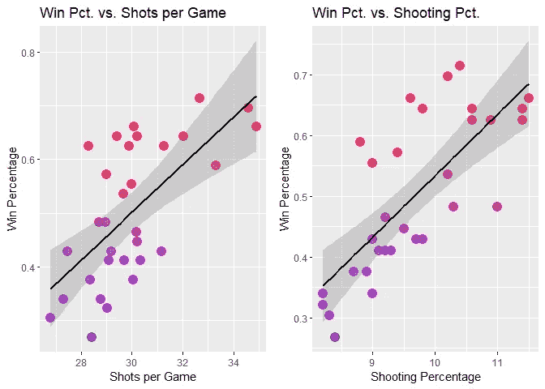

作者图片

现在让我们看看投篮命中率和场均投篮次数。我为获胜百分比添加了一个颜色渐变。

```
*# Create a scatter plot of shooting pct vs. shots per game.*
plot3 **<-** ggplot(currentSeason, aes(stat.shotsPerGame,
                                   stat.shootingPctg,
                                   color**=**winPercentage)) **+** 
  *# Add a scatter plot layer and adjust the size and opaqueness of 
  # points.*
  geom_point(size**=**4, alpha**=**0.75) **+** 
  *# Add a color gradient for winPercentage with an improved label.*
  scale_color_gradient(low**=**"blue", high**=**"red", name**=**"Win Pct.") **+** 
  *# Add labels to the axes.*
  scale_x_continuous("Shots per Game") **+** 
  scale_y_continuous("Shooting Percentage") **+** 
  *# Add a title.*
  ggtitle("Shooting Pct. vs. Shots per Game") *# Show the plot.*
plot3
```

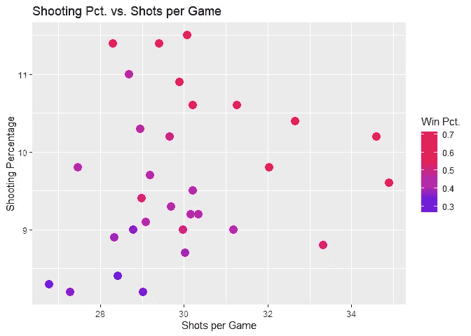

作者图片

这两个变量之间似乎没有明确的关系，而我认为可能有。让我们看看另一个端点的数据。

让我们来看看所有参加过 NHL 的球队的历史数据。请注意，其中一些球队属于同一支球队。我将属于同一支球队的球队视为独立的球队(例如科罗拉多洛矶队和新泽西魔鬼队)。我调用了`nhlAPI("teamTotals")`来获取这个数据。

```
*# Get some stats for the total history of a team.*
teamTotalStats **<-** nhlAPI("teamTotals")
```

首先，让我们看看非活动团队与活动团队的数量。

```
teamStatus **<-** teamTotalStats **%>%**
  *# Filter for regular season stats.*
  filter(gameTypeId **==** 2) **%>%**
  *# Create a column that tells whether a team is active or not.*
  mutate(currentlyActive **=** ifelse(**is.na**(lastSeasonId), 
                                  "Active", "Inactive")) **%>%**
  *# Select the teamName and activity status columns.*
  select(teamName, currentlyActive)*# Count the number of active and inactive teams.*
numActive **<-** **sum**(teamStatus **==**"Active")
numInactive **<-** **sum**(teamStatus **==**"Inactive")
```

有 26 个不活跃的团队和 31 个活跃的团队(只是提醒一下，我把转移到其他地方的团队视为不活跃的)。

不是所有的球队都有相同的任期，我想调整一些统计数据，以便能够在相同的基础上比较球队。我对各队的点球时间和记录特别感兴趣。

为了在相同的基础上得到数字，当比赛次数如此不同时，我计算每场比赛的罚分钟数，总罚分钟数除以总比赛次数。我再次计算获胜百分比，即获胜次数除以游戏次数。

我还对季后赛或常规赛如何影响罚球时间感兴趣，因为我认为季后赛的重要性可能会导致罚球行为的变化。

此外，我还创建了一个列，`recordType`,用于指示一个团队是否有输赢记录。如果赢的百分比大于 0.5，他们被分类为有赢的记录，否则为输的记录。

```
teamTotalStats **<-** teamTotalStats **%>%**
  *# Add columns for penalty minutes per game, win percentage, a text*
  *# representation of the game type, and whether a team has a losing 
  # or winning record for the game type.*
  mutate(penaltyMinutesPerGame **=** penaltyMinutes **/** gamesPlayed,
         winPercentage **=** wins **/** gamesPlayed,
         gameType **=** ifelse(gameTypeId **==** 2, "Regular Season", 
                           "Playoffs"),
         recordType **=** ifelse(wins **>** losses, "Winning Record", 
                             "Losing Record"))
```

下表显示了按游戏类型统计的有输赢记录的活跃队伍的数量。

```
*# Filter for active teams by looking for missing values in 
# lastSeasonId.*
activeTeams **<-** teamTotalStats **%>%**
  filter((**is.na**(lastSeasonId) **==** **TRUE**))*# Display a table of the game types by record types for active 
# teams.*
knitr**::**kable(table(activeTeams**$**gameType, activeTeams**$**recordType),
             caption**=**paste("Counts of Franchise Record Types by ", 
                           "Game Type for Active Teams"))
```

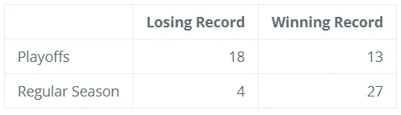

现役球队按游戏类型统计的特许经营记录类型(图片由作者提供)

下面是不活跃团队的相同表格。从这些表格中可以清楚地看出，不活跃的队伍比活跃的队伍要差得多。他们可能很难吸引观众和销售商品，因为他们太差了。这可能是它们不再存在的原因。

```
*# Filter for only inactive teams by looking for rows where 
# lastSeasonId is not missing.*
inactiveTeams **<-** teamTotalStats **%>%**
  filter((**is.na**(lastSeasonId) **==** **FALSE**))*# Count the number of inactive teams using the number of teams with 
# regular season games.*
numInactiveTeams **<-** **dim**(filter(inactiveTeams, gameTypeId **==** 2))[1]*# Count the number of inactive teams that made it to the playoffs, 
# which is not all of the inactive teams.*
numInactiveTeamsInPlayoffs **<-** **dim**(
    filter(inactiveTeams, gameTypeId **==** 3))[1]*# Count the number of inactive teams who did not make the playoffs.*
numDidntMakePlayoffs **<-** numInactiveTeams**-**numInactiveTeamsInPlayoffs*# Create an index for the last row in inactive teams.*
currentEndRow **<-** nrow(inactiveTeams)*# Add as many empty rows to inactiveTeams as teams not making the 
# playoffs.*
inactiveTeams[currentEndRow**+**seq(numDidntMakePlayoffs),] **<-** **NA***# Teams without playoff data do not have rows for that game type. 
# I'm going to add the proper number of losing records to the 
# dataframe to account for the missing rows for the playoffs.*
inactiveTeams[currentEndRow**+**seq(numDidntMakePlayoffs), 
              "recordType"] **<-** "Losing Record"*# To make the table work, I need to make the gameType of these rows 
# "Playoffs".*
inactiveTeams[currentEndRow**+**seq(numDidntMakePlayoffs), 
              "gameType"] **<-** "Playoffs"*# Display a table of the game types by record types for inactive 
# teams.*
knitr**::**kable(
    table(inactiveTeams**$**gameType, 
          inactiveTeams**$**recordType),
          caption**=**paste("Counts of Franchise Record Types by ", 
                        "Game Type for Inactive Teams"))
```

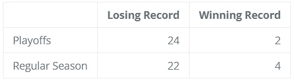

非活跃球队按游戏类型统计的特许经营记录类型(图片由作者提供)

现在，我将在数据集中保留非活动的和活动的团队。现在让我们根据游戏类型得到一个胜率的数字总结。

```
*# Create a table of summary stats for win percentage by game type.*
winPercSumm **<-** teamTotalStats **%>%** 
  *# Select the gameType and winPercentage columns.*
  select(gameType, winPercentage) **%>%**
  *# Group by game type.*
  group_by(gameType) **%>%**
  *# Get summary statistics for winPercentage.*
  summarize("Min." **=** **min**(winPercentage),
            "1st Quartile" **=** quantile(winPercentage, 0.25, 
                                      na.rm**=TRUE**),
            "Median" **=** quantile(winPercentage, 0.5, na.rm**=TRUE**),
            "Mean" **=** mean(winPercentage, na.rm**=TRUE**),
            "3rd Quartile" **=** quantile(winPercentage, 0.75, 
                                      na.rm**=TRUE**),
            "Max" **=** **max**(winPercentage),
            "Std. Dev." **=** sd(winPercentage, na.rm**=TRUE**)
            )*# Display a table of the summary stats.*
knitr**::**kable(winPercSumm, 
             caption**=paste(**"Summary Statistics for Win Percentage ", 
                           "by Game Type"),
             digits**=**2)
```

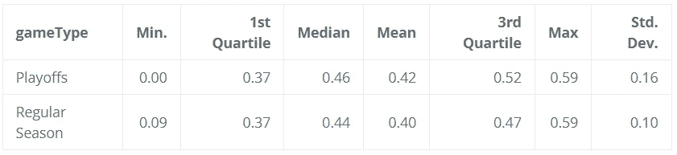

按游戏类型统计的获胜百分比摘要(按作者分类的图片)

根据统计数据，分布看起来没有太大的不同，尽管季后赛的胜率可能会更加多变。至少有一支球队从未赢得过季后赛。让我们用箱线图来形象化这些分布。

```
*# Make a box plot of franchise win percentage by game type.*
plot4 **<-** ggplot(teamTotalStats, 
               aes(gameType,
                   winPercentage,
                   color**=**gameType)) **+**
  *# Add the box plot layer.*
  geom_boxplot() **+** 
  *# Jitter the points to add a little more info to the boxplot.*
  geom_jitter() **+** 
  *# Add labels to the axes.*
  scale_x_discrete("Game Type") **+** 
  scale_y_continuous("Win Percentage") **+**
  *# Add a title.*
  ggtitle("Franchise Win Percentage by Game Type") **+** 
  *# Remove the legend because it isn't needed.*
  theme(legend.position**=**"none")*# Display the plot.*
plot4
```

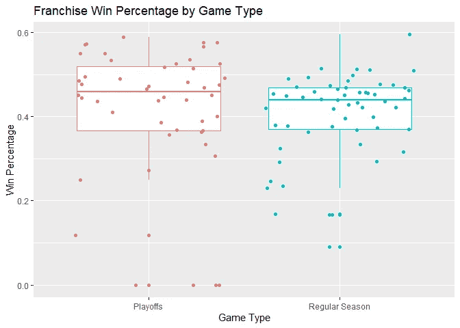

作者图片

季后赛和常规赛的胜率差距肯定是存在的。即使他们的趋势接近，常规赛的胜率分布也更加紧密。这可能是因为常规赛比季后赛多。

现在让我们来看一个按比赛类型划分的每场比赛罚分钟数的数字总结。季后赛似乎有更高的中心倾向，在每场比赛的罚球时间上更易变。

```
*# Create a table of summary stats for penalty minutes per game by 
# game type.*
penMinSumm **<-** teamTotalStats **%>%** 
  *# Select the gameType and penaltyMinutesPerGame columns.*
  select(gameType, penaltyMinutesPerGame) **%>%**
  *# Group by game type.*
  group_by(gameType) **%>%**
  *# Get summary statistics for penaltyMinutesPerGame.*
  summarize("Min." **=** **min**(penaltyMinutesPerGame),
            "1st Quartile" **=** quantile(penaltyMinutesPerGame, 0.25),
            "Median" **=** quantile(penaltyMinutesPerGame, 0.5),
            "Mean" **=** mean(penaltyMinutesPerGame),
            "3rd Quartile" **=** quantile(penaltyMinutesPerGame, 0.75),
            "Max" **=** **max**(penaltyMinutesPerGame),
            "Std. Dev." **=** sd(penaltyMinutesPerGame)
            )*# Display a table of the summary stats.*
knitr**::**kable(penMinSumm, 
             caption**=**paste("Summary Statistics for Penalty ",   
                           "Minutes per Game by Game Type"),
             digits**=**2)
```

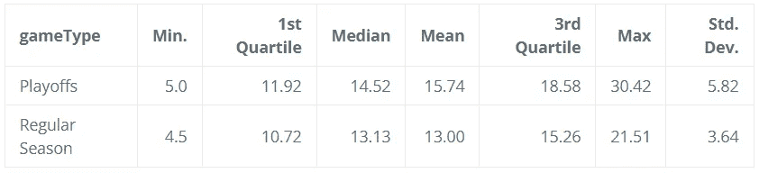

按比赛类型统计每场比赛的罚分时间(图片由作者提供)

下面的柱状图提供了一种替代箱线图的方法，用于可视化每场比赛的罚分钟数分布。很明显，每场季后赛的罚分钟数远远超过了常规赛。

```
*# Make a histogram of penalty minutes per game by game type.*
plot5 **<-** ggplot(teamTotalStats,aes(penaltyMinutesPerGame, 
                                   y**=**..density..,
                                   fill**=**gameType)) **+** 
  *# Add a semi-transparent histogram with 10 bins for regular season 
  # games.*
  geom_histogram(data**=**subset(teamTotalStats,
                             gameType **==** 'Regular Season'),
                 bins**=**10, alpha **=** 0.5) **+**
  *# Add a semi-transparent histogram with 10 bins for playoff games.*
  geom_histogram(data**=**subset(teamTotalStats,gameType **==** 'Playoffs'),
                 bins**=**10, alpha **=** 0.5) **+** 
  *# Add a better legend label.*
  guides(fill**=**guide_legend(title**=**"Game Type")) **+**
  *# Add labels to the axes.*
  scale_x_continuous("Penalty Minutes per Game") **+** 
  scale_y_continuous("Density") **+**
  *# Add a title.*
  ggtitle("Histogram of Penalty Minutes per Game by Game Type")*# Display the plot.*
plot5
```

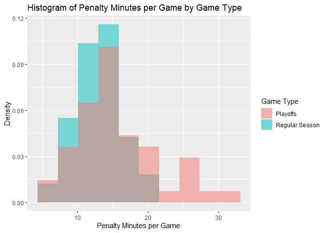

作者图片

我很好奇哪支球队每场比赛在禁区里呆的时间最长。我筛选了现役球队和常规赛比赛，并为每支球队和他们每场比赛的罚球时间制作了一个条形图。我将条形图中的条形从表现最差到表现最好进行了排序。

```
*# Create a column with the triCode for each team ordered by most 
# penalty time per game to least.*
mostPenaltyMinsRegSeason **<-** teamTotalStats **%>%**
  *# Filter for active teams and regular season games.*
  filter(**is.na**(lastSeasonId) **&** (gameTypeId **==** 2)) **%>%**
  *# Sort from most penalty minutes per game to the least.*
  arrange(desc(penaltyMinutesPerGame)) **%>%**
  *# select the triCode column.*
  select(triCode)*# Create a bar chart for the penalty mins per regular season game by 
# active teams.*
plot6 **<-** teamTotalStats **%>%**
  *# Filter for active teams and their regular season stats.*
  filter(**is.na**(lastSeasonId) **&** (gameTypeId **==** 2)) **%>%**
  *# Create a column that is a sorted factor of triCode.*
  mutate(sortedTriCode **=** factor(
      triCode, levels**=**mostPenaltyMinsRegSeason[["triCode"]],
      ordered**=TRUE**))  **%>%**
  *# Create a bar chart with a fill gradient for 
  # penaltyMinutesPerGame.*
  ggplot(aes(sortedTriCode, penaltyMinutesPerGame, 
             fill**=**penaltyMinutesPerGame)) **+**
  geom_col() **+** 
  *# Rotate the x-axis labls 90 degrees and remove the legend.*
  theme(axis.text.x**=**element_text(angle**=**90), legend.position**=**"none")**+**
  *# Change the fill gradient to go from blue to red.*
  scale_fill_gradient(low**=**"blue", high**=**"red") **+**
  *# Set the axes labels.*
  scale_x_discrete("Team") **+** 
  scale_y_continuous("Penalty Minutes per Game") **+**
  *# Add a title.*
  ggtitle("Penalty Minutes per Regular Season Game by Team")*# Display the plot.*
plot6
```

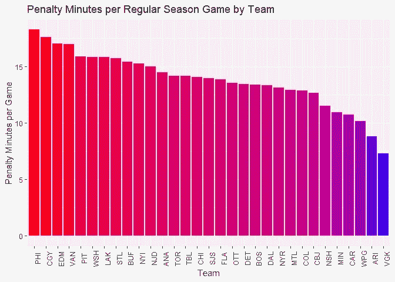

作者图片

看起来费城飞人队和费城体育迷一样吵闹。我又制作了同样的柱状图，但这次是为了季后赛。我保留了常规赛最粗暴的顺序。如果常规赛和季后赛的点球有相关性，我们预计顺序不会有太大变化。

```
*# Create a bar chart for the penalty mins per playoff game by active* 
*# teams.*
plot7 **<-** teamTotalStats **%>%**
  *# Filter for active teams and their playoff stats.*
  filter(**is.na**(lastSeasonId) **&** (gameTypeId **==** 3)) **%>%**
  *# Create a column that is a sorted factor of triCode.*
  mutate(sortedTriCode **=** factor(
     triCode,
     levels**=**mostPenaltyMinsRegSeason[["triCode"]], ordered**=TRUE**))**%>%**
  *# Create a bar chart with a fill gradient for 
  # penaltyMinutesPerGame.*
  ggplot(aes(sortedTriCode, penaltyMinutesPerGame, 
             fill**=**penaltyMinutesPerGame)) **+**
  geom_col() **+** 
  *# Rotate the x-axis labls 90 degrees and remove the legend.*
  theme(axis.text.x**=**element_text(angle**=**90), legend.position**=**"none")**+**
  *# Change the fill gradient to go from blue to red.*
  scale_fill_gradient(low**=**"blue", high**=**"red") **+**
  *# Set the axes labels.*
  scale_x_discrete("Team") **+** 
  scale_y_continuous("Penalty Minutes per Game") **+**
  *# Add a title.*
  ggtitle("Penalty Minutes per Playoff Game by Team")*# Display the plot.*
plot7
```

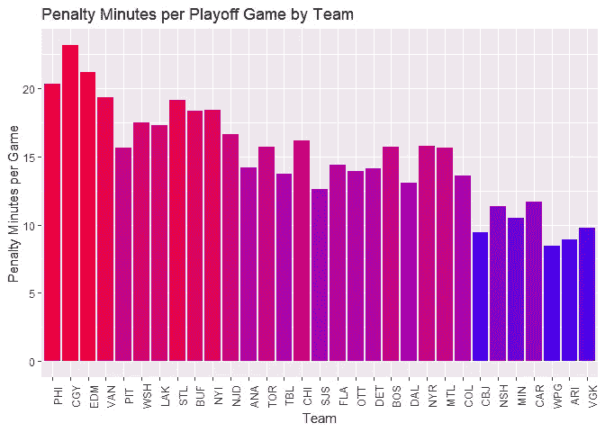

作者图片

顺序变化不大，所以常规赛点球时间和季后赛点球时间是有关联的。让我们来看看季后赛和常规赛每场比赛的罚球时间的散点图。

```
*# Create a scatter plot of playoff penalty time per game vs. regular 
# season.*
plot8 **<-** teamTotalStats **%>%**
  *# Filter for active teams.*
  filter(**is.na**(lastSeasonId)) **%>%**
  *# Select triCode, gameType, and penaltyMinutesPer Game.*
  select(triCode, gameType, penaltyMinutesPerGame) **%>%**
  *# Spread penaltyMinutesPerGame by gameType.*
  spread(gameType, penaltyMinutesPerGame) **%>%**
  *# Create a scatter plot with a regression line.*
  ggplot(aes(`Regular Season`, Playoffs)) **+**
  *# Add a scatter plot layer and adjust the size and opaqueness of 
  # points.*
  geom_point(alpha**=**0.75,  color**=**"blue") **+** 
  *# Add a red regression line.*
  geom_smooth(method**=**lm, formula**=**y**~**x, color**=**"red") **+**
  *# Set the axes labels.*
  scale_x_continuous("Regular Season Penalty Min. per Game") **+**
  scale_y_continuous("Playoffs Penalty Min. per Game") **+** 
  *# Add a title.*
  ggtitle(paste("Playoff vs. Regular Season Penalty Min. Per ",
                "Game (Active Teams)"))*# Display the plot.*
plot8
```

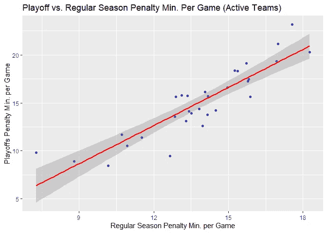

作者图片

虽然正相关并不十分令人惊讶，但我没想到相关性会如此紧密。

我想知道每场比赛的罚分时间和胜率有什么关系。让我们来了解一下！

我创建了一个散点图，根据游戏类型来显示每场比赛的胜率和罚分。我尝试了一下回归线。我首先从一条[黄土](https://en.wikipedia.org/wiki/Local_regression)回归线开始，看到了一个倒置的 U 型线。我决定用一条二次回归线来绘制它们，以使事情更顺利。

```
plot9 **<-** teamTotalStats **%>%**
  *# Select the triCode, gameType, penaltyMinutesPerGame, and 
  # winPercentage columns.*
  select(triCode, gameType, penaltyMinutesPerGame, winPercentage)**%>%**
  *# Create a scatter plot of winPercentage vs. 
  # penaltyMinutesPerGame, coloring by game type.*
  ggplot(aes(penaltyMinutesPerGame, winPercentage, color**=**gameType))**+**
  *# Add a scatter plot layer and adjust the size.*
  geom_point(size**=**2) **+** 
  *# Add a quadratic regression line.*
  geom_smooth(method**=**"lm", formula**=**"y~poly(x, 2)") **+** 
  *# Set the axes labels.*
  scale_x_continuous("Penalty Minutes per Game") **+** 
  scale_y_continuous("Win Percentage") **+** 
  *# The legend isn't needed, so remove it.*
  theme(legend.position**=**"none") **+** 
  *# Add a title*
  ggtitle(paste("Win Percentage vs. Penalty Minutes per Game by ",   
                "Game Type")) **+** 
  *# Break out the plots by game type.*
  facet_wrap(**~**gameType)*# Display the plot.*
plot9
```

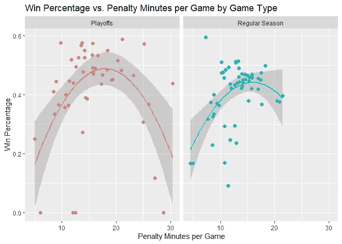

作者图片

正如你所看到的，每场比赛的胜率和罚分钟数之间的关系并不完全清晰，但似乎确实存在二次关系。在常规赛中，就胜率而言，15 分钟似乎是最佳的罚球时间。对于季后赛，它似乎在 17 分钟左右。

在这一点上，相关性并不意味着因果关系是不言而喻的。有可能存在一种罚点球的策略，即使这给了对方一个强力进攻的机会，就像篮球一样。或者它可能只是一个最佳侵略性游戏风格的副产品。不管怎样，我想测试这种关系是否有统计学意义。让我们用回归更正式地测试一下二次关系。

```
*# Create a model regressing win percentage on penalty minutes per 
# game.*
winPercMod **<-** lm(winPercentage **~** poly(penaltyMinutesPerGame, 2),
                 data**=**teamTotalStats)*# Get the percentage of variance explained.*
winVarExplainedPerc **<-** **round**(100*****summary(winPercMod)[[8]],1)*# Create a table of the regression coefficients.*
tidywinPercModSumm **<-** winPercMod **%>%**
  *# Pass the model through the tidy() function.*
  tidy()*# Rename the variables for improved printing.*
tidywinPercModSumm[1, "term"] **=** "Intercept"
tidywinPercModSumm[2, "term"] **=** "Penalty Min. per Game"
tidywinPercModSumm[3, "term"] **=** "(Penalty Min. per Game)^2"*# Pass the tidied model output to a table and format it.*
knitr**::**kable(
  tidywinPercModSumm,
  caption**=**paste("Coefficient summary of Win Perc. Regressed on",
                "Penalty Min. per Game with Quadratic Term"),
  col.names **=** **c**("Variable", "Est. Coef.", "SE", "t", "P(|t| > 0)"),
  digits**=c**(0, 2, 3, 2, 3)
)
```

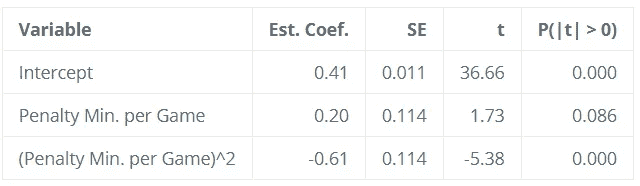

Win Perc 系数汇总。在罚分上倒退。每场比赛有二次项(图片由作者提供)

给定回归中二次项的 t 统计量，二次关系似乎是合理的。该模型解释了成功百分比中 23.8%的差异，因此在预测模型中仍有相当数量的差异需要考虑。尽管如此，这仍然是一个有趣的发现！

# 总结

为了总结我在这篇短文中所做的一切，我构建了与 NHL API 的一些端点进行交互的函数，检索了一些数据，并使用表格、数字摘要和数据可视化对其进行了研究。我发现了一些不足为奇的事情，比如场均投篮次数和投篮命中率与胜率相关。我还发现了一些令人惊讶的事情，即每场比赛的罚球时间与胜率成二次关系。

最重要的是，我希望我的代码有助于您与 API 进行交互！

[**NHL-API-vignette**](https://jkclem.github.io/nhl-api-vignette/)**由**[**JK clem**](https://github.com/jkclem)**维护。**