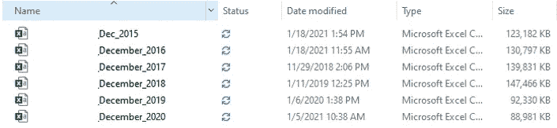
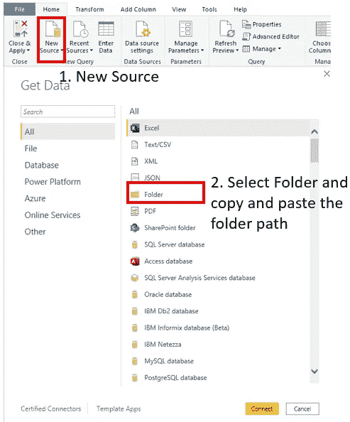
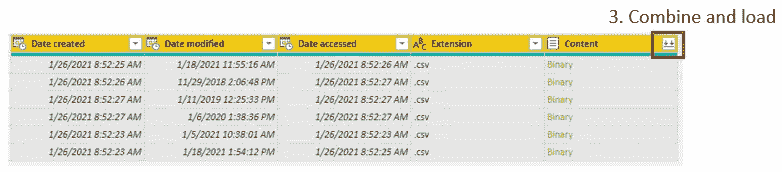
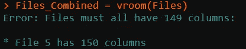
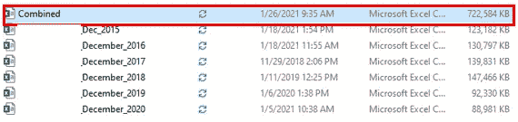
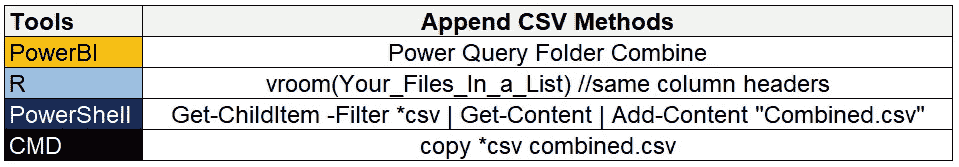

# 附加 CSV 文件

> 原文：<https://towardsdatascience.com/appending-csv-files-d31a08153e0c?source=collection_archive---------28----------------------->

## 使用 Power BI、R、Power Shell 或 CMD 完成此操作


丹尼斯·强森在 [Unsplash](https://unsplash.com?utm_source=medium&utm_medium=referral) 拍摄的照片

你曾经不得不合并多个 CSV 文件吗？我相信这是每个数据分析师或数据科学家在某个时候必须完成的任务，而且确实是一项奇怪的任务。他们当初为什么要分开？连接到源不是更好吗？有时候最好的解决方案并不总是可行的。

如果你发现自己在打开 Excel、复制文件和处理 10 个不同的工作簿，那么这篇文章就是为你准备的。我将向您展示附加文件的不同方式。你不仅可以节省时间，还可以避免犯错误。相信我，在我发现权力 BI 和 r 之前，我曾经这样做过。

如果你不必这样做，并且对 Power BI 和 R 非常熟悉，那么我相信你会发现一些有命令行和 Power Shell 的有趣脚本。

让我们开始吧。

我这里有 6 个图像文件，每个文件有 29 列。



图片来自作者

这些都位于一个文件夹中。我试图得到的最终结果是一个更大的文件，将所有 6 个合并成一个。这里的数字无关紧要，可以是 6，也可以是 100。流程还是一样的:)

我们为什么要合并这些？原因各不相同。有时使用大表进行简单分析会更容易。有时可能是因为数据类型问题，文件无法加载。在任何情况下，都有不同的工具来附加这些文件。

# Power BI — Power 查询文件夹组合


作者图片

有了 Power BI，您只需进入 Power BI，使用“连接到文件夹”即可连接所有内容。



给你 Power Query 中的所有文件供你组合和加载。



作者图片

有时 Power BI 可能会发现数据错误，无法加载这些文件。这里有一篇[文章](/power-bi-modelling-error-803856e373d1?sk=1989f86a49ea3a829e4c000f3b0c6f55)讲述了一些错误以及如何修复它们。

由于列错误，Power BI 将无法加载所有这些文件。有时一个单元格可能有字母，但 Power BI 将该列归类为数字。这将导致错误。

作为一个快速提示，在加载文件时删除“更改类型”步骤。它造成的错误似乎多于它的用处。如果我去掉这一步，您可以看到 Power BI 能够加载所有内容。

**PRO** :不需要代码，只需要点击。简单的导航和 GUI。允许您使用表格函数和[自定义函数](/functions-in-power-bi-56e9e11e4669?sk=32f65f6e5196dbd96ed43a53584ad2fc)通过表格和函数进行其他类型的分析。

**缺点**:速度慢，可能无法工作，如果有数据类型错误，需要排除故障。如果您有大量的文件，并且在等待之后发现一个类型错误，您会感到沮丧。

# R- VROOM 联合收割机


作者图片

在这里，我可以使用包调用 VROOM，获取文件夹中的所有文件名，并将其全部合并。

在 R Studio 中键入

```
library(vroom)setwd("Your folder directory")Files = dir_ls(glob = "*.csv")Files_Combined = vroom(Files)
```

这里的脚本说要设置你的工作目录，使用 ***dir_ls*** ，过滤任何以“.”结尾的内容。csv "并将其保存到一个变量调用文件中。然后 ***vroom()*** 读取“文件”并赋给结束变量调用 Files_Combined。

这里——它对我不太适用，因为其中一个文件有 150 列。



作者图片

要纠正这一点，您可以使用地图。如果您不熟悉 R，map 会对所提供的变量应用一个函数。在这种情况下，它是文件—包含我们想要加载的 CSV 文件的名称。这里的函数是 ***vroom()*** ，这是加载函数。

```
library(vroom)setwd("Your folder directory")Files = dir_ls(glob = "*csv")Files_Combined = map(Files, ~vroom(.x))
```

这里所有的文件都将被加载，但是是列表格式的。然后，您可以通过子设置选择您想要的文件。您可以使用 Files_Combined[1:3]或使用名称 Files _ Combined[" your _ file _ name "]来引用实际文件本身。

**亲**:非常快！也真的很喜欢它的声音:)能够在 5 秒钟内加载列表格式的所有文件。

**CON** :假设您有相同数量的列标题。在运行 vroom 之前，我必须做一些调整，看看哪个文件有额外的列。如果数据框中的一列为数字，另一列为字符，则无法绑定行。

# **PowerShell —获取内容|添加内容**


作者图片

下面是将这些文件合并成一个 CSV 文档的脚本。你可以在启动菜单中输入“PowerShell ISE ”, PowerShell 就会被加载。

会出现一个蓝屏——别担心这不是死亡蓝屏。:)

你可以在这里输入。

```
cd "Your folder directory"Get-ChildItem -Filter *csv | Get-Content | Add-Content "Combined.csv"
```

***Get-child item***将列出该文件夹中的所有文件。如果你愿意，你甚至可以使用 ***-Recurse*** ，它会列出相关子文件夹中的所有文件。 ***Get-Content*** 取每个 csv 的内容，****Add-Content***将内容添加到一个名为" combined.csv "的新文件中。*

*俏皮:)*

**

*作者图片*

***亲:**可靠。不会引发类型错误。它只是做你让它做的事。*

*反对意见:很好，没问题。很高兴看到它没有抛出任何错误！可能是一件好事也可能是一件坏事，额外的列没有被追加到新文件中。*

# *命令行—复制和粘贴*

**

*作者图片*

*这个是我最喜欢的。只需在启动菜单中输入 CMD，就会出现一个黑屏。别担心，这只是命令提示符。*

```
*cd "your folder directory"copy *csv combined.csv*
```

*这一行简单的代码会将您创建的文件夹中的所有 CSV 文件复制到一个名为“combined.csv”的新文件中。*

*这里说的是复制所有以“csv”结尾的内容，并将它们放入一个名为“combined.csv”的文档中。*

*最棒的是，你可以在组合之前添加 *grep* 来过滤你想要的值。*

```
*grep "your_item" *csv >> item.csv*
```

*在这里，您从该文件夹中的所有 CSV 文件中“grep”您的项目，并将其导出到一个名为“item.csv”的新文件中*

*我确实喜欢这个:)*

*想象一下，你必须在 200 个文件中搜索一个项目，比如说一个账号？有 CMD 的 grep 是你的朋友。*

***亲:**非常快，没有问题。3 秒内复制了所有内容。*

***缺点:**如果你不知道你在读什么，那就有点神秘了。*

# *结论*

## *TL:DR？？—我不是在评判。*

**

*作者图片*

*有不同的工具可用于附加 CSV。*

*最头痛的事情，至少对我来说，是处理类型问题。PowerShell 和 CMD 都可以跳过所有这些，为您提供一个分析表。*

*如果你只是想添加文件，做一些过滤和处理一个合并的文档，使用 PowerShell 或 CMD。之后，您可以使用 Power BI 或 R 进行分析，而不用担心数据格式问题。我还没有尝试过 CSVKIT，但当我这样做时，我一定会让你知道。*

*曾经有人问我:“你为什么要费心写作？反正你一篇文章挣不到 5 美元”。这是个很好的问题。事实是，我从别人那里学到了很多。我认为分享知识很重要。没有人能在没有他人帮助的情况下取得今天的成就。我们都相互依赖，不管是直接的还是间接的。*

*谢谢！祝您的数据之旅安全顺利:)*