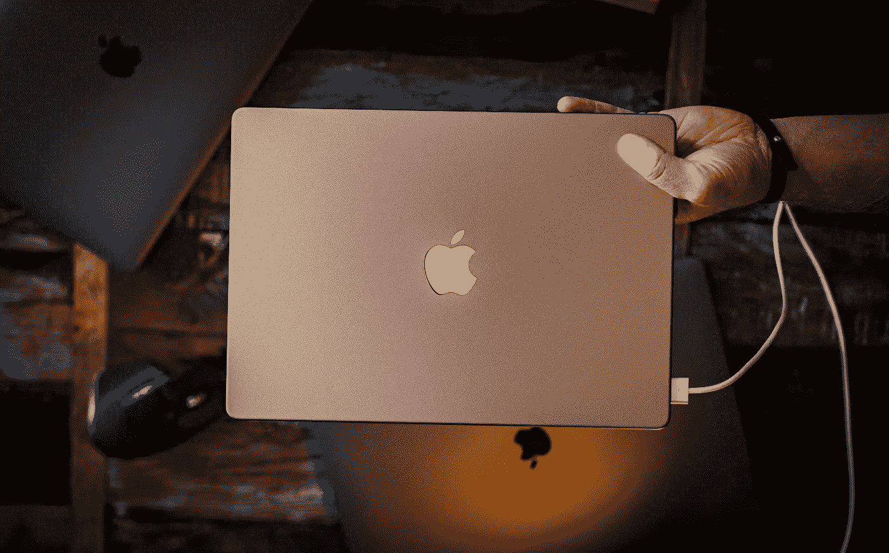
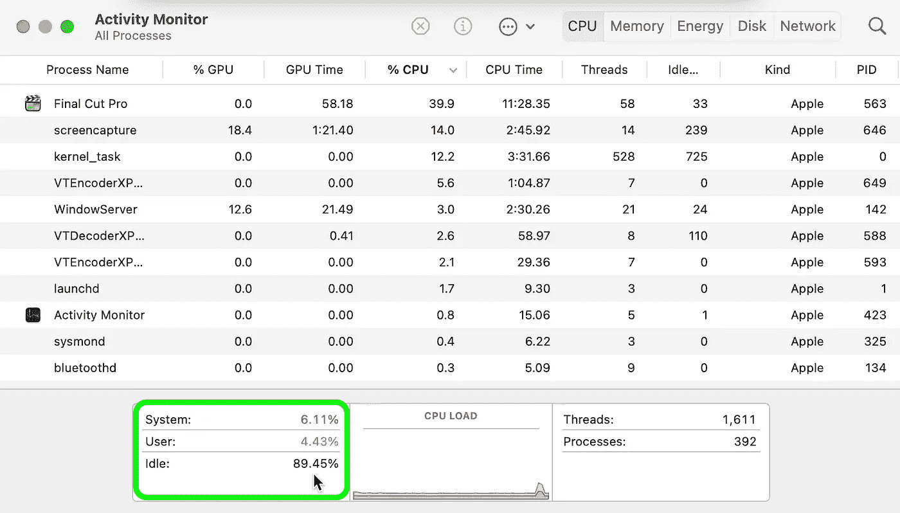
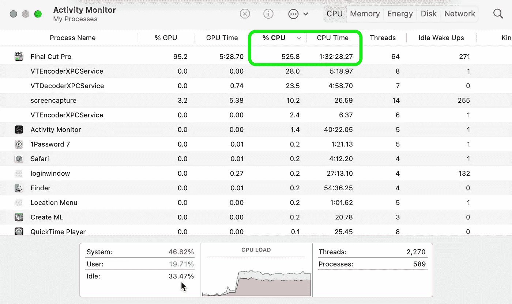
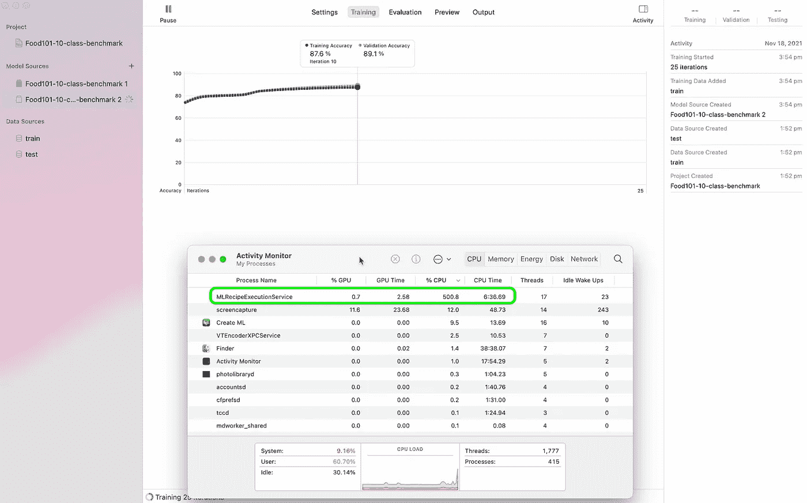
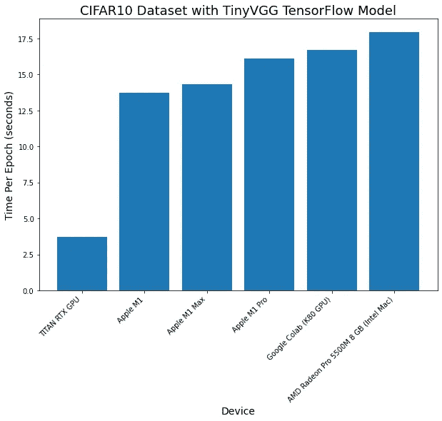
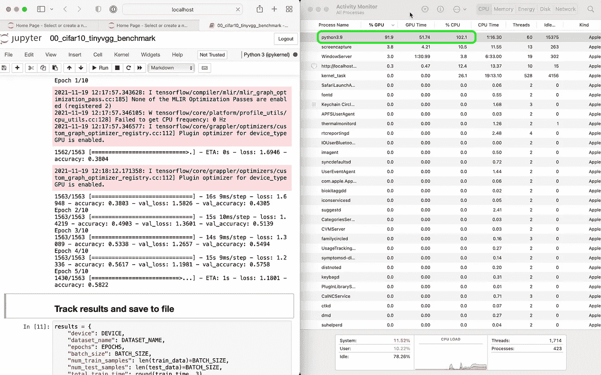
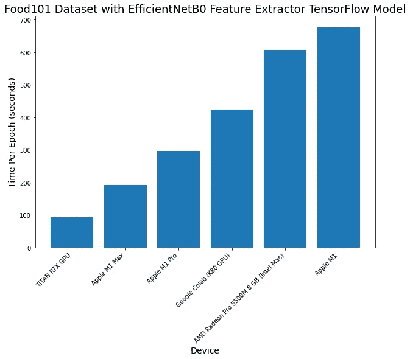
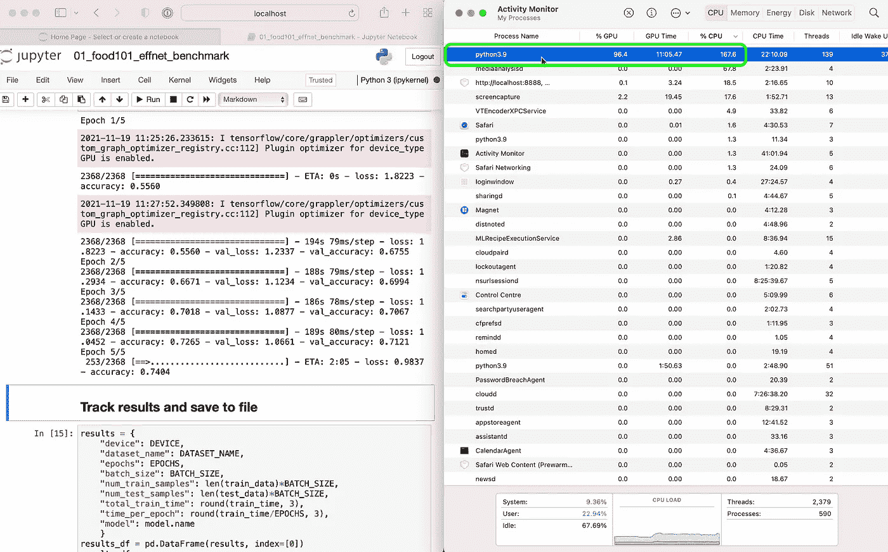

# 苹果的 M1 Pro 和 M1 Max 超过谷歌 Colab 高达 54%

> 原文：<https://towardsdatascience.com/apples-m1-pro-and-m1-max-outperform-google-colab-by-up-to-54-cbf13c8b6357?source=collection_archive---------1----------------------->

## 2021 苹果 M1 Pro 和 M1 Max 机器学习速度测试对比

标志性的绿色充电灯又回来了。作者照片。

我使用的主键盘连接在 MacBook Pro 上。我在 MacBook Pro 上打这个。

作为一个技术呆子，当苹果发布了几款升级了硬件的新 MacBook Pro:M1 Pro、M1 Max 芯片和重新设计等等，我决定，我最好测试一下。

对于上下文，我制作关于机器学习的视频，编写机器学习代码，教授机器学习。

这就是本文的重点。

将苹果的 M1、M1 Pro 和 M1 Max 芯片与其他几款芯片进行对比。

怎么会？

四项测试:

1.  **Final Cut Pro 导出** —各种 MacBook Pro 导出 4 小时长的 TensorFlow 教学视频(我制作编码教育视频)和 10 分钟长的故事视频(使用 H.264 和 ProRes 编码)的速度有多快？
2.  **CreateML 图像分类机器学习模型创建** —各种 MacBook Pro 用 CreateML 把一万张图像变成一个图像分类模型能有多快？
3.  **CIFAR10 TinyVGG 图像分类与 tensor flow(via**`**tensorflow-macos**`**)**——多亏了`tensorflow-metal`，你现在可以利用你的 MacBook 的内部 GPU 来加速机器学习模型训练。这个和小一点的模型配起来怎么样？
4.  **Food101 EfficientNetB0 用** `**tensorflow-macos**`进行特征提取——我很少从零开始训练机器学习模型。那么，新的 M1 Pro 和 M1 Max 芯片如何利用 TensorFlow 代码进行迁移学习呢？

本文严格关注性能。对于设计、输入、输出、电池寿命，还有很多其他资源。

# 硬件规格

我目前使用基于英特尔的 16 英寸 MacBook Pro 作为我的主机(几乎总是插着电源)，2020 年的 13 英寸 M1 MacBook Pro 作为随身携带的选项。

为了训练更大的机器学习模型，我使用谷歌 Colab、谷歌云 GPU 或 SSH(通过互联网连接)连接到一台配备泰坦 RTX GPU 的专用深度学习 PC。

对于 TensorFlow 代码测试，我包括了与 Google Colab 和泰坦 RTX GPU 的比较。

这里的规格主要是基于英特尔的 MacBook Pro、M1、M1 Pro 和 M1 Max。

测试中 Mac 机型的不同硬件规格。

在每项测试中，所有的 MacBook Pro 都运行 macOS Monterey 12.0.1，并接通了电源。

# 实验 1: Final Cut Pro 导出(小视频和大视频)

我制作 YouTube 视频和教授机器学习的教育视频。

所以我用的机器必须能快速渲染和导出。这是我购买 2019 年 16 英寸 MacBook Pro 规格的主要原因之一，这样我就可以毫无延迟地编辑视频。

此外，M1 专业和 M1 最大芯片是针对专业人士。他们中的许多人编辑视频的质量比我高得多(目前)。

对于每个视频，我都将其导出为 [H.264](https://en.wikipedia.org/wiki/Advanced_Video_Coding) 编码(更高的压缩率，更多的 GPU 密集型)和 [ProRes](https://en.wikipedia.org/wiki/Apple_ProRes) 编码(更低的压缩率，更少的 CPU 和 GPU 密集型)。

这是因为苹果公司声明，新的 M1 芯片有专门的 ProRes 引擎。

## 大型视频

实验详情:

*   **视频:** [学习 TensorFlow 进行深度学习第二部分](https://youtu.be/ZUKz4125WNI)
*   **时长:** 4 小时
*   **风格:**拼接在一起的 30 倍屏幕录像短片(每部约 10 分钟)
*   **质量:** 1080p

有趣的是，当使用 H.264 编码时，新的 M1s (Pro 和 Max)占用的时间是基本 M1 的两倍，是基于英特尔的 Mac 的近四倍。

还应该注意的是，在使用 H.264 编码时，M1 Pro(约 89%空闲)和 M1 Max(约 68%空闲)上都有大量硬件处于空闲状态。

在导出到 H.264 编码时，M1 Pro 和 M1 Max 上的大量硬件被闲置。我不确定这是什么原因造成的。但这确实解释了为什么与其他 MAC 相比，它们的出口时间如此之长。

可能需要更新软件才能充分利用新芯片的全部功能？

不过，对于 ProRes 编码来说，情况就不同了。

ProRes 编码是较新的 M1 芯片真正闪光的地方。

与 H.264 编码相比，在 M1 Pro 和 M1 Max 上导出到 ProRes 时，会占用大量 CPU 资源。或许这是来自专用的 ProRes 内核？

导出到 ProRes 编码时，在 M1 Max 和 M1 Pro 上可以看到大量的 CPU 使用。**注:**所有屏幕记录均与结果跟踪分开进行。

然而，尽管 ProRes 编码导出比 H.264 快得多，但文件大小的差异使它对许多人来说几乎不可用。

将大视频导出到 H.264 时，文件大小为 7GB，导出到 ProRes 时，文件大小为 167GB。

我不知道你的网速，但这种视频需要三四天才能上传给我。

## 小视频

较小的视频产生了非常接近的结果。

实验详情:

*   **视频:** [我如何学习机器学习每周 5 天](https://youtu.be/hsQ9efb6a7c)
*   长度: 10 分钟
*   **风格:**画外音，视频剪辑编辑成语音
*   **质量:** 1080p

所有的出口时间都非常相似。

但同样，当导出到 H.264 编码时，M1 Pro 和 M1 Max 芯片上有大量硬件闲置。

当使用 ProRes 编码时，M1 Pro 和 M1 Max 再次大放异彩。检查活动监视器显示了大量的 CPU 使用率，M1 Pro 的使用率为 350-450%，M1 Max 的使用率为 300-500%。

# 实验 2: CreateML 图像分类

[CreateML](https://developer.apple.com/machine-learning/create-ml/) 是苹果公司制作的机器学习 app，自带 Xcode(苹果公司制作 iOS 和 macOS 应用的软件)。

它提供了一种将数据转化为机器学习模型的简单方法。

我之所以尝试它，是因为我和我哥哥一直在用它制作 [Nutrify](https://www.nutrify.app/) (一款拍摄食物照片并了解食物的应用程序)上的原型模型。

它不仅适用于我们的用例，还能生成针对苹果设备优化的训练模型。

实验详情:

*   **数据:**所有 Food101 类的随机 10%子集(~7.5k 训练图像，~2.5k 测试图像)
*   **训练:** 25 个历元，所有数据扩充设置开启
*   **模型:** CreateML powered 模型(苹果没有告诉你用的是什么架构)

再一次，M1 Pro 和 M1 Max 之间没有太大的区别。尽管它们都比其他芯片表现出色。

在培训期间，检查 M1 专业版和 M1 最大版的活动监视器显示，在进程名称“MLRecipeExcecutionService”下有大量的 CPU 使用。

在 CreateML 应用程序中训练模型的过程中，CPU 使用率飙升至 500%以上。GPU 根本用不上多少。也许这是 16 核神经引擎在起作用？截图摄于 M1 专业版。

值得注意的是，在训练或特征提取期间，GPU 根本没有得到多少使用。

这让我相信 CreateML 使用 16 核神经引擎来加速训练。然而，这并没有得到 100%的证实，因为活动监视器并没有透露神经引擎何时启动。

现在 CreateML 也没有透露使用什么样的模型。从性能来看，我猜它至少会使用预训练的 ResNet50 型号或 EfficientNetB2 以上或类似型号。

# 实验三:带 TensorFlow 代码的 CIFAR10 TinyVGG 模型

CreateML 工作起来很棒，但有时你会想要制作自己的机器学习模型。

为此，您可能最终会使用 TensorFlow 这样的框架。

[我教 TensorFlow](https://dbourke.link/tfcourse) 几乎每天都要编码。所以我很期待看到新机器在这里的表现。

对于所有自定义 TensorFlow 测试，所有机器都使用相同的数据集和相同的环境设置运行相同的代码。

唯一的区别是谷歌 Colab 和英伟达巨头 RTX 与每台 MAC 电脑之间的区别。

每台 Mac 都运行了`[tensorflow-macos](https://developer.apple.com/metal/tensorflow-plugin/)`[(Mac 的 TensorFlow)和](https://developer.apple.com/metal/tensorflow-plugin/) `[tensorflow-metal](https://developer.apple.com/metal/tensorflow-plugin/)` [的组合，用于 GPU 加速](https://developer.apple.com/metal/tensorflow-plugin/)。而 Google Colab 和 Nvidia TITAN RTX 使用的是标准 TensorFlow。

你可以[在 GitHub](https://github.com/mrdbourke/m1-machine-learning-test) 上看到所有实验和 TensorFlow 在 Mac 上设置的代码。

**注意:**我目前不知道有任何 PyTorch 等同于`tensorflow-metal`来加速 Mac GPUs 上的 PyTorch 代码。目前，PyTorch 只能在 Mac CPU 上运行。

首次 TensorFlow 实验详情:

*   **数据:**来自 TensorFlow 数据集的 cifar 10(32x 32 幅图像，10 个类别，50，000 次训练，10，000 次测试)
*   **型号:** TinyVGG(来自 CNN Explainer 网站)
*   **训练:** 10 个时期，批量 32
*   **代码:** [在 GitHub 上看到](https://github.com/mrdbourke/m1-machine-learning-test)

**对于 TensorFlow 实验，我使用谷歌 Colab 的免费版本，这是谷歌提供的一个非常棒的产品，可以使用连接到 GPU 的 Jupyter 笔记本，只需很少的设置。免费版本曾经提供更快的图形处理器(英伟达 P100，T4)，然而，自从我获得其中一个已经有一段时间了。你可以通过 Colab Pro 获得更快的 GPU，但在我居住的地方(澳大利亚)还没有。*

泰坦 RTX 胜过其他机器是有道理的。这是一个专门为机器学习和数据科学而构建的 GPU。

就每个时期的时间而言，所有 MAC 的性能或多或少在相同的范围内。M1 马克斯和平原 M1 机器运行代码在类似的时间。

使用较小的数据集(CIFAR10，32x32 图像大小)和使用 TensorFlow 代码制作的模型架构(TinyVGG)测试的不同设备的比较。

检查每台 M1 MAC 电脑的活动监视器发现，在培训期间使用了大量的 GPU。这要归功于苹果的`[tensorflow-metal](https://developer.apple.com/metal/tensorflow-plugin/)` [PluggableDevice](https://developer.apple.com/metal/tensorflow-plugin/) ，一个利用苹果金属 GPU 框架加速 TensorFlow 的软件包。

多亏了`tensorflow-metal`，在所有的 MAC 上，训练期间活动监视器中显示了大量的 GPU 使用情况。截图来自 M1 专业版。

# 实验 4:使用 TensorFlow 代码进行 Food101 EfficientNetB0 特征提取

最后的机器学习实验规模更大了。使用比实验 3 更多更大的图像。

当训练机器学习模型时，获得奇妙结果的最好方法之一是使用迁移学习。

迁移学习利用一个模型在类似数据集上学习到的权重(模式)，并允许您将它们用于自己的数据集。

对于实验 4，我在 Food101 数据集上使用了 EfficientNetB0 模型的迁移学习。

实验详情:

*   **数据:** [Food101](https://www.tensorflow.org/datasets/catalog/food101) 来自 TensorFlow 数据集(224x224 幅图像，101 个类别，~75k 训练，~25k 测试)
*   **型号:** [EfficientNetB0](https://www.tensorflow.org/api_docs/python/tf/keras/applications/efficientnet/EfficientNetB0) 在 ImageNet 上预训练，顶层被替换(特征提取)
*   **训练:** 5 个时期，批量 32
*   **代码:** [在 GitHub 上看到](https://github.com/mrdbourke/m1-machine-learning-test)

**在 16 英寸 MacBook Pro 上运行的代码使用了 SGD 优化器，而不是 Adam 优化器，因为在基于英特尔的 Mac 上运行的* `*tensorflow-macos*` *有一个未解决的问题，我找不到修复方法。*

事实证明，对于更大规模的模型和数据集，更新的 M1 Pro 和 M1 Max 芯片比谷歌 Colab 的免费产品(K80 GPU)更快。M1 Max 甚至与泰坦 RTX 相差不远。

对我来说，最突出的是 M1 Pro 和 M1 Max 在放大到更大的实验时的性能。

实验 3 在所有 MAC 上看到了类似的结果，但当数据量增加时(图像大小和图像数量)，M1 Pro 和 M1 Max 远远领先于其他 MAC。

M1 Pro 和 M1 Max 甚至超过了配备专用 Nvidia GPU 的谷歌 Colab(M1 Pro 快约 1.5 倍，M1 Max 快约 2 倍)。

这意味着你可以在本地机器上进行机器学习实验，比用在线的 Colab 笔记本更快。给你在本地跑步的所有好处。不过，Google Colab 确实给了你通过链接分享笔记本的神奇能力。

当然，泰坦 RTX 表现最好，但 M1 Max 也不甘落后，这对于便携式设备来说是非常令人印象深刻的。

活动监视器显示所有设备都使用了大量 GPU。

多亏了`tensorflow-metal`，所有 MAC 的 GPU 使用率在培训期间都很高。不过，看到神经引擎在这里发挥作用会很酷。CreateML 上的训练非常快。我想知道这是否可以用于定制代码。截图来自 M1 麦克斯。

# 应该买哪个？

在过去的一年里，我每天都在使用一台 13 英寸的 M1 MacBook Pro。我将它用于小规模的机器学习实验、视频编辑和谷歌 Colab 浏览器。

然而，我现在正在考虑用 M1 Pro 升级到 14 英寸的 MacBook Pro，并在需要时在泰坦 RTX 或云上升级之前在本地做一切事情(不再有谷歌 Colab)。

从测试来看，很明显 13 英寸的 M1 MacBook Pro(尽管这里没有测试，M1 MacBook Air 的性能应该仍然接近 M1 MacBook Pro 的结果)仍然是一款不可思议的笔记本电脑。

虽然如果你有预算，M1 专业版会给你一个明显的性能提升。

至于 M1 Max，我的测试很难证明它和 M1 Pro 之间 1100 美元的价格差距。对我来说，我宁愿把钱花在额外的本地存储、RAM 或专用 GPU 上。

简而言之，这些是我的建议:

*   **13 英寸的 M1 MacBook Pro/MacBook Air**——对于初学机器学习和数据科学的人来说，这仍然是一款非常棒的笔记本电脑。
*   **14 英寸 M1 专业版 MacBook Pro** —来自 M1 的显著性能提升，如果你喜欢新设计或有预算，这是值得的。
*   **14 英寸 M1 Max MacBook Pro**——M1 Pro 的显著性能提升**只有在大规模模型训练**中，许多其他性能基准达到了与 M1 Pro 相同的水平。如果您发现自己经常编辑多个 4K 视频流，这可能是一个选项。

# 结论

我想看看苹果的专用芯片在什么地方，什么时候被使用。

例如，当神经引擎开始发挥作用时，看起来会很酷。比如在使用 CreateML 时(所有 M1 机器都在这里快速通过训练，就像没有明天一样)。

或者更好的是，如何编写代码来利用神经引擎本身？

去年，我说[16 英寸 MacBook Pro 配 M2](https://www.mrdbourke.com/m1-macbook-vs-intel-macbook-speed-comparison/) 怎么样，苹果送了一台 M1 Max。或许 M2 仍在以 Mac mini 或新款 iMac 的形式出现。

如果有什么是明确的，专用于某些目的的芯片似乎是趋势。性能优势不言自明。

# 资源

*   在 GitHub 上查看所有用于测试和评估的[代码。](https://github.com/mrdbourke/m1-machine-learning-test)
*   看我关于[如何为机器学习和数据科学设置你的新 M1 机器的视频](https://youtu.be/_1CaUOHhI6U)。
*   在 YouTube 上观看这篇博文的[视频版本](https://youtu.be/JWYsWhR3Pxg)。