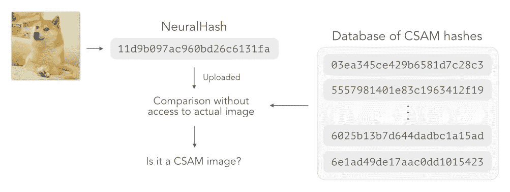
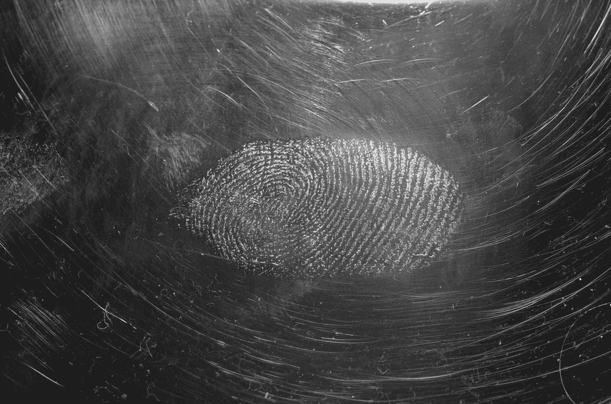
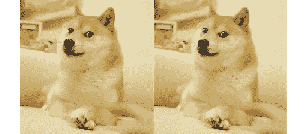
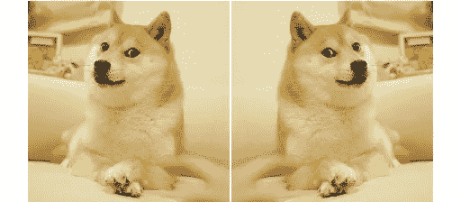
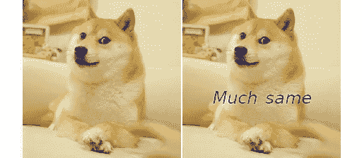
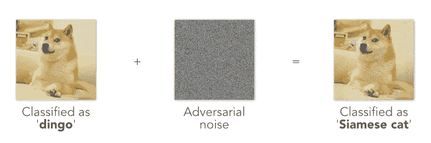
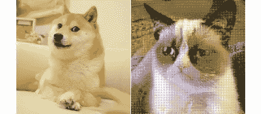
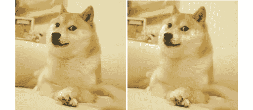
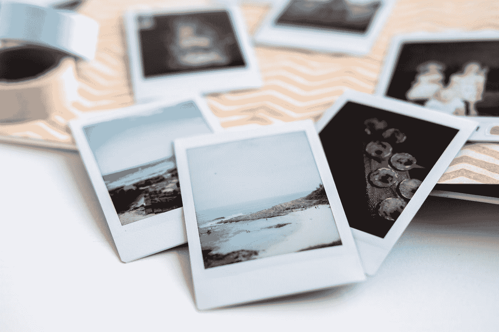

# 苹果的 neural hash——它是如何工作的，以及它可能如何受到损害

> 原文：<https://towardsdatascience.com/apples-neuralhash-how-it-works-and-ways-to-break-it-577d1edc9838?source=collection_archive---------5----------------------->

## [人工智能校准和安全](https://towardsdatascience.com/tagged/ai-alignment-and-safety)

## 技术指南、其漏洞和可能的缓解措施

苹果公司最近宣布了各种措施来打击儿童性虐待材料的传播(CSAM)。

> 接下来，iOS 和 iPadOS 将使用加密技术的新应用来帮助限制 CSAM 病毒在网上的传播，同时为用户隐私进行设计。CSAM 检测将帮助苹果公司向执法部门提供关于 iCloud 照片中 CSAM 收藏的有价值的信息。
> —苹果[声明](https://www.apple.com/child-safety/)宣布这些措施

其中包括使用一种被称为 [NeuralHash](https://www.apple.com/child-safety/pdf/CSAM_Detection_Technical_Summary.pdf) 的新技术扫描 CSAM 的 iCloud 照片。

作者图片，灵感来自苹果关于 CSAM 探测的[技术总结](https://www.apple.com/child-safety/pdf/CSAM_Detection_Technical_Summary.pdf)。这里列出的散列并不是真正的 CSAM 散列。这不包括细节，如致盲步骤。有关详细的图表，请参考技术总结。

# 苹果在扫描我的照片？！？

“扫描”可能是一个错误的词。实际上，苹果打算在不看你照片的情况下检查 CSAM。

照片由 [Immo Wegmann](https://unsplash.com/@macroman?utm_source=medium&utm_medium=referral) 在 [Unsplash](https://unsplash.com?utm_source=medium&utm_medium=referral) 上拍摄

考虑一下指纹的概念——每个人都有其独特之处。它识别一个人，但它本身并不能告诉你这个人的任何信息。在计算机科学中，一个**散列函数**帮助我们计算一个**散列**，它的作用就像一个文件的指纹。散列对于文件来说(有点)是唯一的，但是它本身并不能告诉我们关于文件内容的任何事情。

如果两个文件产生相同的散列，它们很可能是同一个文件。就像如果两组指纹匹配，它们很可能来自同一个人。

苹果打算存储一个与已知 CSAM 相对应的哈希数据库。然后，通过散列你所有的 iCloud 照片，并将你的散列与 CSAM 散列数据库进行比较，苹果可以在不看你的 iCloud 照片的情况下识别匹配。

但是说起来容易做起来难。传统的哈希函数(MD5、SHA256 等。)对文件中的变化非常敏感。例如，这两个图像具有完全不同的 MD5 散列，尽管它们看起来相同(右边的一个在宽度上短了 2 个像素)。

(**左**原 Doge [meme](https://knowyourmeme.com/memes/doge) ，MD5:53 facff 91 EC 83 f 60 a 88235 ab 628590 bb |(**右**)作者裁剪的图片，MD5:da 25273 f 33 C4 EC 95 f 71984075079 BD 16

对变化超级敏感通常是哈希函数的一个有用特性，因为这使得判断文件是否被篡改变得非常容易。

但是如果我们用它来探测 CSAM，这就成了一个巨大的限制。想象一下，如果上面左边的图像是被禁止的图像。苹果可能会存储 MD5 哈希 *53f…0bb* 。但是仅仅通过稍微裁剪图像，我们仍然得到看起来相同的图像(在右边)，但是具有完全不同的 MD5 散列值 *da2…d16* ，这将会逃避检测。

更普遍的情况是，即使苹果有一个已知 CSAM 的数据库，CSAM 经销商也可以旋转、裁剪或调整图像大小来逃避检测。苹果将不得不存储无限数量的散列，以考虑旋转、裁剪或调整图像大小的无限方式。想象一下，当人们减肥、理发或剪指甲时，他们的指纹会发生变化吗？

为了进行检测，即使图像被轻微修改，哈希也必须相同。介绍… **神经哈希**。

# 好吧，跟我说说这个神经哈希

NeuralHash 是一种哈希算法，对输入图像的微小变化不敏感。

(**左**原 Doge [meme](https://knowyourmeme.com/memes/doge) ，neural hash:11 d9 b 097 AC 960 BD 2c 6c 131 fa |(**右**)作者裁剪的图片，neural hash:11 d9 b 097 AC 960 BD 2c 6c 131 fa

对于之前由于不明显的作物而具有非常不同的 MD5 散列的同一对图像，我们得到相同的神经散列。
(本文中所有的 NeuralHashes 都是用[这个浏览器内演示](https://greentfrapp.github.io/compute-your-own-neuralhash)计算出来的。)

(**左**原 Doge [meme](https://knowyourmeme.com/memes/doge) ，neural hash:11 d9 b 097 AC 960 BD 2c 6c 131 fa |(**右**)图片由作者翻转，neural hash:20 D8 f 097 AC 960 ad 2c 7c 231 Fe

即使在图像被翻转的情况下，神经哈希的重要部分仍然相同:
左神经哈希:11**d**9b**097 AC 960**b**d2c**6**c**1**31f**a
右神经哈希:20**d**8f**097 AC 960**

****

**(**左**原 Doge [meme](https://knowyourmeme.com/memes/doge) ，neural hash:11 d9 b 097 AC 960 BD 2c 6c 131 fa |(**右**)图片由作者编辑，neural hash:11 d9 B0 b7a 8120 BD 286 C1 B1 Fe**

**下面是另一个例子，我们将一些单词叠加到图像上，但得到的 NeuralHash 仍然是相似的:
左 neural hash:**11d9b**09**7a**c96**0bd 2**c**6 C1**31**f**a
右 neural hash:**11d9b**0b**7a**812**

****在不深入细节的情况下，NeuralHash 算法使用卷积神经网络(CNN)来计算哈希。在训练过程中，CNN 会看到成对的图像。正对由彼此简单变换(旋转、裁剪、调整大小)的图像组成，例如上面的图像对。负像对包含完全不同的图像。CNN 被训练成将正对映射到相同的散列，将负对映射到不同的散列。这样，它学会忽略应用于图像的小变换。****

# ****而你说可以破？****

****大多数人工智能和人工智能的研究人员和学生可能听说过**对抗性攻击**，其中神经网络通过向图像添加噪声来欺骗。****

********

****作者展示对抗性攻击如何欺骗人工智能模型的图片，其灵感来自**图 1 中的典型熊猫示例，解释并利用了[Goodfellow 等人的对抗性示例](https://arxiv.org/abs/1412.6572)**，2014 。****

****例如，神经网络最初可能会将我们的 Doge 图像标记为“dingo”。但是我们可以在同一张照片上添加少量的噪声，现在神经网络将这张照片标记为“暹罗猫”。****

****这些攻击在人工智能社区中已经广为人知好几年了，研究人员之间一直在开发对抗性攻击和防御。****

****在 NeuralHash 算法中，同样的攻击可以很容易地应用于 CNN。8 月中旬，Reddit 用户 AsuharietYgvar [发布了关于如何导出苹果 NeuralHash 模型副本的](https://old.reddit.com/r/MachineLearning/comments/p6hsoh/p_appleneuralhash2onnx_reverseengineered_apple/) [指令](https://github.com/AsuharietYgvar/AppleNeuralHash2ONNX)。[几个](https://github.com/greentfrapp/apple-neuralhash-attack) [脚本](https://github.com/anishathalye/neural-hash-collider) [出现](https://gist.github.com/unrealwill/c480371c3a4bf3abb29856c29197c0be)演示成功的攻击仅仅几个小时后。****

****对 NeuralHash 模型的对抗性攻击有两种形式。第一种类型的攻击——让我们称之为“不同的图像，相同的哈希”——将噪声添加到源图像，以便得到的神经哈希与目标图像相同。****

********

****一个哈希碰撞对的例子，由作者从 [Doge](https://knowyourmeme.com/memes/doge) ( **左**)和 [Grumpy Cat](https://knowyourmeme.com/memes/grumpy-cat) ( **右**)模因中生成。两张图像都有相同的 neural hash 11 d9b 097 AC 960 BD 2c 6c 131 fa，在给暴躁猫图像添加噪声之后。****

****在上面的例子中，噪声被添加到 Grump 猫图像中，因此结果具有与 Doge 图像完全相同的 NeuralHash。这也被称为**哈希冲突**——从不同的图像中计算出相同的哈希。这是有问题的，因为这意味着有人可以在无害的图像中添加噪声，使它们对应于 CSAM 神经哈希，然后伪装成常规图像，在随机网站上分发它们。这些伪造的 CSAM 图像会在苹果的服务器上引起假警报，导致人们被错误地标记。同样的攻击也可以用来将 CSAM 伪装成普通的图像。****

****另一种攻击——让我们称之为“相同的图像，不同的哈希”——增加了一点点噪声，但极大地改变了神经哈希。****

********

****(**左**原 Doge [meme](https://knowyourmeme.com/memes/doge) ，neural hash:11 d9 b 097 AC 960 BD 2c 6c 131 fa |(**右**)图片由作者生成，neural hash:F8 D1 b 897 a 45 E0 BF 2 f 7 E1 b 0 Fe****

****在这个例子中，即使两幅图像看起来很相似(我们在右边添加了一些浅黄绿色斑点的噪声),但神经哈希却完全不同。该噪音是特制的，用于攻击为 NeuralHash 供电的底层 CNN。与之前的例子相比，我们在图像中添加了一些单词，但是神经哈希仍然基本相似。****

****通过这种攻击，CSAM 的经销商可以通过在他们的图像中添加一点点噪声并极大地改变结果的神经哈希值来逃避检测。如上所示，这可能是少量的噪声，不会显著降低图像质量。****

# ****不要给我带来问题，给我带来解决方案****

********

****照片由[里里](https://unsplash.com/@rirri01?utm_source=medium&utm_medium=referral)在 [Unsplash](https://unsplash.com?utm_source=medium&utm_medium=referral) 上拍摄****

****避免这些攻击的一个方法是永远不要在用户设备上存储 CNN。没有 CNN 的权重，这些攻击将更加困难。然而，这也意味着苹果在他们的服务器上运行哈希算法，这反过来意味着我们所有的 iCloud 照片都将被共享。****

****或者，苹果可以在许多 CNN 型号上运行 NeuralHash，而不是只有一个型号。使用许多模型增加了产生这些攻击的难度，因为攻击必须同时欺骗所有的模型。然而，这增加了必须在设备上完成的计算，这对于用户来说可能是不期望的。****

****另一个可能的解决方案是在哈希之前对图像进行一些预处理，例如将它改为黑白，增加对比度或生成多个随机裁剪和旋转。这是有帮助的，因为攻击有时是脆弱的，并且可能被充分的预处理所否定。****

****NeuralHash 算法是一项新技术，其漏洞的程度可能还没有被完全探索。虽然我对苹果抗击 CSAM 的意图感到振奋，但我会鼓励研究人员继续研究该系统的潜在弱点，以期加以改进。希望这是对 NeuralHash 技术的一个很好的概述！尝试运行算法[这里](https://greentfrapp.github.io/compute-your-own-neuralhash)！****