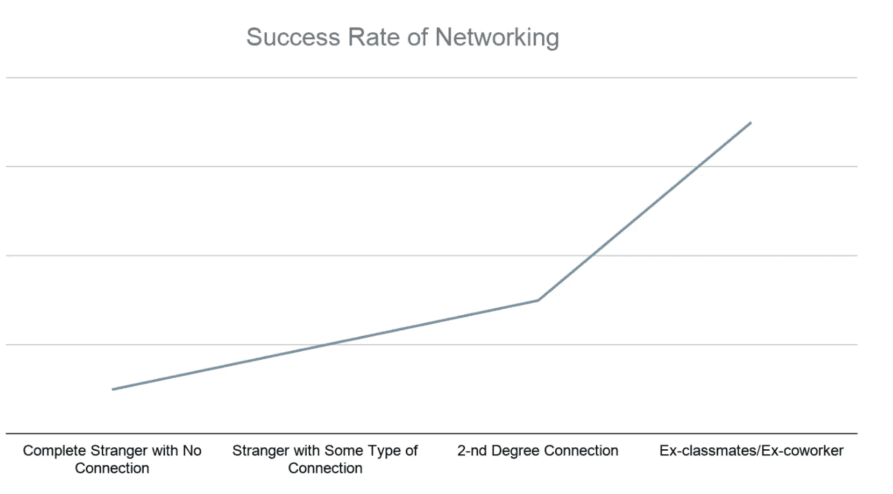
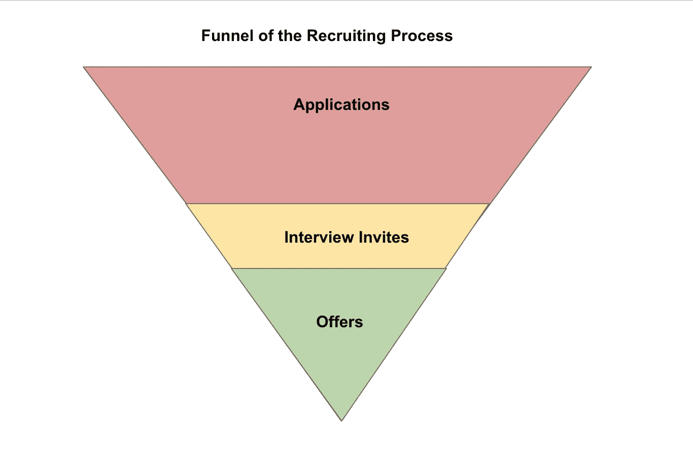

# 申请和简历技巧让你在数据世界找到理想的工作

> 原文：<https://towardsdatascience.com/application-and-resume-tricks-to-land-your-dream-job-in-the-data-world-c2a1e481651f?source=collection_archive---------26----------------------->

[斯科特·格雷厄姆](https://unsplash.com/@homajob?utm_source=medium&utm_medium=referral)在 [Unsplash](https://unsplash.com?utm_source=medium&utm_medium=referral) 上拍照

## 我是如何采访方、独角兽以及顶级咨询公司的

我知道招聘有多么困难和令人生畏，尤其是在像数据科学这样竞争激烈的领域。回到 2018 年，我正试图从金融世界向数据世界转型；尽管我毕业于一所以量化严谨著称的学校，并在一家顶级资产管理公司担任定量分析师，但我申请的任何一家公司都没有给我回音。

GIF 由 [GIPHY](https://media.giphy.com/media/Rkt9N7lIm1IsKnh3tZ/giphy.gif)

我知道，只要公司愿意给我面试机会，让我展示自己，我就有资格胜任这些工作，但我们都知道，获得面试邀请是整个过程中最难的部分。事实上，申请人跟踪系统(ATS)的拒绝率，在人类看你的简历之前，是惊人的 75%<https://blogs.wsj.com/experts/2016/05/24/how-job-seekers-can-get-around-flaws-in-hiring-software/>*。当时我怎么也想不到，仅仅两年后，在另一轮招聘中，我就获得了方的四家公司中的三家、硅谷的无数独角兽和顶级数据科学咨询公司的面试邀请。*

*我参与过招聘过程的两个方面(我在过去的多个职位中帮助过招聘)，我希望我能帮助阐明如何在数据世界中驾驭招聘过程。本文是系列文章中的第一篇，将集中在这个过程中至关重要的第一步——申请和简历；我将在以后的文章中深入探讨面试准备和其他步骤，敬请关注。*

*GIF by [GIPHY](https://media.giphy.com/media/jaXDDTuKmeJvwI56kV/giphy.gif)*

## *首先，让我们谈谈在线申请和网络(以及为什么你应该在线申请)*

*我在 Medium 上读过无数关于“你不应该再在网上申请工作”的文章，这些文章告诉我们“网络是绕过臭名昭著的 ATS 的方法”；因此，我接下来要说的可能不是最受欢迎的观点，但如果你像我一样是一个内向的人，非常害怕强迫社交，这可能会让你的一天变得更好:你绝对应该在线提交申请，很多很多。原因如下:*

***人脉总是有帮助的，但是 ROI(投资回报)取决于情况**:我并不反对人脉。事实上，如果你的目标是更好地了解公司、文化或收集任何其他信息，社交网络是你最好的选择(对于像我这样的内向者来说，这可能是次要的)。但是如果你的目标是得到招聘者的推荐或介绍，这样你就可以“在 ATS 中导航”，你可能会失望。根据我的经验，你通过人际关系网成功获得推荐的机会会因你交往的人对你的了解程度而有很大不同。或者更准确地说，他/她有多愿意/能够担保你的能力。*

**

*作者图片*

*稍微了解一下转诊流程，稍微换位思考一下，就不难理解这背后的原因了。在大公司，每天都有巨大的内部推荐量涌入；因此，他们由一个标准化的系统处理，推荐人必须回答诸如“你为什么推荐这个人”或“你以前和这个人共事过吗？”。在小公司，内部推荐会直接传达给招聘人员，不可避免地，招聘人员会问推荐人类似的问题。*

*当系统处理推荐时，您会遇到与 ATS 相同的问题；招聘人员只会看排名靠前的推荐人。如果让你来设计排名模型，你会把哪一个排在最前面？上面写着“是的，我和这个人一起工作过”以及一份详细的资格清单？或者上面写着“不，我以前没有和这个人共事过”以及对过去经历的一般性描述。当推荐人被直接推荐给招聘人员时，你希望你的推荐人如何陈述“我推荐这个人是因为他们在 LinkedIn 上给我发了冷消息，而我对他们一无所知”的情况？*

*诚然，大部分工作都是由内部推荐的人来完成的；事实上，他们中的一些人甚至在发布到网上之前就被填满了。所以，如果你有一个前同事或前同学在你感兴趣的公司工作，你一定会得到推荐。否则，我宁愿用 ATS 碰碰运气。*

*这是扩大和增加漏斗顶部的最简单方法。如果你思考招聘流程的漏斗(如下所示)，有两个变量你可以改变以获得更多的聘用；转换率和漏斗顶部的数量。转换率可以通过改进简历或面试技巧来提高，而提高申请数量的最快方法是通过在线申请。和体积问题；即使有一份出色的简历和强大的关系网，你也永远不会有 100%的转化率(另外，你理想的情况是想要多个工作机会；但是我们将在后面的文章中涉及到这一点)。不要因为你正在向推荐人努力而放慢你的招聘进程:这两者并不相互排斥。如果你最终从一个关系密切的人那里得到了热情的推荐，那么直接申请一家公司并不会对你的机会产生负面影响。*

**

*作者图片*

***公司系统里有你的简历总是好的。没有多少人知道这一点，但在网上发布工作之前，许多招聘人员会先在公司的数据库中搜索过去的求职者。我不止一次收到电子邮件并与招聘人员交谈，大意是“我在我们的数据库中找到了你一年前的简历，我认为你可能非常适合我们的 XXX 职位”，而我:***

*GIF 由 [GIPHY](https://media.giphy.com/media/KGY2Xxi4frVkVFPhwy/giphy.gif)*

*所以，如果你决定进行在线申请，你需要做些什么来从所有其他在线申请人中脱颖而出呢？改进你的简历可能是最安全的赌注。我不是说检查拼写或语法错误(尽管这也很重要)，但更重要的是，你需要注意你使用的单词。让我来给你解释一下为什么不管一家公司是否在使用 ATS，在简历中使用正确的(关键的)单词是获得最佳结果的关键。*

## *如果你逃不出 ATS，就打吧。*

> *知己知彼**知己知彼**；百战不殆——孙子*

*说到底，ATS 是基于模型的，可能不是超级复杂的模型。既然你是一个有抱负的数据科学家，问问你自己，如果让你构建一个 ATS，你会如何构建？*

*在高层次上，我会抓取简历的内容，将结果与职位描述进行匹配，分配一个匹配分数，并设置一个截止值。*

*我和我新造的 ATS (GIF 来自 [GIPHY](https://media.giphy.com/media/3orifeLUQsetWnktbi/giphy.gif)*

*我敢肯定这比那要复杂得多，但你已经明白了要点。所以“打败”它真的没那么难。*

1.  ***仔细阅读职位描述:**我假设此时，你已经决定了 [**在数据世界**](/how-to-pick-the-right-career-in-the-data-world-1cec8a084767) **追求哪个角色。但是公司有时会互换职位名称，所以阅读职位描述不仅能帮助你完成我将要提到的下一步，还能提供一个现实检查，看看你将要申请的工作是否真的是你想象的那样。***
2.  *为你的简历量身定做:我的意思是真正地玩“单词匹配”游戏。如果工作描述提到 SQL，确保“SQL”出现在你简历的某个地方。如果这个模型不那么笨，它甚至可以挑选出与目标单词在同一个“簇”中的单词；如果工作描述中写着“贝叶斯统计知识”，而你的课程中有“统计学”、“数学”或“概率”，这肯定会加强你的案例。*
3.  *我不会坐在这里假装，如果我只是把我的简历修改一千遍，而没有加上麦肯锡，我也能取得同样的成功。你当然想贴近真实，做到有阶级；但是在你的简历上尽可能多写一些品牌名称。在我的简历上有麦肯锡之前，我在学校赢得的由 Citadel 赞助的 datathon 在 LinkedIn 上引起了很多招聘人员的注意。如果你参加过由著名公司赞助的 Kaggle 竞赛或 Udacity 纳米学位，不要害羞，在描述中包括公司名称。*

*一个额外的小提示，如果你在申请一两天后收到普通拒绝，你几乎肯定会被 ATS 踢出局；人类工作没那么快。*

## *让你的简历更容易被人浏览。*

*人类只是有情感的复杂机器，对吧？所以适用于 ATS 的规则也适用于阅读你简历的人。优秀的招聘人员肯定知道他们招聘的领域，知道如何发现该领域的人才，但这并不意味着他们知道这份工作的每一个细节。更不用说他们每天有成千上万份简历要处理，所以如果你没有“信号”词，他们肯定不会花大量时间试图理解你为一个项目做了什么。如果他们找的是“AB 测试经验”，如果你的简历上只有“进行了营销实验，并分析了结果的统计意义”，那你真是得寸进尺。*

*如果你认为你已经做了你能做的一切，并且相信你已经掌握了所有需要的技能，但是仍然没有回音，有两种可能:*

1.  ***你没有合适的经历(至少在招聘人员的书上是这样的)**。尽管我从事的金融项目与现在非常相似，但科技招聘人员并不明显。我并不惊讶。毕竟，对于以前没有从事过金融工作的人来说，无论我在简历中多少次提到“R”和“SQL”，都很难揣摩“定量分析师”与“数据科学家”做着类似的工作。如果你怀疑是这种情况，那就把目光放在奖品上，但要绕道走。知道咨询公司招聘的人背景更加多样化，我“绕道”成为了一名数据科学顾问，后来证明这是我职业生涯中迄今为止做出的最佳决定(我将写另一篇文章，讲述为什么我认为数据科学咨询是数据职业生涯的一个很好的起点)。在我的简历上写“数据科学顾问”打开了许多几年前关闭的大门。*
2.  ***只是运气不好**。说真的，招聘就像生活中的其他事情一样，运气也是一个因素。在这种情况下，你能做的就是坚持不懈，不断提高自己的技能。我曾经申请过硅谷最大的公司之一(你可能会认为他们已经想好了招聘流程),但被拒绝了，几周后，一位招聘人员找到了我，申请的是完全相同的职位，而我:*

*GIF 由 [GIPHY](https://media.giphy.com/media/xld5ngDPQm1piFSYUe/giphy.gif)*