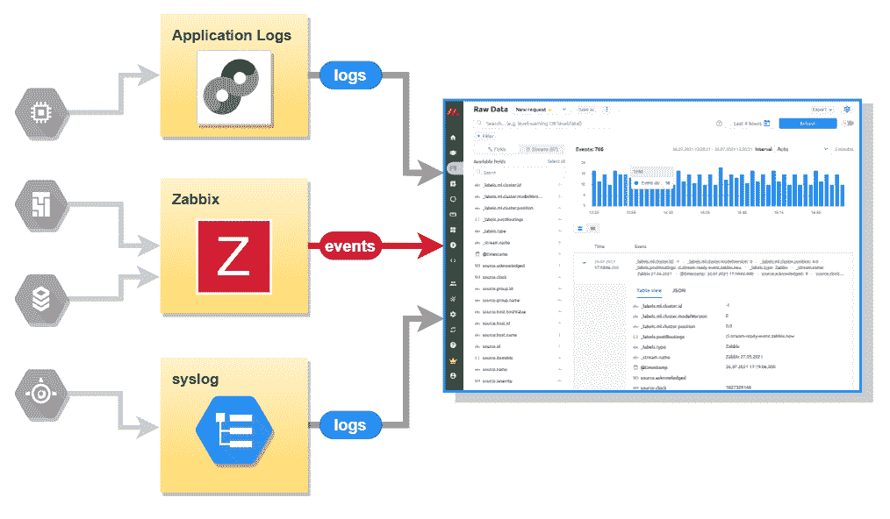
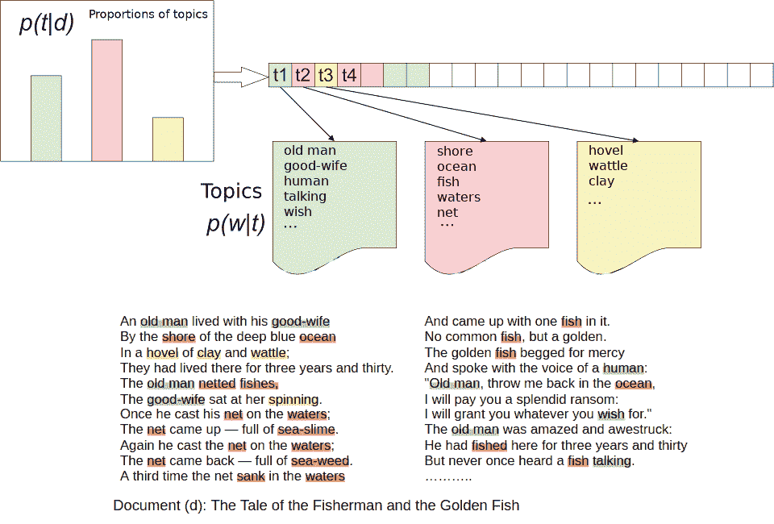
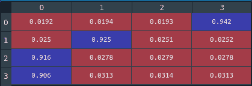
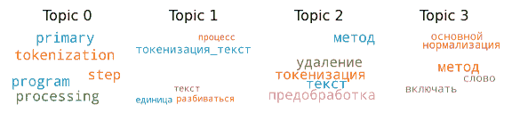
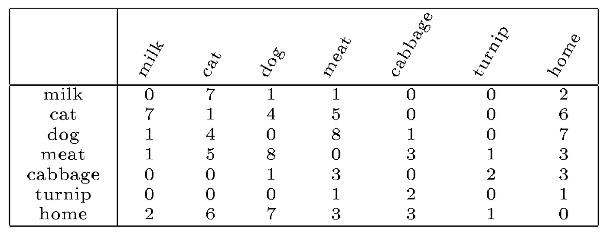
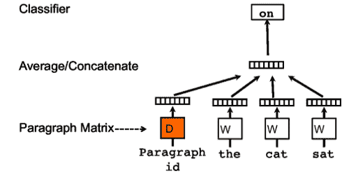
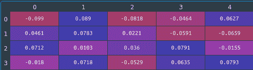

# 用 Python 库实现自然语言处理算法在 IT 监控中的应用

> 原文：<https://towardsdatascience.com/application-of-algorithms-for-natural-language-processing-in-it-monitoring-with-python-libraries-57eddc45c4ac?source=collection_archive---------30----------------------->

## 当应用于监控 IT 基础设施和业务流程的系统时，NLP 算法可用于解决文本分类问题和创建各种对话系统。本文将简要描述在 [Monq](http://monqlab.com) 平台的 AIOps 微服务中使用的 NLP 方法。

## 1.介绍

纯粹从理论上讲，所有自然语言处理(NLP)算法的最终目标都是创造能够理解人类语言的人工智能(AI)，此外，在“实现意义”(文本分析)和“做出有意义的陈述”(文本合成)的意义上“理解”。虽然这个目标仍然非常遥远——为了识别一种活的语言，有必要给 AI 智能体所有关于他周围世界的大量知识，以及与它交互的能力，即创建一个“真正会思考”的智能体。所以就目前而言，实际上，自然语言处理可以被认为是从文本数据中提取一些有用信息的各种算法方法。

有相当广泛的实际任务需要自然语言处理:

*   外语文本的机器翻译，
*   文本的自动注释(摘要)，
*   按类别(垃圾邮件/非垃圾邮件、新闻分类、情感分析等)对文本进行分类。),
*   对话系统(聊天机器人、问答系统)，
*   识别命名实体(找到人、公司、地点等的正确名称。正文中)。

当应用于监控 IT 基础设施和业务流程的系统时，NLP 算法可用于解决文本分类问题和创建各种对话系统。本文将简要描述用于混合 IT 监控的 [Monq](http://monqlab.com) 平台的 AIOps 微服务中使用的自然语言处理方法，特别是用于分析流入系统的事件和日志。



图片作者。

## 2.将文本转换为数字矢量表示

数学算法与数字一起工作，因此，为了使用数学仪器处理和分析文本数据，您必须首先将单词和句子转换为数字向量，并且最好保留语义关系和词序，即:

*   数字向量应该反映文本的内容和结构，
*   意义相似的单词和句子应该具有相似的矢量表示值。

目前，有两种主要的方法用于将文本，更准确地说是一组文本(或者，在 NLP 术语中，文档的语料库)转换成向量表示:

*   主题建模——用于在文档语料库中寻找隐藏(潜在)主题的几种类型的统计模型:潜在语义分析(PLSA)，潜在狄利克雷放置(LDA)，
*   基于分布假设的单词上下文表示的各种模型:神经网络模型 Word2Vec、GloVe、Doc2Vec、fastText 和其他一些模型。

在这些算法结束时获得的向量表示使得比较文本、搜索它们之间的相似文本、对文本进行分类和聚类等变得容易。

大约 10-15 年前，只有专家才能参与自然语言处理项目，因为这需要数学、机器学习和语言学领域的专业知识。现在，开发者可以使用许多现成的工具和库来解决 NLP 问题。特别是，在 Python 语言中，用于训练各种模型的相当广泛的 NLP 能力由两个模块的组合提供: [nltk](https://www.nltk.org/) 和[gensim](https://radimrehurek.com/gensim/)—Monq 平台的 NLP 功能基于它们(但不仅仅是它们)。

## 3.用于模型训练的文本数据预处理

预处理文本数据是构建各种 NLP 模型过程中的一个重要步骤——在这里，GIGO(“垃圾输入，垃圾输出”)的原则比其他任何地方都更正确。文本预处理的主要阶段包括标记化方法、规范化方法(词干化或词条化)和停用词的去除。通常，这还包括提取通常共现的短语(在 NLP 术语中——n-grams 或搭配)和编译令牌字典的方法，但我们将它们区分为单独的阶段。

记号化是将文本分割成文本单元，记号，可以是单个单词或短语，也可以是整个句子。在这种情况下，文档是属于一个语义单元(例如，句子、段落或段落)的标记的集合，而语料库是文档的一般集合。在标记化的过程中，文本是:

*   分解成句子，
*   去掉标点符号，
*   转换成小写，
*   分成记号(最常见的是单词，但有时是音节或字母组合)。

规范化是将单词还原为其标准的形态形式，为此，要么使用词干化，将单词还原为词干形式(“argu”、“fishing”、“fish”)，要么使用词汇化，将单词解析为其规范的词典形式(“is”、“be”、“written”、“write”)。对于俄语来说，词汇化更可取，通常，您必须使用两种不同的算法对单词进行词汇化——分别用于俄语(在 Python 中，您可以使用 pymorphy2 模块来实现这一点)和英语。

从文本块中移除停用词是从文本中清除不提供任何有用信息的词。这些通常包括常用词、代词和功能词类(介词、冠词、连词)。在 Python 中，nltk 模块本身有不同语言的停用词列表，在一个特殊的停用词模块中提供了更大的停用词集合——为了完整起见，可以组合不同的停用词列表。名字和父名也经常被添加到停用词列表中。

下面是一个相对完整的 Python 代码示例，用于预处理一组俄语和英语文本(输出是标记化文档的列表):

```
import re
from nltk.tokenize.punkt import PunktSentenceTokenizer
sentTokenizer = PunktSentenceTokenizer()
from nltk.tokenize import RegexpTokenizer
tokenizer = RegexpTokenizer(r’\w+’)from nltk.stem.wordnet import WordNetLemmatizer
lemmatizer = WordNetLemmatizer()
import pymorphy2
morph = pymorphy2.MorphAnalyzer()import langid
from nltk.corpus import stopwords
from stop_words import get_stop_wordslangid.set_languages([‘en’,’ru’])
stopWordsEn=set().union(get_stop_words(‘en’), stopwords.words(‘english’))
stopWordsRu=set().union(get_stop_words(‘ru’), stopwords.words(‘russian’))
stopWords=list(set().union(stopWordsEn, stopWordsRu))
stopWords.sort()textCollection=[‘The main stages of text preprocessing include tokenization methods, normalization methods, and removal of stop words.', 'Text tokenization is the splitting of text into text units. During the tokenization process, the text is first divided into sentences.’, ‘Tokenization in Python is the most primary step in any natural language processing program. ‘, ‘We have imported re library and used “\w+” for picking up words from the expression.’]textCollTokens = []
for text in textCollection: ## loop over the collection of texts
 sentList = [sent for sent in sentTokenizer.tokenize(text)]
 tokens = [word for sent in sentList for word in tokenizer.tokenize(sent.lower())]
 lemmedTokens=[]
 for token in tokens:
 if langid.classify(token)[0]==’en’:
 lemmedTokens.append(lemmatizer.lemmatize(token))
 elif langid.classify(token)[0]==’ru’:
 lemmedTokens.append(morph.parse(token)[0].normal_form)
 goodTokens = [token for token in lemmedTokens if not token in stopWords]
 textCollTokens.append(goodTokens)
```

## 4.n 元文法的提取和记号字典的编译

提取文本语料库中的稳定短语(n-gram 或搭配，例如，“纽约”、“中央银行”等)。)并且在 NLP 模型中将它们用作单个标记是提高这种模型质量的相当标准的方式。基于给定集合中单词共现的各种统计的计算，有几种算法用于确定文本集合中的搭配。但我们不会深入分析这些算法的利弊，而只是简单地使用 gensim 模块提供的提取二元模型和三元模型的方法:

```
from gensim.models.phrases import Phrases, Phraserbigrams = Phrases(textCollTokens, min_count=1, threshold=5) ## finding bigrams in the collection
trigrams = Phrases(bigrams[textCollTokens], min_count=2, threshold=5) ## finding trigrams
bigramPhraser = Phraser(bigrams) ## setting up parser for bigrams
trigramPhraser = Phraser(trigrams) ## parser for trigrams
docCollTexts=[]
for doc in textCollTokens:
 docCollTexts.append(trigramPhraser[bigramPhraser[doc]])
```

文本数据预处理的最后阶段是为给定的文本集合编译一个标记字典(考虑所有找到的 n 元语法)。通常，为了进入字典，令牌必须满足一些额外的标准——过滤令牌以减少“噪音”和“背景”——在我们的例子中(下面是代码示例):

*   令牌必须在整个集合中出现至少一定次数(参数 *no_below* )，
*   该标记不应该比在来自集合的一半文本中更频繁地被发现(参数 *no_above* )。

```
from gensim import corporatextCollDictionary = corpora.Dictionary(docCollTexts)
textCollDictionary.filter_extremes(no_below=1, no_above=0.5, keep_n=None)
```

因此，经过预处理后，文本集合被转换成一个标记化(包括 n 元语法)的文档列表，此外，我们还有一个给定文本主体的标记字典，以及“训练有素”的二元和三元语法分析器。最后三个对象必须保存在磁盘上以备后用，因为它们是正在构建的 NLP 模型的重要组成部分(为了方便起见，令牌字典也保存为文本文件):

```
bigramPhraser.save(‘bigramPhraser.pkl’)
trigramPhraser.save(‘trigramPhraser.pkl’)
textCollDictionary.save(‘textCollDictionary.pkl’)
textCollDictionary.save_as_text(‘textCollDictionary.txt’)
```

## 5.基于潜在狄利克雷分配的主题建模

如上所述，将文本集合转换成向量表示的方法之一是主题建模。在我们的平台中，我们为此使用了潜在的狄利克雷分配方法(LDA)。我们不会详细描述 LDA 内部的文本处理机制(带描述的原始文章[此处](https://www.jmlr.org/papers/volume3/blei03a/blei03a.pdf))，但我们将尝试概述该方法的基本原理:

*   集合中的每个文档都由一组潜在的(隐藏的)主题描述，
*   主题是具有特定权重或概率(给定字典的单词集上的多项式概率分布)的单词集，
*   文档是由潜在主题集生成的随机独立单词样本(单词包),
*   建立描述在特定文档和整个集合中出现的单词频率的矩阵，
*   使用吉布斯采样——一种根据某种联合分布(特别是狄利克雷分布)生成一组变量的随机样本的算法，确定这样的词到主题和主题到文档的矩阵，其最“正确”地再现给定的文本语料库，
*   作为集合中每个文档的输出，LDA 算法定义一个主题向量，其值是相应文本中每个潜在主题的相对权重。

下图说明了该方法的本质，相对而言，该图可以在对俄罗斯童话文本语料库运行 LDA 方法之后获得。在输出端，LDA 算法将“渔夫和鱼的故事”与主题向量 T = (0.35，0.5，0.15)进行匹配，其中 0.35 是主题 1 的权重，0.5 是主题 2 的权重，0.15 是主题 3 的权重。应该注意，LDA 方法不以任何方式解释主题，也不为每个主题提供任何通用名称——主题只是由索引编号的单词集合。有时，给定主题中具有最大权重的一个或多个单词被视为主题的简单“有意义”标识符。



图片作者。

使用 gensim 模块，用 Python 训练 LDA 模型非常容易:

```
from gensim import models
import numpy as np
```

text corpus =[textcolldictionary . doc 2 bow(doc)for doc in docCollTexts]

```
nTopics=4ldamodel=models.ldamodel.LdaModel(textCorpus, id2word=textCollDictionary, num_topics=nTopics, passes=10)
ldamodel.save(‘ldaModel’)textTopicsMtx=np.zeros(shape=(len(textCorpus),nTopics),dtype=float)
for k in range(len(textCorpus)): ## make the matrix of docs to topic vectors
 for tpcId,tpcProb in ldamodel.get_document_topics(textCorpus[k]):
 textTopicsMtx[k,tpcId]=tpcProb
```

在这个例子中，我们训练了一个 LDA 模型，将其保存到磁盘，并且还创建了语料库中所有文档的主题向量矩阵(文本集合的主题表示矩阵)，该矩阵可以在将来用于解决文本的分类和聚类的具体问题。对于我们的简单示例，主题矩阵看起来是这样的:



图片作者。

Python 中有几个模块可以可视化主题本身及其组成。以下是使用 wordcloud 和 matplotlib 模块可视化 LDA 结果的代码示例:

```
import matplotlib.pyplot as plt
from wordcloud import WordCloudcloud = WordCloud(background_color=’white’, width=2500, height=1800, max_words=5, colormap=’tab10',prefer_horizontal=1.0)
topics = ldamodel.show_topics(num_topics=nTopics, num_words=5, formatted=False)fig, ax = plt.subplots(1, 4, figsize=(8, 3), sharex=True, sharey=True)
for i, ax in enumerate(ax.flatten()):
 fig.add_subplot(ax)topicWords = dict(topics[i][1])
 cloud.generate_from_frequencies(topicWords, max_font_size=300)
 plt.gca().imshow(cloud)
 plt.gca().set_title(‘Topic ‘ + str(i), fontdict=dict(size=16))
 plt.gca().axis(‘off’)
plt.subplots_adjust(wspace=0, hspace=0)
plt.axis(‘off’)
plt.show()
```

结果，对于我们的示例，我们得到了下面的图片:



图片作者。

因为在给定的例子中，文本集合只是一组独立的句子，所以主题分析实际上为每个句子(文档)挑选出一个独立的主题，尽管它将英语中的句子归属于一个主题。

原则上，LDA 算法没有很多调整参数。主要参数是潜在主题的数量，它必须预先确定，并且为该参数选择最佳值是一项非常重要的任务。在我们的实践中，我们受以下简单规则的指导:我们获取在给定文本语料库上构建的标记字典的大小，并将其除以 10 到 20 之间的数(单个主题中的平均字数)——所得值作为 LDA 算法的输入给出。

## 6.Word2Vec 和 Doc2Vec 模型中单词的上下文表示

LDA 过程结束时文本集合的主题向量矩阵构成了文本语料库的全向量表示的第一部分，第二部分由语义向量或上下文表示形成。

语义向量的概念是基于分布假设:一个词的意义不是它由什么声音和字母组成，而是它最常出现在什么词中，即一个词的意义不是存储在它内部的某个地方，而是集中在其可能的上下文中。基本上，一个词的语义向量显示了它出现在其他词旁边的频率。

语义向量的最简单版本是一个单词在一个上下文中使用频率的矩阵，即彼此之间的距离不超过 n 个单词(通常使用 *n=10* ),例如，如果您拿一期《读者文摘》杂志，并计算不同的单词对在特定大小的相同上下文窗口中出现的频率，您会得到一个表格，其中一部分可能如下所示:



图片作者。

此表中的每一行数字都是第一列中单词的语义向量(上下文表示)，在《读者文摘》杂志的文本语料库中定义。

如果我们在整个语言的文本语料库(例如，这个 [one](https://www.english-corpora.org/bnc/) )上执行这样的过程，那么这种方法的两个显著缺点立即变得明显:

*   该表太大了，因为它的大小是由成千上万的字典的大小决定的，
*   该表将主要由零填充。

自上世纪 60 年代以来，已经提出了各种技术来降低词的共现矩阵的维数(奇异值分解、主成分分析、各种类型的过滤)，但是没有观察到显著的突破。突破发生在 2013 年，当时谷歌的一组研究人员提出使用神经网络架构 Word2Vec 来获得语义向量。还是那句话，我们不会详细描述 Word2Vec 神经网络是如何工作的(原文可以取[此处](https://arxiv.org/pdf/1301.3781.pdf)，以更通俗易懂的形式[此处](/light-on-math-machine-learning-intuitive-guide-to-understanding-word2vec-e0128a460f0f))，但我们会局限于主要方面:

*   神经网络在大量的文档集合上被训练，以预测哪些单词最有可能被发现彼此相邻(并且神经网络绝不是深度的——只有两层)，
*   两种学习模式，CBOW(连续单词包，更快)和 skip-gram(对较少使用的单词更准确)，
*   输出向量的维数是几百(典型地， *n=300* )，
*   在训练了从输入层到神经元隐藏层的权重矩阵之后，自动给出所有单词的期望语义向量。

Word2Vec 方法的进一步发展是 Doc2Vec 神经网络架构，它为整个句子和段落定义语义向量。基本上，附加的抽象标记被任意地插入到每个文档的标记序列的开始，并且被用于神经网络的训练。训练完成后，这个抽象记号对应的语义向量包含了整个文档的广义含义。尽管这个过程看起来像是“用耳朵玩的把戏”，但实际上，来自 Doc2Vec 的语义向量改善了 NLP 模型的特性(当然，并不总是如此)。



我们再次使用 gensim 模块中 Doc2Vec 算法的实现:

从 gensim.models 导入 Doc2Vec

```
d2vSize=5
d2vCorpus= [models.doc2vec.TaggedDocument(text,[k]) for k,text in enumerate(docCollTexts)]
d2vModel=Doc2Vec(vector_size=d2vSize, min_count=1, epochs=10, dm=1)
d2vModel.build_vocab(d2vCorpus)
d2vModel.train(d2vCorpus, total_examples=d2vModel.corpus_count, epochs=d2vModel.epochs)
d2vModel.save(‘doc2vecModel’)textD2vMtx=np.zeros(shape=(len(textCorpus), d2vSize),dtype=float)
for docId in range(len(d2vCorpus)):
 doc2vector=d2vModel.infer_vector(d2vCorpus[docId].words)
 textD2vMtx[docId,:]=doc2vector
```

在这里，我们训练一个 Doc2Vec 模型，将其保存到磁盘，然后，使用训练好的模型，创建所有文档的语义向量矩阵。在我们的简单示例中，这个矩阵是这样的:



图片作者。

查看该矩阵，很难解释其内容，尤其是与主题矩阵相比，主题矩阵中的所有内容或多或少都很清楚。但是解释的复杂性是神经网络模型的特征，主要是它们应该改进结果。

结合作为 LDA 和 Doc2Vec 算法的工作结果而计算的矩阵，我们获得了文档集合的全向量表示的矩阵(在我们的简单示例中，矩阵大小为 *4x9* )。此时，可以认为将文本数据转换成数字向量的任务已经完成，并且得到的矩阵可以进一步用于构建文本分类和聚类的 NLP 模型。

## 7.摘要

在本文中，我们分析了使用几个 Python 库处理文本数据并将它们转换成数字向量的例子。在下一篇文章中，我们将描述一个使用 LDA 和 Doc2Vec 方法解决混合 IT [监控平台 Monq](https://monqlab.com/) 中主事件自动聚类问题的具体例子。