# 低密度聚乙烯综合生命周期评估和供应链分析的应用

> 原文：<https://towardsdatascience.com/application-of-an-integrated-life-cycle-assessment-and-supply-chain-analytics-on-ldpe-6aba41555921?source=collection_archive---------40----------------------->

## [行业笔记](https://towardsdatascience.com/tagged/notes-from-industry)

*作者:Debanjana Chakraborty @ Chakraborty _ Debanjana，Suparno Bhatta @iamsuparno 和 Poovammal E 博士，印度钦奈 603203*

S 可持续产品是指以最优成本获得的清洁绿色产品。在市场主导的时代，快速的商业发展集中于廉价商品的快速生产。这造成了自然资源过度消耗的激增，代价高昂，从而产生了有害的污染物。意识到后果后，各国开始采取措施消除市场对气候和自然环境的负面影响。

开发一种能够专注于在环境质量和全球市场产品供应链之间建立平衡的模式，已经成为一件至关重要的事情(Bhatta 等人，2021 年)。这可以通过开发一个融合了供应链管理分析和生命周期评估(LCA)的模型来实现。

生命周期评估(IS014040 和 ISO4044)是指测试和评估产品的环境和生态质量的方法。整个过程包括原材料提取阶段、制造和加工阶段、运输阶段以及最终的处置和再利用阶段。

供应链管理(SCM)要求组织数据、人员、事件、组织和资源(Bhatta et al .，2021)。它们强调改善货物流动的功能、计划、组织和控制。整个过程包括仓储、供应商、分销商、市场、制造商和零售商物流。

## 现有模型的缺点:

在生命周期评估和供应链管理的单个模型中，人们注意到在信息技术、数据生成和管理方面存在严重不足。(达文波特等人，2001；Hazen 等人，2014 年)。他们未能产生一个准确的结果去测试身体。这是因为缺乏对关键决策领域的了解，而这些领域是了解产品类型、质量和在任何特定行业使用时的可持续性所必需的(Fornasiero 等人，2017 年)。独立模型缺乏逻辑和技术流程来确定利润率、消费和排放模式(Brondi & Carpanzano，2011 年)。先前模型中使用的数据集大多是聚合的，而不管它们是否特定于位置。(Nuasaen 等人，2014；Park & Seo，2006；Moriguchi 和 Terazono，2000 年)。

## 目标:

已经进行了许多研究来开发 LCA 和 SCM 的单个模型，但是很少关注将这两个方面结合起来，以提供从原产地到消费的高质量订单履行。这些技术的结合将建立一种操作效率，从而提高模型的生产率。该整合模型将通过关注生产支出的增长和减少，帮助企业跟踪其供求关系。同时，它还将强调减少有害的环境排放和对自然资源的过度消耗。我们之前提出了一个架构(Bhatta 等人，2021 年)，将在这项研究中实施，以检查模型的效率。

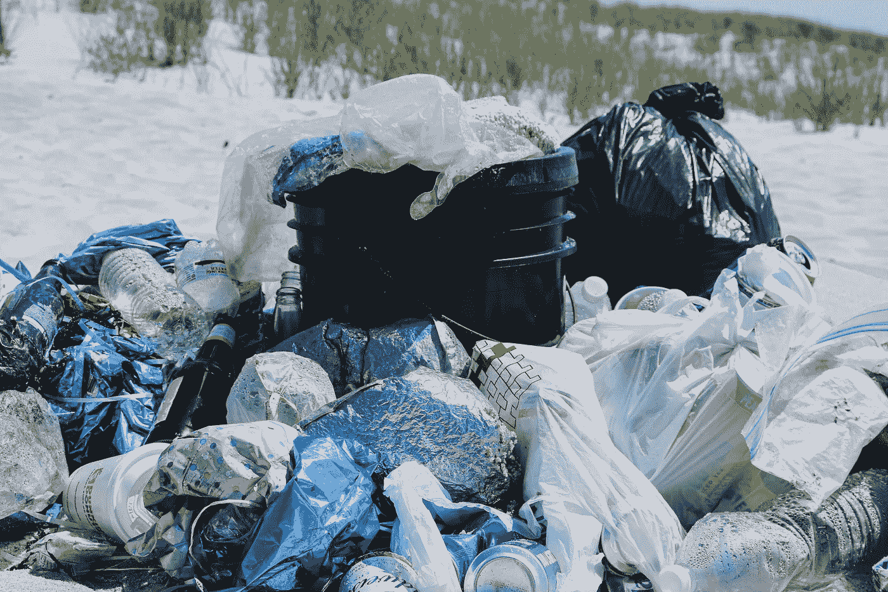

一次性塑料

整个测试将在主要消耗天然气和石油以及排放有害温室气体的产品(一次性塑料)上进行。该模型应强调数据维度的完整性、一致性、准确性和及时性、相关性、价值性、数量性、可访问性和声誉性(王，1996；王等，1995；王，1998)。

# 履行

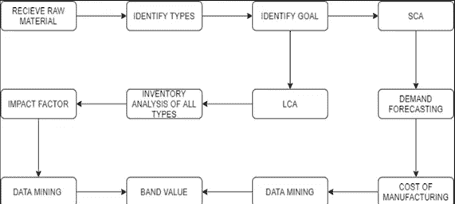

LCA 和 SCM 集成模型的体系结构图

该模型是一个集成开发，首先确定满足客户需求所必需的原材料。然后在 Google Colab 中使用 Python 执行 LCA 和 SCM 分析。在生命周期评价阶段，对每种原材料的环境质量进行测试，以获得加工、制造和运输阶段消耗的能量。这让我们了解了制造阶段可用的不可再生资源的稀缺程度，以及使用这些资源时所消耗的能源量。它还让我们了解了因生产一次性塑料而产生的温室气体和非温室气体排放量。同时还对产品的供求数据进行分析。这可以通过进入计划阶段来获得，在计划阶段，可以获得制造和销售一次性塑料的净支出和总支出。损益是根据净支出、总支出、运营成本和额外的第三方成本预测的。数据集准备就绪后，使用 Scikit learn 执行数据挖掘。

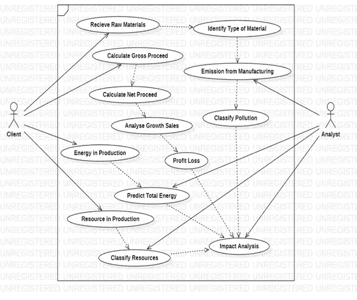

UML 图

首先，我们导入数据集，并将其安装在与 Google Colab 相同的驱动器上。

将数据集装载到 google collab

然后在 python 中设置访问数据集的路径。

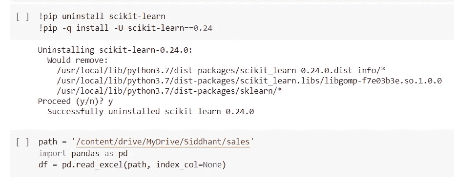

添加数据集的路径

然后，我们导入 NumPy 库来转换 CSV 格式的数据，并以表格格式分析数据。

导入 NumPy 库以将数据集转换为数据数组

使用特征提取获得所有需要的输入，并设置预测的目标值。

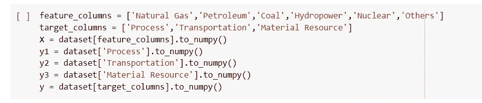

设置输入和输出的数据值

训练和测试数据被分成 70:30 以获得最佳结果。

训练和测试数据集

然后我们在导入 Scikit learn 后进行 Huber、Ridge 和线性回归。

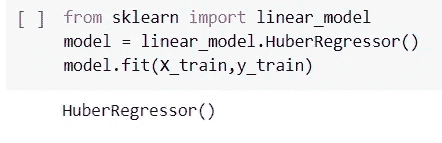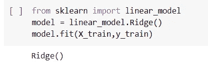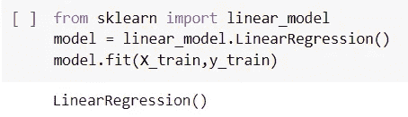

用于导入 Huber(左)、岭(中)和线性(右)回归的代码段

检查模型分数以获得挖掘技术的准确性。

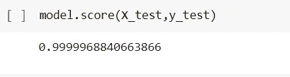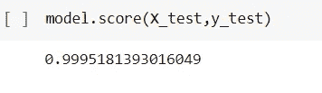

Huber(左)、岭(中)和线性回归(右)的模型得分

对于图形可视化，将从目标结果获得的实际值和预测值与平滑线图进行比较。LCA 和 SCM 阶段都是使用回归技术进行的。

**数据集收集**

理解该模型的可行性是至关重要的。分钟数据集具有现成的数据集，可用于在集成的 LCA-SCM 模型上进行测试，因此为此测试过程创建了一个新的数据集。

每个 LCA 和 SCM 部分的收集方法是不同的。一次性塑料的生产由低密度聚乙烯完成。使用这种塑料的数据是因为它们目前在全球市场上需求量最大。低密度聚乙烯在我们生活的各个方面都有广泛的用途。他们也是造成全球变暖的温室气体的最大排放者。我们从第一个报告期获得了提交给英国政府的六个月(2015 年 10 月-2016 年 4 月)一次性载体的数据集。该数据( *Lca-SCM 塑料数据库-完整数据库*，未注明)包括制造塑料的净支出、销售塑料的总支出、政府征收的增值税。

我们将 SCM 数据与自行创建的 LCA 数据集相结合。使用“一次性塑料的数量”和一个单位生产或排放的数值来计算数值，该数值基于 2011 年 8 月关于九种塑料树脂和四种聚氨酯前体从摇篮到大门生命周期清单的技术报告(Feraldi 等人，2013 年)。生命周期评价的数据集侧重于“从摇篮到大门”阶段。该数据包括加工过程中使用的不可再生资源和消耗的能源的价值。它还包括在一次性塑料的制造、加工和运输阶段排放到大气中的各种温室和非温室污染物。

*要获取数据集，请将此出版物的作者发邮件给*

**回归技术**

我们使用线性回归，因为它有助于预测公司的净利润/亏损，这取决于制造用原材料的销售情况。当我们使用一个因变量和一个自变量进行预测分析时，它会给出准确的结果。因为这有利于预测效果，也有利于确定预测者的强度。我们还尝试使用更多的回归技术来检查哪一个更适合我们。使用 Huber 回归，因为它对异常值是稳健的。与标准的最小二乘法相比，它使用了一种特殊的损失函数。对于损失的小残差，似乎通常拥有最小量的平方惩罚，但是对于大残差，它的惩罚更小，并且它线性地而不是二次地激增。因此，它适用于含有大量异常值的数据集。

然后利用岭回归分析多重共线性严重的多重相关数据。当多重共线性出现时，最小二乘法估计值是无偏的，但它们的方差很大，这意味着它将远离真值。它通过给回归估计增加一定程度的偏差来减少质量误差。

# **结果和讨论**

我们希望设计一个模型，可以预测产品的环境质量和可持续成本之间的趋势。在这个结果中，我们试图找出一次性塑料制造过程中的能源消耗率、销售系数和有害污染物排放量。在这项研究中，采用了线性、Huber 和岭回归技术进行比较研究，以了解在这种情况下哪种方法在准确性方面效果最好。在比较研究中，实际值和真实值通过图表计算得出。实际曲线代表基于独立变量的曲线的当前状态。预测曲线表示与当前值相比，曲线可能如何变化的未来预测。

在所有三种回归技术中，模型得分几乎在**0.9995–1.0**之间。这显示了三种技术的精确度。所有三种回归技术为我们提供了几乎相似的结果，只有微小的偏差。然而，在三个 Huber 回归中，几乎所有代码的模型得分为 1.0，显示出最高的准确性。在这里，我们将只显示 Huber 回归的图形和数据头。

## 销售和推断:

我们试图找出英国公司每年用低密度聚乙烯制造一次性塑料的总支出。在数据集中，我们获得了净支出、总支出和增值税的值。

> 根据计算:**总收入=净收入+增值税**(总收入> >净收入)
> 
> **总收入:**公司生产一次性塑料的平均支出。
> 
> **净收益:**制造商制造塑料的平均支出。
> 
> **增值税:**政府对一次性塑料征收的税

存在增值税时使用线性回归进行销售预测的示例代码

存在增值税时使用 Huber 回归进行销售预测的示例代码

**下图说明:**

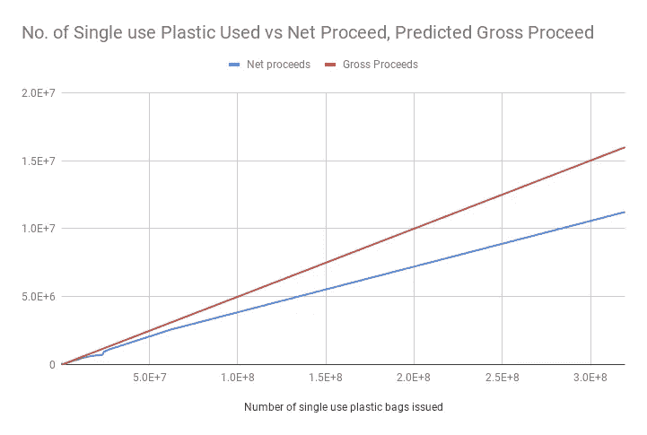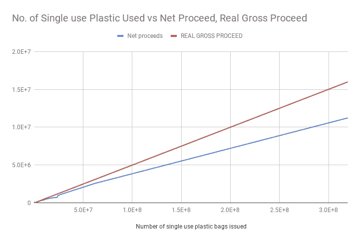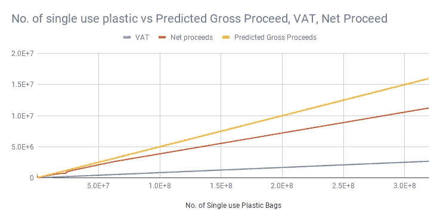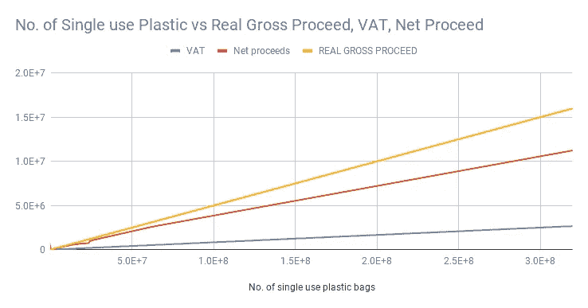

含增值税和不含增值税的一次性塑料的销售增长

1.  在我们的图表中，我们注意到预测总值略低于实际总值。制造塑料的未来开支将会减少。这意味着英国公司将开始减少这些塑料的使用和生产，从而遵守英国公司签署的反塑料协议。公司还没有减少一次性塑料的使用。一次性塑料未来产量的大幅下降将有助于在很大程度上减少销售。公司还没有减少一次性塑料的使用。
2.  上述四张图中的实际总支出和预测总支出保持不变。这表明政府实施的机制还没有发挥作用。未来各公司的塑料年供应量和销售量将继续增长。

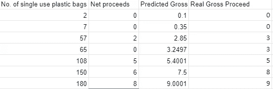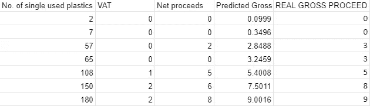

不含增值税的销售额前 7 名的负责人(左)，含增值税的销售额前 7 名的负责人(右)

3.比较上图中的两个数据集，以了解预测总支出的微小变化。数据头中预测总量的微小变化肉眼几乎无法分辨。有增值税的数据集显示塑料的预测支出较少，而没有增值税的数据集显示一次性塑料的未来销售和消费呈线性增长。从而显示政府在控制一次性塑料生产中的作用。英国政府实施的严格机制将迫使这些公司自动减少塑料的生产和消费。

## 能源和资源消耗:

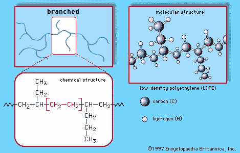

低密度聚乙烯的化学结构

一次性塑料由低密度聚乙烯制成。它们由原油或天然气加工而成。在塑料制造过程中，需要大量不可再生资源来提取原材料，将这些原材料加工成低密度聚乙烯，然后从工厂运输到公司。加工、运输和材料阶段的能源消耗有助于我们了解公司每年消耗的不可再生资源的数量。

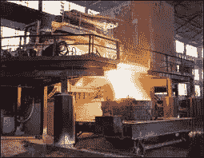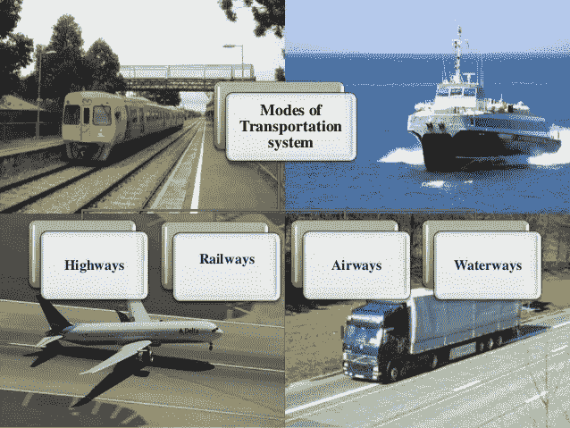

过程运输和材料阶段

***材料阶段:***

下图说明:(添加数字)

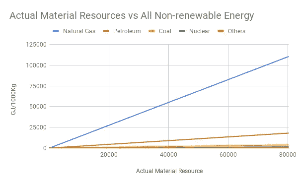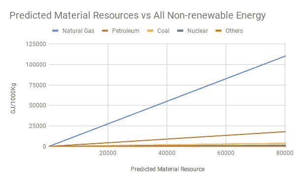

Huber 回归中的实际(左)材料资源与所有不可再生能源以及预测(右)材料资源与所有不可再生能源

1.  上述数字显示了对日益枯竭的自然资源的过度消耗。大量的天然气被加工和消耗以制备低密度聚乙烯。石油在能源消耗总量中位居第二。剩余资源(煤、核能等)消耗的能量非常少。
2.  在这两个图表中，所有资源的能源消耗继续急剧增加。这描绘了公司过度消耗不可再生资源的有害习惯。

***流程阶段***

**下图说明:**

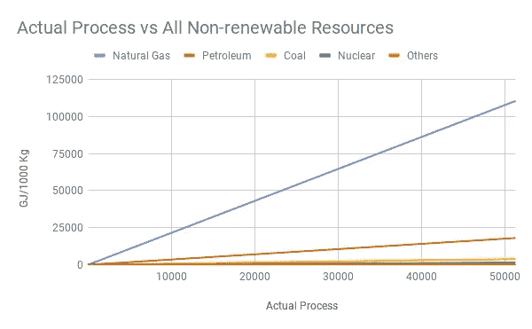

Huber 回归中的实际工艺资源与所有不可再生能源(左)和预测工艺资源与所有不可再生能源(右)

3.在上图中，我们可以看到天然气消耗最大的能量来制备低密度聚乙烯。与物质相类似，石油排在总能耗的第二位。其他气体的曲线几乎已经融合在图表中，因为它们消耗的能量非常少，肉眼几乎看不见。

4.加工阶段的消耗曲线类似于材料阶段。这告诉我们公司如何继续过度消耗资源

***运输阶段:***

下图说明了:

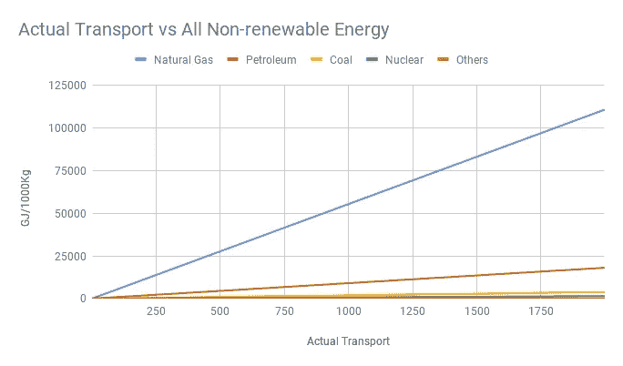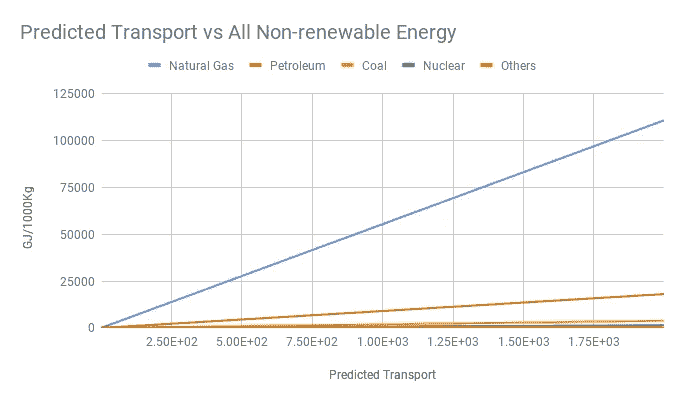

Huber 回归中的实际运输资源与所有不可再生能源(左)和预测运输资源与所有不可再生能源(右)

5.天然气和石油再次占据运输阶段能源消耗的前两位。然而，石油和天然气的能耗曲线存在巨大差异。这表明与石油相比，天然气的消耗量要大得多。加工和制造阶段的情况并非如此。

***合并资源:***

下面给出的数据标题图代表了不可再生资源消耗的能源与工艺、运输和材料资源的实际值和预测值之间的比较。

使用岭回归进行流程、运输和材料预测的示例代码，以了解过度消耗的自然资源

下图说明了:

组合流程、运输和材料阶段的前 9 个值的标题

6.在塑料制造过程中(加工阶段)，不可再生资源的能源消耗最大。原材料运输(运输阶段)排在第二位，提取原材料制造塑料排在第三位

7.英国的公司显示出生产更多塑料的未来趋势。这是显而易见的，因为预测过程值大于实际过程值。减少产量的唯一方法是提高每种产品的税率。这将减少需求，从而减少石油和天然气的过度使用。

8.实际运输量和预测运输量的趋势相反。这与过程阶段相反。这表明未来交通运输阶段的能源消耗率将会下降。

9.与生产和运输阶段的值相比，材料阶段的预测值和实际值的能耗几乎可以忽略不计。

***能源消耗越大，自然资源的损耗就越大。因此，影响了地球的生态因素。它还增加了导致全球变暖的二氧化碳和甲烷的排放率。***

## **温室气体和非温室气体排放推断:**

以前我们已经注意到不可再生资源是如何被过度消耗来制造一次性塑料的。下图和图 15 中的饼图分析了该阶段排放的温室气体和非温室气体。

***温室气体:***

下图分析了提取、制造和运输一次性塑料时预计会排放的温室气体量。

利用 Huber 回归分析温室污染率

*温室气体:二氧化碳、甲烷、一氧化二氮、溴甲烷、氯甲烷、三氯乙烷、氯仿、四氯化碳、CFC13、HCFC 22。*

**下图说明:**

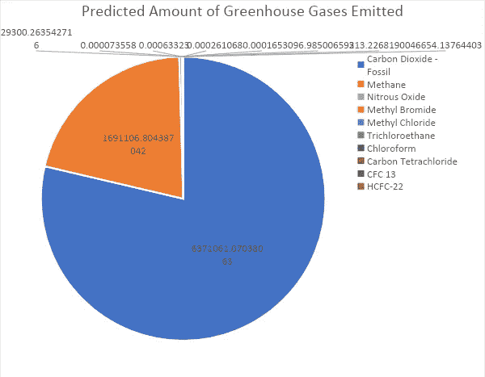

各阶段预计的温室气体排放量(单位:1000 千克)

1.  二氧化碳(78.67%)和甲烷(20.88%)是产生最多的污染物，其次是其他污染物。这是因为石油和天然气资源被过度消耗以制造一次性塑料。在运输阶段，大量的煤以及石油和天然气也被用作燃料。它们是截留甲烷气体的主要来源。当这些资源被过度消耗时，致命的甲烷和二氧化碳被释放到空气中。在运输阶段，大量的煤以及石油和天然气也被用作燃料。这会释放有害的污染物。这两种污染物都吸收热量，并且不允许它们从地球表面逸出。从而使空气变得非常热，增加了气候临界点的危险。这将对地球的气候产生毁灭性的影响。
2.  甲烷是一种更致命的温室污染物，因为它在大气中停留的时间比二氧化碳更长。在所有三个阶段中曲线的急剧上升会导致许多健康问题，如视力问题、记忆力丧失、恶心、呕吐、面部潮红和头痛。
3.  其余的污染物加在一起只占总污染的 0.44 %。因此，控制甲烷和二氧化碳的比例，地球的温度就会得到控制。

*下面是一个类似的饼状图，用来比较加工、运输和材料阶段排放的非温室气体水平。这些气体不是全球变暖的罪魁祸首，但它们是导致致命健康问题的空气污染的罪魁祸首。*

**非温室气体:颗粒物(PM 未指明，2.5，10)、挥发性有机化合物(VOC)、非化石二氧化碳、氮氧化物、一氧化碳和二氧化硫。所有三个阶段都显示出相同的趋势。**

*使用线性回归技术的非温室气体排放率*

***下图说明:***

*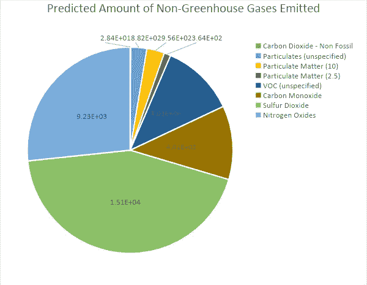*

*预测的各阶段非温室气体排放量(单位:1000 千克)*

1.  *在该过程中产生大约 43.5%的二氧化硫。这是一个令人担忧的问题，因为如此高的百分比破坏了生态系统，也是文物建筑恶化的原因。它们还会导致人类呼吸急促和胸闷。*
2.  *氮氧化物占非温室气体排放总量的 27%。它们破坏植被，影响动物和人类。这种污染物会引起眼睛刺激、肺部问题和呼吸问题。它们与大量排放的二氧化硫结合产生酸雨。酸雨与建筑物和雕像发生化学反应，溶解化学物质，从而使它们变得脆弱。*
3.  *与其他污染物相比，一氧化碳和挥发性有机化合物的产生率为 12%,但当一氧化碳含量超过 40%时，这些污染物就会对人类和动物的生命产生致命影响。*
4.  *与其他污染物相比，微粒物质(未指明，10 和 2.5)的排放量非常小。这些主要是微米和纳米微粒，是室内污染的主要来源。它们对人类健康有重大影响。这些是极小颗粒和液滴的复杂混合物。这些污染物在本质上是致命的，当大量排放时甚至会导致死亡。*

*二氧化碳化石排放几乎可以忽略不计。然而，与其他污染物相比，它们的致命性较低，如果在高浓度下产生，会导致昏迷或死亡。*

# *结论*

*所有三种回归技术都经过了准确性测试。给出最佳精度的模型是 Huber，其次是线性，然后是岭型。这是因为它对数据集中出现的异常值或数据异常不太敏感。但是，在此过程中，某些净值、总值和增值税值不可用，因此默认情况下假定它们为 0。长期以来，完整数据的可获得性一直是一个问题，这项研究也反映了这一点。由于公司的保密原因，这些数据中的大部分被隐藏或未被探索。在大多数图表中，所有的曲线都不清晰可见。这是因为我们的数据集包含大范围的值，当累积在一起时，我们很难通过肉眼看到结果中的微小差异。此过程中使用的数据独立于任何特定位置，因此如果考虑任何特定区域，结果可能会有所不同。使用回归技术的整个过程提供了非常高效的结果。读者也可以尝试聚类或分类技术来获得可持续的结果。*

# *参考资料:*

*Bhatta，s .，Chakraborty，d .，& Poovammal，E. (2021)。*使用整合的 LCA-SCM 模型*得出可持续产品的最佳成本。 *9* (2)，1193–1199 年。【https://doi.org/10.17762/itii.v9i2.472 *

*c .布朗迪和 e .卡潘萨诺(2011 年)。基于 LCA 的生产系统模拟的模块化框架。*《CIRP 制造科技杂志》*， *4* (3)，305–312 页。[https://doi.org/10.1016/j.cirpj.2011.06.006](https://doi.org/10.1016/j.cirpj.2011.06.006)*

*达文波特，T. H .，哈里斯，J. G .，德龙，D. W .，，雅各布森，A. L. (2001)。从数据到知识再到结果。*加州管理评论*， *43* (2)，117。[http://search.ebscohost.com/login.aspx?direct=true&db = buh&AN = 4372997&site = ehost-live](http://search.ebscohost.com/login.aspx?direct=true&db=buh&AN=4372997&site=ehost-live)*

*费阿尔迪、凯许曼、哈夫和拉豪格(2013 年)。美国废轮胎处理方案的比较生命周期分析；*

*材料回收和轮胎衍生燃料燃烧。*国际生命周期评价杂志*， *18* (3)，613–625。[https://doi.org/10.1007/s11367-012-0514-8](https://doi.org/10.1007/s11367-012-0514-8)*

*Fornasiero、c . Brondi 和 d . Collatina(2017 年)。提出一个整合的 LCA-SCM 模型来评估定制策略的可持续性。*国际计算机集成制造杂志*， *00* (00)，1–14。【https://doi.org/10.1080/0951192X.2016.1268716 *

*Hazen，B. T .，Boone，C. A .，Ezell，J. D .，& Jones-Farmer，L. A. (2014 年)。供应链管理中数据科学、预测分析和大数据的数据质量:问题介绍及研究和应用建议。*国际生产经济学杂志*， *154* ，72–80。[https://doi.org/10.1016/j.ijpe.2014.04.018](https://doi.org/10.1016/j.ijpe.2014.04.018)*

**lca-scm 塑料数据库-全数据库*。(未注明)。*

*Moriguchi，y .，& Terazono，A. (2000 年)。大气排放空间差异影响评估的简化模式。*国际生命周期评价杂志*， *5* (5)，281–286。[https://doi.org/10.1007/BF02977580](https://doi.org/10.1007/BF02977580)*

*Nuasaen，s .，Opaprakasit，p .，& Tangboriboonrat，P. (2014 年)。壳聚糖功能化的中空乳胶粒子用于去除室内空气中的甲醛。*碳水化合物聚合物*， *101* (1)，179–187。[https://doi.org/10.1016/j.carbpol.2013.09.059](https://doi.org/10.1016/j.carbpol.2013.09.059)*

*Park，J. H .，，Seo，K. K. (2006 年)。一种基于知识的近似生命周期评估系统，用于评估协同设计环境中产品设计备选方案的环境影响。*高等工程信息学*， *20* (2)，147–154。[https://doi.org/10.1016/j.aei.2005.09.003](https://doi.org/10.1016/j.aei.2005.09.003)*

*王瑞英(1996)。数据质量对数据消费者意味着什么。*管理信息系统杂志*， *12* (4)，5–34。[https://doi.org/10.1080/07421222.1996.11518099](https://doi.org/10.1080/07421222.1996.11518099)*

*王瑞英(1998)。全面数据质量管理的产品视角。*ACM 的通信*、 *41* (2)、58–65。【https://doi.org/10.1145/269012.269022 *

*王瑞英、斯托里、冯维国、费斯、陈平(1995)。数据质量研究的分析框架。 *IEEE 知识与数据工程汇刊*， *7* (4)，623–640。【https://doi.org/10.1109/69.404034 *