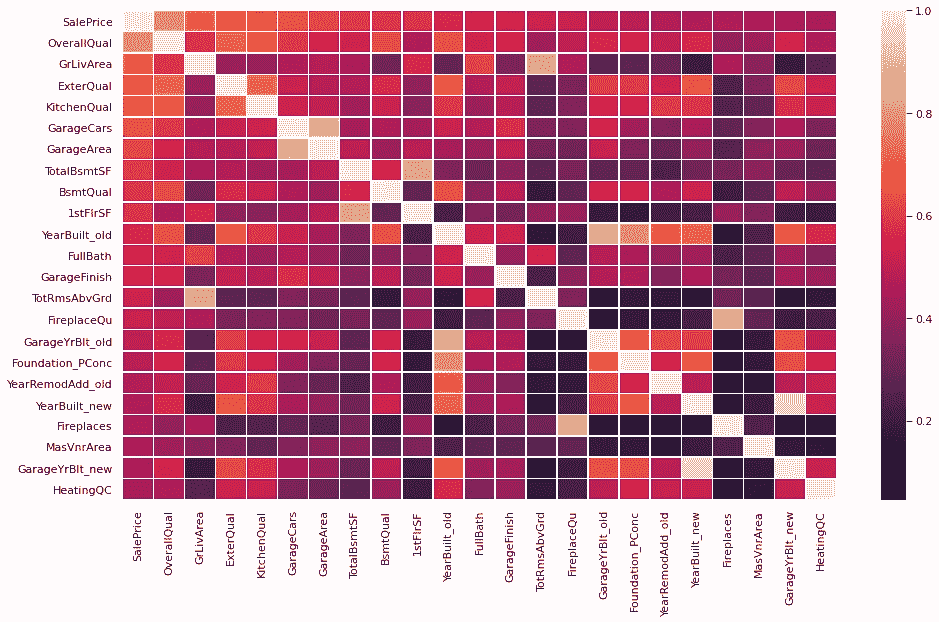
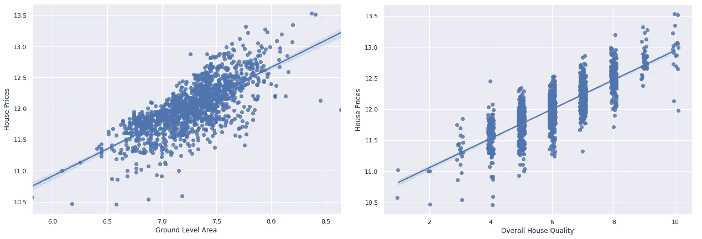
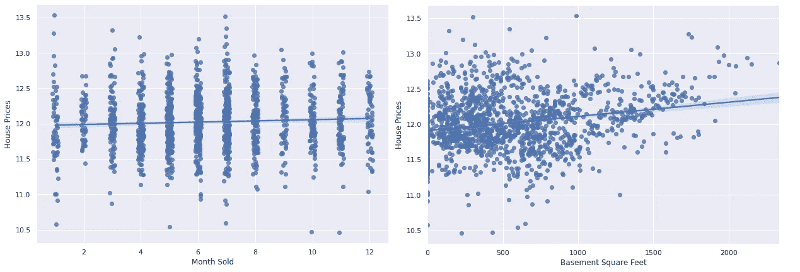
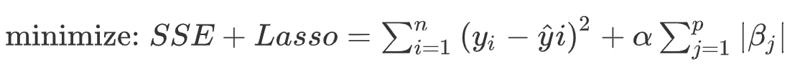

# 特征选择技术在回归问题中的应用

> 原文：<https://towardsdatascience.com/application-of-feature-selection-techniques-in-a-regression-problem-4278e2efd503?source=collection_archive---------18----------------------->


维多利亚诺·伊斯基耶多在 [Unsplash](https://unsplash.com/?utm_source=unsplash&utm_medium=referral&utm_content=creditCopyText) 上的照片

## Python 中的要素选择和优化示例

在与您的数据管理员多次通话，通过各种渠道和[数据丰富](https://www.tracers.com/blog/what-is-data-enrichment/)平台获取最有用的数据后，您作为一名数据科学家完成了数据收集。现在你有一个庞大的数据集可以浏览。为了优化计算时间、性能和可解释性之间的权衡，您只需要包括与您的机器学习模型最相关的列。此时，功能选择开始发挥作用。

## 为什么我们需要特征选择？

主要原因是在将数据提供给模型之前减少数据集中的字段数量。为什么需要这样做？需要降低模型的复杂性，这可能会导致过度拟合。我们的数据应该符合信号，而不是不相关的预测者产生的噪音。复杂性的降低也增加了我们模型的可解释性，这在与其他利益相关者交流结果时是必不可少的。最后，它减少了内存和计算需求，这是针对生产中的模型进行优化的一个方面。

## 最常见的特征选择方法

*过滤方法*仅包括与目标变量相关性分数高的模型最相关的特征。这是非常简单和计算友好的，因为使用一个相关措施，一个分数计算所有的预测。具有最高分数的特征被过滤以在模型中使用。一个警告是，在线性模型中总是存在共线性的风险。过滤方法只检查与目标变量的相关性，这就是为什么预测值之间的任何相关性都需要在预处理的后期处理。

*包装器方法*在每次迭代中用特性子集训练模型，并检查它们对性能的影响。然后利用不同的子集训练另一个模型。在每一步中，来自先前模型的学习被考虑来挑选产生更好结果的不同子集。迭代继续进行，直到选择出最佳特征。这种方法计算量很大，因为在每次迭代中，都用新的特征子集来训练新的模型。

*嵌入式方法*利用在建模过程中支持特征选择的算法。这种方法减少了预处理时间，因为训练和特征选择是一起完成的。最好的例子可以是 Lasso 和[岭回归](/the-power-of-ridge-regression-4281852a64d6)或者决策树。

下面我将为*过滤器*、*包装器*和*嵌入方法*应用一些例子。前三个将是皮尔逊相关、单变量特征选择和方差阈值来表示过滤方法，然后是包装方法的递归特征消除，最后是嵌入方法的 Lasso。

## *方法 1:皮尔逊相关法*

皮尔逊相关系数是介于-1 和+1 之间的一种度量。如果系数越来越接近一端，那么相关性就越高。最好的可视化方法是利用`sns.heatmap()`。在下图的情况下，单元格越亮，特征之间的相关性越高。



为了找到模型中最有用的列，可以从相关矩阵中筛选出目标变量。由于我对相关性的大小比对其方向更感兴趣，所以我检查了矩阵的绝对值。

```
# creating dataframe including the correlations with SalePrice
df_corr = abs(df_train.corr()).sort_values(by='SalePrice', ascending=False)[['SalePrice']]# threshold of 0.4 is selected to filter the features
df_corr[df_corr['SalePrice']>0.4]
```

挑选与目标变量最相关的列很容易，但是我们需要解决任何线性模型中的共线性问题。为了解决这个问题，我建立了一个共线性检测器:

```
def colinear_detector(df, target_col):
  """
  aim: detect any colinearity
  inputs: all the columns
  output: colinear pairs
  """
  # dropping the target columns
  df_x = df.drop(columns=target_col) # initiating an empty dictionary 
  colinear_dict = {}

  # sorting the most correlated column for each column
  for column in  df_x.columns.tolist():
    df_corre = abs(df_x.corr()).sort_values(by=column, ascending=False)[[column]]

    # if score is higher than 0.8, add them to a new list
    # every predictor's correlation with itself is 1 so drop the first
    colinear_cols = df_corre[df_corre[column]>0.8].index.tolist()[1:]
    # add a list of correlated columns for each column
    colinear_dict[column]= colinear_cols

  # return the correlation dictionary
  return colinear_dict
```

输出将是一个字典，其中键是具有共线性的列，值是相应键的所有共线性列的列表。

## 方法 2:单变量特征选择

单变量特征选择计算特征和目标变量之间的相互作用，并对每个特征分别进行计算。对于每个特征，计算 p 值，表明该特征是否对目标变量有显著影响。由于我们正在处理一个回归问题，我将利用 sklearn 的`f_regression`。在幕后，它分别训练每个特征的简单线性回归模型来预测目标变量。每个模型的 F 值解释了该特征预测目标变量变化的程度。在`f_regression`的例子中，一个简单的线性回归模型的 F 值变成了它被训练的特征的 F 值。该分数随后用于确定该特征相对于其他特征与目标变量的相关性。



与目标变量高度相关的特征



与目标变量相关性差的特征

下面，我挑选了 25 个得分最高的列来包含在我的模型中。

```
from sklearn.feature_selection import f_regression
# assigning f and p values to 2 separate arrays
f_val, p_val = f_regression(X_train,y_train)

# creating a dictionary from the arrays
feature_dict={'features':X_train.columns.tolist(),
              'f_score':f_val.tolist()}

# creating a sorted dataframe from the dictionary
feature_df = pd.DataFrame(feature_dict).sort_values(by='f_scores', ascending=False).reset_index(drop=True)

# printing 25 features with the highest scores
feature_df.iloc[:25,:]['columns'].tolist()
```

## 方法 3:方差阈值

在训练数据集中，仅采用一个值的要素对模型的整体性能没有贡献。不管有没有，性能都是一样的，因为该特性的方差为零。换句话说，如果方差很低，该特征就不能提供关于目标变量的有意义的见解。这就是为什么它不会增加模型的预测能力。由于一个特征的方差很好地表明了它的预测能力，`VarianceThreshold`函数消除了低于给定方差的所有特征。

下面是一个箱线图，显示了 6 个不同特征的中心趋势。与前五个特征相比，最后一个特征的方差为零，因为 99%的值都是 0。换句话说，它对目标变量几乎没有预测能力，因为它的值从不改变。这就是为什么将它添加到我们的模型中不会提高性能。


下面我更喜欢使用阈值水平 0.25，因为默认值不会删除我的训练数据中的任何列。请注意，一旦数据被标准化，这个过程是有用的，这样所有的差异都在一个相似的范围内。

```
from sklearn.feature_selection import VarianceThresholdvar_selector=VarianceThreshold(threshold=0.25)
df_var = var_selector.fit_transform(X_train)
```

## 方法 4:递归特征消除

递归特征消除方法试图找到包含在模型中的最优特征子集。在这种方法中，形成特征的子集，并且在每次迭代中，丢弃表现最差的特征。因此，在达到最佳子集之前，子集在每一步中都变得越来越少。

为了利用递归特征消除，我从 sklearn 中选择了`RFECV`函数。在 RFE 函数中启动并加载一个模型，其中`step=5`意味着每一步将消除 5 个特征，而`cv=3`用于 3 重交叉验证。

```
from sklearn import linear_model
from sklearn.feature_selection import RFECV

# initiating a linear model
model = linear_model.LinearRegression()

# feeding the model to RFECV
rfe = RFECV(estimator=model, step=5, cv=3)

# fitting to the trained rfe model
rfe_fit = rfe.fit(X_train,y_train)

# zipping the column names and their rankings according to RFECV
rfe_dict = dict(zip(np.array(X_train.columns),rfe_fit.ranking_))

# picking the features ranked 1st in the above dictionary
selected = {}
for key, value in rfe_dict.items():
  if value==1:
    selected[key]=value
print(list(selected.keys()))
```

## 方法 5:套索回归

虽然 Lasso 是一种正则化技术，但它也可用于特征选择，因为它强制不相关特征的系数变为零。如果正则化的强度通过增加α而增加，则成本函数优先考虑最小化系数，而不是最小化误差平方和，这将迫使系数更快地达到零。



套索回归的目标函数

在应用正则化之前对数据进行归一化是非常重要的，因为否则要素及其系数将不会以类似的方式受到正则化项的影响。下面，我在建模前使用了`StandardScaler`。

```
from sklearn.linear_model import Lasso
from sklearn.preprocessing import StandardScaler
from sklearn.feature_selection import SelectFromModel
from sklearn.pipeline import Pipeline
from sklearn.model_selection import GridSearchCV# creating a pipeline to scale and model
pipeline = Pipeline([('sc',StandardScaler()),('model',Lasso())])# gridsearch over the pipeline to find the best alpha for lasso
# scoring is picked as mean squared error
lassocv = GridSearchCV(pipeline,
                      {'model__alpha':np.arange(0.1,10,0.2)},
                      cv = 5, scoring="neg_root_mean_squared_error"
                      )# fitting to the model
lassocv.fit(X_train,y_train)

# dataframe of variables, coefficients and absolute coefficients 
coefs = pd.DataFrame({'variable':X.columns,                            'coef':lassocv.best_estimator_.named_steps['model'].coef_,                            'abs_coef':np.abs(lassocv.best_estimator_.named_steps['model'].coef_)})

# sorting based on the absolute of the coefficients
coefs.sort_values('abs_coef', inplace=True, ascending=False)
```

**结论**

以上，我试图总结最常见的特征选择技术；*过滤器*、*包装器*和*嵌入方法*及其在一个回归问题中的应用。重要的是要记住，上述方法中的一种并不比另一种优越，因为每个应用程序的用例及优先级都不同。关键的一点是，在大多数情况下，我们不需要引入模型过度拟合的复杂程度。我们需要选择对目标变量具有最高预测能力的特征。

感谢阅读到最后，你可以在这里找到我的笔记本[。如有任何问题或意见，请联系](https://github.com/demirkeseny/feature_selection_in_regression/blob/main/Feature_Selection_Techniques_in_a_Regression_Problem.ipynb)[。](https://www.linkedin.com/in/yalimdemirkesen/)

[1] Tracers，[什么是数据浓缩？](https://www.tracers.com/blog/what-is-data-enrichment/)，追踪者博客

[2] Sklearn 文档， [sklearn.feature_selection。RFECV](https://scikit-learn.org/stable/modules/generated/sklearn.feature_selection.RFECV.html#sklearn-feature-selection-rfecv)

[3] J. Brownlee，[递归特征消除(RFE)用于 Python 中的特征选择](https://machinelearningmastery.com/rfe-feature-selection-in-python/)，机器学习掌握