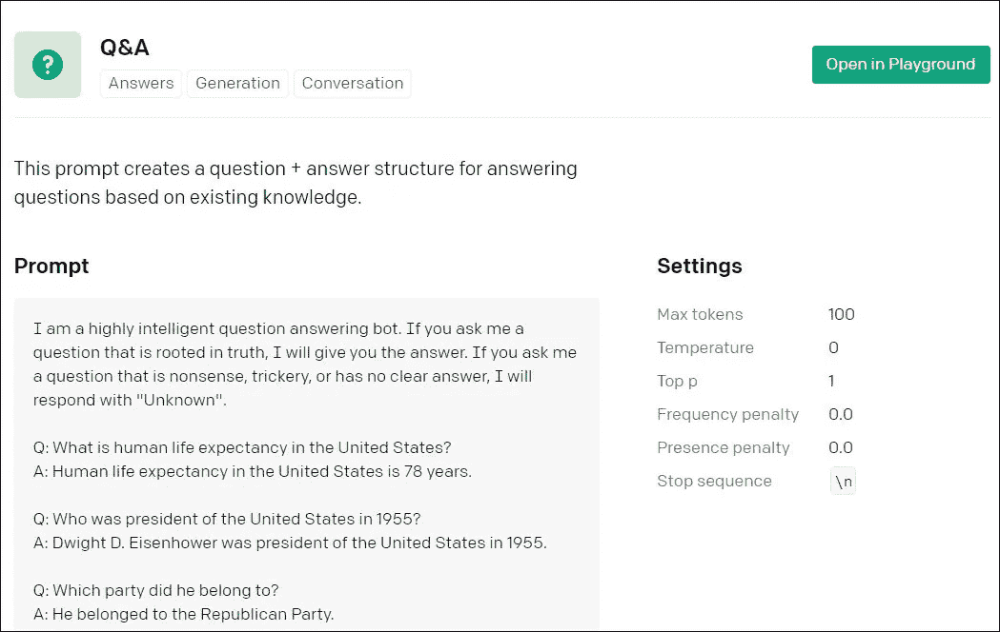
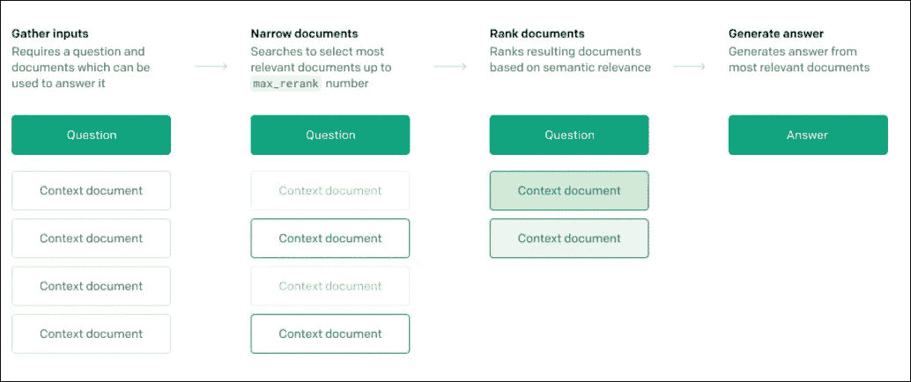
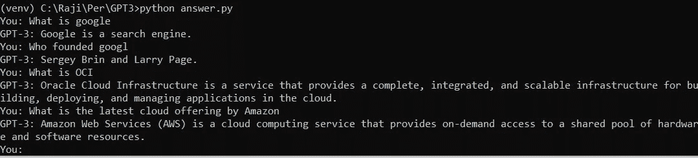

# GPT-3 在问答中的应用

> 原文：<https://towardsdatascience.com/application-of-gpt-3-in-q-a-769239a01f6d?source=collection_archive---------4----------------------->

## 人工智能时代的技术支持


杰利·范·李斯特在 [Unsplash](https://unsplash.com?utm_source=medium&utm_medium=referral) 上拍摄的照片

计算机程序将句子翻译成内部表示的能力，从而可以对用户提出的问题产生有效的答案，这种能力被称为自然语言的机器理解。 [OpenAI 的](https://www.openai.com/)预训练生成变压器 3 (GPT-3)就是这样一个自回归语言模型，它将自然语言处理(NLP)的能力革命性地提升到了一个新的水平。

> 本文探讨了如何有效地使用 GPT-3 来更好地理解用户的问题，并以良好的准确性将它们连接到庞大内容库中的相关部分，如用户指南和技术文档。

# GPT-3 概述

GPT-3 已经被训练了 1750 亿个参数，比任何以前的非稀疏语言模型多 10 倍。它可以生成质量如此之高的书面文本，以至于经常很难与人写的文本区分开来。GPT-3 与其他语言模型(如 BERT)的区别在于，对于所有任务，GPT-3 都是在没有任何梯度更新或微调的情况下应用的，任务和少量演示完全通过与模型的文本交互来指定。GPT-3 在许多自然语言处理数据集上取得了很好的性能，包括翻译和问答[1]。GPT-3 的加权预训练数据集的 60%来自由 4100 亿字节对编码的令牌组成的通用爬行的过滤版本。其他来源是来自 WebText2 的 190 亿个标记，占加权总数的 22%，来自 Books1 的 120 亿个标记占 8%，来自 Books2 的 550 亿个标记占 8%，来自 Wikipedia 的 30 亿个标记占 3%。GPT-3 接受了数千亿单词的训练，能够用 CSS、SQL、Python 等语言编码。由于 GPT-3 的训练数据包罗万象，它不需要为不同的语言任务进行进一步的训练[2]。**目前，OpenAI 已经发布了基于 invite only** 的 GPT-3 API[**beta 版**](https://beta.openai.com/) **。**

# GPT 3 号建筑

GPT-3 的架构由两个主要部分组成，编码器和解码器。编码器将句子中的前一个单词作为输入，并将其转换为向量表示，然后通过注意过程来生成下一个单词预测。解码器将前一个单词及其矢量表示作为输入，并输出给定这些输入的可能单词的概率分布。GPT-3 API 提供了一个通用的“文本输入，文本输出”接口，几乎可以用于任何语言任务。另一方面，大多数其他语言 API 都是为单一目的设计的，比如情感分类或命名实体识别。要使用该 API，只需向它提供一个文本提示(基于文本的输入或指令)，它将返回一个文本补全，尝试适应您提供的上下文或模式。它可以通过写一个你想让它做什么的总结或者几个例子来编程。它的性能很大程度上取决于任务的复杂性。如果你有一个更具体的例子，你可能会期待一个更可靠的答案。随着 GPT-3 训练数据在 2019 年 10 月截止，API 可能不了解当前事件。



*礼遇:OpenAI*

# GPT-3 核心组件

GPT-3 API 包含三个核心组件:提示、完成和令牌。“提示”是给 API 的输入文本。“完成”是 API 根据提示生成的文本。例如，如果您给 API 提示“Python 是 a”，它将返回“Python 是一种很棒的编程语言，因为它非常简单易学。”很有可能。默认情况下，API 是随机的，这意味着每次您调用它时，您可能会得到稍微不同的完成，即使提示保持不变。“令牌”可以被认为是单词的片段。API 在处理文本之前将其转换成标记。文本提示和 API 生成完成的标记组合必须少于 2048 个标记，即大约 1500 个单词。

**GPT-3 API 提供了不同的语言模型/引擎，它们在功能上有所不同。突出的典型有:达芬奇、居里、巴贝奇、阿达。**达芬奇被认为是最有能力的模特，阿达是最快的。OpenAI 建议使用 davinci 进行用例实验，并尝试其他生产模型，因为它们具有成本效益。达芬奇主要用于创意和分析输出。由于 davinci 的功能增加，它需要更多的计算资源。因此，它的每次 API 调用成本更高，并且不如其他引擎快。居里速度很快，擅长语言翻译、分类和总结。巴贝奇擅长语义搜索分类。Ada 是解析文本和简单分类的首选。

# 回答 API 端点

Answers 是一个专用的问答端点，适用于需要基于文档源、用户指南和技术文档生成高精度文本的应用程序。给定一个问题、一组文档和一些示例，API 基于这组文档中的信息生成问题的答案。您可以输入多达 200 个文件的列表，也可以预先上传不超过 1GB 的文件。通过 OpenAI 支持的 Python 绑定，您可以通过任何语言的 HTTP 请求与 API 进行交互。API 使用 API 密钥进行身份验证。

**Answers 端点对一组文档进行语义搜索。**如果您提交一个查询，例如一个自然语言问题或一个句子，返回的文档将根据它们与查询的语义相关程度进行评分和分级。“文档”可以是一组段落或几页。例如，如果您提供一个文档列表[“苹果是红色的”、“胡萝卜是橙色的”、“玫瑰是粉红色的”]并查询“哪一种是水果”，您将为每个文档获得不同的相似性得分。相似性得分越高，文档与查询在语义上就越相似。在这个例子中，“苹果是红色的”将与查询最相似。可以使用“Documents”参数将文档作为 API 请求的一部分进行传递。您可以使用“文件”参数来上传文件。文档作为文件预先上传，离线处理和索引一次。当使用保存的文件时，利用两步搜索过程来找到回答问题的最佳上下文。第一步使用传统的关键字搜索将所提供文件中的文档缩小到最多“max_rerank”(参数)个文档。然后，通过语义搜索分数对所选文档进行重新排序。



*礼遇:OpenAI*

**下面是一个通过提供文档列表来获取答案的 Python 代码片段示例:**

```
import os
import openai
openai.api_key =os.getenv("OPENAI_API_KEY")
doc_list= ["When you deploy Oracle Analytics Cloud, you complete some initial setup steps, and then Oracle takes care of most service management, patching, backup and restore, and other maintenance tasks. You determine the size of your service when you set up the service and you can increase or decrease capacity if your requirements change. Oracle Analytics Cloud offers two sizing options, you can specify the number of Oracle Compute Units (OCPUs) you want to deploy or how many people you expect to use the service."]
response = openai.Answer.create(
 search_model="davinci",
 model="curie",
 question="**What are the sizing options offered by Oracle Analytics Cloud?**",
 documents=doc_list,
examples_context="Larry Page and Sergey Brin.",
examples=[["Who founded Google?"]],
 max_tokens=30,
 stop=["\n", "<|endoftext|>"],
)
 print(response)
```

**回应是:**

```
{
  "answers": [
    "**You can specify the number of Oracle Compute Units (OCPUs) you want to deploy or how many people you expect to use the service.**"
  ],
  "completion": "cmpl-2xHoUMBCfmt0MyYvLso3n4PFtpEFM",
  "model": "curie:2020-05-03",
  "object": "answer",
  "search_model": "davinci",
  "selected_documents": [
    {
      "document": 0,
      "text": "When you deploy Oracle Analytics Cloud, you complete some initial setup steps, and then Oracle takes care of most service management, patching, backup and restore, and other maintenance tasks. You determine the size of your service when you set up the service and you can increase or decrease capacity if your requirements change. Oracle Analytics Cloud offers two sizing options, you can specify the number of Oracle Compute Units (OCPUs) you want to deploy or how many people you expect to use the service. "
    } ] }
```

# 用例

**客户/技术支持** —支持主管可以使用此功能快速提供服务请求的相关答案。

**开发者文档** —开发者没有耐心在技术指南的链接列表中寻找答案。该功能可以解析文档，并为他们的查询提供准确的答案，而不是指向相关页面。

**上下文相关的帮助** —在软件中提供上下文相关的帮助是很常见的。但大多数时候用户会有次要问题，现在为此提供聊天机器人很常见。然而，聊天机器人提供的答案有限。因此，Answers API 可以有效地用来准确地回答用户的问题，而不是提供相关技术文档的链接。



示例答案应用程序

# 结论

著名的计算机科学家 Geoffrey Hinton 说过，“你所需要的是大量的数据和关于正确答案的大量信息，你将能够训练一个大的神经网络来做你想做的事情。”这正是 OpenAI 的 GPT-3 能够做到的。通过清楚地理解上下文来给用户提供正确的答案，将建立有益的用户体验。无需微调，GPT-3 可以高精度地执行搜索和回答问题的任务。这将彻底改变技术/客户支持领域。

参考

[1]语言模型是很少出手的学习者，OpenAI，[https://arxiv.org/pdf/2005.14165.pdf](https://arxiv.org/pdf/2005.14165.pdf)

[2]https://en.wikipedia.org/wiki/GPT-3