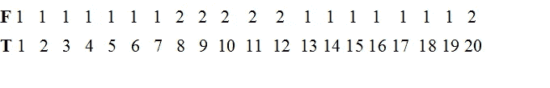
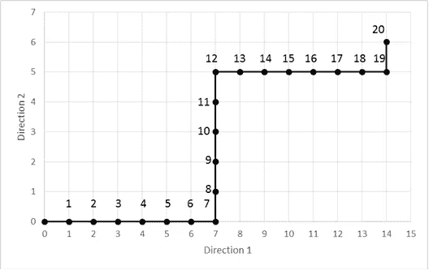

# 冯·米塞斯的随机性公理在由数字序列描述的非平稳系统动力学预测中的应用

> 原文：<https://towardsdatascience.com/application-of-the-von-mises-axiom-of-randomness-on-the-forecasts-concerning-the-dynamics-of-a-9693ce3d763e?source=collection_archive---------34----------------------->

[TT](https://pixabay.com/it/users/tt-15877/?utm_source=link-attribution&utm_medium=referral&utm_campaign=image&utm_content=629708) 在 [Pixabay](https://pixabay.com/it/?utm_source=link-attribution&utm_medium=referral&utm_campaign=image&utm_content=629708) 上的照片

## 使用冯·米塞斯的随机性公理作为一种关于预测非平稳系统发展的分析方法。

摘要:在本文中，我们将使用一个数字序列来描述一个非平稳系统的动力学，其中项的值在系统的自由度的数量内变化。这个数字序列允许我们使用冯·米塞斯的随机性公理作为一种分析方法，这种分析方法涉及从非平稳系统的演化预测中获得的结果。这个公理的含义如下:当我们理解一个数字序列的模式时，我们获得的结果是对下一个序列号的预测，它不能随机再现。在实践中，如果结果是通过随机算法或通过实现系统中存在的模式的认知算法获得的，则该公理定义了能够理解的统计方法。这种方法对于分析非平稳系统特别有用，非平稳系统的特点是产生非独立的结果，因此没有统计意义。非平稳系统最重要的例子是金融市场，因此，这种方法的主要应用是分析交易策略。

**简介**

为了应用冯·米塞斯的随机性公理作为一种分析方法，必须面对的第一个问题是能够用一个数字序列来描述一个系统的演化。为了这个目的，我们使用一个序列，其中项的值可以在系统的自由度的数量内变化。然后我们还引入了一个由一系列递增整数表示的时序级数。有了这两个序列，我们可以描述一个描述我们正在研究的系统演化的动力学。这样，我们可以应用冯·米塞斯的随机性公理，它定义了随机序列的统计特征。公理如下:*“一个序列被定义为随机的本质要求在于，完全不存在任何可以被成功应用来改善关于下一个数的预测的规则”*。

这个公理告诉我们，当我们理解一个数字序列的模式时，我们可以获得结果，作为对下一个序列号的预测，它不能随机再现。知道我们的数字序列的值代表系统的动态，我们已经找到了一种方法来评估结果。因此，如果随机获得相同或更好结果的概率非常小(即，随着策略使用次数的增加而趋于零)，这意味着预测方法使用系统中存在的规则。因此，我们可以使用发展的方法，以预测系统的演变；这种方法是研究非平稳系统的基础。事实上，如果我们处于非平稳状态，结果可能是非独立的，其结果是统计值的减少。为了用简单的方式解释这样一个复杂的话题，我创造了一个悖论[1]，两个玩家在一个游戏中互相挑战，其中通过改变游戏规则，有可能从静止状态进入非静止状态。其后果是，开始时的数据是独立的，然后一旦发生变化，它们就变得相互依赖，因此对统计目的没有用处。

因此，在这些条件下获得的大量数据在统计学上对理解产生数据的方法是否是随机的没有用处。在这种情况下，预测算法的性能不再是可靠的数据；因此，我们需要找到一个新的统计指标，以评估结果。事实上，在金融领域经常发生这样的情况，一种策略尽管通过执行大量操作获得了出色的结果，但突然停止工作，产生了巨大的损失，以这种方式证明这是一种完全随机的策略。关于金融市场的非平稳性有很多研究；关于这个话题的一些文章有[2]、[3]、[4]、[5]。

**通过数字序列描述非平稳系统的动态**

我们首先考虑一个以两个自由度为特征的非平稳系统。我们做出这个选择有两个原因:第一，为了简化处理，第二，在有两个自由度的系统中，有金融市场，它代表了我们将要展示的方法的主要应用。

然后，我们将这个系统与一系列在 1 和 2 之间变化的值联系起来。在实践中，当在这个系统上，确定性过程的作用方向发生变化时，我们得到的结果是，继承的值相对于前一项发生变化。当我们谈到“确定性过程”时，我们指的是作用于系统的确定性和非随机力。我们还引入了这样的简化，即确定性过程作为一个恒定的力，在两个自由度的方向上强度没有变化；这允许我们用一个单独的数字序列来描述系统的动态特性。

最后，我们向系统添加一个时间度量；我们可以通过使用一系列递增的整数来做到这一点，这样，我的序列中的每个值都明确地对应于我的时间序列中的一个值。

得到的结果如下:我们有两个序列，一个描述作用在系统上的力的方向 *F* ，另一个描述时间的进程 *T* :

分析这两个序列，我们可以注意到作用在系统上的力(确定性过程)改变方向三次，第一次在时间 *T = 8* ，第二次在时间*T = 13***，第三次在时间 *T = 20* 。图 1 显示了由两个序列描述的动力学；图表中还包括了时间进程。**

****

**图 1:由两个序列描述的系统动力学。**

**应用冯·米塞斯的随机性公理作为一种关于预测算法所得结果的分析方法**

**在这一点上，我们将应用冯米塞斯的随机性公理来评估预测算法所获得的结果。根据本文引言中报告和分析的公理，如果我们已经开发了一种非随机方法来实现系统中存在的模式，我们将能够预测继任期限相对于前一个期限的变化。**

**这个陈述是至关重要的，因为我们说只有关于系统变化的预测才是有用的，以便理解所使用的方法是否是随机的。事实上，如果我们在时间 8 和 12 对连续的两个项目进行两次预测，打赌连续的值是 2，我们获得两次成功。这两个结果是相互独立的吗？这个问题是基本的，因为只有当他们是独立的，才是有用的统计目的，以评估预测方法。**

**为了回答这个问题，我们必须使用我们报告的复合概率公式:**

****P(E1∩E2)= P(E1 | E2)P(E2)= P(E2 | E1)P(E1)(1)****

**两个事件 *(E1，E2)* 发生的概率，等于 *E1* 发生*P(E1)* 的概率，乘以给定 *E1* 发生 *P(E2 | E1)* 的条件概率 *E2* 。**

**看到公式(1)我们明白，条件概率 *P (E2 | E1)* 的正确计算取决于事件是否独立。事实上，在独立事件的情况下 *P(E2 | E1) = P(E2)* ，相反在事件完全相互依赖的情况下 *P (E2 | E1) = 1* 或 0。在我们的例子中，概率 *P(E1) = 1/8* 。事实上，以随机方式打赌在前 8 个时间位置内序列的值等于 2 的获胜概率是 1/8，因为在前 7 个位置中序列的值为 1，只有在第 8 个位置中序列的值为 2。在实践中，我们可以看到这个值，就像从一个装有八个弹珠的袋子中随机抽取一个值为 2 的弹珠的概率，其中七个值为 1，一个值为 2。因此， *P (E1)* 表示使用随机策略获得相同结果的概率。这样，我们就能从一系列有关系统动力学的数据中推导出一个概率。**

**现在我们试着计算 *P (E2)* 的值；研究从第九个位置到第十二个位置的时间间隔，我们看到系统保持不变。因此，在此时间间隔内，随机下注值 2 并获胜的概率等于 1。这是因为所有的位置都有值 2，所以随机策略以 100%的概率获得相同的结果。在这种情况下，我们可以将第二次下注视为完全依赖于第一次下注。这意味着，从统计学的角度来看，我们可以将这两次下注视为单次下注。**

**现在，让我们尝试将第二个赌注从第十二个位置转移到第二十个位置，在这种情况下，我们将有 *P(E2) = 5/7* 。事实上，在从第九个位置到第二十个位置的时间间隔中，有七个值等于 1，五个值等于 2。由于第二次预测中的这一变化，复合概率将等于:**

****P(E1∩E2)= P(E1)P(E2 | E1)= P(E1)P(E2)= 1/8∙5/7 = 0.089****

**在这种情况下，这两个事件是相互独立的，因此它们对于统计目的是有用的，以便理解所使用的方法是否可以预测系统的演化。**

> **从这两个例子中，我们可以推导出以下结论:当我们想要研究一个确定性过程时，每当它决定系统中的一个变化时，我们就有可能对系统的演化执行一个预测，其采用随机策略的成功概率被证明是微小的 1。这涉及到复合概率的降低，根据冯·米塞斯的随机性公理，复合概率的含义是表明作用于系统的确定性过程的存在。**

**在实践中，每当确定性过程改变系统状态时，我们可以通过预测来检测它。因此，为了以低误差检测确定性过程，有必要在系统中产生统计上显著数量的变化。对此我们的预测方法进行了大量的独立预测。因此，每一次预测都必须关注系统的单一变化。**

**这种方法对于预测可能不独立的非平稳系统至关重要。因此，计算复合概率是非常重要的，复合概率是以随机方式获得相同结果的概率。我们还记得，在复合概率(1)中，有条件概率的计算，如果事件是相互依赖或相互独立的，则考虑条件概率。其实这个方法的目标是抛弃所有非独立预测，其贡献是让我高估了算法的预测技巧。这种错误评估的后果可能会导致我们(例如在金融领域)承担过度的风险。**

****结论****

**对结果的分析，涉及一个非平稳系统的发展，代表了应用数学中尚未解决的最重要的问题之一。在这篇文章中，我建议使用冯米塞斯的随机性公理作为评估在这些条件下获得的数据的方法。如前所述，这个公理定义了一个统计特征，当我们有意识地操作时，这个统计特征假定了一个明确定义的行为。在实践中，由非随机预测算法生成的结果不能随机再现，该算法实现了关于所考虑系统的知识。因此，随着策略使用次数的增加，获得相同或更好结果的概率随机趋于零。这样，我们就把注意力从非平稳条件下可能由非独立预测产生的结果值转移到与其非随机行为相关的统计特征上。**

**为了应用这种方法，我们定义了一个简单的数学模型，它的任务是通过一个数字序列来描述一个系统的动力学。使用这个数学模型，我们已经展示了如何从预测算法获得的一系列结果中计算复合概率。然后，通过分析一些例子，我们得出了一些重要的考虑因素。**

> **特别是，我们已经看到，当系统发生变化时，我们有可能做出成功概率小于 1 的预测。这样做的结果是复合概率的减少，根据冯米塞斯的随机性公理，复合概率的意义是表明系统中模式的存在。**

**因此，如果我们想以较低的误差检测它，我们必须对系统的每一个单独的变化作出统计上显著数量的独立预测。这样，预测算法证明能够预测未来的系统演变。因此，这一特征成为评估在非稳定系统(如金融市场)上运行的策略的风险的基础。事实上，正确的风险评估必须始终考虑算法对系统未来发展的预测技巧。**

**在下一篇文章中，我们将在一个非平稳系统的动态中引入一个纯粹的随机成分。这样，确定性过程将被用概率密度函数描述的随机过程所取代。为了在金融领域应用这种方法，这一步是必不可少的。**

****参考文献****

**[1] Berdondini Andrea，《职业交易者的悖论》，(2018 年 11 月 20 日)。可在 https://ssrn.com/abstract=3287968[SSRN](https://ssrn.com/abstract=3287968)买到。**

**[2]j . Barkley Rosser Jr .‘重新考虑遍历性和基本不确定性’。载于:《后凯恩斯经济学杂志》第 38 期(2015 年第 3 期)，第 331–354 页。doi:10.1080/01603477.2015 . 1070271(1)。**

**[3]苏厄尔先生。“有效市场假说的历史”。伦敦大学学院计算机科学系技术报告，2011 年 1 月。**

**[4] O .彼得斯，m .盖尔曼。“使用动力学评估赌博”，《混沌:非线性科学跨学科期刊》，2016 年；26 (2): 023103**

**[5] Berdondini，Andrea，“来自经济物理学的方法论描述作为财务战略的验证技术”，(2017 年 5 月 1 日)。可在 https://ssrn.com/abstract=3184781[SSRN](https://ssrn.com/abstract=3184781)买到。**