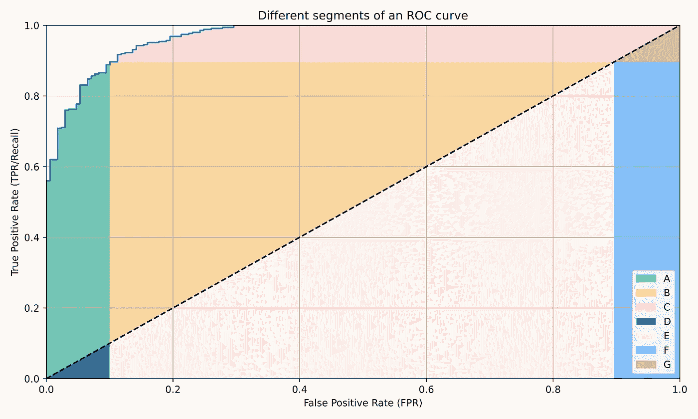
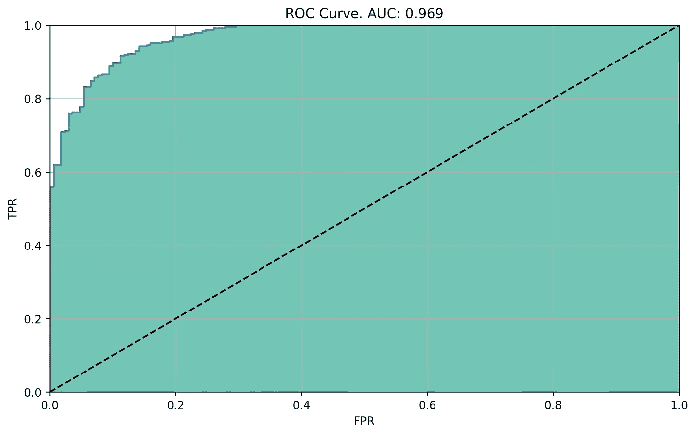
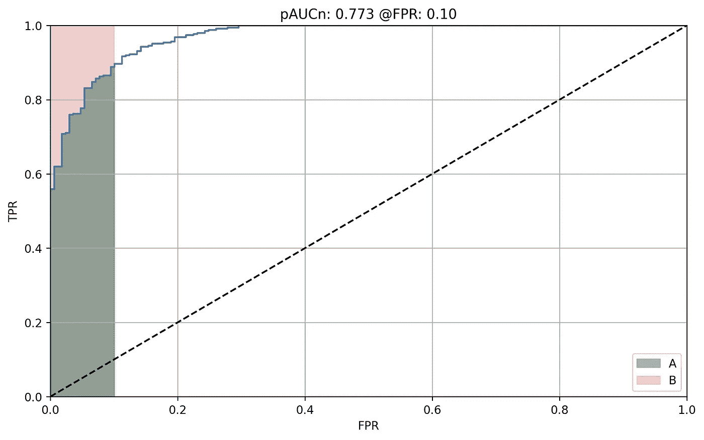
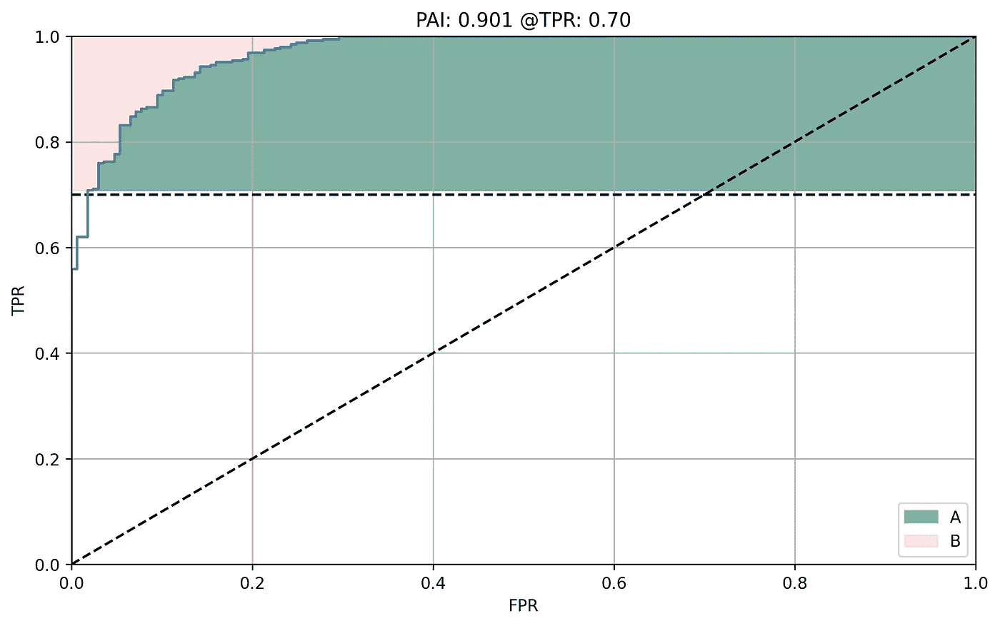
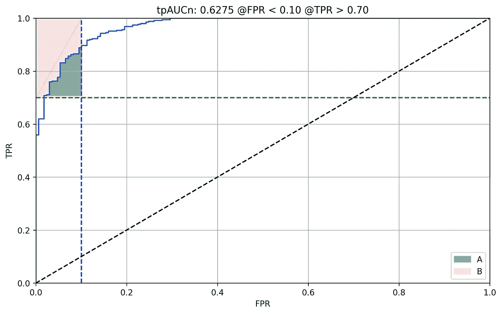
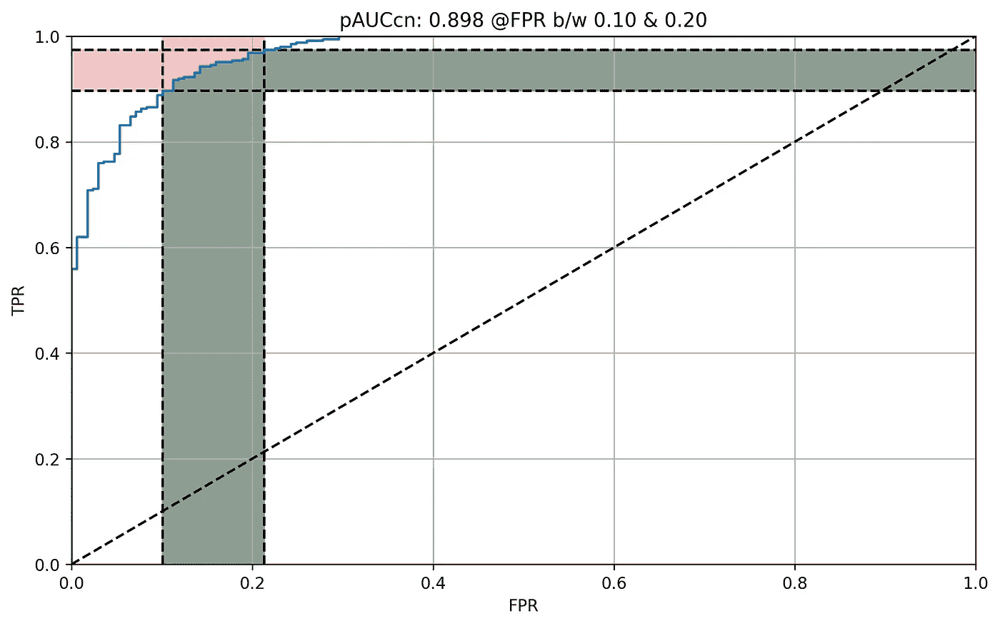
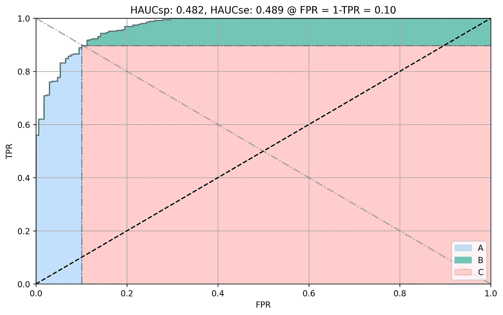
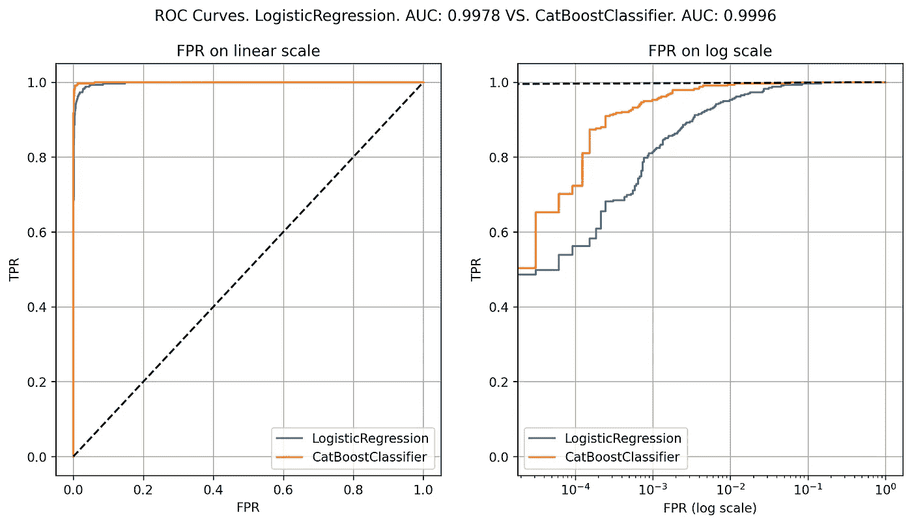
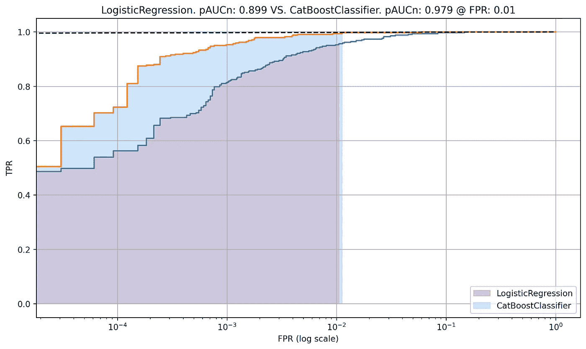

# ROC 曲线不同部分的应用

> 原文：<https://towardsdatascience.com/applications-of-different-parts-of-an-roc-curve-b534b1aafb68?source=collection_archive---------6----------------------->

## 理解 ROC 曲线不同部分的重要性，探索 ML 应用的 AUC 变量

*作者图片*

# 介绍

受试者工作特性( **ROC** )曲线是诊断二元分类器能力的最常用图形工具之一，独立于固有的分类算法。几十年来，ROC 分析已经用于许多领域，包括医学、放射学、生物统计学、自然灾害预测、气象学、模型性能评估和其他领域，并且越来越多地用于机器学习和数据挖掘研究[1]。如果你是一名数据科学家，你可能每天都在使用它。

ROC 曲线是通过绘制真阳性率(TPR)对假阳性率(FPR ),基于不同模型分数设置下的二元结果而创建的。理想的分类器将在非常低的 FPR 下给出非常高的 TPR 值(即，它将正确地识别阳性而不会错误地标记阴性)。但是，理想的模型很少存在，因此，尝试不同模型和机器学习实验的目标是确定一个最佳模型，该模型将给出最佳的成本(FPR)/收益(TPR)权衡。ROC 分析有助于实现这一目标。

# ROC 曲线下的总面积(AUC)

通常，(并且在“几乎所有”情况下)，我们使用 ROC 曲线下的总面积( **AUC** )作为评估标准来找到最佳分类器。AUC 也是大多数 Kaggle 比赛中使用的评估标准。这是因为 AUC 是一个单一的数字，它提供了各种阈值设置下整体模型性能的平均信息。关于 AUC 的一个有趣的性质是，它独立于类别分布，即无论类别分布是 10%/90%还是 50%/50%，基于 AUC 的模型的排名将是相同的。*(注意我提到的“有趣”，并不总是好的属性。有用性取决于手头的问题。在某些情况下，这个属性可能不好，数据科学家转而使用精确-召回曲线下的面积。但是让我们把这个放在一边)。AUC 在大多数情况下是信息性的和有用的，但是有许多现实世界的问题，在这些问题中，它未能提供对模型能力的正确关注，而在投入生产之前需要理解该模型的能力。在许多实际应用中(下面讨论的例子)，ROC 曲线的主要部分几乎没有用，但 AUC 总结了整个曲线，给予所有区域同等的重要性，包括不相关的区域。*

应对上述 AUC 挑战的常用解决方案是确定一个 FPR(或 TPR)截止点，并找到在该截止点最大化 TPR(或最小化 FPR)的模型。但是在任一轴上固定截止值需要业务方面的具体要求，并且在输出值上具有更高的方差。这不是一个理想的解决方案，它忽略了 ROC 曲线的大部分操作范围。也很难查看各种指标的网格来比较模型，例如 TPR @ 1% FPR、2%FPR、10% FPR、20% FPR 等。

简而言之，我们认为完全 AUC 在某些情况下存在问题，查看固定的截断点集并不是这些问题的理想解决方案。建议的解决方案介于两者之间，即，我们不使用所有可能的 FPR/TPR 值，而是在一组重要的点上进行聚合。这可以通过 ROC 曲线下的**部分面积来实现。**

在剩下的帖子中，让我们来了解一下文献中发现的部分面积度量的不同变体，如何计算每个变体以及何时使用它们。但首先，让我们从一些 AUC 未能强调部分面积指标需求的例子开始。

## **完全 AUC 问题示例**

1.  当类别分布高度不平衡时(例如 0.1%/99.9%，用例:欺诈检测、癌症检测等。)，不同的分类器即使被正确排序**也会在 AUC 值上表现出非常小的差异**，**，使得模型比较变得困难**。例如，您可能正在比较像 0 这样的数字。AUC 中 9967 vs. 0.9961 并且认为对比的两个模型相当相似。实际上，这两个模型在用于实际决策时可能会有显著的差异。
2.  如果只有 1 个肯定和 999 个否定，即使是一个像样的模型也能够通过错误分类一小部分否定(FPR，假设 20%)来捕捉 100%的肯定(即 1)。在这种情况下，比较高 FPR 范围(例如> 20%)的面积是没有用的，因为**所有模型在高 FPR 区域都达到了 100%的 TPR。**但是 AUC 仍然使用高 FPR 无用区域。在这种情况下，理想情况下，我们希望找到一种模型，它可以通过错误分类非常低%的否定来识别很大%的肯定。
3.  在临床实践中，具有高 FPR 的诊断测试导致显著的经济费用，因为很大比例的非患病候选人将耗尽医学治疗的稀缺资源。此外，在诊断致命疾病时，未能正确识别严重患病受试者(低 TPR)将导致严重的伦理后果。因此， **FPR 和 TPR 需要同时分别维持在低和高水平**；以便从 AUC 中排除不经济和不道德的区域。[2]
4.  在使用乳房 x 光片检测良性与恶性癌症时，识别恶性癌症比对良性疾病进行不必要的活检更重要。即高 TPR ≥ 0.9 是感兴趣区域。完整的 AUC 可能不会显示不同模型之间的显著差异，即使它们在感兴趣的区域有所不同。
5.  AUC 警告的另一个经典例子是两个分类器的比较，这两个分类器具有彼此交叉的非常不同的 ROC 曲线。一个具有高 TPR，另一个具有高真阴性率(TNR)，但两者具有相同的 AUC。在这种情况下，AUC 无法选择更好的分类器。[6]

> **边注:**顺便说一句，这里有一个有趣的琐事，以及 ROC 曲线中“[”这个词的由来。ROC 在二战期间首次被用于分析雷达信号，更具体地说，被美国陆军用于从他们的雷达信号中探测日本飞机。通过观察屏幕，雷达接收机操作员必须手动决定屏幕上的一个光点是代表敌机还是某种噪音。他们做出这些区分的能力被称为受试者操作特征。](https://en.wikipedia.org/wiki/Receiver_operating_characteristic#:~:text=to%201.0.%5B55%5D-,History,-%5Bedit%5D)

ROC 曲线(*图片作者*

ROC 曲线的不同部分(*图片作者*

左边的 ROC 曲线表示被训练来分类二元结果的样本分类器的性能。该分类器的 AUC 是 0.969。

注:AUC 范围从 0 到 1，在 0.5 之间对称。即 AUC 为 0.5 是最差的分类器。AUC 在 0 和 0.5 之间的分类器预测与被评估的类别相反的类别。

现在，我们将了解如何使用同一 ROC 曲线的不同区域(如左侧突出显示的区域)来计算不同的部分指标。

# ROC 曲线下部分面积的变量

局部区域度量并不新鲜。我最后引用的一些论文发表于 80 年代。我写这篇文章的目的是重温它们，并引起您对处理实际生产问题时可能遇到的常见场景的注意，尤其是在数据科学竞赛的世界之外。

## **1。暂停**

**定义**:低于某一 FPR 的 ROC 曲线下归一化面积。[4]

pAUCcn @ <10% FPR. Green area divided by red area. (A/B) *(图片由作者提供)*

**优点:**关注 ROC 曲线最左边部分对高 TPR 的需求；对高度不平衡的数据最重要的区域。

**缺点:** pAUCn 缺乏 AUC 在 0.5 左右所享有的对称性。pAUCn 没有固定的下限，因为下限随着所选择的 FPR 阈值而变化。

## 2.矿泉

**定义:**主对角线以上 ROC 曲线下标准化部分面积。[7]

sPA @ <10% FPR. *0.5 * (1 + A/(A+B))(图片由作者提供)*

**优点:**关注 ROC 曲线最左边部分对高 TPR 的需求。对于随机分类器，其被缩放以给出 0.5 的值，即，给出固定的下限，而不考虑 FPR 截止。 **缺点:** sPA 也缺乏对称性，0.5 以下没有意义。其下限不为 0。

## 3.个人事故保险（Personal Accident Insurance 的缩写）

**定义:**局部面积指数。特定 TPR 以上 ROC 曲线下的面积。换句话说，TPR 临界值和 1 之间的所有 FPRs 值的 TPR 平均值。[3]

PAI @ >70% TPR。绿色区域除以红色区域。(A/B) *(图片由作者提供)*

**优点:**关注高 TPR 需求，不考虑 FPR。在一些临床实践中，如早期癌症检测，如果高 FPR 意味着更好的捕获率，是否可以容忍。

**缺点:**下限不是固定的，并且随着 TPR 截止值而变化。相对于其他部分面积度量，缺少大约 0:0.5 和 0.5:1 的对称性。

## 4.tpAUCn

**定义:**ROC 曲线下低于一定 FPR、高于一定 TPR 的双向部分区域。[2]

tpAUCn @ <10% FPR & > 70% TPR。绿色区域除以红色区域。(A/B) *(图片由作者提供)*

**优点:**允许同时控制 TPR 和 FPR。许多用例需要高 TPR 和低 FPR。例如使用昂贵测试仪器的致命疾病的诊断。

**反对意见:**用户应该了解 TPR 和 FPR 临界值。

## 5.pAUCcn

**定义:**ROC 曲线下一致的部分面积。ROC 曲线下垂直部分面积(pAUCn)和 ROC 曲线下水平部分面积(pAUCxn)之和的一半。[5]

pAUCcn @ >10% FPR & <20% FPR. Green area divided by red area *(图片由作者提供)*

**优点:**比例与 sPA 相似，给随机分类器 0.5 分。与其他局部面积测量不同，这种方法认为 AUC 与平均 TPR、平均 FPR 和 [c 统计](https://www.mcw.edu/-/media/MCW/Departments/Biostatistics/vo19no4.pdf)有类似的关系。

**缺点:**其下界不为 0。

*【后作者注:关于 pAUCcn 利弊的知识需要根据 ROC 曲线下一致部分面积作者的最新论文进行更新。基于新的归一化方法，cons 是无效的，并且具有类似于 AUC 的对称性。我将很快做出必要的改变。】*

## 6.HAUC

**定义:**Half-AUC，AUC 分两半测量，当 TPR > TNR 或 TPR < TNR 时。当已知需要高灵敏度(TPR)还是高特异性(TNR)时，用于比较分类器。两半之和等于完全 AUC。[6]

HAUCsp: A+0.5*C，HAUCse:B+0.5c . HAUCsp+HAUCse = AUC*(图片由作者提供)*

**优点:**不需要就 FPR 或 TPR 停产做出决定。临界值是从 ROC 曲线中 FPR = 1 - TPR 的点自动得出的。唯一需要决定的是你需要高 TPR 还是高 TNR。范围从 0 到 0.5，0.25 随机。

**缺点:**当截止点已知且不同于 FPR = 1 - TPR 时，没有用。

# 比较研究

我用一个合成数据的比较研究来说明部分 AUC 的有用性。可能还有其他几个例子我没有在这篇文章中演示(长话短说)。这些例子包括:A)具有高 AUC 但在低 FPRs 下表现不同的两个分类器的比较，B)具有相同 AUC 但在高 TPRs 下表现不同的分类器，C)具有相同 AUC 但灵敏度或特异性水平不同的交叉 ROC 曲线，以及更多…

## 两个分类器具有相似的高 AUC，但在低 FPR 时性能不同

在下面的例子中，我使用 sklearn 的 [make_classification](https://scikit-learn.org/stable/modules/generated/sklearn.datasets.make_classification.html#sklearn.datasets.make_classification) 方法准备了一个合成数据集。为了强调标签分布高度不平衡的数据场景，我将标签比率保持为 99%/1%。然后我训练了两个分类器，一个用 LogisticRegression (LR)训练，另一个用 CatBoostClassifier (CB)训练。

线性和对数标度的 ROC 曲线。对数标度强调低 FPR 时的差异。*(图片作者*

我们看到 LR 和 CB 的 AUC 非常接近(99.78%对 99.96%)。事实上，线性标度 ROC 曲线看起来非常相似。有人可能会认为 CB 的排名很好，但并不比 LR 好多少。但是在对数标度上看到相同的曲线(右侧)强调了在低 FPRs 下的差异(<1%). Let’s see what would a partial area give.

Emphasis on partial area under curve below certain FPR. FPR at log scale. *(图片由作者提供)*

在 1% FPR 的截止值处的 pAUCn 显示了 LR 和 CB 之间的相当大的性能差异(89.9%对 97.9%)，表明 CB 做得更好。

这种情况的一个例子(除了前面提到的癌症检测)是训练一个分类器，用于从在线认证中检测账户泄露。设想一个模型，该模型检测登录是来自攻击者(受损的)还是来自原始帐户持有人。考虑到在线活动的巨大规模，实际上只有极小比例的登录会受到影响(例如万分之一)。您可以使用该模型将高风险登录放入人工调查队列中。由于很大的不平衡，在 FPR 低至 1%的情况下，您将调查 100 个良好的登录，以努力找到 1 个折衷方案。由于调查中产生的费用，您的业务需求可能会限制您只调查所有登录中的 X%,从业务角度来看，将 X% FPR 以上的区域视为无用。

## 包含创建图和计算部分指标的代码的笔记本

 [## machine-Learning/11 _ Applications _ of _ different _ parts _ of _ an _ ROC _ curve . ipynb at master…

### 机器学习笔记。在 GitHub 上创建一个帐户，为 Grover pr/机器学习开发做贡献。

github.com](https://github.com/groverpr/Machine-Learning/blob/master/notebooks/11_Applications_of_different_parts_of_an_ROC_curve.ipynb) 

# 结论

AUC 通常被用作一个汇总指标，根据 TPR 和 FPR 在不同阈值下的准确性，指示二元检验的总体表现。更简单地说，它是所有可能的 FPR 上的平均 TPR 和所有可能的 TPR 上的平均 FPR(本质上是对称的)。AUC 在大多数情况下是信息性的和有用的，但是存在许多真实世界的问题，其中 ROC 曲线的许多部分是不感兴趣的，并且 AUC 未能聚焦于重要的区域。有时，您感兴趣的区域低于某个 FPR，有时高于某个 TPR，或者其他时候同时受 FPR 和 TPR 的限制。有时特异性(TNR，1-FPR)比敏感性(TPR)更重要，有时反之亦然。在所有这些情况下，部分 AUC 测量做了正确的事情，集中在 ROC 曲线的重要区域。这篇文章提供了一些文献中的局部面积测量，帮助我们将它们可视化，并总结了它们的优缺点。

**复习学分:** [什卡·古普塔](https://medium.com/u/83100b0fd306?source=post_page-----b534b1aafb68--------------------------------)

# **参考文献**

我上面提到的度量标准基本上是从过去写的几篇关于部分 AUC 的论文中挑选出来的。

1.  维基百科:[https://en . Wikipedia . org/wiki/Receiver _ operating _ character istic](https://en.wikipedia.org/wiki/Receiver_operating_characteristic)
2.  [杨 H，陆 K，吕 X，胡 f .双向偏 AUC 及其性质。](https://arxiv.org/abs/1508.00298)
3.  [姜 Y，梅斯策，西川 RM。高灵敏度诊断试验用的接收机工作特性局部面积指数。](https://pubmed.ncbi.nlm.nih.gov/8939225/)
4.  [沃尔特·SD。汇总 ROC 曲线下的部分面积。](https://onlinelibrary.wiley.com/doi/abs/10.1002/sim.2103)
5.  [Carrington 等人。机器学习算法评估中不平衡数据的新的协调部分 AUC 和部分 c 统计。](https://pubmed.ncbi.nlm.nih.gov/31906931/)
6.  布拉德利美联社。用于评价敏感或特异分类器的半 AUC。
7.  [马等利用 ROC 曲线下部分面积评价诊断性能。](https://pubmed.ncbi.nlm.nih.gov/23508757/)