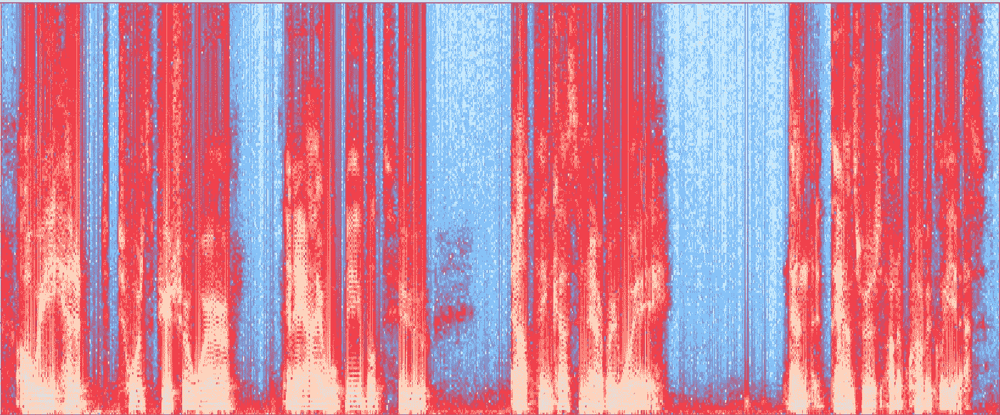
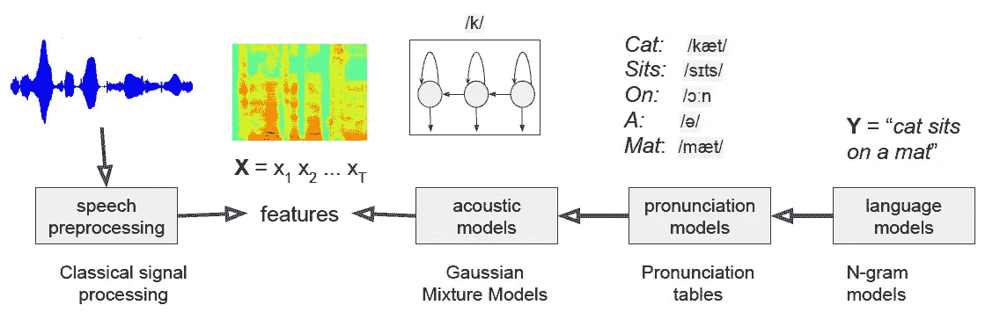
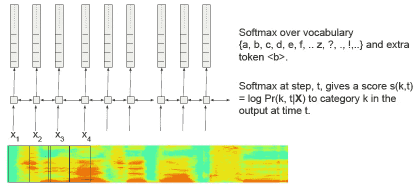
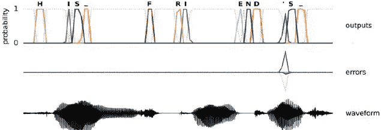
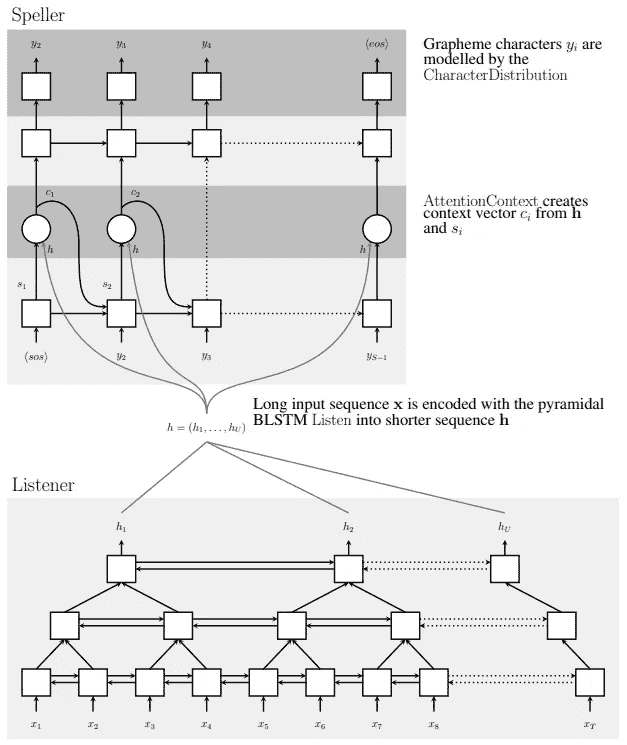
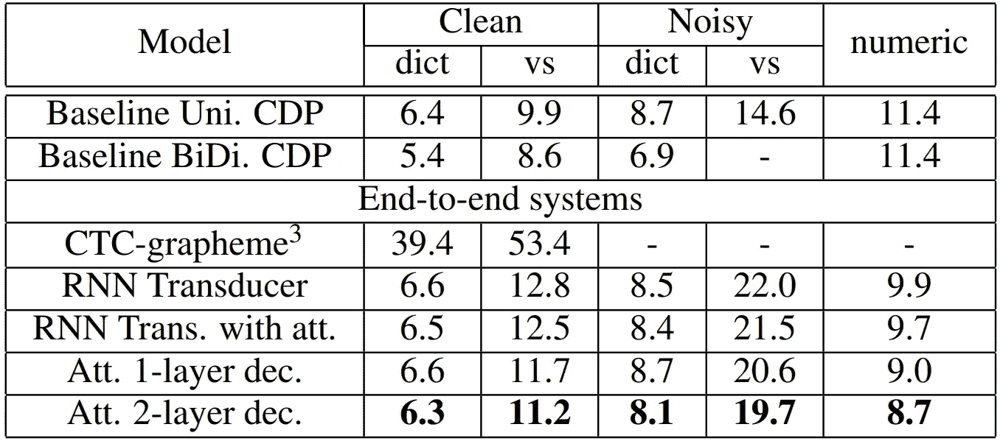
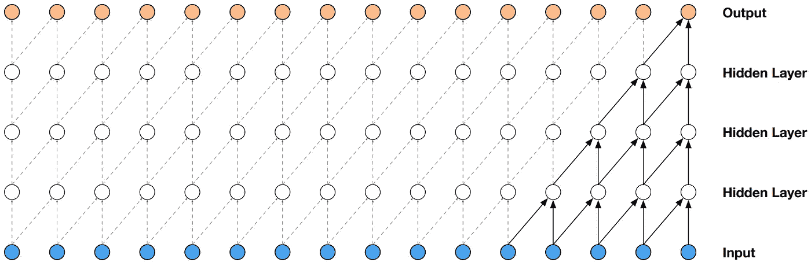
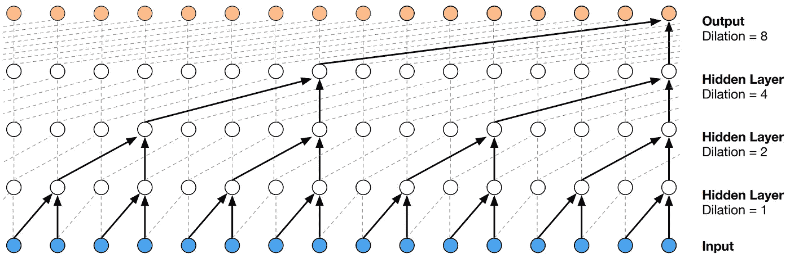
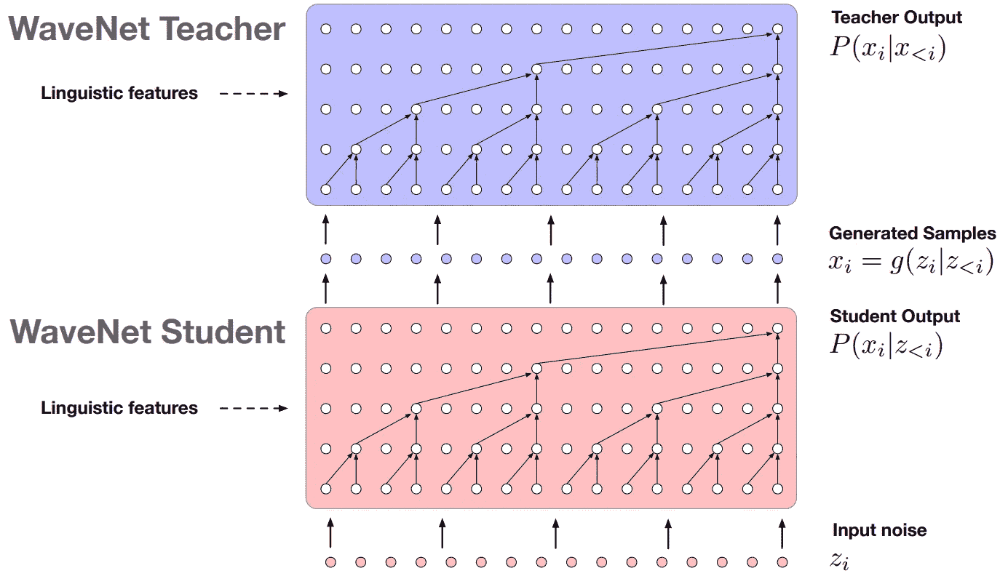
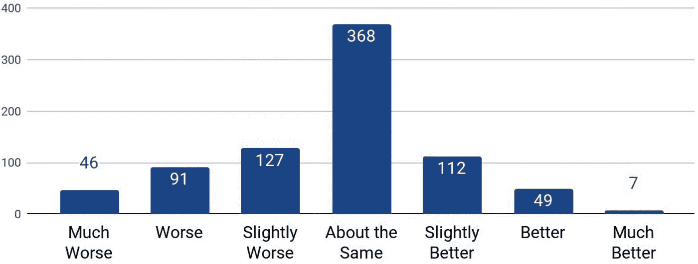

# 时频表示在语音处理中的一些应用

> 原文：<https://towardsdatascience.com/applications-of-time-frequency-representations-in-speech-processing-cfa28ec1f251?source=collection_archive---------21----------------------->

## 从计算机视觉到 Mel 声谱图的音频处理

频谱图无疑是用于分析的音频信号的最合适的表示。它不仅符合我们通过频率分解对声音的理解，还允许我们使用二维分析架构。鉴于过去十年计算机视觉的巨大进步，将声音表现为图像的可能性打开了许多选择。本文将分析计算机视觉技术应用于音频处理的相似性和局限性。重点放在语音识别和语音合成上。

“我们是否正在走向一个人工智能能够在各方面超越我们的未来？那么答案是肯定的。”埃隆·马斯克——谱图由作者生成。

计算机视觉是当前机器学习中最热门的研究领域之一。然而，音频处理已经能够在视觉分析中突破性的深度学习技术的浪潮中冲浪。事实上，音频信号可以很容易地表示为二维数据。这种形式被证明更适合信息提取。顾名思义，时频表示通过时间和频率的离散化来显示音频信号。因此，大多数操纵图像的神经网络结构可以用于音频处理。就像人类大脑如何激发神经网络一样，Mel-Spectrogram 旨在显示我们如何听到信号。这种特定的时间-频率表示考虑了我们听觉的非线性尺度。本文重点介绍 Mel-Spectrogram 和深度学习技术在改善语音处理方面的一些应用。我们将看到如何生成特定文本的类似人类的语音，以及计算机如何理解我们正在说的话。这样的任务使用像序列对序列(听、听和拼)、连接主义时间分类和因果卷积这样的体系结构。最后，我们将讨论计算机视觉和机器听觉之间相似性的局限性。

# 如何可视化声音

声音信号或波形是由气压的变化产生的。麦克风和扬声器通过振动膜与声波接触。我们很快就明白声音是一维数据。在其最自然的形式中，音频信号被表示为随时间变化的强度。然而，这并不能很好地表达信号中包含的信息。事实上，频率是构成声音的关键特征。信息片段被编码在频率和振幅随时间的演变中。时间-频率(TF)表示是对声音进行分析其嵌入数据的适当表示。最常见的 TF 表示是光谱图。声谱图由像素组成，这些像素描述了与特定时间步长的频率范围相关的振幅。时间位置在 x 轴上，而频率仓在 y 轴上。像素越亮，相关频率的能量越高。频谱图不仅是可视化音频信号的好方法，而且易于计算。多年来，已经开发和优化了多种技术，傅立叶变换是最常见的。

由于声谱图的二维性质，计算机视觉技术可以应用于音频处理。有许多应用:音频分类、音频分离和分段、音乐流派分类和标记、音乐生成、音乐转录、语音识别、语音合成和语音识别。此类应用不胜枚举，但在本文中，我们将重点讨论后两种应用。一种特定类型的声谱图，或者更具体地说是一种标度，特别适合于语音处理。人类听到频率的方式被称为音高。人类的听觉频谱并不平坦。我们不能线性地感知频率。低频比高频更容易辨别。Mal 标度考虑了我们听觉的对数反应。该标度基于经验公式，使得声谱图 y 轴上的距离与我们在不同声音中感知的距离频率相匹配。此外，人类对声音振幅的感知也不是线性的。我们再一次听到响度的对数。分贝标度考虑了这一特性。Mel 谱图通过将 y 轴变形为 MEL 标度和分贝标度作为像素强度值来实现这两种表示。

# 语音识别

## 经典方法

语音识别无疑是公众最熟知的机器学习技术之一。语音助手正在成为所有平台的主流:扬声器(亚马逊 Echo)、游戏机(Kinect)、手机和智能手表(Siri、谷歌助手)等。虽然语音识别已经研究了几十年，但由于深度学习的兴起，它只是在最近才变得足够准确，可以用于现实世界的应用。

首先，让我们看看建立语音识别系统的经典方法。这种方法基于检测声谱图中的音素和它们的组合来形成基于模型的句子。如图 1 所示，三个模型组成了语音识别管道，以将语音特征***【X】***匹配到句子 ***Y*** :

*   语言模型定义了给定单词序列在句子中出现的概率。这种模式是基于对特定语言的语法和习惯用法的研究。n 元模型非常适合有限的语音输入数据。
*   发音模型为给定的句子生成一系列音素。这个步骤通常使用语言学专家定义的查找表来执行。
*   声学模型最终定义了给定音素的发音。它产生与从录音中提取的语音特征 ***X*** 相比较的数据。光谱图通常用作特征集。声学模型被构建为高斯混合模型。

给定这样的模型，通过推断从分析的记录中提取的特征来执行识别。给定数据 ***X*** ，系统通过最大化其概率找到句子 ***Y*** 。

图一。经典语音识别管道[1]

多年来，该模型的组件一直使用深度学习进行优化。神经网络的使用大大提高了模型的整体准确性。典型的完全优化的流水线使用神经语言模型、神经网络发音模型和混合 RNN-HMM(递归神经网络-隐马尔可夫模型)声学模型。甚至使用 CNN(卷积神经网络)增强了特征提取。

然而，每个学习模型都被独立地训练来执行组件应该做的特定任务。管道成员的模型误差可能无法很好地协同工作——这一过程中的复合误差限制了性能。此外，人性化设计的特征管道直观且易于训练。尽管如此，它可能不是为任务优化的，这导致了性能限制和对更高计算资源的需求。这些原因推动了端到端模型的发展。整个识别过程被训练成一个单一的大组件。我们现在来看两个最流行的:连接主义时态分类和序列对序列。

## 联结主义时间分类

如果你曾经说过‘嘿，谷歌’，这个模型肯定已经分析了你的声音。Connectionist 时态分类(CTC)模型[2，3，4]目前在 Google 和百度的多个产品中使用。

同样，目标是从输入的声谱图 **X** 中推导出句子 **Y** 。但是现在，每个输出记号 *{Y(t)，t ∈[1，L]}* 代表一个字母，每个输入记号 *{X(t)，t t ∈[1，T]}* 是声谱图的一个子部分。请注意，输入光谱图标记可以重叠并具有任意大小。唯一的要求是*T>L*；输入标记必须比句子字符多。然而，由于两个主要原因，不能将输入与输出令牌直接匹配。首先，正如我们之前看到的，声音与字母无关，而是与音素相关。并且可以为不同的字母组合产生给定的音素。因此，语境对于识别产生给定音素的字母是至关重要的。其次，我们的输入记号的时间分辨率不一定与说话者给定字母(或音素)的发音持续时间相匹配。在多个连续的输出标记中会(并且应该——为了避免遗漏)推断出相同的字符。图 2 所示的 CTC 结构解决了这两个问题。

图二。连接主义时态分类结构[1]

图 3。CTC 模型对“他的朋友”发音的结果[1]

频谱图被输入双向递归神经网络。每个时间步长都考虑了它的时间邻居，这允许考虑发音上下文。预测的每一帧由最可能字符的分布函数描述， *Y(t) = { s(k，t)，k ∈字符图}* 其中 *s(k，t)* 是在时间步长 *t* 出现字符 *k* 的对数概率。字符映射表可以由字母、数字、标点符号、空白字符甚至完整的单词组成。现在，我们可以通过选择 picks 字符来计算每个字符在一段时间内形成句子的概率——参见图 3。

CTC 结构经常与语法和拼写错误的单词作斗争。在 CTC 培训中集成一个简单的语言模型极大地改进了该模型[2]。

## 序列对序列

序列到序列(Seq2Seq)模型在语言处理中用于改变对象的表示域。这种表示可以是用于语音翻译的特定语言或者用于图像字幕的图像和文本。在我们的例子中，我们希望以文本形式表达一段语音记录。Seq2Seq 型号由两个主要组件组成，一个编码器和一个解码器。给定我们的应用领域，让我们分别称之为听者和拼写者。

图 4。LAS 模型结构[5]

listen 操作通常使用双向长短期记忆(BLSTM) RNN 来压缩来自语音频谱图的信息。卷积层也被证明在提高精度方面非常有效[7]。这一步对于优化信息的表现和消除音频中的噪声至关重要。听众提取的特征向量 ***h*** 通常比音频记录的初始持续时间小八倍。这种降低的分辨率对于加速学习和(最重要的)推理过程至关重要。注意，给定网络的循环结构，时间顺序保持不变。

然而，特征向量对于拼写者提取句子来说太长了。它不知道在哪里找到相关信息来推断与特定时间步长相关联的字符。需要注意机制来将分析集中在输入的适当时间窗口上。这个操作被添加到我们的解码器中。该模型现在被描述为一个听、听、拼(LAS)神经网络[5，6]。解码器通过聚焦于最可能感兴趣的区域，一次一个字符，顺序地运行特征表示 ***h*** 。注意，这种注意力机制很好地解决了在 CTC 中重复字符检测的问题。

使用基于注意力的 LSTM 传感器来计算注意和拼写操作。来自 *y(i)* 输出的字符的概率分布是解码器状态 *s(i)* 和注意上下文 *c(i)* 的函数。此外，当前状态 *s(i)* 还依赖于先前状态 *s(i-1)* ，先前最可能的字符 *y(i-1)* ，以及先前上下文 *c(i-1)* 。这种错综复杂的关系清楚地显示在图 4 中。

## 语音识别方法比较

图 5。[12]中比较的模型的各种测试集的 WERs (%)

图 5 显示了多个语音识别系统的单词错误率(WERs)。特别是，CTC-grapheme 模型是基于第三部分所示的第一种架构，Att。[1，2]-图层 dec。使用 LAS 技术。相关论文[12]中提供了实施细节和培训流程。

WER 是音频语音识别领域中使用的常用评估度量。它使用 Levenshtein 距离比较模型输出和地面真实情况。可以简化为 *WER = (S+I+D) / N* 其中 *S* 为替换数， *D* 为删除数， *I* 为插入数， *N* 为地真中的字数。性能最好的模型是使用两个解码器(或拼写器)层的 LAS。然而，考虑到额外的计算成本，使用单个拼写器的模型的准确性改进是微小的。乍一看，似乎基于 CTC 的模型甚至不可用。然而，这里给出的实现不包括语言模型。这是可以理解，因为所有模型都将受益于这种附加组件。但是正如我们前面看到的，CTC 模型的主要问题是它们的语法不正确。输出仍然是可理解的，但是从与参考文本的原始比较来看，表现很差。Graves 等人[2]通过将三元模型语言模型添加到基于 CTC 的模型中，达到了 6.7%的 WER。请注意，这种准确性很难与图 5 中的结果相比，因为它们不共享相同的训练过程。

# 语音合成

现在我们知道了虚拟助手是如何理解我们所说的话的，让我们看看它是如何回复的。语音合成或文本到语音(TTS)传统上使用两种主要策略构建:拼接和参数化。拼接方法将大量数据库中声音拼接在一起，生成新的可听语音。参数方法(HMM)使用由语言专家定义的表示复杂语言-听觉特征的模型。然而，这两种方法都不灵活，听起来像机器人。类似于语音识别领域，TTS 已经被神经网络增强。

最先进的深度学习方法已经显示出很好的效果。一些模型生成的语音可能会被误认为是真人的话。目前主要有两个 TTS 框架:百度研究院的 DeepVoice3 和 Google 的 Tacotron2。两种模型都使用 MEL 谱图作为管道中的中间表示。从输入文本生成声谱图，然后从元表示合成音频波。谱图生成过程总体上使用前面在语音识别部分看到的相同的 seq-2-seq 技术。此外，两个系统都使用音频合成器 WaveNet [9，10]。我们现在将关注 WaveNet 及其与应用于图像处理的深度学习技术的相似性。

## 波网结构

WaveNet 是给定 MEL 谱图的原始音频波形的生成神经网络。有人可能会说，一个简单的傅里叶逆变换可以更有效地完成类似的任务。不幸的是，从文本生成的频谱图目前还不足以产生听起来真实的语音。鉴于输入的 2D 性质，计算机视觉领域的深度学习技术是执行手头任务的一大灵感。自动回归模型、自动编码器和生成对抗网络(GANs)是执行图像生成的流行模型。WaveNet 实际上是基于 PixelCNN 架构，一种自动回归模型。

WaveNet 成功的关键是因果卷积(CCs)。这是一种适用于 2D 时间数据(如光谱图)的卷积。它确保模型保持输入的时间顺序。与经典卷积相反，在给定时间步长 *t* 发出的预测概率 *p(x(t+1) | x(1)，…，x(t))* 不依赖于下一个输入令牌，如图 6 所示。此外，CCs 不存在复发连接。因此，他们通常比其他 RNN 模型训练得更快。

图 6。因果卷积层堆栈的可视化[9]

然而，CCs 模型需要许多层来增加输入序列的感知场。例如，图 6 所示模型的接收场只有 5。在具有高时间分辨率的声谱图上，单个音素可以跨越数百或数千个时间步长。网络扩张解决了这个问题。这使得输入数据有很大的跳跃，所以我们有一个更好的全局视图。这个概念通过视觉类比很容易理解。这类似于扩大视野以看到整个景观，而不仅仅是照片上的一棵树。如图 6 所示，每增加一层，视野就扩大一倍。这种方法可以在不增加网络中数据分辨率的情况下产生巨大的感受野，从而保持计算效率。

图 7。膨胀因果卷积层堆栈的可视化[9]

## WaveNet 训练和加速

然而，训练和推理过程的计算量非常大。它通常需要 10 到 30 个小时的个人语音训练数据。该模型必须为每秒的连续音频镜头产生 16 到 24，000 个样本。不幸的是，由于 CCs 架构是顺序生成的，因此要求逐个生成样本。这是对计算能力的巨大浪费，因为今天的显卡依赖于大量的并行计算。波形必须一次产生，利用并行计算单元来加速计算。WaveNet 的最新变体[10]从白噪声开始，并随着时间的推移对其进行改变，以将其变形为输出语音波形。变形过程在整个输入数据上是并行的。这种网络的训练需要另一个预训练模型。第二个模型，老师，是一个经典的序列波网。并行网络试图模仿教师网络的工作，同时更加高效。这可以通过在训练期间将教师放在学生前面(见图 8)来实现，这样反向传播算法就可以调整学生的参数。这种训练方法叫做*概率密度蒸馏*。

图 8。波网概率密度蒸馏综述[10]

这种方法相对类似于 GANs 的训练:一个学生模型试图愚弄老师，而老师试图更好地区分假输入和真输入。然而，在这里，学生试图模仿而不是愚弄老师。注意，只有推理过程被加速，因为训练方法需要初始的完全训练的顺序模型。但是计算效率的提高对于推理来说是巨大的。波形生成比它的前身快一千多倍。实时生成现在在大多数硬件平台上都是绝对可行的，甚至是智能手机或者像 Google Nest 这样的家庭助手。

## 波网性能

评估生成模型是困难的。事实上，在给定输入的情况下，不可能将模型的输出与预期结果进行比较。根据定义，生成模型创造了新的、看不见的东西。WaveNet 也不例外。平均意见得分(MOS)是语音合成的有效验证度量。MOS 是一个描述声音样本如何作为自然人类语音传递的数字。它是通过人工评级服务获得经验值。Tacotron 2 [11]使用 WaveNet 从 seq2seq 模型生成的声谱图中合成音频，产生了很好的结果。这款机型的 MOS 为*4.526±0.066，*真正的专业录音达到*4.582±0.053*。此外，谷歌还进行了一项用户研究，让人们听 Tacotron 2 样本和专业语音解说员，并猜测哪一个更自然。你可以自己试试这个测试，在论文链接的以下网页上听听合成的样本[11]:【https://google.github.io/tacotron/publications/tacotron2】*。图 9 显示了研究结果。*

**

*图 9。合成与地面真相:100 个项目的 800 个评级[11]*

*大多数时候，人们无法区分合成的和基础的真相样本。记录了一个微小但具有统计学意义的真实镜头趋势。这主要是因为专有名词和生僻词汇的发音错误。*

# *计算机视觉应用于音频处理的局限性*

*现在，我们已经讨论了几种能够极大改善音频处理的深层架构。这些架构中的大多数最初是为了解决计算机视觉问题而开发的。然而，声音的时间-频率表示允许将声音视为 2D 数据，类似于图像。更具体地说，卷积层非常有用。然而，一些谱图特征可能对这种技术的进步产生实质性的限制。*

*首先，声音是透明的。视觉对象和声音事件不会类似地累积。声谱图中的黑暗区域显示没有声音，而它只是对应于图像中的黑暗物体或阴影。除了反射或透明表面，图像中的像素通常属于单个实体。相反，离散的声音事件叠加在一起成为一个独特的整体。不能假定给定时间步长的频率仓属于具有相关像素幅度的单个声音。它可以由任何数量的累积声音产生，甚至是复杂的相互作用，如相位抵消。在图片中容易分离对象的地方，分离重叠的声音并不方便。*

*第二，声谱图的轴与平面图像的轴不具有相同的含义。图像的轴描述了物体的投影位置。平移或旋转不会改变图片中主体的性质，只会改变它的位置。这就是 CNN 如此强大的原因。卷积层允许将对象的性质与其在图像中的位置分离开来。如果一只狗在图片的左上角或右下角，它仍然是一只狗。然而，声谱图沿 y 轴的平移会改变声音的频率。由于两个轴的不同含义，声谱图的旋转没有任何物理解释。正如我们在因果卷积的研究中所看到的，谱图的时间方面对模型的结构进行了一些修改。*

*第三，声音的频谱特性是非局部的。图像的相邻像素属于相同的对象或形成边界。然而，声音却不是这样。虽然声音的基频是局部的，但它的音色却不是。声音的音色是由 y 轴上的所有谐波组成的。这些谐波频率在声谱图中不是局部接近的，而是形成相同的声音，并且根据共享关系一起移动。*

# *结论*

*现在，您应该对神经网络上下文中的时频表示的优势有了更好的理解。我们在这里描述的几个架构仅仅提供了可能的应用的一瞥。然而，CTC 和 seq2seq 架构封装了经典计算机视觉模型如何适应音频处理，关键区别在于频谱图的时间性质。此外，这些方法是通向更高级应用的垫脚石，如声音克隆。*

*毫无疑问，计算机视觉对于大多数二维数据的分析是一个巨大的启发。它对音频处理产生了重大影响，因为它允许端到端管道，而无需创建全新的架构。然而，光谱图的年代性质是图像和音频之间的一个严重障碍。虽然基于卷积的网络显著提高了精度，但这种层不适合光谱图。如 *IV 所示，新技术带来了根本性的不同。计算机视觉应用于音频处理的局限性*。语音相关的 2D 卷积为基础的技术公认达到他们的桃性能。剩下的误差百分比肯定是由于光谱图的不寻常的特性造成的。*

***感谢阅读**。在 [LinkedIn](https://www.linkedin.com/in/arthurfdlr/) 上与我联系，继续讨论！*

# *参考*

*[1] Chris Manning 和 Richard Socher，[第 12 讲:语音处理的端到端模型](https://youtu.be/3MjIkWxXigM) (2017)，斯坦福大学*

*[2]格雷夫斯、亚历克斯和纳夫迪普·贾伊特利。[用递归神经网络实现端到端语音识别](http://proceedings.mlr.press/v32/graves14.pdf) (2014)，ICML。第 14 卷。*

*[3] H. Sak，A. Senior，K. Rao，O. Irsoy，A. Graves，F. Beaufays 和 J. Schalkwyk，(2015)，IEEE 声学、语音和信号处理国际会议(ICASSP)*

*[4] Amodei，Dario，等人，[深度语音 2:英语和普通话的端到端语音识别](https://arxiv.org/pdf/1512.02595.pdf) (2015)，arXiv 预印本 arXiv:1512.02595*

*[5]陈伟霆和纳夫迪普·贾伊特利和阔克诉勒和奥里奥尔·维尼亚尔斯案，"[听、听、拼](https://arxiv.org/pdf/1508.01211.pdf) (2015)，arXiv:1508.01211*

*[6] Chung-Cheng Chiu 和 Tara N. Sainath 和 Yonghui Wu 和 Rohit Prabhavalkar 和 Patrick Nguyen 和和 Anjuli Kannan 和 Ron J. Weiss 和 Kanishka Rao 和 Ekaterina Gonina 和 Navdeep Jaitly 和和 Jan Chorowski 和 Michiel Bacchiani，[采用序列到序列模型的最新语音识别技术](https://arxiv.org/pdf/1712.01769.pdf) (2018)，arXiv:1712.01769*

*[7] N. Jaitly，D. Sussillo，Q. Le，O. Vinyals，I. Sutskever 和 S. Bengio，[一种神经传感器](https://arxiv.org/pdf/1511.04868.pdf) (2016)，arXiv 预印本 arXiv:1511.04868*

*[8]魏平和彭和安德鲁吉比安斯基和 o .阿里克和阿贾伊坎南和纳朗和乔纳森雷曼和约翰米勒，[深度语音 3:利用卷积序列学习缩放文本到语音](https://arxiv.org/pdf/1710.07654.pdf) (2018)，arXiv: 1710.07654*

*[9]亚伦·范·登·奥尔德和桑德·迪耶曼和黑加·曾和卡伦·西蒙扬和奥里奥尔·维尼亚尔斯和亚历克斯·格雷夫斯和纳尔·卡尔奇布伦纳和安德鲁·老和科拉伊·卡武克库奥卢， [WaveNet:原始音频的生成模型](https://arxiv.org/pdf/1609.03499.pdf) (2016)，arXiv: 1609.03499*

*[10]Aaron van den Oord and Yazhe Li and Igor Babuschkin and and Oriol viny als and Koray Kavukcuoglu and George van den dries sche and Edward Lockhart and Luis c . Cobo and Florian stim Berg and Norman and Grewe and Seb Noury and Sander die Elman and Erich Elsen and Nal Kalchbrenner and Heiga Zen and Alex Graves and Helen King and Tom Walters and Dan Belov and,[平行波网:快速高保真语音合成](https://arxiv.org/pdf/1711.10433.pdf)(2010 年)*

*[11]和庞若明和 Ron J. Weiss 和 Mike Schuster 和 Navdeep Jaitly 和 Zongheng Yang 和和和 Skerry-Ryan 和 Rif A. Saurous 和 Yannis Agiomyrgiannakis 和 Wu Yonghui，[通过调节 WaveNet 对 Mel 谱图预测进行自然 TTS 合成](https://arxiv.org/pdf/1712.05884.pdf) (2018)，arXiv: 1712.05884*

*[12] Rohit Prabhavalkar 和 Kanishka Rao 和 Tara Sainath 和李博和叶小开·约翰逊和纳夫迪普·贾伊特利，[语音识别的序列间模型比较](https://www.isca-speech.org/archive/Interspeech_2017/pdfs/0233.PDF) n (2017)，Interspeech 2017，ISCA*