# PyMC3 应用贝叶斯推理第 1 部分

> 原文：<https://towardsdatascience.com/applied-bayesian-inference-pt-1-322b25093f62?source=collection_archive---------14----------------------->

## [实践教程](https://towardsdatascience.com/tagged/hands-on-tutorials)

## 条件世界导论


毛伊岛上空的银河。作者图片

这个故事是为那些已经稍微熟悉统计学和 Python，并希望将他们的技能提升到一个新水平的人而写的。我将从哲学开始，然后尝试直接用 Python 实现概念，为您构建一个更具可操作性的指南。我已经无数次读到过这个世界，但直到我实际应用它之前，我对自己的能力没有信心，所以我恳求你找到一个你感兴趣的数据集，然后一头扎进去！

有帮助的先决条件:熟悉统计学直到假设检验，初级到中级 Python 技能。

在这个故事中，我将介绍贝叶斯思维、概率编程介绍，以及一个用 PyMC3 & ArviZ 掷硬币的例子。

# **思维贝叶斯**

当我们听到“统计”这个词时，我们通常会更多地考虑长期运行的频率。我们的脑海中会立即浮现出这样的例子:*硬币正面朝上的概率，在六面骰子上掷出 3 的概率，闪电击中的概率*。举个例子:如果你想知道一枚硬币正面朝上的概率，那么你可以想象一个世界，你把一枚硬币抛了无数次，然后看看在令人难以置信的大量抛硬币或试验中，它有多少次正面朝上。这个经典的思想流派被称为**频率主义者**，其中概率被认为是经过多次试验后某一事件相对频率的极限。有些情况下，“长期频率”思维没有太多的逻辑意义，比如:*考试得 A 的概率*和*选举结果的概率。*频率主义者通过调用替代现实来解决这些问题，并说在所有这些现实中，发生的频率决定了可能性。本质上，频率主义者将参数(测试统计试图估计的)视为确定性的，或非随机的变量。

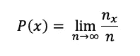

当 n 趋近于无穷大时，真实概率就接近于。作者图片

与这一学派相反的是**贝叶斯**，其中概率表达了对一个事件的相信程度。因为这篇文章的大部分内容将在贝叶斯世界中进行，所以让我举例来介绍这种思维方式。

这个例子来自行为心理学家丹尼尔·卡内曼和阿莫斯·特沃斯基，在*思考快与慢* (Kahneman，2011)中得到推广:

“史蒂夫非常害羞和孤僻，总是乐于助人，但对人或现实世界不感兴趣。温顺整洁的灵魂。他需要秩序和结构，热爱细节。”

史蒂夫更有可能成为图书管理员还是农民？

他们发现绝大多数人选择图书管理员(90%)而不是农民(10%)。不管答案如何，丹尼尔&阿莫斯发现，人们甚至不考虑世界上图书馆员与农民的比例来做出决定，这是不合理的。即使是关于图书馆员和农民的比例，这也不是关于人们实际上知道真实的答案，而是关于思考去*估计*它。正如来自 [3Blue1Brown](https://www.youtube.com/watch?v=HZGCoVF3YvM) 的 Grant Sanderson 如此雄辩地指出的那样，这一点可以用图形更好地说明:

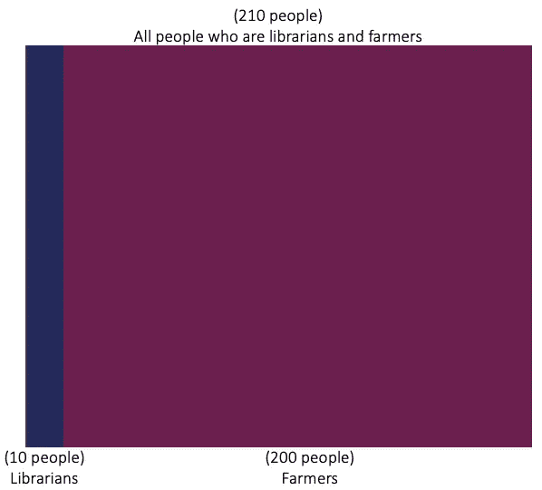

作者图片

让我们说，在我们的估计中，我们认为图书管理员约占农民总数的 1/21。我们的目标是根据描述找出史蒂夫成为图书管理员的可能性。假设我们发现证据表明，在 10 名图书管理员和 200 名农民中，有 4 名图书管理员和 20 名农民符合这个描述。

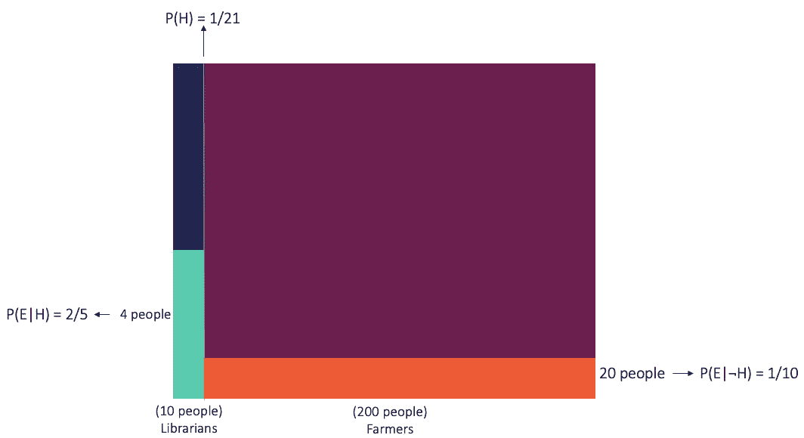

作者图片

因此，考虑到我们的信念、证据和目标，我们可以宣称概率为:

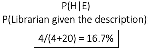

作者图片

现在让我们说，在对这个话题做了更多的阅读之后，我们发现图书馆员与农民的比例并没有那么低。那么，在这种情况下，我们所要做的就是更新我们先前的信念(实质上是加宽细长的蓝色条)并重新计算。这是贝叶斯哲学的真正精髓；没有“对”或“错”的概念，因为你在用你先前的知识和新的证据不断更新你对世界的理解。

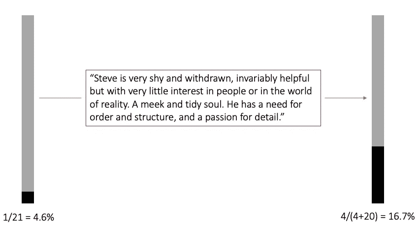

作者图片

本质上，贝叶斯主义者将参数(最有可能解释数据的分布)视为随机变量。下面是我们的例子如何映射到贝叶斯世界中的术语:

*   先验:P(H) = 1/21。在看到证据之前我们所知道的参数值。
*   证据(又名边际可能性):P(E) = 24。证据 E 不考虑事件的可能性有多大。
*   可能性:P(E|H) = 4/10 = 2/5。给定假设证据有多大可能？
*   后验:P(H|E) = 4/24 = 1/6。给定证据，假设的可能性有多大。

综上所述，我们得到:

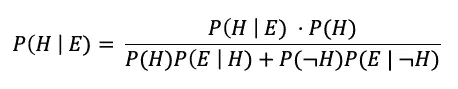

作者图片

当我们把它简化时，我们得到:

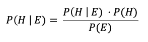

贝叶斯定理。作者图片

顺便说一下，由于在贝叶斯世界中获得洞见的“主观”本质，它可能会被混淆，并很容易被简化为仅仅是观点。这可能是一个懒惰的概括，因为所有的统计(频率主义者和贝叶斯)都需要假设，无论在哪里做出假设，从数据到见解，你都有一个相对主观的工艺。

这说明了数据的真正价值，因为当我们收集无限量的数据(或证据)时，比如说当 *N* 接近无穷大时，贝叶斯结果往往与频率主义者的结果一致。因此可以推断，统计推断对于大的 *N.* 来说或多或少是客观的。问题是我们通常没有无限的资源(时间、能量、数据、计算等)。)，所以我们不得不在现有证据较少的世界里工作。在频率主义者的世界里，这将产生具有更大方差和更大置信区间的结果。贝叶斯分析在这里可以大放异彩，因为你保留了不确定性，突出了小数据集上统计推断的不稳定性。请注意，这并不意味着贝叶斯在小数据集上比 Frequentist“更准确”。两者都需要假设才能获得洞察力，数据集越小，需要做出的假设就越多/越广泛。

# 概率规划

请记住，我们的目标是计算后验概率，理想情况下是基于大量数据(以有效的方式)。由于过去的斗争和计算时代的发展，我们已经开发了概率编程语言(PPL)，即 PyMC3。PPL 旨在帮助在模型创建和推理之间划清界限，同时也使设计和调试更加容易。这个框架允许各种数值方法作为通用推理机来应用，以自动化整个过程的推理部分。使用相对较少的代码行，就可以以有效和合理的方式创建复杂的概率模型。为了可视化 PyMC3 结果，我们将使用 ArviZ 库，正如您将看到的，它是为了补充 PyMC3 而惊人地构建的。

让我们来看看一些最著名的推理引擎。许多这方面的知识在 [*用 Python 进行贝叶斯分析*(马丁 2016)](https://learning.oreilly.com/library/view/bayesian-analysis-with/9781785883804/ch02.html) 中得到了令人难以置信的解释，所以我将从那里汲取灵感:

非马尔可夫方法:

*   网格计算
*   二次逼近
*   变分法

马尔可夫方法:

*   大都会黑斯廷斯
*   哈密尔顿蒙特卡罗/无掉头采样器

由于被称为 MCMC ( [蒙特卡罗马尔可夫链](https://en.wikipedia.org/wiki/Markov_chain_Monte_Carlo))模型的马尔可夫方法是当今最流行的方法之一，所以我在这里只集中讨论这些方法。我发现学习这些方法的理论的最好方法是通过做和倒退，所以让我们先从一个简单的，人为的抛硬币的例子开始。

```
import pandas as pd
import numpy as np
import pymc3 as pm
import arviz as az
from arviz.plots.plot_utils import xarray_var_iter
import scipy.stats as stats
import matplotlib.pyplot as plt
%matplotlib inlinenp.random.seed = 0#the number of samples
N=15#establishing prior and getting observed data
theta_real = .5
observed_data=stats.bernoulli.rvs(p=theta_real, size=N)#the number of heads
k=observed_data.sum()print(observed_data)
print(f"There are {k} heads")[1 0 1 1 1 1 1 0 0 0 0 1 0 1 1]
There are 9 heads
```

上面的代码只运行 15 次概率(theta_real)为 0.5 的硬币投掷。在大多数真实的用例中，这需要估计。现在我们有了数据，让我们来构建模型:

```
#fit the observed data 
with pm.Model() as coin_flip:
    theta=pm.Beta('theta', alpha=1, beta=1)
    y=pm.Bernoulli('y', theta, observed=observed_data)

pm.model_to_graphviz(coin_flip)
```

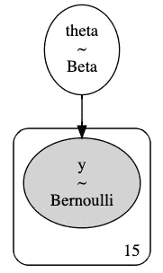

作者图片

为了在这里阐述思维过程，这本书 [*黑客的贝叶斯方法:概率编程和贝叶斯推理* (Davidson-Pilon，2015)](https://learning.oreilly.com/library/view/bayesian-methods-for/9780133902914/ch02.html) 提供了一个惊人的心理模型指南。当你构建贝叶斯模型时，你应该问自己的第一个问题是“*这些数据是如何产生的？”*。

**1。**我们首先思考，“描述这个抛硬币数据的最佳随机变量是什么？”二项式随机变量是一个很好的候选变量，因为它可以很好地表示具有 n 次独立试验的二元决策过程。这是代码块中的第三行，代表我们的可能性。单个成功/失败实验也称为伯努利试验或伯努利实验，一系列结果称为伯努利过程；对于单次试验，即 *n* = 1，二项分布是伯努利分布。

**2。**接下来，我们想，“好吧，假设掷硬币是二项分布的，我需要什么来得到二项分布？”嗯，二项分布有一个参数θ(*θ)*。

**3。**我们知道 *θ* 吗？是的，但是让我们假设我们没有。在大多数真实情况下，我们不会，我们需要估计它，但对于我们的例子，我们知道它是 0.5。但是我们可以引入一个天真的先验，好像我们不知道 *θ。*这是代码块中的第二行，代表我们的先验。

**4。**什么是 *θ* 的好分布？Beta 是好的，因为它模拟了有限范围的事物，比如 0 到 1。贝塔分布有两个决定其形状的参数，阿尔法(α)和贝塔(β)。

**5。我们知道α和β可能是什么吗？不。在这一点上，我们可以继续并给这些参数分配一个分布，但一旦我们达到一个设定的无知水平，最好停止(记住我们只进行了 15 次试验作为证据)；尽管我们对 *θ* 有一个先验的信念(“当我们接近无穷大时，它可能会趋向于 0.5”)，但我们对α和β并没有什么强有力的信念。所以最好就此停止建模。**

6。那么，α和β的合适值是多少呢？贝塔分布的形状因这些值而异，但首先我们将α和β指定为 1。这等同于从[0，1]开始的均匀分布。这是一个弱信息先验，因为它基本上假设没有先验知识，知道公平抛硬币头的概率是多少。本质上，该参数可以是 0 到 1 之间的任何值。

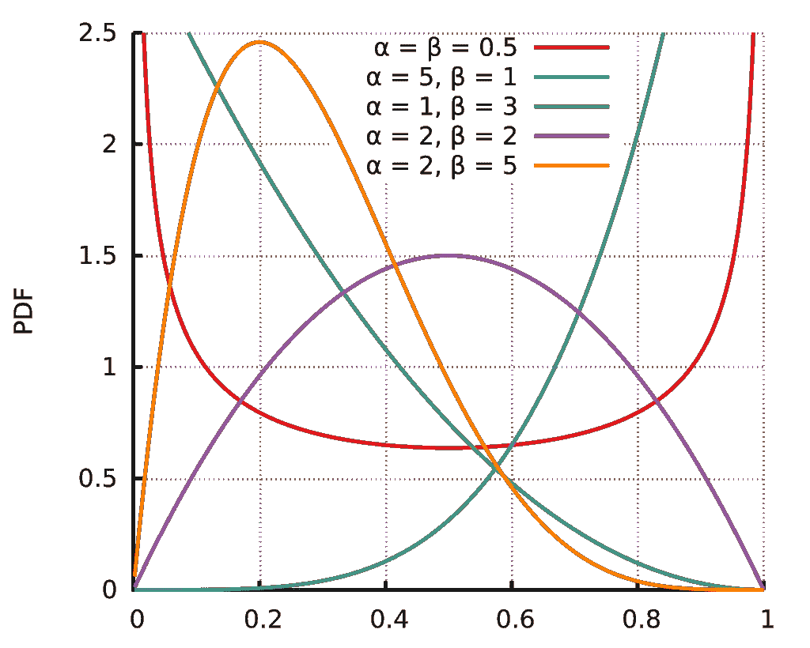

贝塔分布的概率密度函数，[公共域](https://en.wikipedia.org/wiki/Beta_distribution#/media/File:Beta_distribution_pdf.svg)

*这种思维方式“这个数据是怎么产生的？”*非常关键。本质上，我们对世界上的某个过程有一些假设，并希望对该过程建模，因此我们希望选择适当的分布组合来创建模型。如果我们假设公平抛硬币的概率代表贝塔分布，并且我们希望我们的模型描述它，那么由于共轭性，选择我们的先验分布为贝塔分布和可能性为二项式分布是一个重要的选择。如果后验分布与先验概率分布在同一概率分布族中，则先验和后验被称为共轭分布**、**，先验被称为似然函数的共轭先验。本质上，如果我们使用贝塔分布作为先验，使用二项式分布作为似然，我们将得到贝塔分布作为后验。

共轭性确保了后验概率的数学易处理性，这一点很重要，因为贝叶斯统计中的一个常见问题是我们无法解析地解决后验概率。幸运的是，无论我们是否选择共轭先验，现代计算方法都使我们能够解决贝叶斯问题，但重要的是要认识到制作适当模型的价值。

现在让我们按下推理引擎按钮，看看我们得到了什么:

```
with coin_flip:
 step = pm.Metropolis()
 trace = pm.sample(10000, step=step, return_inferencedata=True)
```

默认情况下，PyMC3 将运行 Metropolis 推理引擎(Metropolis-Hastings)，但是我们也可以显式地声明它。我们选择要运行的样本数量，现在让我们看看我们的模型学习数据的程度。

```
var_names = ["theta"]
lines = list(xarray_var_iter(trace.posterior[var_names].mean(dim=("chain", "draw"))))
az.plot_trace(trace, lines=lines);
```

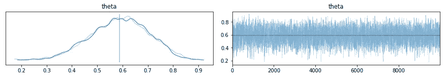

作者图片

正如我们所看到的，后验概率的平均值接近 0.5，但确实有点偏。考虑到这只是 15 次试验，我们可以想象如果我们进行更多的试验，模型会自然地找到它的方向！对于左边的图，我们寻找的是一个相对平滑的核密度估计(KDE)图。没有那么顺利，可能是多种原因造成的(推理机的选择，数据中的观察次数，样本数等。).对于右边的图，我们要找的是没有明显的模式。我们希望右边的图类似于白噪声，没有明显的“分歧”被描述；本质上，我们想要各种蒙特卡罗马尔可夫链的良好混合。

在我们进一步分析后验分布之前，让我们看看是否能得到一个更好的 KDE 图。

```
with coin_flip:
 step = pm.NUTS()
 trace = pm.sample(10000, step=step, return_inferencedata=True)var_names = ["theta"]
lines = list(xarray_var_iter(trace.posterior[var_names].mean(dim=("chain", "draw"))))
az.plot_trace(trace, lines=lines);
```

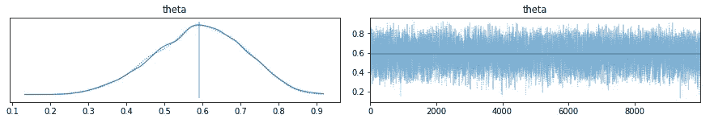

作者图片

这样看起来好多了！但是为什么呢？我们的第一个模型和这个模型的区别在于推理机。我们首先使用了默认的 Metropolis-Hastings 推理引擎，现在我们尝试了哈密尔顿蒙特卡罗/无 U 形转弯采样器。这[页](https://learning.oreilly.com/library/view/bayesian-analysis-with/9781785883804/ch02.html)相当精彩地解释了它们的区别(概念上和数学上的),我将尝试在这里总结它们的区别:

Metropolis-Hastings 使我们能够从任何概率为 *p(x)* 的分布中获取样本，只要我们能够计算出至少一个与其成比例的值。这在概念上类似于试图从船上测量湖底的形状，方法是随机使用一根长棍来测量与一点的距离，然后在更深的方向上反复移动，并且只在这些方向上移动。正如你所想象的，经过大量的迭代，你会对湖底的形状有一个非常精确的描述，这在贝叶斯世界中也是相似的(湖底是后验分布)。

汉密尔顿蒙特卡罗/NUTS 源于这样一种认识，即获取大量样本可能会非常昂贵(时间和计算)。这种方法基本上与 Metropolis-Hastings 相同，只是我们没有建议随机移动我们的船，而是做了一些更聪明的事情；我们沿着湖底的曲线移动小船。为了决定下一步去哪里，我们让一个球在湖底滚动，从我们现在的位置开始。我们扔一个球，让它滚动一小会儿，然后我们把船移到球所在的地方。现在，我们使用 Metropolis 标准来接受或拒绝这一步，就像我们在 Metropolis-Hastings 方法中看到的那样。熟悉用 Adam 优化的梯度下降的人可能会发现这种方法类似。

像所有事情一样，使用更聪明的哈密尔顿方法有一个权衡。HMC 的每一步都比大都会-黑斯廷斯的每一步计算起来更昂贵，但是 HMC 接受这一步的概率比大都会高得多。我强烈建议阅读之前链接的页面，深入了解这个概念，但现在让我们继续前进。

我们还可以打印出一个数据框架，显示我们的后验分布建模的关键指标:

```
az.summary(trace)
```

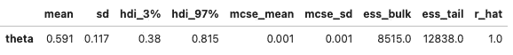

作者图片

默认情况下，我们可以获得相当多的信息:平均值、标准差、最高密度区间(HDI)等等。返回的数量之一是蒙特卡洛标准误差(MCSE)平均值和标准偏差。这是对采样方法引入的误差的估计。它被定义为链的标准偏差除以它们的有效样本量。该估计考虑到样本并非真正相互独立。后验分布的另一个快速质量检查是 r_hat 度量。经验法则是，您希望该值接近 1.0，因为这表示链中的收敛。通常，高于 1.05 的值是一个关注点，1.0 和 1.5 之间的值值得研究。

这里有趣的是，即使进行了 15 次试验，我们的估计仍然得到接近 0.5 的平均值，但肯定比我们想要的要高。看到 r_hat 告诉我们，我们的模型在构造中也不一定会遇到错误，所以我们的许多估计结果都是因为我们的数据很少。

为了解释高密度间隔，让我们直观地看一下:

```
az.plot_posterior(trace, kind='kde', ref_val=0.5);
```

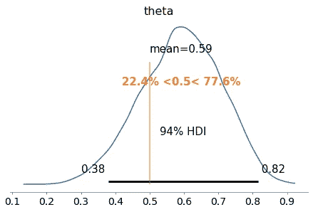

作者图片

在贝叶斯推理中，与频率主义推理不同，我们得到值的整个分布。每次 ArviZ 计算和报告 HPD 时，默认情况下，它将使用 94%的值。在频率主义者的世界里，我们有 p 值和置信区间。在贝叶斯世界中，这被称为可信区间。这里我们可以解释为，有 94%的概率，硬币抛头的信念在 0.45 到 53 之间。这里的好处是，我们用频率主义者世界中相对混乱的术语和解释来换取贝叶斯世界中明智的估计。不利的一面是，我们失去了一个更明确的行动来换取一系列的信念。例如，在这种情况下，硬币可能会稍微偏向正面，因为大部分区间都在 0.5 以上，但也可能是 0.38。频繁主义者的世界可能会给我们提供一个更明确的答案，但一如既往:你一直在做出假设以获得洞察力。

最后，我们可以运行后验预测检验(PPC)来验证我们的模型。这里的想法是，我们比较观察数据和预测数据，找出这两组数据之间的差异。主要目标是检查自动一致性。这是通过使用来自后部的每次绘制的参数从模型生成数据来完成的。理想情况下，生成的数据和观察到的数据应该或多或少相似。即使我们把所有的建模都做对了，他们也可能会看走眼。对原因的调查可能会导致我们模型的重大改进，这是我们以前可能没有想到的。

```
with coin_flip:
 ppc = pm.sample_posterior_predictive(trace, var_names=[“theta”, “y”])ppc['y'].shape(20000, 15)az.plot_ppc(az.from_pymc3(posterior_predictive=ppc, model=coin_flip));
```

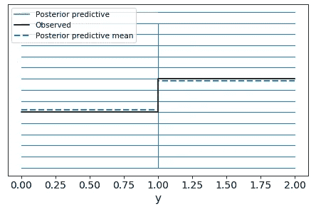

作者图片

```
fig, ax = plt.subplots(figsize=(10, 5))
ax.hist([y.mean() for y in ppc['y']], bins=19, alpha=0.5)
ax.axvline(observed_data.mean())
ax.axvline(0.5, c='r')
ax.set(title='Posterior Predictive Check', xlabel='Observed Data', ylabel='Frequency');
```

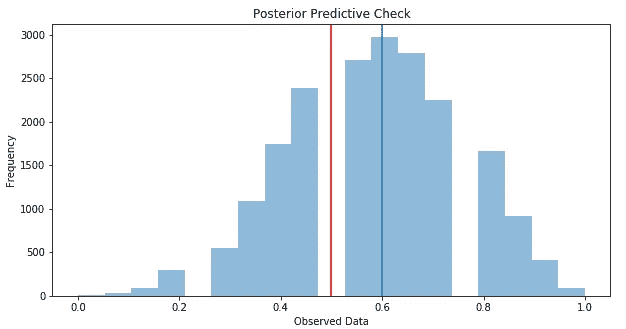

作者图片

看起来我们的贝叶斯模型能够很好地学习我们观察到的数据分布！这一点尤其值得注意，因为我们只进行了 15 项试验，坦白地说，这是相当疯狂的。像任何数据项目一样，高性能模型不仅仅是好的度量数字。我们对掷硬币的了解告诉我们，0.6 对于公平的掷硬币来说没有多大意义。

所以现在，以真正的贝叶斯方式，让我们收集更多的证据，更新我们的先验，看看会发生什么。

**根据新证据更新信念**

假设我们进行 1000 次相同的掷硬币试验:

```
#the number of samples
N_updated=1000#establishing prior and getting observed data
theta_real = .5
observed_data_updated=stats.bernoulli.rvs(p=theta_real, size=N_updated)#the number of heads
k_updated=observed_data_updated.sum()print(observed_data_updated)
print(f”There are {k_updated} heads”)[0 1 0 1 0 1 0 1 1 1 1 1 0 1 0 0 1 1 0 1 1 1 1 1 1 1 0 0 1 0 1 0 1 0 0 1 1 0 1 1 0 0 1 1 1 0 1 0 1 0 0 1 0 0 1 1 0 0 1 1 0 0 1 1 1 1 1 0 0 1 1 1 1 1 1 0 1 0 0 0 0 1 0 0 1 0 0 0 0 0 0 0 0 1 0 0 0 1 1 0 0 0 1 1 0 1 0 0 1 1 0 1 0 0 1 1 0 0 1 1 0 0 1 1 1 0 0 1 0 1 1 1 0 0 1 0 1 1 1 1 1 1 0 0 1 0 1 1 1 0 1 0 1 1 1 0 0 0 1 0 1 1 0 1 1 0 1 0 1 1 1 1 0 0 0 0 1 0 0 0 1 0 1 0 1 0 1 1 0 1 1 0 0 0 1 0 1 0 1 0 1 0 1 0 0 1 0 0 1 1 0 1 0 0 0 0 0 1 0 0 0 1 0 0 0 1 1 1 1 0 1 1 1 0 0 0 0 0 0 0 0 0 0 1 0 0 0 0 0 0 1 0 0 0 0 0 0 0 0 1 1 0 0 0 1 1 1 1 1 1 1 1 1 1 1 1 0 1 0 1 1 0 1 1 0 1 1 0 1 1 0 1 0 0 0 1 0 1 1 1 1 0 1 0 1 1 1 1 1 1 1 0 0 1 1 0 0 0 1 1 0 1 0 1 1 1 1 1 1 1 1 1 1 0 1 1 1 1 1 0 1 1 1 0 1 1 1 0 0 0 0 1 1 0 0 0 1 0 1 1 0 0 1 1 0 1 1 0 1 0 1 1 0 0 1 0 0 1 1 1 1 0 1 0 1 0 1 1 0 0 0 1 0 1 1 0 0 0 1 1 0 1 0 1 0 0 0 1 1 0 1 1 0 1 1 0 1 1 1 1 1 0 1 0 0 0 0 1 0 0 1 1 0 0 0 1 1 0 1 0 1 0 1 1 0 0 1 1 1 1 0 0 1 1 1 0 0 1 1 0 0 1 1 1 0 0 1 0 1 0 0 1 1 1 1 1 0 0 0 1 1 0 1 0 1 1 1 0 1 1 0 1 0 0 1 1 1 1 1 0 0 1 0 1 1 1 0 0 1 1 1 0 0 0 0 0 0 1 1 1 1 0 1 1 1 1 1 1 0 0 1 0 1 1 0 1 1 0 1 0 0 1 1 1 1 0 0 1 0 1 0 1 0 1 1 0 1 1 1 0 1 1 0 1 1 1 0 1 0 1 1 1 1 0 0 1 0 0 0 0 0 1 1 0 1 1 1 0 0 0 1 0 1 0 0 1 1 1 0 0 1 1 1 0 0 0 1 1 0 1 0 0 1 1 0 0 1 1 0 1 0 1 0 0 0 0 1 0 1 0 1 0 1 0 0 1 0 1 1 0 0 1 1 0 0 0 1 1 1 1 0 0 1 0 1 1 1 1 0 1 0 0 0 0 0 0 1 0 1 0 1 1 0 0 1 1 1 0 0 1 1 1 0 1 1 1 0 1 0 0 0 0 0 1 0 0 0 0 1 0 1 0 1 0 0 0 0 0 0 0 0 0 1 0 0 0 1 1 1 0 0 1 1 0 1 0 1 1 0 1 0 1 0 1 0 0 1 1 1 1 0 0 1 1 1 1 1 0 1 0 1 0 1 0 0 0 0 1 0 1 0 0 0 0 0 0 0 0 1 0 1 1 1 0 0 1 0 0 1 0 1 1 0 0 0 1 1 0 0 0 0 1 1 0 0 0 0 0 0 0 0 0 1 0 1 1 0 1 1 1 0 0 0 0 0 1 1 1 0 1 0 1 1 0 1 0 1 0 0 1 0 0 0 0 0 1 0 1 0 1 0 0 0 1 0 0 0 1 1 0 1 1 0 1 1 0 1 0 0 1 0 1 1 0 0 1 1 1 1 0 0 0 1 1 0 0 1 1 1 0 0 0 0 1 1 1 0 0 0 0 1 1 1 0 0 0 1 1 1 1 1 0 0 0 1 0 1 1 1 0 0 0 1 1 1 1 0 1 1 0 1 1 1 1 1 1 0 0 0 0 1 0 1 1 0 0 1 0 0 0 1 0 0 0 1 1 1 1 1 1 0 0 0 1 0 0 0 1 1 0 0 0 1 1 1 0 1 1 1 0 0 1 1 0 0 1 1 1 0 0 1 0 1 1 1 0 0 1 0 1 1 0 1 0 1 0 1 0 0 1]
There are 511 heads
```

在我们构建模型时，我们也可以更新之前的 Beta 分布，使其看起来更像一个能更好地反映掷硬币的形状。

```
#fit the observed data 
with pm.Model() as coin_flip_updated:
 theta=pm.Beta(‘theta’, alpha=2, beta=2)
 y=pm.Bernoulli(‘y’, theta, observed=observed_data_updated)

pm.model_to_graphviz(coin_flip_updated)
```

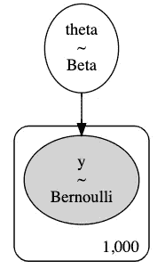

作者图片

```
with coin_flip_updated:
 step = pm.NUTS()
 trace_updated = pm.sample(10000, step=step, return_inferencedata=True)var_names = ["theta"]
lines = list(xarray_var_iter(trace_updated.posterior[var_names].mean(dim=("chain", "draw"))))
az.plot_trace(trace_updated, lines=lines);
```

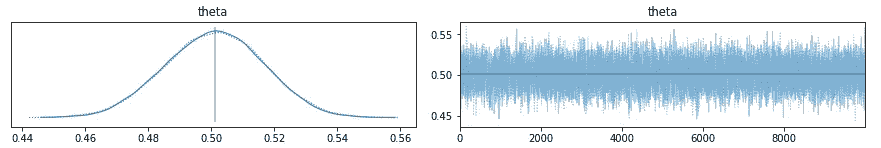

作者图片

```
az.summary(trace_updated)
```

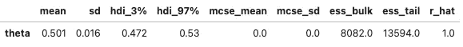

作者图片

```
az.plot_posterior(trace_updated, kind=’kde’, ref_val=0.5);
```

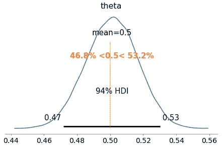

作者图片

```
with coin_flip_updated:
 ppc_updated = pm.sample_posterior_predictive(trace_updated, var_names=[‘theta’, ‘y’])az.plot_ppc(az.from_pymc3(posterior_predictive=ppc_updated, model=coin_flip_updated));
```

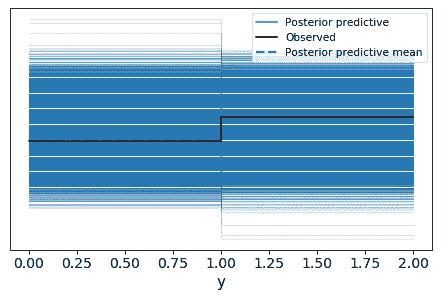

作者图片

```
fig, ax = plt.subplots(figsize=(10, 5))
ax.hist([y.mean() for y in ppc_updated[‘y’]], bins=19, alpha=0.5)
ax.axvline(observed_data_updated.mean())
ax.axvline(0.5, c='r')
ax.set(title=’Posterior Predictive Check’, xlabel=’Observed Data’, ylabel=’Frequency’);
```

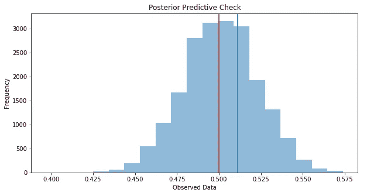

作者图片

这里令人惊讶的是，我们的贝叶斯模型能够超越我们的证据(其平均值约为 0.51)，并确定公平抛硬币的真实平均概率:0.5。只要收集新的证据，更新我们先前的信念，重塑我们的数据，我们就能够对掷硬币现象做出更好的估计！

数学上已经证明，如果我们想扩展逻辑以包括不确定性，我们必须使用概率和概率论。正如我们所看到的，贝叶斯定理只是概率规则的逻辑结果。因此，另一种思考贝叶斯统计的方式是在处理不确定性时作为逻辑的延伸。

这个世界还有许多令人着迷的深度，在第 2 部分中，我计划将这些应用到真实世界的数据集中！看这里:[用 Python pt 应用贝叶斯推理。2](/applied-bayesian-inference-with-python-pt-2-80bcd63b507e)

**参考文献**

[1]奥斯瓦尔多·马丁，[用 Python 进行贝叶斯分析](https://learning.oreilly.com/library/view/bayesian-analysis-with/9781785883804/)

[2]卡梅隆·戴维森-皮隆，[黑客的概率编程和贝叶斯方法](https://github.com/CamDavidsonPilon/Probabilistic-Programming-and-Bayesian-Methods-for-Hackers)

【3】卡西·科济尔科夫，[统计学:你是贝叶斯主义者还是频率主义者？](/statistics-are-you-bayesian-or-frequentist-4943f953f21b)