# 应用贝叶斯推理与 PyMC3 和 Bambi 第 3 部分

> 原文：<https://towardsdatascience.com/applied-bayesian-inference-with-pymc3-and-bambi-pt-3-d4bfb3211509?source=collection_archive---------8----------------------->

## 预测 Spotify 前 200 首歌曲的流


银翼杀手 2020。作者图片

# 介绍

这是我的应用贝叶斯推理系列的最后一部分。在第 1 部分中，我介绍了条件世界和概率编程:

</applied-bayesian-inference-pt-1-322b25093f62>  

在第 2 部分中，我展示了如何通过对 Nike 和 Adidas 的鞋子建模来将模型扩展到“真实”数据。这篇文章展示了如何运行更有效的 A/B 测试和组比较:

</applied-bayesian-inference-with-python-pt-2-80bcd63b507e>  

在本部分的第 3 部分，我将通过在 PyMC3 中引入线性回归，然后将其进一步引入层次模型、广义线性模型和样本外预测，来展示贝叶斯建模为何如此不可思议。

这个故事将看看 Spotify 的数据，即 2020 年至 2021 年的前 200 首歌曲。可以在这里找到数据集:[https://www . ka ggle . com/sashankpillai/Spotify-top-200-charts-2020 2021](https://www.kaggle.com/sashankpillai/spotify-top-200-charts-20202021)。我们将尝试基于每首歌曲的相关特征(可跳舞性、艺术家追随者等)为每首歌曲的流的后验建模。)

# 探索性数据分析和清理

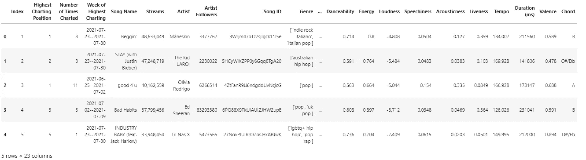

作者图片

Dtypes 是一个很好的起点:

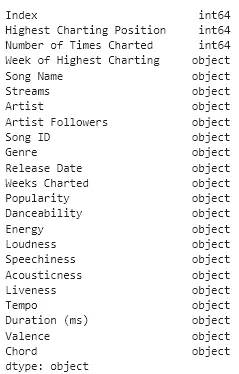

作者图片

这肯定需要一些清理。此外，因为它们是对象，所以很可能需要清理一些奇怪的文本才能变成数字。在这之间，我认为最大的变化是体裁栏。每首歌曲似乎符合 1 个以上的流派，这些流派以列表的形式表示。对于我们的用例，我们希望对这些列进行一次热编码。这可以很容易地用 sklearn 的 MultiLabelBinarizer 来完成。

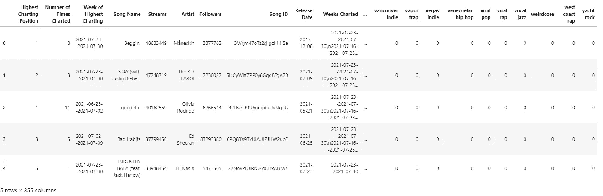

作者图片

那应该好多了！现在我们想把列按类型分成 1 列。修复 dtype 和 2。从一个地方开始过滤。从那里，我们可以绘制流分布图，看看我们的目标是什么。

对于回归，集中或标准化你的价值是常见的做法，这里也不例外。事实上，对于 MCMC 模型来说，标准化您的值可能特别重要，因为否则采样器将很难收敛。标准化对我们来说还有另一个优势，那就是能够使用弱信息先验，因为截距总是为零，斜率大约为-1 和 1。它还允许我们用 Z 分数来表示，确定离平均值有多少标准偏差值。

```
0
```

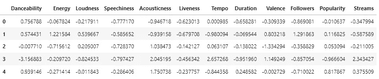

作者图片

我们现在只处理这些数字字段；稍后的实现可以很容易地扩展到包含我们之前编码的分类列(genre)。

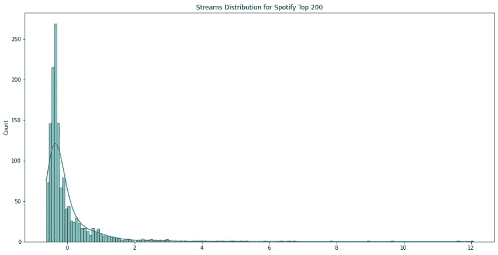

作者图片

这是我们在许多场景中看到的常见分布形状。这是有很多人处于“较低”值的结果，并且随着你在尾部越靠右，人数呈指数下降。有趣的是，我们发现它甚至对前 200 首歌曲都如此强大，但这将是我们在建模后要记住的一个重要部分。

首先，我们可以画出标准化的水流记录图:

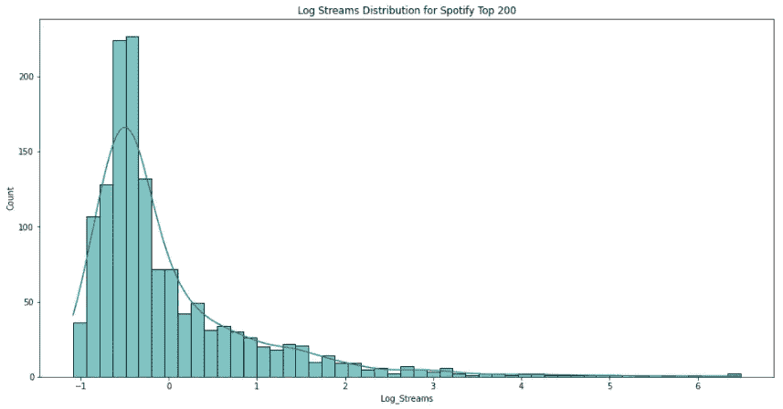

作者图片

仍然不是最好的，但是好多了。我们显然有一些离群值，它们在去年经历了一些大规模的病毒式传播。

# 简单回归

最好的学习方法是实践，当事情很复杂时，最好从尽可能简单的开始，然后慢慢扩大规模。这里最简单的例子是线性回归，让我们看看我们想要将流建模为艺术家追随者的函数。也许我们有一些预感，艺术家的追随者对溪流有一些影响。

首先理解人际关系是一个好习惯；艺术家的追随者如何与排名前 200 的流相关联？

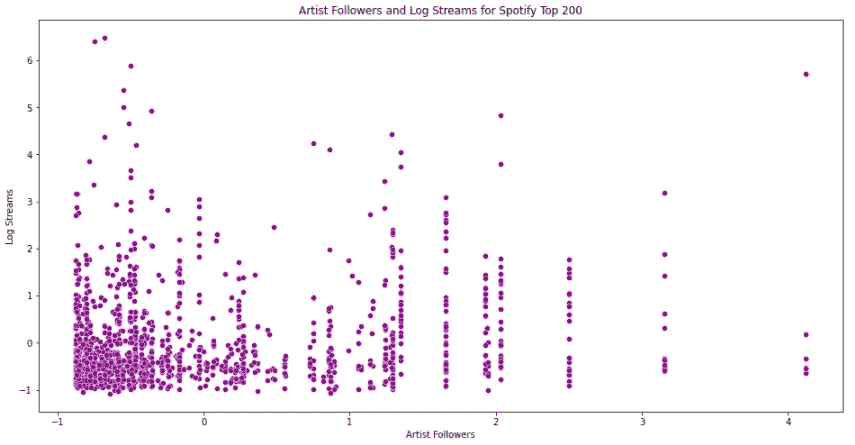

作者图片

几乎没有相关性，这似乎是有意义的，因为这些歌曲已经非常受欢迎——甚至可能出现反向相关性(当一首新歌进入前 200 名时，该艺术家的粉丝显著增加)。不仅在建模之前，而且在从结果中得出结论的时候，理解这些类型的见解都非常重要。现在每个人都应该明白这种相关性了！=因果关系，但相关性可能流向哪个方向？为什么呢？这些可以给你惊人的洞察力，让你知道如何修复模型中的问题，或者你想要管理什么样的数据来改进你的模型。

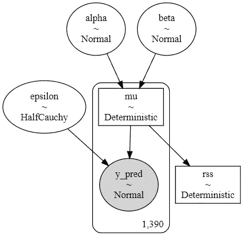

作者图片

这里有趣的是，我们为 beta(x 的权重，艺术家的追随者)和偏差创建一个先验，然后创建一个线性函数(alpha + beta*x)来建模可能性。请记住，我们试图将后验概率建模为先验的函数，但当我们这样做时，我们能够基于观察值的不确定性量化值的分布。我们希望将 mu 包装在一个确定性函数中，因为我们不希望它每次都不一样；它应该总是遵循 alpha + beta*x 的结果，但 alpha 和 beta 具有随机先验，允许模型扫描它们的一系列选项。

此外，我们还可以创建一些确定性的指标来非常简单地测量我们的输出。因为我们在处理回归，所以我们也可以在模型构建本身中计算 r2 值。这创造了一个非常简单的方法来确定拟合线与数据的吻合程度。

现在我们可以对数据进行采样。NUTS(不掉头采样器)是大多数用例的绝佳选择。虽然它的每一步都比 Metropolis 慢，但它能够轻松穿越对角线空间。此外，它通常需要少得多的步骤来获得对后验概率的合理近似。

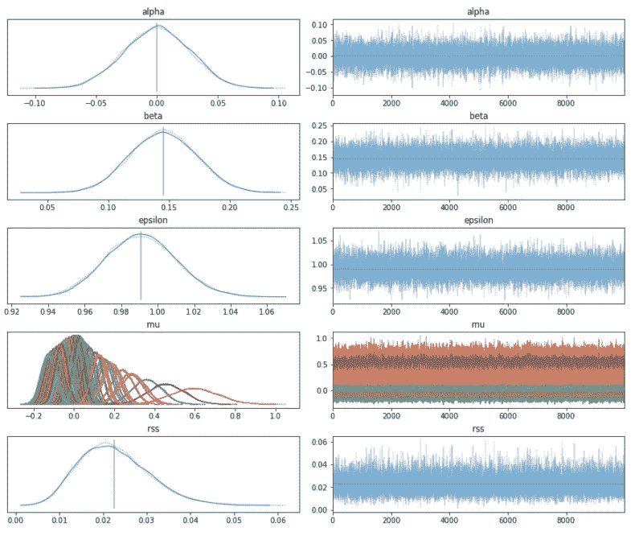

作者图片

我们在轨迹中没有看到明显的差异，标准化/居中显著地帮助我们的模型为每首歌找到合适的分布。让我们看看我们的 r2，并绘制结果。

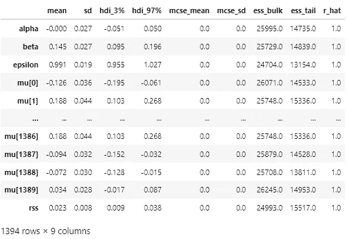

作者图片

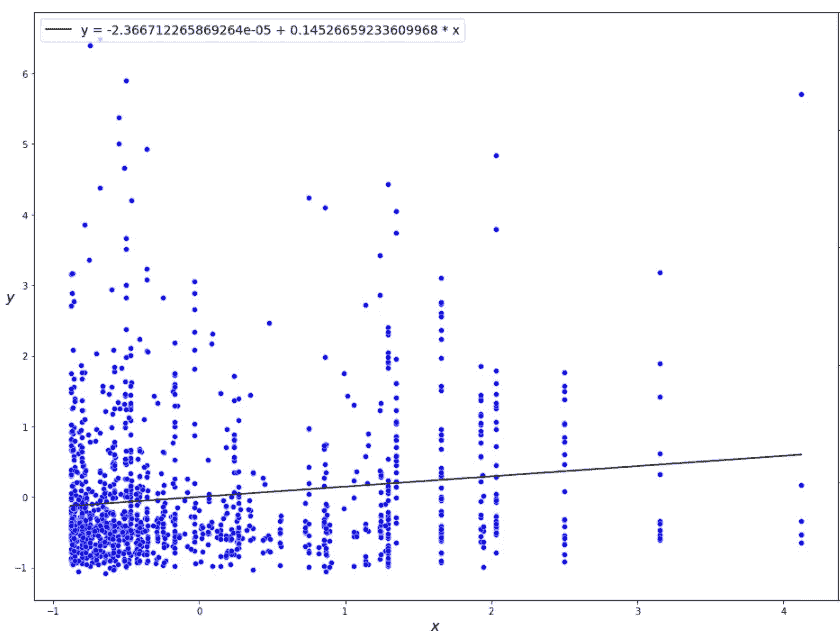

作者图片

因此，我们的模型表现很好，但我们得到了相当低的相关性，这在看到这个散点图时应该很明显。一开始真的没有太多的相关性，这一点似乎越来越明显。不过，我们可以做很多事情来改进这个模型。首先，让我们使用 StudentT 分布作为我们的可能性，看看我们是否可以使它对异常值更稳健，同时也预测样本外。

# 稳健的线性回归和样本外预测

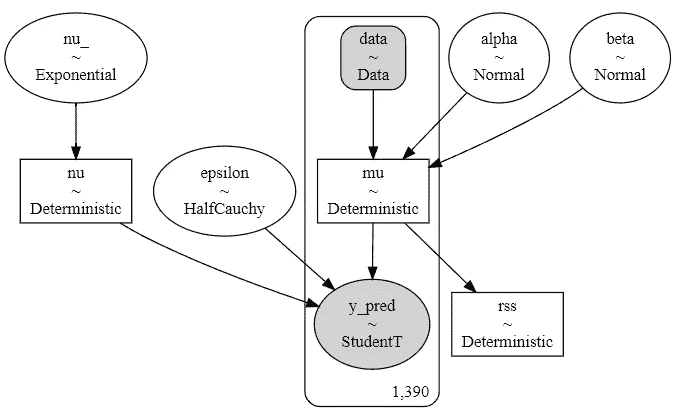

作者图片


作者图片

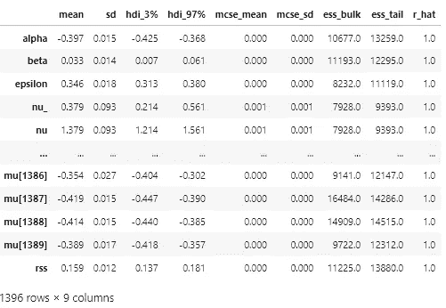

作者图片

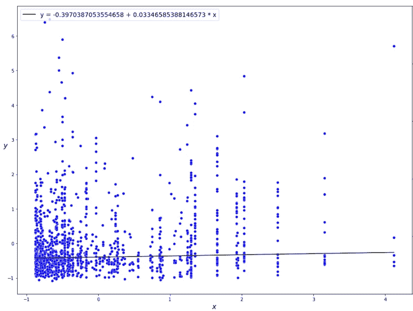

作者图片

我们在拟合数据的直线方面得到了显著的改进—～0.16！从技术上讲，由于我们对数据进行了标准化，斜率和皮尔逊相关系数具有相同的值，但这是一种非常有趣的将它融入建模的方式。仍然不是流的最佳预测器，但我们可以看到这条线不太可能被数据集中的潜在异常值选中。虽然这对我们没什么好处，但我们也可以轻松地更新我们的数据，并在测试数据集上使用该模型预测后验概率。

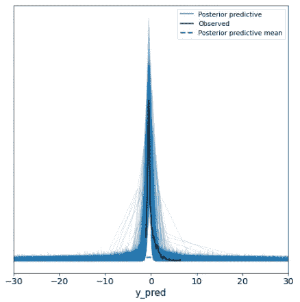

作者图片

```
Mean Squared Error: 0.6710557105827462
```

令人惊讶的是，不仅可以很容易地找到一个测试点(每个后验分布的平均值)，而且还可以找到一个值的分布来估计误差！我们现在可以利用这些技能来构建这个简单的模型，并在此基础上继续构建。

进入贝叶斯建模界面——Bambi。

# 多重、分层和广义线性模型

像以前一样，如果我们要加入更多的变量，我们应该首先可视化关系，并确保特征之间以及特征/预测变量之间的最小相关性。我们可以用我最喜欢的可视化工具散点图矩阵有效地做到这一点。

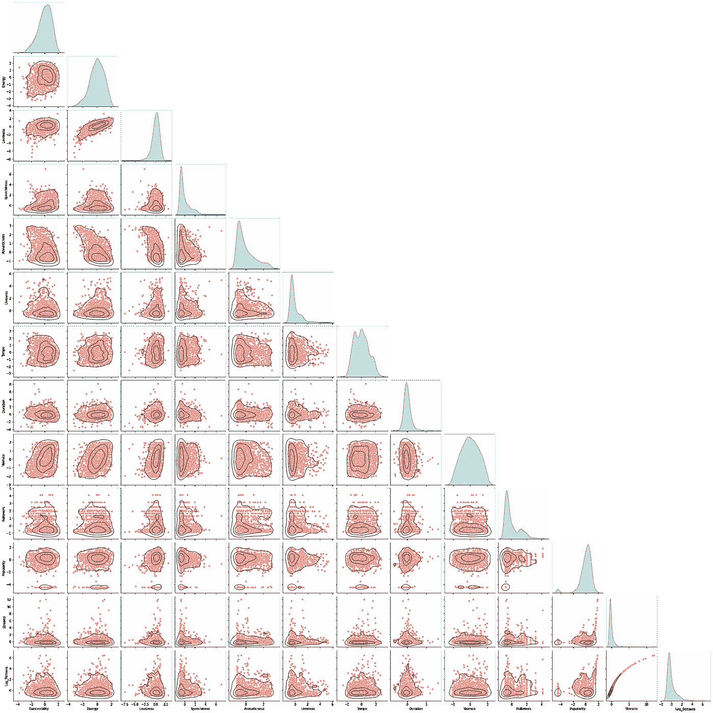

作者图片

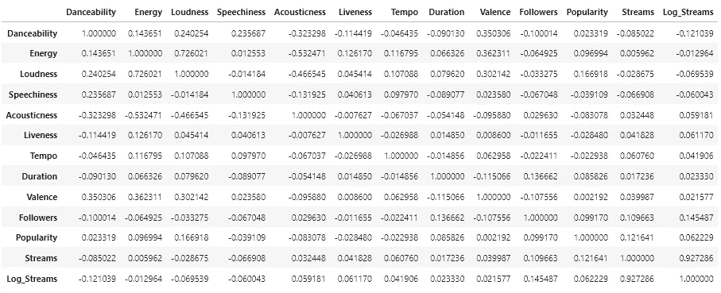

作者图片

似乎“能量”和“响度”比我们想象的更相关。当试图对这些变量之间的关系建模时，这可能会导致许多问题，因此我们可以删除一个变量。

注意最后一行是 Log_Streams 值，所以我们不需要评估它与流的相关性，因为我们还没有建模。

## 多元线性回归

使用 Bambi，我们可以轻松地写出我们的公式，并像这样创建模型:

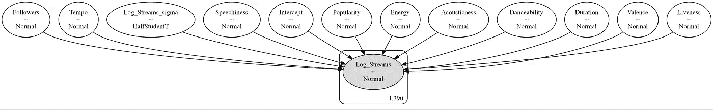

作者图片

我将跳过 traceplots 和 forestplots 来分析这里的数据，但请确保使用它们来确保您的模型正确地收敛到每个要素！跟踪图是直观显示 MCMC 模型输出的极好方法。

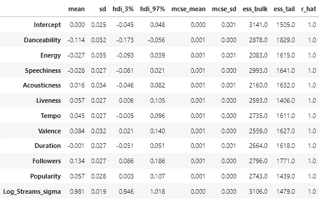

作者图片

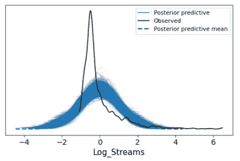

作者图片

```
Mean Squared Error: 0.5720862510645325
```

请注意，我们在后验预测中对两条链进行采样，以模拟测试预测，因此我们采用了两个列方式的平均值，一个是两条链的平均值，另两个是每个预测的后验分布平均值(测试值)。

随着我们添加特定歌曲的更多特征(可跳性、效价、能量等等)，MSE 明显更好。通过评估拟合模型摘要中的平均值，有趣的是，追随者似乎对增加 Log_Streams 的其他值有最强的影响。Danceability 和 Speechiness 等功能似乎对 Log_Streams 有负面影响，但重要的是对这些功能持保留态度，因为我不完全确定 Spotify 是如何记录这些信息的(更不用说有人可能是如何操纵它以在 Kaggle 中获得这些信息的)。

此时你可能已经意识到的一个重要问题是，艺人的歌曲变奏曲呢？我们目前正在为每首歌单独建模(非池化)，但我们也可以为每个艺术家的歌曲建模(池化)。每一个问题是，你必须为它放弃一些东西。如果没有，你就失去了看到艺术家之间细微差别的能力；有了 pooled，你就失去了每首歌分发的粒度。那么我们能做什么呢？分级部分统筹来救援！

## 分层部分池

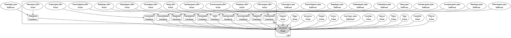

作者图片

这看起来复杂得多，但实际上非常简单。到目前为止，我们所学的贝叶斯推理的整个概念是，你能够烘焙先前的知识，并建立一个后验分布模型，该模型适合于随着新知识的形成而更新。到目前为止，我们只对直接先验进行了建模(例如，基于正态概率的 mu 和 sigma 先验)，但是如果我们的数据具有层次性质，会怎么样呢？如果我们可以对每个艺术家的歌曲元数据的分布进行建模，这不是很好吗？简而言之，我们可以，而且很容易。这是一个层次模型，它包括你在你的先验知识上增加超先验知识；在这种情况下，我们添加了按艺术家对歌曲元数据特征的分组，并添加了超优先级以及我们的可能性。

在代码块中，我们可以通过向每个特性添加“(1|…)”来表示我们想要一个层次模型，然后简单地向值添加适当的优先级。语法可以分解如下:

*   常见的预测因素是你的主要影响。例如，可跳舞性。
*   群体预测因子可以通过三种不同的方式来识别:1 .(Danceability|Artist)表示我们希望允许每个艺术家拥有自己的可跳舞斜率和截距，2。(1|Artist)表示我们想要 Artist 的不同截距，而不是斜率，以及 3。(0+Danceability|Artist)表示我们只想要特定于每个艺术家的斜率，而不包括特定于艺术家的截距。

显然，我们拥有的知识越少，我们想要实现的先验就越广，就像以前一样。无论如何，这个模型表现如何？

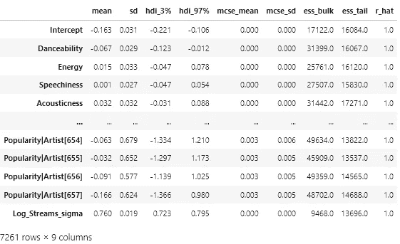

作者图片

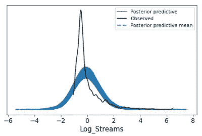

作者图片

不幸的是，Bambi 目前还没有功能(版本 0.6.3)来进行样本外预测，当你涉及到分类分组时，我们的模型似乎也可以学习分布。做部分池的好处是，我们不仅可以看到这方面的后验分布，还可以衡量每个艺术家的歌曲属性分布的影响。下面是一些受欢迎程度的例子:

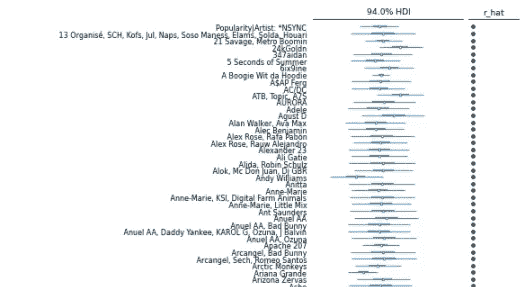

作者图片

尽管分层建模非常吸引人，但很明显我们不能完全有效地对观察到的分布建模。这是因为它的非高斯形状。我们试图用线性模型来模拟它，这些模型假设了一个常态水平，而在现实中，我们只是看不到。此外，我们的流永远不会低于 0，所以我们的 Log_Streams 永远不会低于 0(最小的流计数可能是 1 和离散的)。我们如何对此建模？

## 广义线性模型

广义线性模型在 Bambi 中非常容易实现，它们是我们问题的解决方案。我们的河流不是自然分布的，因此我们应该考虑如何有效地模拟它们的真实性质。一个好的开始是我在第 1 部分中概述的指南——我们如何相信这些数据是收集的？流是一种计数方法；它们反映了一首歌曲在 Spotify 上播放的离散次数。对我们来说幸运的是，有一种流行的 GLM 类型完全符合这一点:泊松。下面是我们如何用 Bambi 实现它以及结果(注意我们现在是如何直接建模流的)。

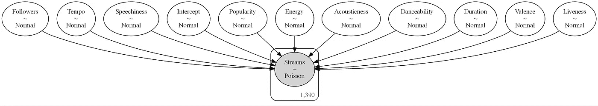

作者图片

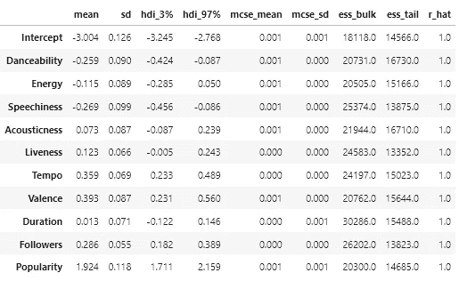

作者图片

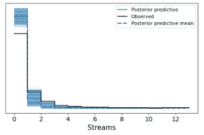

作者图片

**重要声明**:在撰写本文时，我使用了已经标准化的 Streams 字段，该字段不适合建模为泊松分布，因为这会将离散计数数据转换为低于 0 的连续数据(大喊到 [Susia](https://medium.com/u/fe32d3e40330?source=post_page-----d4bfb3211509--------------------------------) 以捕捉这一点)。在我能够解决这个问题之前，请确保知道要建模的预期字段是流的原始计数。

```
Mean Squared Error: 0.2989611604295006
```

多么惊人的进步啊！但是为什么 MSE 变得如此之好呢？实际上，我敢打赌我们可以更低，但是怎么做呢？这个问题的答案就是贝叶斯机器学习的精髓。

该模型表现明显更好的原因是因为我们仔细考虑了数据及其代表的内容。我们思考了它的细微差别以及它是如何被收集的。在一个问题上投入无止境的建模技术可以提高你的度量，但是模型不会真正歌唱，直到你做了战略设计的艰苦工作。贝叶斯 ML 让我们能够非常灵活地做到这一点，并且通过稳健和精确的先验变得更加强大，这是我们做/改进的另一件事。允许你的前科有一个大致的学习空间可以创造一个真正的信息模型，能够快速收敛和有效学习。

# 模型比较

为了更好地总结这一点，让我们进行模型比较，以更清楚地了解每个模型的表现。

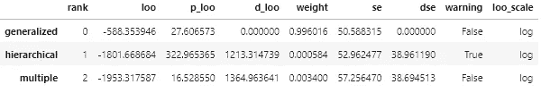

作者图片

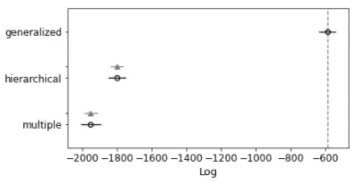

作者图片

默认情况下，AriZ 使用留一个交叉验证。另一种选择是广泛适用的信息标准(WAIC)。由于结果是对数标度的，因此具有最高值的模型给出了更好的样本外预测拟合，这就是我们前面看到的广义线性模型。

# 结论

这结束了我的应用贝叶斯推理的 3 部分系列，我们已经能够在这段时间做了很多。老实说，我开始这个系列时对这个领域知之甚少，我知道我想深入了解它，所以我认为最好的方法是利用我在阅读中找到的所有知识。除了记录我的旅程，还有什么更好的方法让其他人学习呢？

我希望这个系列不仅帮助你学习这门手艺并亲自投入其中，还让你看到了机器学习的美好世界。学习贝叶斯方法给你一个更好的理解，一个强大的统计学基础可以带你走这么远。从对你的世界的不确定性建模，做出预测，以及根据新的证据更新你的知识。

这个系列的结束标志着我在这个领域设计我的品牌的正式开始。应用内容不仅可以帮助你入门，还可以帮助你理解概念，丰富你的世界。请关注更多与机器学习的艺术和科学相关的内容。

**参考文献**

[1]奥斯瓦尔多·马丁，[用 Python 进行贝叶斯分析](https://learning.oreilly.com/library/view/bayesian-analysis-with/9781785883804/)

[2] PyMC3，[pymc 3 中的 GLM:样本外预测](https://docs.pymc.io/en/stable/pymc-examples/examples/generalized_linear_models/GLM-out-of-sample-predictions.html)

[3] PyMC3，[(广义)线性和分层线性模型在 PyMC3](https://docs.pymc.io/en/stable/pymc-examples/examples/generalized_linear_models/GLM.html)

[4] PyMC3， [GLM:泊松回归](https://docs.pymc.io/en/stable/pymc-examples/examples/generalized_linear_models/GLM-poisson-regression.html)

[5] PyMC3，[分层部分统筹](https://docs.pymc.io/en/stable/pymc-examples/examples/case_studies/hierarchical_partial_pooling.html)

[6] PyMC3，[多级建模贝叶斯方法入门](https://docs.pymc.io/en/stable/pymc-examples/examples/case_studies/multilevel_modeling.html)

[7] Bambi， [Wald 和 Gamma 回归(澳大利亚保险索赔 2004-2005)](https://bambinos.github.io/bambi/0.6.3/notebooks/wald_gamma_glm.html)

[8] Bambi，[多层回归](https://bambinos.github.io/bambi/0.6.3/notebooks/multi-level_regression.html)

[9] Bambi，[与 Bambi 和 ArviZ 的逻辑回归和模型比较](https://bambinos.github.io/bambi/0.6.3/notebooks/model_comparison.html)

[9] Bambi，[具有二项式家族的分层逻辑回归](https://bambinos.github.io/bambi/0.6.3/notebooks/hierarchical_binomial_bambi.html)