# PyMC3 应用贝叶斯推理第 2 部分

> 原文：<https://towardsdatascience.com/applied-bayesian-inference-with-python-pt-2-80bcd63b507e?source=collection_archive---------13----------------------->

## 在 StockX 上展示阿迪达斯 Yeezy 和耐克米色转售


纽约时报。作者图片

# 介绍

如果你是从第 1 部分来到这里的，那么我已经假设你至少知道 Python &统计学的基础。如果不是，从第 1 部分开始可能对你自己的学习体验更舒服。

在第 1 部分中，我展示了如何通过 Python 使用 PyMC3，通过掷硬币的例子进行贝叶斯建模。这个例子是一个很好的起点，因为它是一个大多数人都熟悉的概念，而且数据并不“混乱”。这个例子的问题是它的人为性质使你，学习者，很难真正使用这个技能。我知道，因为这正是我的感受。因此，在这一部分中，我将把 PyMC3 模型和方法应用于“真实”数据集。由于我是一个狂热的耐克粉丝，我将浏览这个 [StockX 2019 数据竞赛数据集](https://www.kaggle.com/hudsonstuck/stockx-data-contest)。这个数据集比这个领域的大多数专家使用的数据集都要干净得多。Kaggle 是一个很好的游乐场，可以做数据科学的有趣事情，但是现实世界中的大多数数据集都非常混乱。

为了解决这个问题，假设我们想为 Yeezys 和 Off-white 的利润率建模，以帮助我们在转售世界中找到一个更好的权衡。

与任何好的数据科学项目一样，让我们先做尽职调查，进行探索性的数据分析，并在此过程中做一些清理工作。

# 探索性数据分析和数据清理

```
import pandas as pd
import numpy as np
import pymc3 as pm
import arviz as az
from arviz.plots.plot_utils import xarray_var_iter
import matplotlib.pyplot as plt
import seaborn as sns
import xarray as xr%matplotlib inlineRANDOM_SEED = 42stockx_data = pd.read_csv('StockX-Data-Contest-2019-3.csv')#Seeing how many rows/columns we're working with
print(stockx_data.shape)(99956, 8)#Getting first glimpse at dataset
stockx_data.head(10)
```

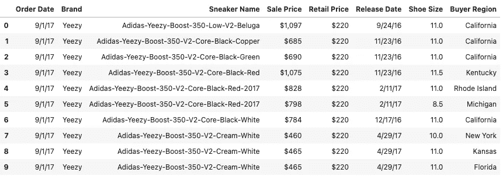

作者图片

首先检查 nan 和 dtypes:

```
stockx_data.isna().sum()
```

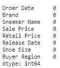

作者图片

```
stockx_data.dtypes
```

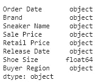

作者图片

一开始看起来相对干净。让我们稍微清理一下数据/数据类型，然后创建一些有趣的特性。

```
def cleanCurrency(series):
    """
    Input: a dataframe series for currency (USD)
    Output: cleaned series as a float
    """
    #Replaces dollar sign and comma with empty string
    series = series.str.replace('$', '', regex=True)
    series = series.str.replace(',', '', regex=True)
    series = series.astype(float)
    return series#Fix the Price fields to only be numeric
stockx_data['Sale Price'] = cleanCurrency(stockx_data['Sale Price'])
stockx_data['Retail Price'] = cleanCurrency(stockx_data['Retail Price'])#Calculate Profit by subtracting Sale from Retail
stockx_data['Profit'] = stockx_data['Sale Price'] - stockx_data['Retail Price']#Cleaning Sneaker Name column by removing hyphens
stockx_data['Sneaker Name'] = stockx_data['Sneaker Name'].str.replace('-', '')#Making brand name a little more descriptive
stockx_data['Brand'] = stockx_data['Brand'].str.replace('Yeezy', 'Yeezy (Adidas)')
stockx_data['Brand'] = stockx_data['Brand'].str.replace('Off-White', 'Off-White (Nike)')#Getting only 'object' dtype columns and then stripping trailing white spaces
stockx_data_obj = stockx_data.select_dtypes(['object'])
stockx_data[stockx_data_obj.columns] = stockx_data_obj.apply(lambda x: x.str.strip())#Ensure date fields are the right dtype
stockx_data['Order Date'] = pd.to_datetime(stockx_data['Order Date'])
stockx_data['Release Date'] = pd.to_datetime(stockx_data['Release Date'])#Calculate Duration of Days from Release Date to Order Date
stockx_data['Duration (days)'] = stockx_data['Order Date'] - stockx_data['Release Date']#Univariate stats on the numeric measures
stockx_data.describe()
```

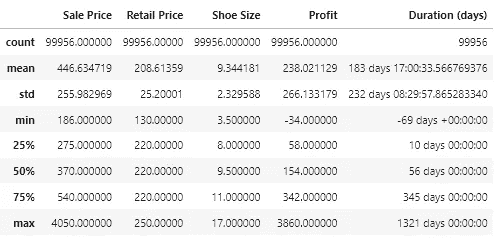

作者图片

首先引起我注意的是这双鞋的价格。考虑到品牌和 StockX 的目标(转售高端街头服饰)，这一点得到了证实。这里的平均订单也从转售中获得了相当不错的利润，大约 60 美元。不过，标准差显示利润有很大的变化。这里需要注意的另一件有趣的事情是，在 2017-2019 年期间，Off-Whites & Yeezys 平均需要 2 个月才能在 StockX 上转售。这可能是由于在鞋子发布的最初几个月供货率低。

接下来，让我们快速了解一下日期字段的范围。

```
#Getting the min and max dates to understand order date range
print(stockx_data['Order Date'].min(), stockx_data['Order Date'].max())2017-09-01 00:00:00 2019-02-13 00:00:00
```

似乎我们有相当多的数据！将近两年的相对干净的数据。目前看起来不错，现在让我们开始可视化数据，以便更好地理解我们正在处理的内容:

```
#Grouping by Brand to see how the general distribution of sales are
brand_group = pd.DataFrame(stockx_data.groupby('Brand').size(), columns=['values']).reset_index().sort_values('values', ascending=False)
brand_group['values'] = brand_group['values'].astype(int)
plt.figure(figsize=(16, 8))
plt.rcParams.update({'font.size': 10})
ax = sns.barplot(x=brand_group['Brand'], y=brand_group['values'], data=brand_group, hue='Brand', palette="icefire")
ax.set(ylabel='Number of Shoes')
plt.show()
```

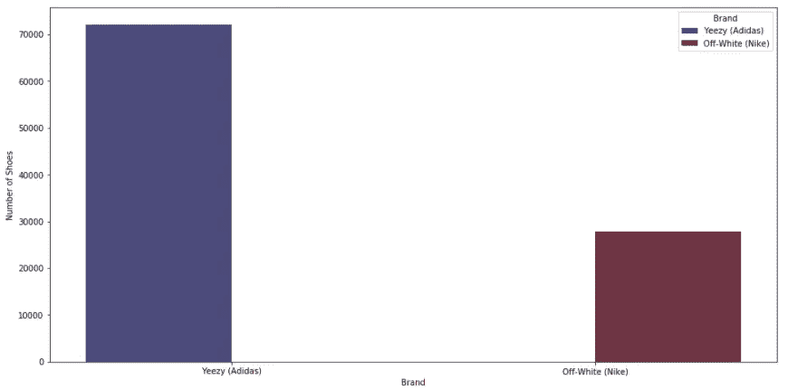

按品牌销售的鞋子总数。作者图片

这是一个很大的阶级不平衡，Yeezys 在这两年的销量似乎远远超过了白人。让我们潜得更深。

```
#Grouping by Sneaker Name to see how the general distribution of ratings are
sneaker_group = pd.DataFrame(stockx_data.groupby(['Brand', 'Sneaker Name']).size(), columns=['values']).reset_index().sort_values('values', ascending=False)
sneaker_group['values'] = sneaker_group['values'].astype(int)
plt.figure(figsize=(20, 8))
plt.rcParams.update({'font.size': 10})
ax = sns.barplot(x=sneaker_group['Sneaker Name'], y=sneaker_group['values'], data=sneaker_group, hue='Brand', palette="icefire")
ax.set(ylabel='Number of Shoes')
plt.xticks(rotation=90)
plt.show()
```

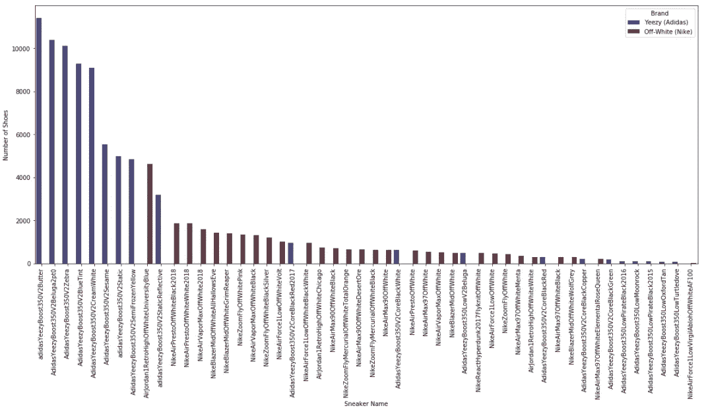

按运动鞋名称销售的鞋子总数。作者图片

按销量排名前 10 的运动鞋品牌似乎主要由 Yeezys 占据。即:

```
sneaker_group[:10]
```

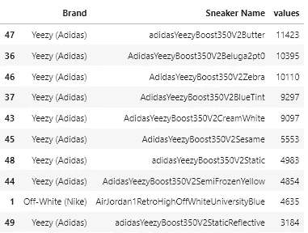

作者图片

尽管买方地区(州)可能有点显而易见，但让我们确认一下假设。

```
#Grouping by Region to see how the general distribution of ratings are
region_group = pd.DataFrame(stockx_data.groupby([‘Buyer Region’, ‘Brand’]).size(), columns=[‘values’]).reset_index().sort_values(by=’values’, ascending=False)
region_group[‘values’] = region_group[‘values’].astype(int)
plt.figure(figsize=(20, 8))
plt.rcParams.update({‘font.size’: 10})
ax = sns.barplot(x=region_group[‘Buyer Region’], y=region_group[‘values’], data=region_group, hue=’Brand’, palette=”icefire”)
ax.set(ylabel=’Number of Shoes’)
plt.xticks(rotation=90)
plt.show()
```

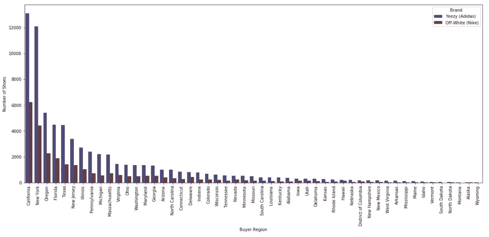

按买家区域列出的售出鞋子总数。作者图片

像加利福尼亚和纽约这样的州在这里有很多代表。这无疑证明了这些州(和俄勒冈州)的运动鞋文化是非常强大的。

```
region_group[:10]
```

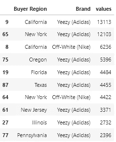

作者图片

最后，让我们更好地了解一下利润与我们目前所看到的内容之间的关系。

```
order_group = pd.DataFrame(stockx_data.groupby([‘Order Date’, ‘Brand’]).size(), columns=[‘values’]).reset_index().sort_values(by=’values’, ascending=False)
order_group[‘values’] = order_group[‘values’].astype(int)
fig, (ax1, ax2) = plt.subplots(2, 1, figsize=(20, 12))
plt.rcParams.update({‘font.size’: 10})
ax1 = sns.lineplot(x=order_group[‘Order Date’], y=order_group[‘values’], data=order_group, hue=’Brand’, palette=”icefire”, ax=ax1)
ax2 = sns.lineplot(x=stockx_data[‘Order Date’], y=stockx_data[‘Profit’], data=stockx_data, hue=’Brand’, palette=”icefire”, ax=ax2)
ax1.set(ylabel=’Number of Shoes’)
plt.show()
```

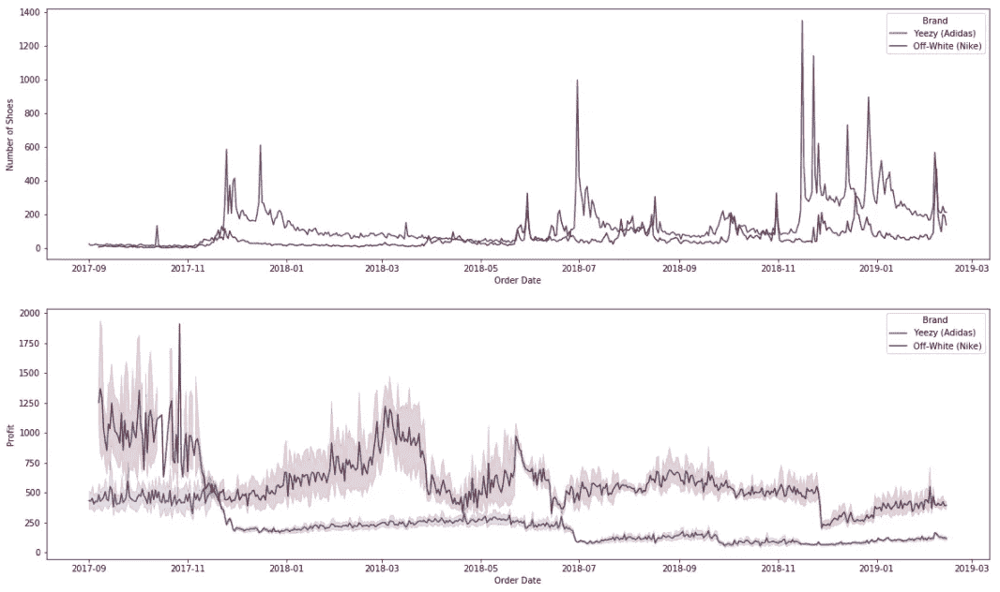

一段时间内售出的鞋子数量(上图)。一段时间内每次销售的利润(下图)。作者图片

这讲述了一个非常有趣的故事——虽然 Yeezys 在 StockX 上销售的鞋子数量上占主导地位(根据该数据集)，但白人的利润数字一直较高。将散点图矩阵可视化将有助于查看是否有任何固有的模式出现在数值测量中:

```
sns.pairplot(stockx_data, diag_kind=’kde’, hue=’Brand’, palette=’icefire’);
```

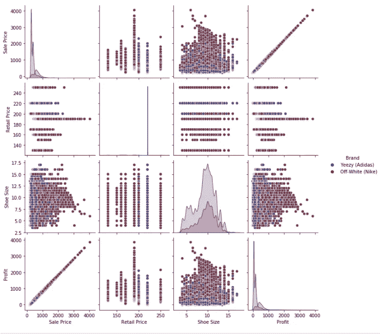

作者图片

很明显，销售价格和利润会有一个完美的线性关系，但除此之外，变量之间不会出现明显的模式。与 Yeezys 相比，我们在各种散点图中看到了更多的灰白色分散和变化。最后，值得注意的是，售出的平均鞋码似乎在 10 码左右。在美国，这个数字相当大，可能意味着销售的主要是男鞋。

因为我们最终想要对利润建模，所以让我们仔细看看它们的分布。

```
fig, (ax1, ax2) = plt.subplots(1,2, figsize=(16, 8))ax1 = sns.histplot(stockx_data.loc[stockx_data[‘Brand’]==’Yeezy (Adidas)’,’Profit’], kde=True, color=’midnightblue’, ax=ax1)
ax2 = sns.histplot(stockx_data.loc[stockx_data[‘Brand’]==’Off-White (Nike)’,’Profit’], kde=True, color=’maroon’, ax=ax2)ax1.set_title(‘Rating Distribution for Yeezy (Adidas) Products’)
ax2.set_title(‘Rating Distribution for Off-White (Nike) Products’)plt.show()
```

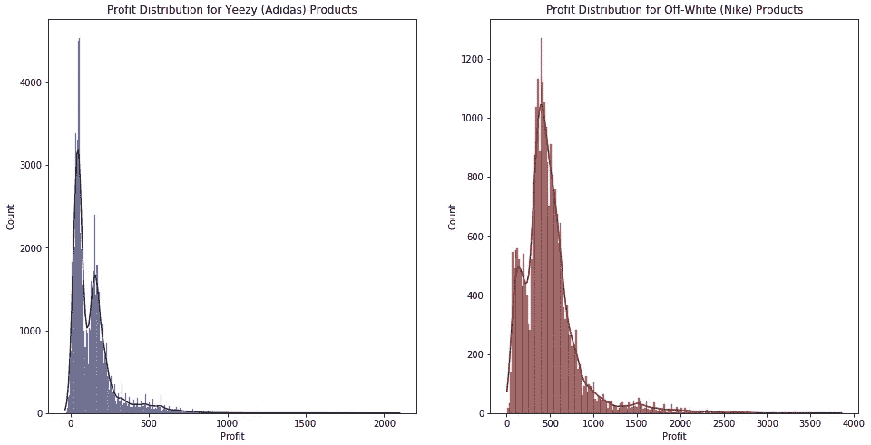

作者图片

一定要记住天平；该数据集中的灰白色计数要少得多，但它们都遵循类似的双峰分布，大频率接近 0–500，长尾将平均值向右倾斜。从线图中可以看出，我们确实证实了米白色的平均利润更高。

```
#Filtering dataframe to get the respective brands only
yeezy = stockx_data[stockx_data[‘Brand’]==’Yeezy (Adidas)’]
offwhite = stockx_data[stockx_data[‘Brand’]==’Off-White (Nike)’]
```

我们已经对我们的数据有了一个相当不错的想法，现在是时候开始构建模型了。

# 建模和分析

在我们开始编码之前，重要的是要经历第 1 部分中说明的步骤:
**1。**描述这个利润数据的最佳随机变量是什么？这种分布似乎表明，有两种类型的人从 yee zys/Off-white(双峰)中获利。此外，长尾可能代表更具排他性的产品，但我们的模型会将它们解读为噪音。为了说明这一点，我们可以使用学生的 t 分布。这种分布与正态分布非常相似，除了对异常值更稳健，这对我们非常有用。这种假设反映了我们所认为的利润人群会得到我们所拥有的信息。考虑到世界上流行的高斯人是多么有效，这可能是一个很好的起点。

**2。**接下来，我们想，“好吧，假设利润是学生的 t 分布，我需要正态分布吗？”嗯，t 分布有三个参数 mu ( *μ* ) *、* sigma ( *σ* )，nu ( *v* )。这些表示平均值、标度(与数据的分布相关)和 t 分布的自由度，它们决定了 t 分布的形状。

**3。**我们知道 *μ，σ，*和 *v* 吗？不，我们对它的最好估计是我们分布的均值和标准差。似乎每个品牌都有不同，所以我们能做的是设定一个先验来评估它们。

**4。**对于 *μ，σ，*和 *v* 有哪些好的分布？对于 *μ* ，我们可以用一个很宽的均匀分布来体现我们的无知。从本质上讲，我们认为在给定的范围内，平均值可能是相同的。仅仅通过观察分布，我们就可以得到 Yeezys 的范围是[0，500]，灰白色的范围是[0，1000]。对于 *σ* ，我们知道标准差需要有正值，因此我们可以使用半正态分布，并通过使用宽范围[0，10]来反映我们的无知。最后，我们也不知道 *v* 的分布，所以我们可以遵循推荐的文献，使用另一个弱信息先验。这意味着一个平均值为 30 的指数分布。这基本上反映了我们或多或少地认为 *v* 应该在 30 左右，但是可以轻松地移动到更小和更大的值。

到目前为止，我们讨论的所有观点都反映了我们对两个品牌利润的人口分布的各种假设和忽视。请记住，这个过程的目标是从某个相当好的地方开始，获得新的证据，然后更新我们的先验和可能性，以获得更准确/精确的后验。

```
#Creating a model with respective mu, sigma, and y distributions
with pm.Model() as model:
    mu_offwhite = pm.Uniform('mu_offwhite', 0, 1000)
    sigma_offwhite = pm.HalfNormal('sigma_offwhite', sd=10)
    nu_offwhite = pm.Exponential('nu_offwhite', 1/30)
    y_offwhite = pm.StudentT('y_offwhite', mu=mu_offwhite, sd=sigma_offwhite, nu=nu_offwhite, observed=offwhite['Profit_transformed'])mu_yeezy = pm.Uniform('mu_yeezy', 0, 500)
    sigma_yeezy = pm.HalfNormal('sigma_yeezy', sd=10)
    nu_yeezy = pm.Exponential('nu_yeezy', 1/30)
    y_yeezy = pm.StudentT('y_yeezy', mu=mu_yeezy, sd=sigma_yeezy, nu=nu_yeezy, observed=yeezy['Profit_transformed'])

pm.model_to_graphviz(model)
```

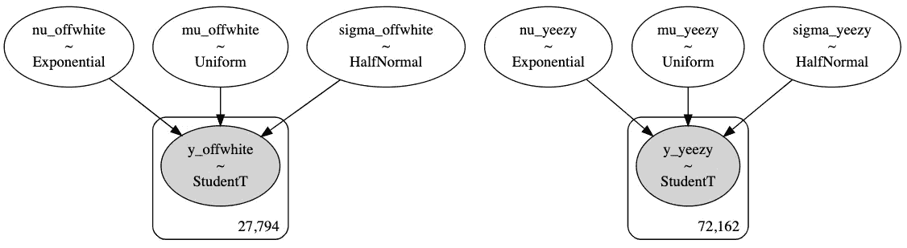

作者图片

你可能想知道为什么我在同一个模型中有两种利润分布。这应该不会对我们的模型产生很大的影响，如果有的话，对我们后面要讨论的部分会有帮助。

```
with model:
    trace = pm.sample(10000, tune=2000, target_accept=.9, return_inferencedata=True, random_seed=RANDOM_SEED)
```

关于排除发散链故障的快速说明:当您创建自己的 MCMC 模型时，您可能会遇到后验分布收敛的问题。马尔可夫链蒙特卡罗(MCMC)使用马尔可夫链𝑞0,…,𝑞𝑁.的状态来逼近关于给定目标(后验)分布的期望问题是，只有当链变得无限长时，它们才能保证精确。这通常在计算上是不可行的，因此我们试图在不耗尽资源的情况下快速收敛到目标分布。不幸的是，这需要一个叫做几何遍历的条件才能成立。这个条件本质上使我们能够在仅利用有限次迭代时遵循 MCMC 模型的中心极限定理。从技术上讲，我们无法以简单的方式证明几何遍历性，但我们可以观察到链中的发散，这表明条件已被违反。采样中发现的 Rhat 统计和发散链是违反该条件的关键指标，如果您发现了这一点，我建议尝试以下策略:

1.  增加“调整”参数:如果你想从你的模型中抽取“真实的”(无偏的)样本，你需要“调整”(让它收敛)这个链。默认情况下，tune 对 1000 个样本执行此操作，但增加此操作会让模型有更多时间达到收敛。
2.  增加抽取的样本数量:马尔可夫链从随机分布开始，慢慢收敛到你的模型的分布。在调整步骤收敛后，增加绘制次数可以为模型提供更多样本供选择。
3.  增加“target_accept”参数:这等同于降低机器学习模型中的学习速率。降低该值可使采样器确保更少的发散。

如何对推理引擎进行最佳故障诊断的理论和解释在这里得到了最好的说明[。](https://docs.pymc.io/notebooks/Diagnosing_biased_Inference_with_Divergences.html)

```
var_names = ['mu_offwhite', 'sigma_offwhite', 'nu_offwhite', 'mu_yeezy', 'sigma_yeezy', 'nu_yeezy']
lines = list(xarray_var_iter(trace.posterior[var_names].mean(dim=("chain", "draw"))))
az.plot_trace(trace, lines=lines);
```

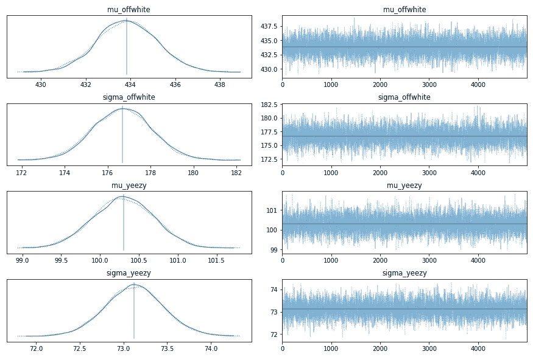

作者图片

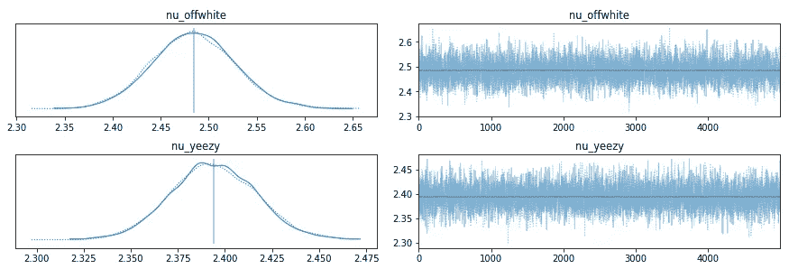

作者图片

对我们前科的初步分析看起来不错。左边的 KDE 图平滑且相对对齐(尽管在这里和那里可以看到轻微的偏差),右边的图看起来更像白噪声，没有明显的模式。

在继续前进之前，对你的过去进行更多的分析是一个很好的习惯。请记住，从数据中获得洞察力的桥梁是通过假设，因此理解和提炼我们的先验知识非常重要！幸运的是，ArviZ 让我们的工作变得简单多了。

```
with model:
 prior_checks = pm.sample_prior_predictive(random_seed=RANDOM_SEED)
 idata_prior = az.from_pymc3(prior=prior_checks)

fig, (ax1, ax2) = plt.subplots(1, 2, figsize=(16,8))
ax1 = az.plot_dist(idata_prior.prior[‘mu_yeezy’], kind=’kde’, rug=True, 
 quantiles=[.25, .5, .75], color=’midnightblue’, ax=ax1)
ax2 = az.plot_dist(idata_prior.prior[‘mu_offwhite’], kind=’kde’, rug=True,
 quantiles=[.25, .5, .75], color=’maroon’, ax=ax2)ax1.set_title(‘Prior Distribution for mu_yeezy’)
ax2.set_title(‘Prior Distribution for mu_offwhite’)plt.show()
```

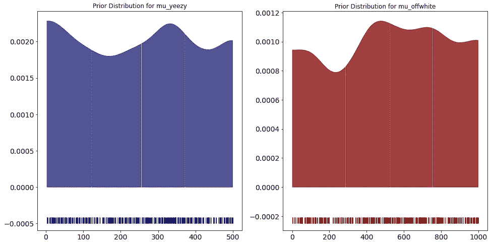

作者图片

```
fig, (ax1, ax2) = plt.subplots(1, 2, figsize=(16,8))ax1 = az.plot_dist(idata_prior.prior[‘sigma_yeezy’], kind=’kde’, rug=True, 
 quantiles=[.25, .5, .75], color=’midnightblue’, ax=ax1)
ax2 = az.plot_dist(idata_prior.prior[‘sigma_offwhite’], kind=’kde’, rug=True,
 quantiles=[.25, .5, .75], color=’maroon’, ax=ax2)ax1.set_title(‘Prior Distribution for sigma_yeezy’)
ax2.set_title(‘Prior Distribution for sigma_offwhite’)plt.show()
```

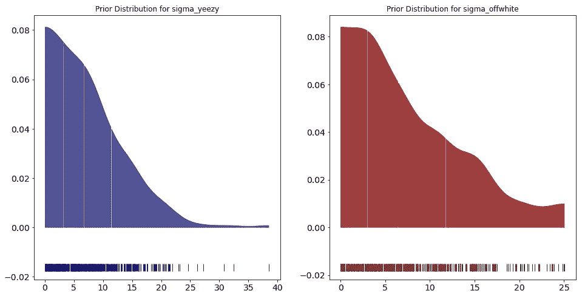

作者图片

```
az.summary(trace)
```

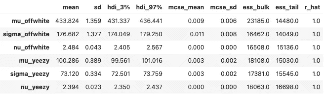

作者图片

这些先验分布图并不意味着与我们的利润分布相匹配；在给定数据的情况下，我们正在研究模型发现的每个品牌利润的均值和标准差的可能分布。所以对于平均的先验分布，我们确实看到平均值与我们在每个利润分布中发现的相对接近。事实上，对于 yeezy，该模型能够拾取由较大数据分布组成的较大的第一个尖峰。我们估计值的低标准偏差是一大优势。此外，查看摘要，我们可以看到 rhat 的良好数字和相当低的 MCSE 误差，这是一个好现象。最后，我们看到自由度的估计值约为 2.4，这表明我们的分布确实有较重的尾部(由于异常值)，选择 Student 的 t 分布是一个很好的选择，因为它可以为我们提供更稳健的估计。

我们肯定要进行后验预测检验，看看后验分布是否成立。

```
with model:
 ppc = pm.sample_posterior_predictive(trace, var_names=var_names+[‘y_offwhite’, ‘y_yeezy’], random_seed=RANDOM_SEED)fig, (ax1,ax2) = plt.subplots(1,2, figsize=(10, 5))
ax1.hist([y.mean() for y in ppc['y_yeezy']], bins=19, alpha=0.5, color='midnightblue')
ax2.hist([y.mean() for y in ppc['y_offwhite']], bins=19, alpha=0.5, color='maroon')
ax1.axvline(yeezy['Profit'].mean(), color='r')
ax2.axvline(offwhite['Profit'].mean(), color='r')
for ax in [ax1, ax2]:
    ax.set(xlabel='x', ylabel='')
ax1.set_title('Posterior Predictive Check for y_yeezy')
ax2.set_title('Posterior Predictive Check for y_offwhite');
```

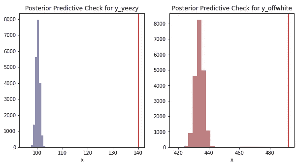

作者图片

红线代表我们观察到的各个利润分布的平均值。这里很容易说我们的模型没有像我们最初想的那样学习数据，但是让我们考虑一下我们的假设。我们第一眼看到的利润分布显示，由于离群值的长尾效应，利润分布明显向右倾斜。我们的假设是，这些异常值并不代表每个品牌的利润，如果我们想更准确地了解哪个品牌的利润率更高，我们应该构建一个对这些异常值稳健的模型。因此，我们选择学生的 t 分布作为我们的可能性。这是一个直接的结果。我们观察数据的平均值*应该*高于我们后验分布的平均值，因为我们明确想要一个对异常值更稳健的目标分布。

既然我们对每个利润分配都有了一个看似强大的模型，我们就可以明显地看到米色的平均利润率更高，或者进行典型的 t 检验来评估差异。对我们来说幸运的是，贝叶斯估计为我们提供了一个很好的比较群体的方法，同时也产生了对不确定性的评估。

# 分组比较

```
with model:
    diff_means = pm.Deterministic('means difference', mu_yeezy-mu_offwhite)
    diff_std = pm.Deterministic('stds difference', sigma_yeezy-sigma_offwhite)
    effect_size = pm.Deterministic('effect size (cohens d)', diff_means/np.sqrt((yeezy['Profit'].std() ** 2 + offwhite['Profit'].std() ** 2) / 2))
```

我们可以计算均值、标准差和效应大小的差异，然后用确定性对象来表示我们希望将采样值记录为输出的一部分。

对于效应大小，我们可以使用 Cohen 的 d 测量值来计算，d 测量值是两组平均标准差的平均值之差。

```
with model:
 trace = pm.sample(5000, return_inferencedata=True, random_seed=RANDOM_SEED)pm.plot_posterior(trace, var_names=['mu_yeezy', 'mu_offwhite', 'sigma_yeezy', 'sigma_offwhite'], color='#87ceeb');
```

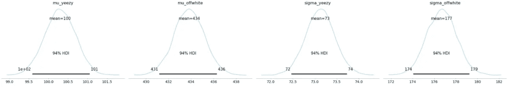

作者图片

```
pm.plot_posterior(trace, var_names=['means difference', 'stds difference', 'effect size (cohens d)'], ref_val=0, color='#87ceeb');
```

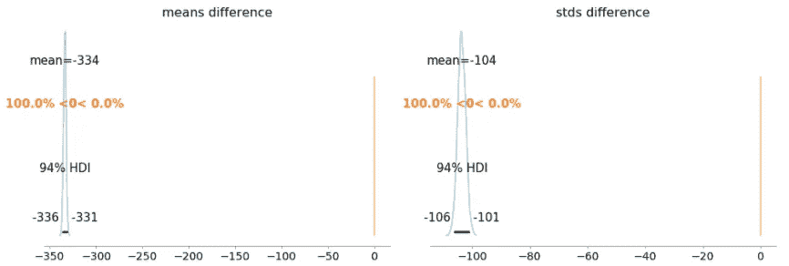

作者图片

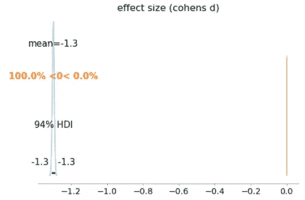

作者图片

```
az.summary(trace, var_names=['means difference', 'stds difference', 'effect size (cohens d)'])
```

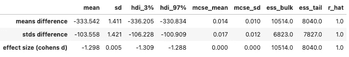

作者图片

如果 Yeezy 和 Off-White 之间的利润率出现巨大差异，我们会看到什么；Yeezys 在该数据集中的销售额可能更高，但利润率比非白种人低 330 美元左右。效果大小也非常重要，可以解释为 Z 分数。所以 Yeezy 的利润率比白人低 1.3 个标准差。

# 结论

贝叶斯估计和建模的惊人之处在于，它为您提供了分布的稳健不确定性估计，并且您可以轻松地添加新的数据/证据来完善您的先验知识。使用 PyMC3，我们可以将这一点进一步扩展到分层建模，我们不仅可以比较品牌，还可以对每款鞋的目标分布进行建模，即使我们只有每款鞋相对少量的数据。

我们最初的目标是为 Yeezys 和 Off-white 的利润率建模，以帮助我们在转售世界中找到更好的权衡。看看我们的数据集，Yeezys 的转售数量占压倒性多数，这给人的印象是，这些将是更好的目标选择。在使用贝叶斯估计对我们的目标利润分布进行建模后，我们发现白色人种的利润率可以高出近 1.3 个标准差。作为耐克的狂热爱好者，这是一个好消息！

**参考文献**

[1]奥斯瓦尔多·马丁，[用 Python 进行贝叶斯分析](https://learning.oreilly.com/library/view/bayesian-analysis-with/9781785883804/)

[2]卡梅隆·戴维森-皮隆，[黑客的概率编程和贝叶斯方法](https://github.com/CamDavidsonPilon/Probabilistic-Programming-and-Bayesian-Methods-for-Hackers)

[3] PyMC3，[事前和事后预测检查](https://docs.pymc.io/notebooks/posterior_predictive.html)

[4] PyMC3，[贝叶斯估计取代了 T 检验](https://docs.pymc.io/pymc-examples/examples/case_studies/BEST.html)

[5] PyMC3，[诊断有偏差的推理与分歧](https://docs.pymc.io/pymc-examples/examples/diagnostics_and_criticism/Diagnosing_biased_Inference_with_Divergences.html)