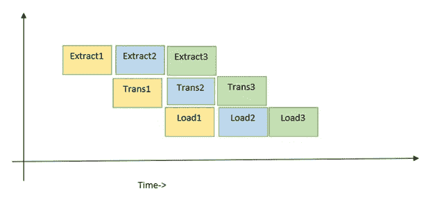

# ETL 管道中的应用并发技术

> 原文：<https://towardsdatascience.com/applied-concurrency-techniques-for-etl-pipelines-32387eb82fbc?source=collection_archive---------17----------------------->

## Python 并发方法与案例场景


照片由[突发](https://burst.shopify.com/photos/fast-bike-racing?)

并发性意味着在重叠的时间间隔内运行程序的组成部分&并行性意味着并行运行所有部分的能力(这也取决于系统的能力，如多核和语言支持)。如果我们想让程序多任务化(并行)或表现得像多任务化(并发)，我们必须理解这些概念是什么，何时以及如何应用的。今天，在这篇文章中，我将尝试解释这些技术以及它们通过一个简单的 ETL 管道的实现。

**词汇**:

1.  python 技术简介。
2.  通过示例 ETL 过程实现
3.  所有技术的执行时间表

**简介**:在 python 中，我们有一个强大的模块，可以在任何程序中实现并发/并行。这里，下面是三个需要实现的模块—

*   *concurrent . futurers . threadpool executor*
*   *concurrent . futures . processpoolexecutor*
*   *阿辛西奥*

我们将在每个单独的管道中使用上述模块，并读取性能，但在此之前，让我们尝试了解这些模块是关于什么的？

*   *并发。期货*包提供了*执行器*接口，可以向*线程*或*进程提交作业。一个*作业可以提交给线程实现多线程( **ThreadPoolExecutor 将被使用**)，一个作业提交给进程实现多处理，然后 **ProcessPoolExecutor** 将被使用。
*   另一方面，asyncio(异步 i/o)类似于线程，但它通过单线程或事件循环来归档并发性。

现在，我们将在实施部分讨论何时以及哪个模块适合任何特定的场景——

**实现** —我们将获取一个 CSV 文件，其中包含通过示例 ETL 流程中的提取功能处理的机场频率记录。转换函数将这两个值['airport_ident，' ' ***']连接到输出文件中的新列。这是一个非常简单的场景，显示了实现我们的技术(并发/并行)的 ETL 执行流程。

线程支持 i/o 绑定操作、网络 i/o、磁盘操作，多进程支持 CPU 绑定操作。平台上有很多很好的文章来了解什么是线程&进程，为什么是操作特定的！为了继续我们的讨论，我们需要了解哪个组件/模块支持哪种操作。

下面是如何使用每种技术运行它。

1.  多线程——正如我们已经讨论过的，每个线程的操作在重叠的时间间隔内并发运行。并且这种重叠与以并行方式执行一样快。

此外，在实现多线程时，我们需要记住一些事情，比如线程间的竞争条件使程序的关键部分容易出错；在 ETL 或任何程序中，这可能会导致数据加载/处理损坏。为了避免这种竞争情况或控制任务执行的流程，我们可以使用锁或信号量。如我们的 ETL 示例所示。此外，下面的示例截图显示了线程是如何执行的，当前进入和退出执行的是哪个线程！


线程执行-作者图片

**注意**——在 python 的线程化中，我们还要记住一件重要的事情，那就是 GIL(global interpreter lock)，它通过对一个解释器应用全局锁，使得任何程序一次只能运行一个线程。

```
from concurrent.futures import ThreadPoolExecutor
import pandas as pd
import time##Threading:
##- A new thread is spawned within the existing process
##- starting a thread is faster than starting a process
##- memory is shared between all threads
##- mutexes often necessary to control access to shared data
##- on GIL (Global Interpreter Lock) for all threads##semaphore locks with lock access count
semTrn = Semaphore(4)
semLd = Semaphore(4)

def extract(file):
    dtype_dict = {'id': 'category',
                  'airport_ref': 'category',
                  'airport_ident': 'category',
                  'type': 'category',
                  'description': 'category',
                  'frequency_mhz': 'float16'
                  }

    df = pd.read_csv(file, dtype=dtype_dict, low_memory=False)
    return df

def transform(df):
    ##semaphore lock
    semTrn.acquire()
    print("thread {} acquired tranform lock ".format(threading.currentThread().ident))
    ##basic transformation operation

    df['ref_code'] = df['airport_ident'].astype(str)+str('***')
    semTrn.release()
    print("thread {} released tranform lock ".format(threading.currentThread().ident))
    print("thread {} acquired load lock ".format(threading.currentThread().ident))
    semLd.acquire()
    load(df)

def load(tdf):

    tdf.to_csv('airport_freq_output.csv', mode='a', header=False, index=False)
    semLd.release()
    print("thread {} released load lock  ".format(threading.currentThread().ident))
    print("thread {} load completion ".format(threading.currentThread().ident))

def main():
    pd.set_option('mode.chained_assignment', None)
    file = 'airport_freq.csv'
    df = extract(file)
    chunk_size = int(df.shape[0] / 4)
    ##t = [0] * 4
    executor = ThreadPoolExecutor(max_workers=4)
    lst = list()
    for start in range(0, df.shape[0], chunk_size):
        df_subset = df.iloc[start:start + chunk_size]
        ##df_subset.is_copy=None
        lst.append(executor.submit(transform, df_subset))
    for future in lst:
        future.result()
    executor.shutdown()

if __name__ == "__main__":
    start = time.time()
    main()
    end = time.time() - start
    print("Execution time {} sec".format(end))
```

2.多处理——在这种情况下，python 提供了在每个进程中运行程序任务的能力，并且全局解释器锁的限制也得到扩展(这意味着我们可以通过多处理接口正式并行运行每个任务),但这也带来了其他特定的约定，例如每个进程比线程花费更多的创建时间。另外，每个进程都需要自己的内存执行空间；这使得成本很高，所以在用户被要求运行任何特定于 CPU 的活动之前，多处理对于 i/o 相关的任务来说是很昂贵的。下面显示了示例 ETL 实现的执行流程。



多进程执行流程—作者图片

```
from concurrent.futures import ProcessPoolExecutor
import pandas as pd
import time##MultiProcessing
##- A new process is started independent from the first process
##- Starting a process is slower than starting a thread
##- Memory is not shared between processes
##- Mutexes not necessary (unless threading in the new process)
##- One GIL(Global Interpreter Lock) for each processsemTrn = Semaphore(5)
semLd = Semaphore(5)
def extract(file):
    dtype_dict = {'id': 'category',
                  'airport_ref': 'category',
                  'airport_ident': 'category',
                  'type': 'category',
                  'description': 'category',
                  'frequency_mhz': 'float16'
                  }

    df = pd.read_csv(file, dtype=dtype_dict, low_memory=False)
    return df

def transform(df):
    print("process {} transform started ".format(multiprocessing.current_process().pid))
    ##basic transformation operation
    semTrn.acquire()
    df['ref_code'] = df['airport_ident'].astype(str)+str('***')
    semTrn.release()
    print("process {} transform completion ".format(multiprocessing.current_process().pid))
    semLd.acquire()
    load(df)

def load(tdf):
    print("process {} load started".format(multiprocessing.current_process().pid))
    tdf.to_csv('airport_freq_output.csv', mode='a', header=False, index=False)
    semLd.release()
    print("process {} load completion ".format(multiprocessing.current_process().pid))

def main():
    file = 'airport_freq.csv'
    df = extract(file)
    chunk_size = int(df.shape[0] / 4)
    executor = ProcessPoolExecutor(max_workers=5)
    lst = list()
    for start in range(0, df.shape[0], chunk_size):
        df_subset = df.iloc[start:start + chunk_size]
        lst.append(executor.submit(transform, df_subset))
    for future in lst:
        future.result()
    executor.shutdown()

if __name__ == "__main__":
    start = time.time()
    main()
    end = time.time() - start
    print("Execution time {} sec".format(end))
```

3.Asyncio —该模块为任何网络、磁盘或基于 web 的操作提供高性能。我们可以使用 asyncio 模块编写并发代码。这可以在函数中使用异步/等待条件来实现；以下 ETL 示例的执行展示了 asyncio 技术的实现。

```
import asyncio
import time
import pandas as pd##coroutine - wrapped version of the function to run async
##async function in python is typically called coroutine
##coroutines declared with async/await syntax
##coroutines are special functions that return coroutine objects when called

##event loop -
##the event loop is a very efficient task manager
##coordinate tasks
##run asynchronous tasks and callbacks

def extract(file):
    dtype_dict = {'id': 'category',
                  'airport_ref': 'category',
                  'airport_ident': 'category',
                  'type': 'category',
                  'description': 'category',
                  'frequency_mhz': 'float16'
                  }
    df = pd.read_csv(file, dtype=dtype_dict,low_memory=False)
    return df

async def transform(df):

    df['ref_code'] = df['airport_ident'].astype(str)+str('***')
    await load(df)

async def load(tdf):

    tdf.to_csv('airport_freq_out.csv', mode='a', header=False, index=False)
    await asyncio.sleep(0)

async def main():
    pd.set_option('mode.chained_assignment', None)
    file = 'airport_freq.csv'
    df = extract(file)
    chunk_size = int(df.shape[0] / 4)
    for start in range(0, df.shape[0], chunk_size):
        df_subset = df.iloc[start:start + chunk_size]
        x = asyncio.create_task(transform(df_subset))
        await x

start = time.time()
asyncio.run(main())
end=time.time()-start
print("execution time {} sec".format(end))
```

**执行时间:**


作者图片


几秒钟！！—作者图片

**结论**:从我们的样本运行来看，我们可以假设 asyncio 线程方法适合我们的场景，因为它涉及到文件的 i/o 处理。多重处理对我们的系统来说是昂贵的，尽管它涉及并行处理。

今天的帖子通过一个示例 ETL 强调了应用并发性/并行性的技术。我希望这个细节对理解这些技术并在您的实现中使用有所帮助。在以后的文章中，我将尝试在任何数据集的 groupby 和 aggregation 等操作上实现这些技术。

**GitHub 地点**—[https://github.com/Shivakoreddi/ConcurrencyPipelines](https://github.com/Shivakoreddi/ConcurrencyPipelines)

参考:

1.  Python 文档，[https://docs.python.org/3/library/asyncio.html](https://docs.python.org/3/library/asyncio.html)
2.  塞尔达尔，[https://www . infoworld . com/article/3632284/python-concurrency-and-parallelism-explained . html](https://www.infoworld.com/article/3632284/python-concurrency-and-parallelism-explained.html)，2021 年
3.  http://pymotw.com/2/threading/[PyMOTW](http://pymotw.com/2/threading/)