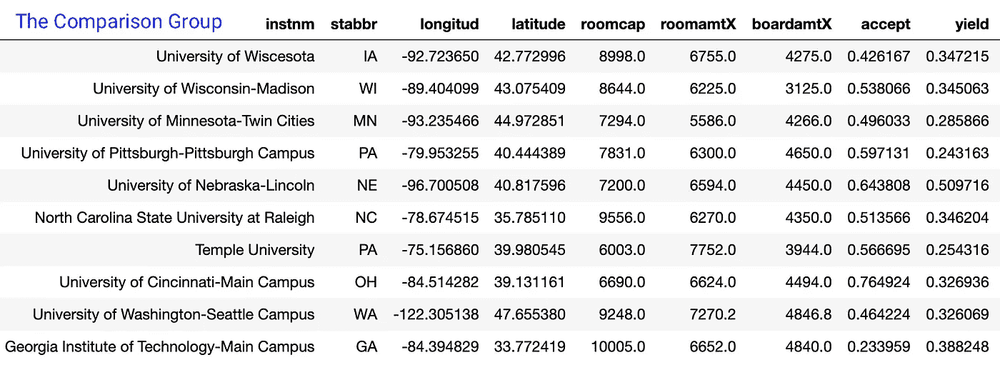

# 应用的距离测量；建立高等教育比较小组

> 原文：<https://towardsdatascience.com/applied-distance-measures-building-higher-education-comparison-groups-22d4985f23b5?source=collection_archive---------40----------------------->


[庞余浩](https://unsplash.com/@yuhao?utm_source=medium&utm_medium=referral)在 [Unsplash](https://unsplash.com?utm_source=medium&utm_medium=referral) 上拍照

## 美国教育部的数据演示，如何使用距离测量来指定大学比较组

# 介绍

想象一个场景，一所学院或大学受到负面印刷、在线和社交媒体关注等形式的批评。假设注意力集中在学校的本科申请费用上。

机构如何应对？如果你对回应媒体关注的想法包括将这个机构与其他类似的机构进行比较，那么这篇文章是为你准备的。这个负面的媒体关注假设提供了一个应用距离测量的案例研究。机构可以使用这些距离度量来确定有意义的比较组。如果你想在任何数据中找出有意义的比较组，这篇文章也会对你有帮助。

[依靠之前出版的食谱](/a-cookbook-using-distance-to-measure-similarity-8de97a1404dd)，这篇文章将距离测量应用于美国教育部的数据。这些数据包括来自 1，539 个机构的观察结果(7，000 多个观察结果的子集)。任务是找到一份具有相似特征的机构清单。特征相似的机构的列表可以作为一个比较组。然后，比较组将支持其他分析。

例如，一个机构可能会经历关于其本科大学申请费的负面报道。这种技术可以支持一种分析，这种分析将显示与一组类似的机构相比，该机构的申请费是相对高、低还是中等。

下面我将首先指出以前发表的讨论这些数据的资源，我是如何获得这些数据的，以及我是如何准备这些数据进行分析的。接下来，我还将提到以前的文章，这些文章展示了使用距离度量来寻找比较组的过程。最后，用本科申请费的例子，我将展示一个机构如何使用比较组来分析它的申请费。在结论中，我将讨论这项技术的其他应用，可能涉及其他数据。


要记住的一个警告或“诀窍”是，这一高等教育数据已经包括了预先指定的对照组的信息。照片由[詹妮弗·拉图佩丽莎-安德森](https://unsplash.com/@fraumuksch?utm_source=medium&utm_medium=referral)在 [Unsplash](https://unsplash.com?utm_source=medium&utm_medium=referral) 拍摄

# 警告

有一个警告或“窍门”要记住。一定要观察整个大象，这样你就不会分类错误或错过整个画面。

虽然本文旨在说明一种可以在教育机构之间建立比较组的方法，但这些数据也包括预先指定的比较组(例如，“NCES 创建的数据反馈报告比较组”)。[美国教育部网站提供了关于那些已经指定的对照组的信息](https://nces.ed.gov/ipeds/datacenter/InstitutionByGroup.aspx)。本文中讨论的方法，为了这个特定的案例研究的目的，然后补充和添加到预先指定的比较组。

# 数据

## 变量

这些数据来自美国教育部。这些数据易于访问和准备分析。[我以前写过一些代码示例，这些代码可以自动获取这些数据](/how-to-source-federal-data-higher-education-data-675f5edb9813)。

在本文中，我使用的数据版本包括以下变量。

```
unitid   : A unique identification number for each institution.
instnm   : The institution's name.
stabbr   : The abbreviation of the institution's state.
sector   : A categorical that indicates multiple factors
           such as, public, private, 2yr, 4yr, etc.
iclevel  : A categorical that indicates 2yr, 4yr, etc.
control  : A categorical that indicates public, or private.
locale   : A categorical that indicates the campus urbanicity.
instcat  : A categorical that indicates degree-granting status.
c18basic : Classification; Carnegie Commission on Higher Ed.
instsize : A categorical that indicates enrollment counts.
longitud : The campus geographic longitude.
latitude : The campus geographic latitude.
roomcap  : The residence hall room capacity.
roomamt  : The residence hall room fees.
boardamt : The residence hall meal plan fees.
rmbrdamt : Room & bard amount combined (if no roomamt or bardamt)
applfeeu : The undergraduate application fee.
applcn   : Count of undergraduate applications.
admssn   : Count of undergraduate admissions.
enrlft   : Count of full-time student enrollment.
enrlt    : Count of student enrollment.
```

从这些数据中我们可以计算出新的数据点。例如，我们可以通过将`admssn`除以`applcn`来估计*选择性。由此得出的数字是每所学校录取的申请人比例。我们还可以通过除以`enrlt` / `admssn`来估计该校的产量，即录取的学生比例。*

```
accept   : Estimated selectivity admssn / applcn.
yield    : Estimated admission yield enrlt / admssn.
```

## 观察结果

我进一步将数据限制到特定的观察类型。这些数据最初包括 2 年期机构、不到 2 年期机构、职业机构(例如，美容、电气、管道、油漆、农业等)的观察数据。)，以及营利性机构。

对于本文中的演示，我将数据限制为包括来自 4 年非营利私人机构和 4 年公共机构的观察结果。数据也受到信息缺失的影响。去除缺失信息后，最终观测值为 1，539 个观测值。

图 1 显示了数据的摘录。


图 1，作者摘录的数据。

图 2 显示了数据的汇总。


图 2，作者呈现的数据摘要。用熊猫轮廓制作。

# 寻找一个比较组

为了便于演示，假设有一个虚构的机构(Wiscesota 大学)具有以下特征:

```
instnm                                 University of Wiscesota
stabbr                                                      IA
sector                                 Public, 4-year or above
iclevel                                     Four or more years
control                                                 Public
locale                                             City: Large
instcat      Degree-granting, primarily baccalaureate or above
c15basic      Doctoral Universities: Highest Research Activity
instsize                                      20,000 and above
longitud                                              -92.7237
latitude                                                42.773
roomcap                                                   8998
applfeeu                                                    22
applcn                                                   42596
admssn                                                   18153
enrlft                                                    7597
enrlt                                                     6303
alloncam                                                 2\. No
accept                                                0.426167
yield                                                 0.347215
roomamtX                                                  6755
boardamtX                                                 4275
```

使用[之前出版的食谱](/a-cookbook-using-distance-to-measure-similarity-8de97a1404dd)，我们找到了如图 3 所示的对照组。



图 3，作者描绘了一个虚构的 Wiscesota 大学的对比组。[先前出版的食谱](/a-cookbook-using-distance-to-measure-similarity-8de97a1404dd)说明并解释了如何找到这个比较组。根据代码中设置的参数，结果可能会有所不同。

# 使用比较组

我在上面提出了一个假设，在这个假设中，一个机构，Wiscesota 大学，最近经历了对其本科申请费的批评。在找到一个在经验上站得住脚的对照组后，我们接下来可以看看该费用在整个对照组的其他机构中的比较情况。

图 4 显示了每个机构的本科申请费。事实证明，Wiscesota 大学的本科申请费是所有大学中最低的。


图 4，作者描绘了一个比较组，以及虚拟的 Wiscesota 大学的比较组中每个机构的申请费。

从这个输出中我们看到，Wiscesota 大学不仅要求最低的费用，而且下一个最低的 45 美元的费用是 Wiscesota 的两倍多。最高收费是 Wiscesota 收费的近 4 倍。

这些信息对 Wiscesota 大学的专业招生人员来说很有价值，因为他们决定如何回应最近的批评。这一信息也可能会告知 Wiscesota 关于申请费的未来计划。

# 优势、劣势和局限性

在这篇文章中，我给出了一个高层次的技术概述，这些技术可以支持需要一个比较组的各种分析。这篇文章的一个弱点和局限性是，各种来源定期进行类似的分析，以产生库存，现成的，现成的比较组。许多高等教育分析师、数据消费者和其他人已经熟悉现成的比较组。使用家庭自制的比较组，比如用这里介绍的方法制作的比较组，有与其他更知名的比较组竞争的风险。

然而，在多个比较组之间复制分析，除了用这些方法生成的分析之外，还包括那些现成的(如美国教育部预先指定的)分析，可以支持更完整的分析。例如，如果多个潜在比较组的相同分析产生相似的结果，差异的一致性将增加发现的可信度。

此外，并不是所有的数据都有现成的比较组。在下面的结论中，我讨论了使用学生级别或员工级别的数据在这些人群中构建和分析比较组的场景。

这种技术的另一个缺点是，它可能会强化或复制现有的偏见，包括对少数民族个体(例如，非白人、非男性、非 cis、非 hetero)的制度化排斥和压迫。本文并没有解决这些或类似的技术可能会强化或重现现有偏见的问题。如果一个机构或分析师采用这些方法，就需要额外的步骤来调整和纠正这些缺点。

至少还有一个弱点和局限值得关注。本文(上文和下文)中讨论的技术，以及它的配套文章，很少提供支持因果分析的前景。为了更好地理解*如何或为什么*机构设置他们的申请费，如上所述，一系列的实验或准实验分析将是必要的。同样，一项实验或准实验技术对于帮助理解*学生如何应对申请费的变化*的分析是必要的。

# 结论

这篇文章应用距离测量方法在全美的高等教育机构中寻找一个比较组。在找到这个对照组之后，本文接着使用这个对照组来分析这个机构的本科申请费。

这项技术可以支持其他分析目标。例如，某个机构可能有兴趣研究其员工。该机构可能会发现其员工的平均年龄和中值年龄。但下一个合乎逻辑的问题是，平均值和中值高吗？低吗？你怎么知道什么是规范？一个答案是，你转向整个对照组的平均值和中间值。

如果你有观察个体的数据，这种技术也可以找到相似的个体。例如，继续本科生入学的主题，考虑一下 Wiscesota 的一个场景，招生主任想要寻找一种新的方法来识别有可能在该机构表现良好的学生。

<https://adamrossnelson.medium.com/membership>  

照片由[泰在](https://unsplash.com/@taiscaptures?utm_source=medium&utm_medium=referral) [Unsplash](https://unsplash.com?utm_source=medium&utm_medium=referral) 上抓拍

想象一下，举一份在 Wiscesota 完成第一年学业的学生名单。然后根据第一年的平均绩点对名单进行排序。之后取前十名学生。然后，招生办主任可以使用距离测量来确定下一年申请人中与那些表现优异的学生相似的学生。

另一个场景，假设院长的目标是提高产量。然后，院长可以开出一份名单，列出在学校表现良好、提前退还了注册押金的学生。再次使用距离测量，院长可以在随后的申请人中寻找申请人，以确定那些既有可能获得更高比率又在该机构表现良好的学生。

# 感谢阅读

感谢阅读。把你的想法和主意发给我。你可以写信只是为了说声嗨。如果你真的需要告诉我是怎么错的，我期待着尽快和你聊天。推特:[@ adamrossnelson](https://twitter.com/adamrossnelson)| LinkedIn:[亚当·罗斯·纳尔逊](http://www.linkedin.com/in/arnelson) |脸书:[亚当·罗斯·纳尔逊](http://www.facebook.com/adamrossnelson)。